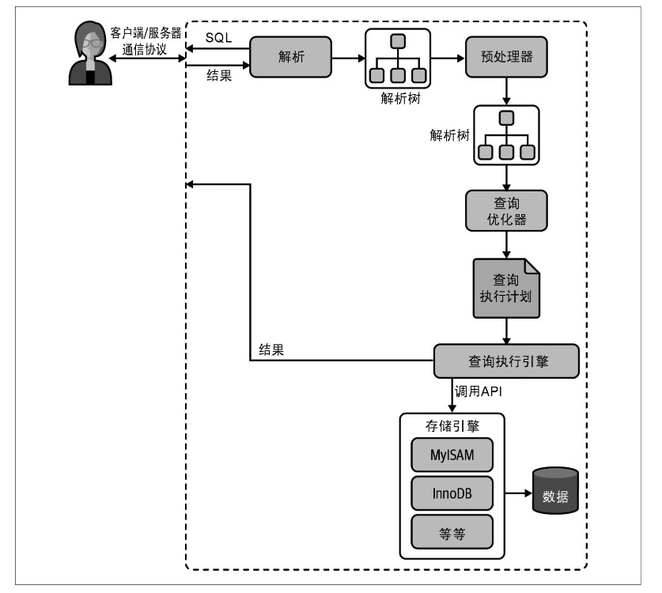
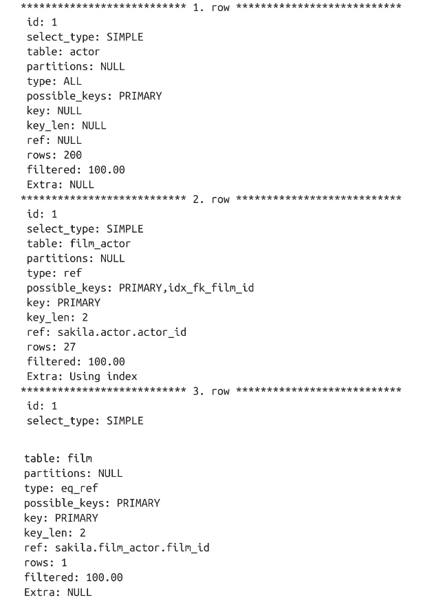
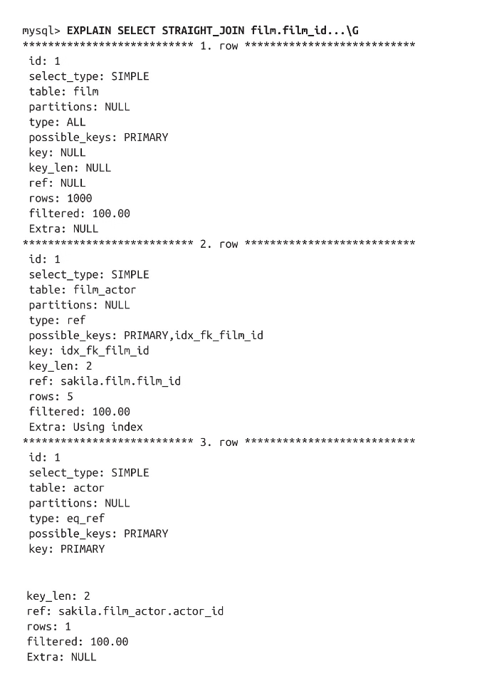
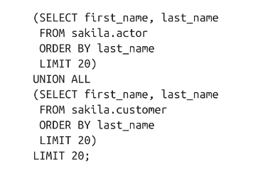
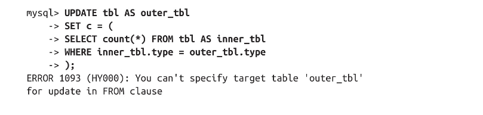
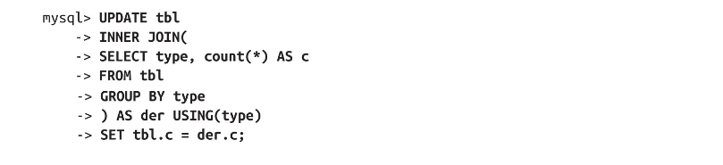
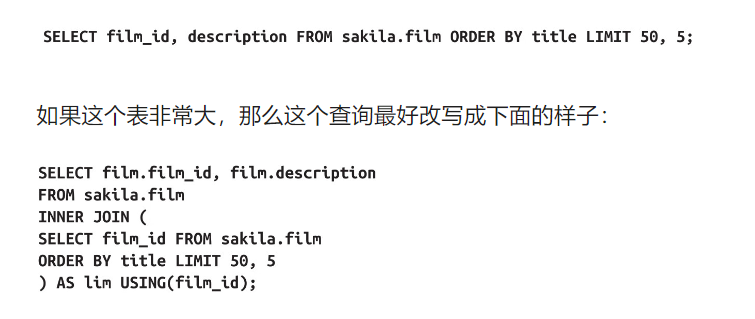

# Mysql

存储结构：

## innodb

索引和表数据在同一个文件中。通过B+树保存

索引分为以下：

* 聚簇索引：由主键构成的B+树，通过两层索引叶子节点存储整条数据。构建规则：主键>第一个非空唯一列>隐式创建的id。

* 非聚簇索引：由索引构成的B+树，对该索引进行查找后，得到最终叶子节点存储的主键id；再去聚簇索引中查找数据，就是回表。
* 联合索引：由多个索引项组成的索引，遵守最左优先匹配

**索引覆盖**能够直接从一个索引树上查询到全部返回列。


### 慢查询


## 1.Mysql架构

最上层：客户端

第二层：连接/线程处理、解析器、优化器

第三层：存储引擎层。负责mysql数据的存储和提取


### **连接管理和安全性**

每个客户端都会在服务器进程中拥有一个线程，该连接的查询只会在这个单独的线程中执行，该线程驻留在一个内核或者cpu上。服务器维护缓存区，用于存放已就绪的线程。


### **并发控制**

#### **读写锁**

处理并发并发读/写访问的系统通常实现一个由两种锁类型组成的锁系统。这两种锁被称为<i>共享锁</i>。细分为共享锁/读锁和排他锁/写锁。多个客户端可以同时读取同一个资源而互不干扰。写锁是排他的，即一个写锁会阻塞读锁也会阻塞其他的写锁。

实际的数据库系统中，每时每刻都会发生锁定：当某个客户端在修改某一部分数据时，mysql会通过锁定会防止其他客户端读取同一数据。锁的管理速度足够快的时候，就不会引起客户端的感知。

#### **锁的细粒度**

理想化方式：只对需要修改的数据片段进行准确的锁定。

**表锁**

table lock是mysql中最基本也是开销最小的锁策略。

**行级锁**

可以最大程度地支持并发处理，允许多人同时编辑不同的行，而不会阻塞彼此。


### 事务

 需要保证严格的ACID测试。

原子性：

一致性：

隔离性：通常来说，一个事务在最终提交之前，对其他事务是不可见的。

持久性：一旦提交，事务所作的修改就会永远保存到数据库中。此时即使系统崩溃、数据也不会丢失。难以有100%的持久性保障。


### 隔离级别

标准定义了四种隔离级别。

* READ UNCOMMITED（未提交读）：事务可以看到其他事务没有提交的修改。一般很少使用，会产生脏读---读取未提交的数据。
* READ COMMITED（提交读）：大部分数据库是这个。一个事务可以看到其他事务在它开始之后提交的修改，但在事务提交之前，其所作的任何修改对其他事务都是不可见的。同一个事务中，两次执行相同的(读)语句，可能会看到不同的数据结果----**不可重复读问题**
* REPEATABLE READ（可重复读）：解决**不可重复读问题**。保证同一个事务中，读取相同行数据的结果是一样的。但是可能会产生幻读---当一个事务在读取某个范围内的记录时，另外一个事务又在该范围内插入了新的记录，当之前的事务再次读取该范围的记录时，会产生幻行。
* SERIALIZABLE（可串行）：是最高的隔离级别，该级别通过强制事务按序执行。


### 死锁

数据库系统实现了死锁检测和锁超时机制。其中InnoDB存储引擎，检测到循环依赖之后会返回一个错误信息。

InnoDB目前处理死锁的方式是将持有最少行级锁的事务回滚。


### 事务日志

存储引擎只需要更改<u>内存中的数据副本</u>，而不用每次修改磁盘中的表，以提高事务的效率。

事务日志会将以追加的方式记录写操作，以顺序IO持久化到硬盘中一小块区域内。最后会议个后台进程在某个时间去更新硬盘中的表。因此以这种<i>预写入日志</i>的存储修改数据会最终需要写入磁盘两次。


### Mysql中的事务

**理解AUTOCOMMIT**

默认情况下，单个更新、插入、删除会被隐式包装在一个事务中，并在执行成功后立即提交，被称为自动提交（autocommit）模式。

**隐式锁定和显示锁定**

InnoDB使用两阶段锁定协议。在事务期间，根据隐式锁定，随时可以获取锁，但是锁只有在提交或者回滚后才会被释放，并且所有的锁会同时释放。

除此之外，InnoDB可以通过特定的语句进行显示锁定，例如`Lock Tables`和`unlock tables`，这些命令都是在服务器级别，而不是存储引擎中。除非禁用autocommit，否则不要使用。


### 多版本并发控制

mysql的大多数事务型存储引擎使用的都不是简单的行级锁机制，会结合多版本并发控制（mvcc）。

其工作原理是使用数据在某个时间点的快照来实现，这意味着无论事务在运行时间多长，都只会看到一致的视图。但是也意味着，不同的事务，可以在同一时间看到同一张表中的不同数据。

innodb通过为每个事务在启动时，分配一个事务id来实现mvcc。该id在事务首次读取任何数据时分配。在该事务中修改记录时，会向Undo日志写入一条说明如何恢复该更改的undo修改记录，并且将事务的回滚指针指向undo日志记录。来指明，事务如何在需要的时候进行回滚的方法。

当不同的会话读取聚簇主键索引时，innodb会将该记录的事务id与会话的读取视图进行比较。如果当前状态下的记录不可见（对其产生过修改的事务，还未提交），那么undo日志记录会被追踪和应用，直到达到一个符合可见条件的事务id。

mvcc仅仅支持READ COMMITED、REPEATABLE READ模式。


### InnoDB

innodb使用mvcc实现高并发，通过间隙锁策略防止在REPEATABLE READ隔离级别上的幻读：innodb不只锁定在查询中涉及的行，还会对索引结构中的间隙进行锁定，防止幻行被插入。

innobd在内部做了很多优化，其中包括从磁盘预读数据、内存中自动构建哈希索引进行快速查找的自适应哈希索引。


### 缓存机制

MySQL查询缓存用来缓存特定查询的整个结果集信息，并共享给所有客户端。服务端会将查询语句经过哈希编码后，将哈希值、涉及的table信息和结果集放入Query Cache中。
MySQL每收到一个查询语句，都会通过特定的Hash算法，并在Cache中匹配。
该缓存查询早于优化器，无须经过解析器和存储引擎层，直接从缓存取值。但是必须满足完全相同的字节，不同的数据库、协议版本、字符集均视为不同的查询。

**缓存规则**

* 缓存的结果是session共享，不同client均可使用。
* 区分大小写、空格
* 条件查询携带的不确定函数，如now()等，不会被缓存
* 大于QueryCacheLimit的结果集不会被缓存
* 分库分表不起作用
* 自定义函数时，不起作用

**缓存失效**

表的结构、数据有CUD操作时

**内存管理**

内存池技术，自己管理内存释放和分配，不通过操作系统。其本质是可变长的block（最短长度为query_cache_min_res_unit），用来存储类型、大小、数据等信息。一个ResultSet的cache通过链表把block连接起来。
考虑到无法预测结果集的实际大小，当需要缓存时候，会先申请一个最小空间，不够就再申请，最后将多余释放。
实际上，在分配空间时，会锁住空间块，消费较大时间。


适用于应用数据库的更新较少情况。
如果有经常更新数据的需求，建议关闭。
```sql
set global query_cache_size = 0; --缓存内存大小设置为0，不分配缓存内存
set global query_cache_type = OFF; --关闭查询
```


## 2. Innodb底层

### 存储格式

`schema`中存储的每个表都会在`/data`目录下有一个文件（分区表则会有多个文件）
* 在`Innodb`中数据和索引是一起的，B+树实际上就是一种存储结构，都存储在`.ibd`文件中。该文件可能会被分为多个**段**。文件本身不会因为删除数据和减少容量，而**段**本身会增长或收缩，下一级为区；**区**大小默认为1MB，下一级为**页**，默认16KB。
* `.frm`主要存储数据表格式


### 页分裂

当插入时，为保证主键的顺序，`Innodb`会创建一个新的页，在原始页和后继页之间，确定是否需要新创建页，并重新定义之间的关系。
尽管重新定后的关系在逻辑上仍然顺序，但是在物理位置上是无序的，会增加寻址时间。

### 页合并

在删除一条数据记录时，只是将其标记为删除状态，并表示该块空间可以被回收。
如果页的空间大小低于合并阈值（默认为50%），`Innodb`会看相邻页，判断是否有合并机会，当成功合并后，原始页为空，用于后续新数据的插入。


## 6.schema设计与管理

### 选择优化的数据类型

* 更小的通常更好：占用空间、cpu处理周期减少
* 简单为好
* 避免使用Null：null使得索引、索引统计和值比较复杂。可为null的列会使用更多的存储空间


#### 整数类型

可以为整数类型指定宽度，例如int(11)。但是并不会限制值的合法范围，只是规定了mysql一些交互工具显示字符的个数。从存储上说，int(1)和int(20)是相同的。

#### 实数类型

浮点类型通常比DECIMAL使用更少的空间来存储相同范围的值。float/double使用4/8字节的存储空间.

考虑到空间需求和计算成本，仅在需要精确计算小数时才使用decimal。大容量场景可以使用bigint

#### 字符串类型

**varchar**

varchar需要额外的1~2字节来记录字符串的长度：如果列的最大长度小于等于255字节，只需要1个字节表示，否则2字节。过长的varchar会被转化为blob。

但是由于是可变长度，在更新时可能会增长，产生额外的工作。如果行的增长使得原位置无法容纳更多内容，innodb可能会需要分割页面来容纳行。

当字符串最大长度远大于平常长度、列的更新较少（碎片不是问题）、使用utf8这样的字符集，每个字符都使用不同的字节数进行存储时，使用varchar更好。

**char**

固定长度，mysql总是为定义的字符串长度分配足够的空间。<u>当存储char值时，mysql删除所有尾随空格。如果需要进行比较，值会使用空格填充</u>。

char类型使用存储比较短的字符串，或者是长度几乎相同的情况。例如密码的md5值。

* 对于经常修改的数据，char优于varchar，因为固定长度的行不容易出现碎片。
* 对于非常短的数据，char同样比varchar高效，char(1)只需要1个字节，而varchar(1)需要2个字节

```sql
create table char_test(char_col char(10));
insert into char_test(char_col) values ('string1',' string2','string3   ');
select * from char_test;
'string1'
' string2'
'stirng3' // 后面的空格被截断了  但是如果用varchar存储，就会显示出来
```


***-----不理智的慷慨-----***

使用varchar(5)和varchar(500)存储'hello'虽然空间存储的开销一致，即硬盘占用一样。

但是在创建临时表时，mysql通常会在内部分配固定大小的内存来保存值，即会将varchar(500)转换为char(500)。内存空间使用变大，导致在排序、统计等操作时需要扫描的就越多、时间越长。


#### **枚举代替字符串**

enum列可以存储一组预定义的不同字符串的值。mysql在存储枚举时会非常紧凑。

mysql将每个枚举类存储为整数，并且必须查找以将其转换为字符串表示，因此enum列有一些额外的开销。

enum联接varchar相比与enum联接稍慢，但是使表变少。可以使用enum作为状态主键，在添加其他列作为补充说明。


#### 日期时间类型

datetime可以存储大范围的数值，从1000到9999年，精度1微秒。显示的值与时区无关，切换时区，显示值不会变动。

timestamp存储自1970年1月1日到2038年1月9日的时间。时间戳显示的值依赖于时区，当切换时区时，显示值会变动，如果跨时区使用，更改。

考虑将日期和时间存储为整数


### 选择标识符

不仅要考虑存储类型，还要考虑mysql如何对该类型执行计算和比较。在预期蔚来增长空间的前提下，应该选择最小的数据类型，tinyint比int少3个字节，可能会产生比较大的性能差异。

**整数类型**

避免整数意外耗尽

**enum和set类型**

对于标识符来说，是比较糟糕的选择，尽管对于某些只包括固定状态或者类型的静态“定义表”来说可能没有问题。enum和set适用于保存订单状态或者产品类型等信息。

**字符串类型**

避免使用，尤其是带“随机”字样的字符串。

* 插入的值会写到索引的随机位置，使得insert查询变慢。导致页分裂、磁盘随机访问，产生聚簇索引碎片
* select查询变慢，逻辑上相邻的行会广泛分布在磁盘和内存中
* 缓存性能的低下


### 特殊数据类型

ipv4实际上是32位无符号整数，小数点分为4段只是为了方便阅读。mysql提供了inet_aton()和inet_ntoa()来进行转换。使用的空间从varchar(15)的约16字节变成无符号整数的4字节。


### schema设计中的陷阱

**太多的列**

太多的联接

**全能的枚举**


## 7.创建高性能的索引


### 索引类型

#### **b-tree索引**


#### 自适应哈希索引

当innodb发现某些索引值被非常频繁访问的时候，会在原有的b-tree基础上，在内存中再构建一个哈希索引。可以实现快速的哈希查找，这个过程完全是自动化的。

#### 全文索引

FULLTEXT是一种特殊类型的索引，用于查找文本中的关键词，而不是直接比较索引中的值。类似于搜索引擎，适用于match against操作，而不是普通的where


### 高性能的索引策略

高效选择和使用索引，针对特殊案例做优化。


#### 前缀索引和索引的选择性

有时候为了提升索引的性能，同时节省空间，只对字段的前一部分字符做索引，但是会降低索引的*选择性*。
$$
索引选择性=不重复的索引值(基数,cardinality)/数据表的记录总数
$$
索引的选择性越高则查询效率越高，高选择性的索引可以让mysql在查询的时候过滤掉更多的行。唯一索引的选择性就是1

一般情况下，列前缀的索引性也是足够高，能满足查询性能。对于blob、text或者较长的varchar类型的列，必须使用前缀索引。其关键在于，选择足够长的前缀的同时又要考虑到空间占用问题。因此，尽量让前缀的基数接近于完整列的基数。

因此，为了确定前缀的合适长度，需要找到最常见的值的列表。


假设需要对城市名称建立索引（其中，城市名称列不保证唯一性），首先需要清楚每个城市对应的记录分布。

```sql
select count(1) as c, city 
from city_demo
group by city
order by c desc
```

在了解每个城市的出现频率后，开始寻找最频繁出现的城市*前缀*，从3开始..

```sql
select count(*) as c, left(city,3) as pref 
from city_demo
group by pref
order by c desc 
```

不断增加前缀长度，直到这个前缀的选择性接近完整的列的选择性。

另外一种方法，就是计算完整列的选择性，并使前缀的选择性接近完整列的选择性。

```sql
// 完整列的选择性
select count(distinct city)/count(*) from city_demo

// 从前3个字符开始计算不同前缀的选择性
select count(distinct left(city,3))/count(*) from city_demo
```

当再增加前缀长度，选择性的提升已经很小了时，就可以了。但是完整性列在数据分布不均匀的情况下，很难用。如果最常出现的前缀出现的次数，大于全称出现的次数时候，也就是选择性比平均选择性要低，就很糟糕。

添加前缀索引:

```sql
alter table city_demo add key (city(7))
```

前缀索引是一种能使索引更小、更快的办法，但是无法使用order by和group by，也无法做覆盖扫描。


#### 多列索引

并非“把where条件里面的列都加上索引”是正确的!!!

在多个列上独立地创建，并不一定能提升性能，mysql引入了“索引合并”的策略，能够在一定程度上使用表中的多个单列索引来定位指定的行。这种情况下查询能够使用两个单列索引进行扫描，并将结果合并。有or、and和组合三个变种。

* 当优化器需要对多个索引相交时（and），意味着需要一个包含所有相关列的多列索引
* 当优化器需要对多个索引联合时（or），通常需要消耗大量的计算资源
* 优化器并不会将以上操作计算到“查询成本”中


#### 选择合适的索引列顺序

考虑全局基数和选择性下的经验法则： 将选择性高的列放在索引的最前列。但同时和条件查询的具体值/分布情况有关系。


### 聚簇索引

聚簇索引并不是一种单独的索引类型，而是一种数据存储方式。

当表有聚簇索引时，它的数据行实际上存放在索引的叶子页（leaf page）中。大部分情况下，因为无法同时将数据行存放在两个不同的地方，索引一个表只有一个和聚簇索引（覆盖索引可以模拟这种情况）。

<u>如果没有定义主键，mysql会隐藏创建一个主键作为聚簇索引，但是所有需要使用这种隐藏主键的表都依赖一个单点的自增值，可能会导致锁竞争。</u>

* 聚簇索引的插入顺序严重依赖顺序，如果更新聚簇索引列、插入新行导致主键被更新而需要移动行时，可能会面临页分裂（page split）的问题。当行的主键值被要求必须将这一行插入某个已满的页中，存储引擎会将该页分裂成两个页来容纳该行，导致表占用更多的磁盘空间。
* 如果行比较稀疏，或者由于页分裂导致的数据存储不连续，可能会导致全表扫描变慢
* 聚簇索引最大限度地提高了i/o密集型性能，但是如果数据全部存储在内存中，访问的顺序就不是很重要了，聚簇索引也没了优势


#### innodb的数据分布

聚簇索引的每个叶子节点都包括了主键值、事务Id、用于事务和mvcc的回滚指针，以及剩下的列。

非聚簇索引的叶子节点存储的是主键值，可以有效减少，当出现行移动或者页分裂时二级索引的维护工作。并节省更多空间。


#### innodb按主键顺序插入行

主键值是顺序的，innodb会把每一条记录都存储在上一条记录的后面，当达到页的最大填充因子时，下一条记录会被写到新的页中。（innodb默认的最大填充因子是页大小的15/16，留出的部分用于未来调整）

如果没有按照顺序插入数据行，导致索引调整，那么需要确定新的记录存放位置

* 写入的目标页可能从缓存刷新到磁盘，或者还没加载到磁盘，在innodb插入前，需要从磁盘将目标页读取到内存中，导致大量磁盘io
* 页分裂导致大量的数据移动，一次插入最少需要修改3个页（需在相对紧凑的A,B页之间新增C页，并将A的部分数据和本次插入的数据放入C页，并将指针按ACB顺序修正）
* 频繁的页分裂，会导致页变得稀疏，并被不规则地填充，数据最终可能会有碎片

把随机值载入聚簇索引后，最好做一次optimize table来重建表，来优化页的填充


### 覆盖索引

如果查询只需要扫描索引，无须回表，那么：

* mysql极大地减少数据访问量，这对缓存型地应用负载很重要，响应时间大部分只花费到数据拷贝上。覆盖索引对于io密集应用也有好处，因为索引比数据更小，更容易放到内存中。
* 范围查找会比随机从磁盘读取每一行数据的io要少的多
* 有效避免对主键索引的二次查询

当成功执行*索引覆盖查询*，EXPLAIN的extra列可以看到“<u>using index</u>”的信息。


### 使用索引扫描来做排序

mysql有两种方式可以生成有序的结果：通过排序操作，或者按索引顺序扫描。如果EXPLAIN的输出结果中，type的值为”index“，说明mysql使用了索引扫描来做排序。

**只有当索引的顺序和order by子句的顺序完全一致，并且所有列的排序方向都一样时，mysql才能用索引对结果做排序。如果需要反向排序，可以使用该列值的反转串或者相反数**

**如果查询需要联接多张表，则只有当order by子句引用的字段都是第一张表时，才能用索引做排序。**

<u>order by与查询的限制一样，同样需要满足索引的最左前缀的要求。</u>如果前导列为常量的时候，order by子句中的列也可以不满足索引的最左前缀的要求。如果在where子句或者join子句中将列指定为常量，也是可行的。

```sql
// 当索引为(rental_date,inventory_id,customer_id)时，指定常量的第一个索引，仍然可以实现排序
select rental_id,staff_id
from rental
where rental_date = '2005-05-25'
order by inventory_id, customer_id 
```


### 冗余和重复索引

mysql允许在相同列上创建多个相同的索引。重复索引是指相同列上按照相同顺序创建的相同类型的索引，应该避免（索引类型不同，就不算是重复索引，实际情况下经常会创建KEY(col)和FULLTEXTKEY(col)两种索引）。

冗余索引：如果创建了索引(A,B)，再创建索引(A)就是冗余的。而索引(A,B)可以当索引(A)使用。大多数情况下，都不需要新增冗余索引，而应该扩展已有的索引，例如现有索引(A)，可以扩展为索引(A,B)；如果扩展已有的索引会导致其变大，从而影响其他使用该索引查询的性能，那么还是新增冗余索引为好。

```sql
where A = 5 order by id; // key(A)的非聚簇索引 实际上为 key(A,id)
如果将该索引扩展为key(A,B),那么实际上就变成了key(A,B,id),那么上面sql就无法用索引做排序了！！！
```


### 减少索引和数据的碎片

碎片话的索引可能会以很差或者无序的方式存储在磁盘上。

b树需要随机访问磁盘才能定位到叶子页，所以随机访问总是不可避免的。然而如果叶子页在物理分布上是顺序且紧密的，那么查询的性能就会很好。

表的存储也会发生碎片化：

* 行碎片：数据行被存储到多个地方的多个片段中。即使查寻中索引中访问一条记录，行碎片也会导致性能下降
* 行间碎片：逻辑上顺序的行或者页，在磁盘上不是顺序的。导致全面扫描、聚簇索引扫描等操作本来可以收益于顺序存储（无需多次磁盘寻址）的数据。
* 剩余空间碎片：数据页中有大量的空余空间。导致服务器读取大量不需要的数据，造成浪费。

可以通过OPTIMIZE TABLE或者导出再导入的方式来整理数据。


## 8.查询性能优化

### 为什么查询会慢

查询的生命周期：从客户端到服务器，然后再服务器上语法解析，生成计划，执行后（包括排序、分组）把结果返回给客户端。

大量消耗的时间，某些操作重复执行了很多次、某些不必要的操作、某些操作执行的太慢。


### 慢查询基础：优化数据访问

如果性能很差，最常见的原因是访问的数据太多，因此需要从两个步骤分析：

1. 确认应用程序是否存在检索大量且不必要的数据。访问了太多的行/列
2. 确认mysql服务器层是否在分析大量不需要的数据行


#### 是否向数据库请求了不需要的数据

* 请求超过实际需要的数据，然后这些多余的数据被应用程序丢弃。例如请求100条，但是只需要前端分页10条

* 多表联接的时候返回了全部的列

* 总是取出全部的列，select * 。会让优化器无法完成索引覆盖扫描这类优化，还会为服务器带来额外的io、内存和cpu消耗
* 重复查询相同的数据。重复执行相同的查询，最好提前缓存


#### mysql是否存在扫描额外的记录

最简单的衡量查询开销的三个指标如下：

* 响应时间
* 扫描的行数
* 返回的行数

**响应时间**

响应时间为服务时间和排队时间和。其中服务时间指数据库处理这个查询真正的时间，排队时间是指服务器因为等待某些资源而没有真正执行查询的时间---可能是io，等待行锁。


**扫描和行数和返回的行数**

并非每个行的访问代价的都是一样的，较短的行访问速度更快，内存中的行比磁盘中的行访问速度快得多。因此难以通过“扫描的行数”来找出糟糕的查询。

理想情况下扫描的行数最好要逼近返回的行数


**扫描的行数和访问的类型**

评估查询开销的时候，需要考虑从表中找到某一行的成本。mysql有好几种访问方式可以查找并返回一行结果。有些访问可能需要扫描很多行才能返回一行结果，也有些方式无需扫描就能返回结果。

EXPLAIN的type列反映了访问类型，如从全表扫描到索引扫描、范围扫描、唯一索引查询、常熟引用等。

一般情况下，mysql使用三种方式应用where条件，从好到坏依次：

1. 在索引中使用where条件过滤不匹配的记录。在存储索引层完成
2. 使用索引覆盖扫描（extra列显示using index）来返回记录，直接从索引上过滤不需要的记录并返回命中的记录。是在mysql服务器层完成
3. 从数据表返回的数据，然后过滤不满足条件的记录（extra显示using where）。在mysql服务层完成，需要先从数据表中读取记录然后过滤

如果发现查询需要扫描大量的数据但只返回少数行，可以尝试以下手段优化：

* 使用索引覆盖扫描，把所有需要的列放在索引中
* 改变库表结构
* 重写复杂查询


### 重构查询的方式

可以将拆线呢转换为返回相同结果的等价形式

#### 一个复杂查询or多个简单查询

对于现代电脑，网络通信、查询解析和优化不是一件高代价的事，运行多个小查询已不再是大问题。

**切分查询**

通过“分而治之”，将大查询切分成小查询，每个查询的功能一样，只完成一小部分，每次只返回一小部分查询结果。

例如，定期清除大量数据时，如果用一个大的语句一次性完成，可能需要一次锁住很多数据，占满整个事务日志，耗尽系统资源、<u>阻塞很多很小但是很重要的查询</u>。

将一个很大的delete语句切分为较小的查询可以尽可能减少mysql的性能。

```sql
delete from messages where created_time < DATE_SUB(now(), interval 3 month);
```

可以用以下等价方式替换

```java
int row_affected = 0;
do {
    row_affected = do_query("delete from messages where created_time < DATE_SUB(now(), interval 3 month) limit 10000");
}while(row_affected >0)
```

一次性只删除1万条是一个比较高效的做法。同时，每次删除后，都会存在短暂停留，<u>可以将服务器上原本一次性的压力分散到一个很长的时间段中，并大大减少删除时持有锁的时间</u>。


**分解联接查询**

很多高性能的应用会对联接查询做拆分。简单理解为，<u>可以对每一张表进行一次单表查询</u>，然后将结果再应用程序中进行联接。存在以下优势：

* 让缓存的效率更改。因为许多应用程序可以方便地缓存单张表查询对应地结果对象。即使是`in(11,22,33..)`，如果有缓存`(22,33)`也能减少几个扫描
* 查询分解后，执行单个查询可以减少锁的竞争
* 在应用层做联接，拓展性更高
* 查询本身的效率也会提高。使用`in()`代替联接查询时，可以先排序，这样可能会比随机的联接要更高效
* 减少冗余记录的访问。在应用层做联接查询，意味着某条记录应用只需要查询一次（拆分后的简单查询，在缓存后，可以被其他应用接口复用），而在数据库做联接查询，则可能需要重复访问一部分数据。这样重构可以减少网络和内存的消耗。


### 查询执行的基础



#### mysql的客户端/服务器通信协议

mysql的客户端和服务器之间的通信协议是“半双工”的。即，一个时间，只能由客户端向服务器发送数据，或者由服务器给客户端发送数据。这种通信方式简单快捷，但是无法进行流量控制。

客户端使用一个单独的数据包传输查询语句给服务器（如果语句过大就报错），随后只能等待结果。

服务器通常给用户的数据，由多个数据包组成。当服务器开始响应客户端请求的时候，客户端必须完整接收整个返回的结果，而不能单独只取前面几条而拒绝后面的结果发送。因此需要使用`limit`

多数连接mysql的库函数会将获得到的全部结果集放在缓存中。而mysql通常需要等所有的数据都发送给客户端才能释放这条查询所占用的资源，因此迅速接收全部结果（不做额外的处理再保存），让查询能早点结束、释放相应的资源。

而使用库函数连接mysql来请求数据时，实际上是从库函数的缓存中获取数据。


#### 查询状态

对于一个mysql连接/线程，任何时刻都有一个状态，表明mysql当前在做什么。通过 `show full processlist`（其中command列，就表明当前状态）


#### 查询优化处理

##### 语法解析器和预处理

mysql通过关键字将mysql语句进行解析，并生成一棵对应的“解析树”。mysql解析器将使用mysql语法规则验证和解析查询。然后预处理器检查生成的解析树，以及查找解析器无法解析的其他语义，如，将检查数据表和数据列是否存在。


##### 查询优化器

mysql使用基于成本的优化器，尝试预测一个查询使用某种执行计划的成本，并选择其中最小的一个。

mysql优化器根据每个表或者索引的页面个数、索引的基数、索引和数据行的长度、索引分布等统计信息计算出来。然而，<u>优化器在评估成本的时候并不考虑任何层面的缓存带来的影响，它假定读取任何数据都需要进行一次磁盘io</u>。

优化器的优化策略分为两种：

* 静态优化，直接对解析树进行分析，将where等价转换
* 动态优化，和查询的上下文有关系，需要每次查询的时候都重新评估

以下为mysql能够处理的优化类型：

**重新定义联接表的顺序**

数据表联接的顺序并不总是按照指定顺序执行

**将外联接转化为内联接**

并非所有的outer join都必须以外联接的方式执行。例如where条件就可能会等价于内联接

**使用代数等价变换规则**

自动合并和减少一些比较，还可以移除一些恒（不）成立的判断

**优化count()、min()、max()**

索引和列是否可以为空可以辅助优化。在b树中，优化器会将这个表达式作为一个常数对待

**预估并转化为常数表达式**

当mysql检测到一个表达式可以转化为常数的时候，就会一直把该表达式作为常数优化。比如作用在索引上的min()。

可以通过where、using、on语句来限制某列取值，将常数值从一个表传到另一个表

**覆盖索引扫描**

**子查询优化**

将子查询转化为一种高级形态

**提前终止查询**

发现满足需求、发现不成立条件（id=-1的情况），会立刻返回结果

**等值传播**

如果两列的值可通过等式联接，那么mysql能够把其中一列的where条件传递到另一列上。例如：

```sql
select film.film_id
from film
inner join film_actor using(film_id)
where film.film_id > 500
```

优化器会改写为

```sql
where film.film_id > 500 and film_actor.film_id > 500
```

**列表in()的比较**

在很多数据库中，`in(..)`完全等价于多个or条件的子句。但是在mysql中，并不成立。

mysql将`in(...)`列表中的数据先进行排序，然后通过二分查找的方式确定列表中的值是否满足条件。是一个O(logn)的复杂度；等价为转化为or查询的复杂度O(n)，对于`in(..)`有大量取值时，mysql的处理速度将会更快。


优化器已相当智能，但是由于应用逻辑使某些条件总是成立、优化器缺少哈希索引等功能、只能从成本角度评估最优计划，可能在实际运行过程中会较慢。


##### 表和索引的统计信息

服务层有查询优化器，但是没有保存数据和索引的统计信息。统计信息由存储引擎实现。

在mysql生成查询计划的时候，需要向存储引擎获取相应的统计信息，包括每个表/索引的页面数、索引的基数等等


##### mysql如何执行联接查询

总的来说，mysql中使用的“联接”<u>可以认为每个查询都是一个联接</u>---不仅仅是匹配两张表中对应的行的查询，而是每个查询、每个片段（包括子查询、甚至基于单表的select）都是联接。

mysql的联接执行策略，对任何联接都执行嵌套循环联接操作，即mysql先在一个表循环取出**单条**数据，然后再嵌套循环到下一个表寻找匹配的行，依次下去，直到找到所有的表中匹配的行，**最后再返回指定的列**。mysql会再最后一个联接表中找到所有匹配的行，如果最后一个联接表无法找到更多的行，mysql返回上一层次的联接表，尝试找出更多的匹配记录。

**执行计划**

mysql生成一棵指令树，通过查询执行引擎完成指令树并返回结果。执行计划包括了重构的全部信息。可以在执行`explain extended`后执行`show warnings`查看重构出的查询。下图为mysql的执行计划。


**联接查询优化器**

MySQL查询优化最重要的一部分，决定多个表联接时的顺序。可以有多种不同的联接顺序来获得相同的执行结果，联接查询优化器从通过评估不同顺序的成本选择一个最低成本的联接顺序。

如下sql：


直观的感受是以film表驱动film_actor表，获取结果后，再驱动actor表。但是mysql的执行顺序如下：



而采用直观的方式，执行输出如下：



mysql的执行计划，只需对后面的表执行200次的索引查找，而直观的方法则需要检查1000次。

反转的目的在于，让查询以更少的回溯和重读操作执行：使查询在**第一个表**中检查更少的行，这样后续的表可以执行快速索引查找。

联接查询优化器会尝试在所有联接顺序中选择一个低成本生成执行计划树。如果可能，优化器会遍历每一个表，逐个做嵌套循环。但是n的表的联接顺序有Cn种。当超过限制后，就会选择“贪婪”模式了。好在优化器已积累了很多“启发式”的优化策略。并且有时查询（left join等存在依赖关系）不能重新排序，可以消除选择来减少搜索空间。


**排序优化**

无论如何排序都是成本很高的操作，应尽可能（对大量数据）避免排序。

如果数据量少，则再内存中进行，如果数据量大则需要使用磁盘，不过mysql将这个过程统一为*文件排序(filesort)*

如果需要排序的数据量小于“排序缓冲区”，mysql使用内存进行*快速排序*操作。如果内存空间不够，那么mysql会将数据分块，对每个独立的块使用*快速排序*，并将结果保存在磁盘上，然后对排好序的块进行合并(merge)，最后返回排序结果。

mysql新版使用*单次传输排序*，先读取查询所需要的所有列，再根据给定的列进行排序，最后返回结果（旧版需要两次磁盘io，先读取行指针和需要排序的字段，再读取结果需要的数据行）。

在联接查询的时候如果需要排序，smysql会分两种情况：

* 如果order by子句中的所有列都来自联接的第一个表：mysql在联接处理第一个表的时候就进行文件排序
* 其他情况：mysql先将联接的结果放在临时表，然后所有的联接都结束后，再进行文件排序

如果有`limit`，也只会再文件排序后应用，所以即使需要返回较少的数据，临时表和需要排序的数据量也会很大


#### 查询执行引擎

执行计划逐步执行的过程中，有大量的操作需要通过调用存储引擎实现的接口来完成，这些接口就是“handler API”。

查询中每个表都有一个handler实例表示。如果一个表在查询中出现了3次，服务器会创建3个handler对象。实际上，在优化阶段，就为每个表创建了一个handler实例，优化器根据这些实例的接口可以获取表的相关信息：列名、索引统计信息等。


#### 将结果返回给客户端

即使查询不需要返回结果集，也会返回这个查询的信息，如影响到的行数。

mysql将结果集返回客户端是一个增量且逐步返回的过程。当联接处理完成，开始生成第一条数据的时候，mysql就开始向客户端逐步返回结果集了。这样有两个好处：

1. 服务器端无需存储太多的结果，也就不会因此要返回太多结果而消耗大量内存
2. 可以让客户端第一时间获取返回的结果

结果集的每一行都会以一个满足mysql客户端/服务器通信协议的封包发送，再通过tcp协议进行传输，在tcp传输的过程中，可能对mysql的封包进行缓存，再批量传输。


### mysql查询优化器的局限性

可以通过改写查询实现

#### union的限制

mysql无法将限制条件从union的外层“下推”到内层，使得原本能够限制部分返回结果的条件无法应用到内层查询上。



如果需要获取正确的顺序，还需要额外order by一下


#### 等值传递

优化器通过将列表复制到所有相关表中的相应列来“共享”列表。通常因为各个表新增了过滤条件，所以优化器可以高效从存储引擎过滤记录。但是如果这个列表非常大，会导致优化和执行都会变得很慢。


#### 并行执行

无法利用多核并行查询


#### 在同一个表中查询和更新

<u>mysql不允许对一张表同时进行查询和更新</u>。如下更新并不允许。



可以使用生成表的形式，这样mysql只会把这个表当作一个临时表处理。然而实际上执行了两个查询：一个是子查询的select语句，另一个是多表update查询。子查询会在update语句打开表之前完成。



### 优化特定类型的查询

针对当前版本


#### 优化count()查询

count()聚合函数，可以统计某列非空（null）值的数量，也可以统计行数（`count(*)`中的通配符`*`并不会像猜想的那样扩展成所有的列，它会忽略所有的列而直接统计所有的行数，应该始终使用`count(*)`）。


**简单优化**

如何在一个查询中统计同一列的不同值的数量，以减少查询的语句量.

以下为统计不同颜色的数量

```sql
select sum(if(color='blue',1,0)),sum(if(color='red',1,0)) 
from items

select sum(color='blue'),sum(color='red') 
from items
```

也可以使用count达到目的

```sql
select count(color='blue' or null),count(color='red' or null)
from items
```


**使用近似值**

有时候，某些业务场景不要求完全精确的统计值，比如当前活跃人数等场景，可以使用近似值来代替。

EXPLAIN出来的优化器估算的行数就是一个不错的近似值，因为其不会真的去执行，所以成本很低。


### 优化联接查询

* 确保on或者using子句中的列上有索引。一般来说，只需要在联接顺序的第二个表的相应列上创建索引
* 确保group by和order by的表达式只涉及一个表的列，这样才可能会用索引来进行优化


### 优化limit和offset子句

在系统中需要分页时候通常会使用limit加上偏移量的办法实现，同时加上合适的order by子句，如果有对应的索引，通常效率不错。否则会面临文件排序。

但是，在偏移量特别大的时候，比如`limit 10000,20`时，mysql需要查询10020条数据，但是只返回最后20条数据，前面的1000条会被丢弃，这样代价很高。


最简单的方式就是：尽可能地使用索引覆盖扫描，而不是查询所有地行。然后根据需要做一次联接操作再返回所需的列。



这种“延时联接”之所以有效，是因为它允许服务器在不访问行的情况下检查索引中尽可能少的数据（子查询的索引覆盖），找到所需要的行，就与整个表联接，从该行中检索其他列。适用于其他带`limit`子句的联接

另外可以将limit查询转换为已知位置的查询（或者已经提前计算出边界值），让mysql通过范围扫描获得对应的结果。

```sql
select ... 
from film
where position between 50 and 54 order by position
```

对数据进行排名也是类似，需要预先计算并存储排名信息。


limit和offset的问题，其实是offset的问题导致大量的mysql扫描结果被丢弃。可以利用书签记录上次（页）的位置

```sql
select ...
from item
where item.id < 前端当前页的最后一条item.id
order by id
limit 10
```

这样无论翻页多靠后，都性能都不错


### 优化sql_calc_found_rows

一个好的设计是将具体的页数切换成“下一页”，比如每页20条，每次查询都返回21条，并只展示20条，如果本轮第21条存在，那么就显示“下一页”，没有的话就无需展示“下一页”。

另外一个就是先获取并缓存较多的数据，然后每次分页直接从缓存中获取。


### 优化union查询

mysql总是通过创建并填充临时表的方式来执行union查询，因此很多优化策略在union查询中没法好好使用。需要手工下推子句到union各个子查询中。

**除非确实需要服务器消除重复的行，否则一定要使用`union all`，这很重要。如果没有`all`关键字，mysql会给临时表加上`distinct`选项，会导致对整个临时表的数据做唯一性检查。**

mysql总是把结果放入临时表，再读出来，然后返回给客户端。


# Redis


## 数据行的缓存

放置两个列表（延迟队列和最后更新时间/数据行基本信息队列），得到数据行的id时，首先去获取延迟队列中的间隔时间，如果间隔时间大于0，那么说明有更新的需求，再从另外一个队列中获取最后的更新时间，如果间隔时间超过，那么就重新更新，并重置对应信息，不然就直接返回缓存中的数据行信息。

### 一致性

在数据行同时保存在redis和mysql中。由于在更新的时候存在先后操作，并且redis本身没有mysql中的多表事务操作，满足acid的特性。可能产生数据一致性的问题

在理想条件下，先删除缓存再更新数据库(本质上是：利用下次访问数据，redis不存在，从数据库读取，再塞入redis中)，是可行的。但是由于删除redis和更新数据库，并不是原子操作，因此在极端情况下，仍然会出现不一致。

在极端情况下，可以使用基于Mq的可靠性消息通信。


### 缓存穿透

如果查询的key在redis中不存在，会去数据库中查询。如果突然大量的请求访问该key，会导致数据库压力过大奔溃。可以采用以下方式避免：

* 在接口层添加校验：不合法的请求参数直接返回
* 缓存和数据库都不存在，可以将key对应的value设置为null，同时将过期的时间设置短一些，避免正常的使用。可以避免反复同一个参数攻击
* 限流：为每个ip设置一个访问阈值


### 缓存雪崩

在同一个时间，缓存大批量失效，所有请求全打入数据库，导致数据库直接崩溃。

例如：电商首页的缓存，如果首页的key在某一时刻同时失效（过期），而此时正好又有秒杀活动，导致全部的请求打到数据库中。如果没有降级策略，只能重启数据库，再次受到新的流量冲击。

* 在缓存数据到redis中时，为每个key的失效时间加上一个随机数，避免数据在同一时刻大面积失效


### 缓存击穿

与缓存雪崩的**大面积数据**失效不同。大量请求访问某一热点数据，而此时热点数据瞬间过期，大量的请求穿透缓存达到数据库上，导致雪崩。

* 对热点key设置为永久有效
* 使用互斥锁。在缓存失效的时候，不是立刻去访问数据库，而是尝试去获取锁，如果获取锁成功，则从数据库访问值，并放入redis中；如果锁获取失败，则等待一段时间，再从redis中获取目标数据，如果redis仍然没有，则再尝试去获取锁。

```java

public Object getCacheValue(String key){
    
    // 如果缓存中有目标值，则直接返回
    if(redis.containsKey(key)){
        return redis.getKey(key);
    }
    
    // 如果没有则先尝试获取互斥锁
    if(redis.setIfAbsent("lock_cache")){
        redis.setValue(key,ORM.select(key)); // 从数据库中把key对应的数据存入redis中
        redis.del("lock_cache"); // 释放互斥锁
    }else{
        sleep(500); //等待一段时间后
        getCacheValue(key); // 继续尝试获取目标值
    }
    
}

```


## token的删除策略

* 手动删除token，可以有效对用户的浏览记录，操作历史进行保存。但是容易出现内存溢出
* 自动删除token(过时)，无法及时保留个人信息


## 持久化策略

### 快照

将当前redis中的数据完整保留下来，触发的情况：

1. BGSAVE命令，redis会fork一个子进程进行写入
2. SAVE命令，redis会以阻塞式写入数据文件
3. （配置文件）单位时间内写入次数达标
4. 正常关闭redis
5. 另外一个redis服务器尝试同步当前服务器，且短时间内没有执行BGSAVE


### AOF

只会记录写入、更新命令。

AOF的写入不会立马执行和存储到磁盘中，首先会到内存缓存区中，放入操作系统的执行计划中，等待其自行输出。flush()命令可以让操作系统尽快保存缓存数据，具体时间仍然由操作系统确定。也可以阻塞到完全写入磁盘为止。


### 主从服务器的数据同步

主服务器负责写入，从服务器负责读请求。

1. 从服务区尝试连接主服务器时，master触发BGSAVE，fork进程保留当前数据。slave则在期间，要么不返回查询数据或者对查询请求报错
2. slave服务器接收到master发送的快照后，舍弃原有数据，加载快照中的数据。master在此期间保存收到和执行的更新命令
3. slave同步由master发送过来的更新命令
4. 此后，master每收到一条更新命令，则会发给slave同步执行


## 事务

redis客户端的事务操作会<u>延迟执行</u>。等到`MULTI-代码-EXEC`扫描到后再一起发送给服务端。

**竞态条件**触发时候，可以使用Watch命令（Watch命令放在事务的开头之前，可以用unwatch命令取消监控），监视键（的替换、更新）,如果发现变动，则事务会失败，与mysql的事务相反，不会回滚。

mysql的在写入/更新时，会锁数据行，其本质是一种悲观锁。

redis在执行事务的时，不会拒绝其他对键的更新，但是通知异常，结束事务，本质是一种乐观锁。


## 分布式锁

通过`watch`和事务对数据进行加锁，但是不会阻止其他客户端对数据进行修改。

分布式锁，是由**不同机器上的不同redis客户端进行获取和释放**。没有使用操作系统、编程语言级别的锁，**是为了redis存储数据进行的排他性访问，客户端需要一个锁，并且这个锁得在所有客户端都看得见的范围内**


redis本身的`watch`、`multi`、`exec`只是乐观锁，并不会真正把数据锁住。只有通过在客户端上实现一个真正的锁，才能为用户带来更好的体验。


### 简易锁

redis对锁的基本功能，上锁、锁超时等情况都有了解。但是发生故障的时间和方式通常难以预料，包括以下情况：

* 持有锁的进程因为操作时间过长，导致锁自动释放，但是进程不知道这回事儿，甚至最后会错误地释放掉其他进程的锁（因为所有客户端共享一把锁，但是，在释放的时候，并不知道此时的锁是否还属于自己）
* 一个打算长期持有锁的进程崩溃，但是其他进程不知道谁持有锁，也无法检测持有锁的进程是否已经奔溃，只能等待锁自动释放
* 在一个进程持有锁过期后，多个进程同时尝试获取，并且都获取到了，并且都以为自己是唯一持有锁的进程


### 构建锁

为了对数据进行排他性访问，程序首先需要获取锁。

`SETNX`命令只能在键不存在的情况下，为键设置值（示例中将随机的uuid，赋予给了锁）。如果命令失败，表明锁已经被其他进程拿取了

```java
// java 伪代码
public Object acquireLock(redisConn conn,String lockName,int acquireTime){
    String uuid = UUIDUtils.toString();  // 获取uuid
    
    while(在规定的上锁时间内){
        if(conn.setnx("lock"+lockName, uuid)){
            // 成功上锁
            return uuid;
        }
        睡眠1s
    }
    return "";
}

```

业务执行伪代码

```java
public void execut(){
    
    String locked = acquireLock(redisConn,lcokName,10s);
    if (locked==""){
        // 上锁失败
        return ;
    }
    
    try{
        业务代码执行
    }catch(异常){
        
    }
    finally{
        releaseLock(redisConn,lcokName,locked);
    }
    
    
}
```

释放锁时，需要检测当前的锁，是否和自己的锁一致!!!!  **并且以事务的方式删除锁**

```java
public boolean releaseLock(redisConn conn,String lockName,String lockValue){

    try{
        conn.watch(lockName); // 监视锁
        while(){   //这里设置永动，是考虑到后面一节是超时特性的上锁
            if (conn.get(lockName)==lockValue){
                事务开启;
                conn.delete(lockName);
                事务提交：
                conn.unwatch(lockName); //取消监视
                return ture;
            }
        }
    }catch(WatchError e){
        // 检测到：在执行的时候，锁发生异常
        // 此时锁不属于自己了
        conn.unwatch(lockName);
        return false;
    }   
 
}
```


### 细粒度锁

使用细粒度的锁，减少锁竞争出现的概率。


### 带有超时特性的锁

 程序在获得锁之后，调用Expire设置锁的过期时间。同时在确保客户端奔溃的情况下。能够自动释放锁，其他竞争的客户端在尝试获取锁失败后，尝试检查所的超时时间，并对没有设置超时时间的锁设置超时时间（可能是上一个客户端在拿到锁和设置过期时间中间奔溃了）。

```java
// 伪代码
while (加锁时间内) { 
    redisConn.setnx(锁名，uuid键);
    if 上锁成功{
        配置过期时间;
        返回uuid；
    }
    else if 该锁没有过期时间{
        //上锁失败，说明锁被其他客户端占领，且没来得及上锁
        配置过期时间;
    }
    睡眠
}
返回上锁失败：

```


## 限流

### 简单限流

简单限流通过时间滑动窗口和redis中的zset数据结构实现。

zset数据结构本身，由key,value,score三个元素组成。在限流的领域，可以用zset描述一个用户的采用同一种行为的次数，即

* key表示用户的行为，
* value本身不具备任何含义
* score表示时间

在每次行为触发的时候，应该履行以下伪代码：

```java
public boolean simpleLimit(User user,int nums){
    Long 限流时间长度;
    int 最大允许访问数量;
    String userKey = 获取限流key(user);
    Long now = new Date().toLong();
    redis.removeRange(userKey,0,now-限流时间长度); // 删除有效时间窗口之前的行为记录
    Long curNum = redis.zSetCard(userKey); // 获取当前zset中的元素数量
    if(curNum>=userKey){
        // 超出访问上限 拒绝访问
        return false;
    }
    multi();
    redis.addZset(userKey,任意value,now); // 记录当前时间产生的用户行为
    exec();
    redis.expire(userKey,2*限流时间长度); // 设置存活时间 防止冷用户产生
    return true;
}
```

简单限流采用的基于score的时间轴，每次用户产生行为的时候，都会先清空之间时间轴上的无效记录，然后判断当前时间窗口内的行为数量有没有达到阈值，如果达到则拒绝访问，不然就允许方位，并随后新增一条行为记录。

简单限流能够有效维护单个用户单个行为的限流工作，但是如果限流的次数足够大，例如百万次以上的限流，则会产生巨大的资源开支

### zset数据结构-跳表

跳表就是多层链表，每一层的链表都是有序的，Level-1层为所有数据。Level-i层的节点及其指向Level-(i-1)层的节点，元素属性一致。
因此：一个非底层的跳表节点，相比底层跳表节（后继指针和值）点多了一下**向下的引用指针**

**插入数据**
在跳表中插入元素，不仅仅需要插入到底层的原始链表上，其上面的部分层也需要插入（可通过随机决定插入到哪一层）
```java
private int randomLevel(){
    int level = 0;
    while(level<MAX_LEVEL&&Math.Random()<0.5f){  //层数越高，概率越低 p(level)=0.5^level
        level++;
    }
    return level;
}

```
1. 在跳表插入之前，确保上面的层级是否创建过。如果没有，则需要先依次Level层，创建head节点，并把head标记到最左上。
2. 需要在小于插入层级的每一层中，找到待插入节点的前一个节点
3. 从上往下创建单向链表，指定next和down指针

**删除数据**
从左上head节点往下，二分查找删除节点的前一个节点——该节点为从上往下单向链表的第一个节点，并完成删除。
如果该节点为顶上几层的唯一节点，那么在删除之后（高Level层只有head头节点），需要将head降级，知道该Level有非空节点。


MySQL使用B+树的目的在于其叶子节点存储数据，非叶子节点存储索引，并且将节点大小设置为页大小（16KB），能够充分利用磁盘的预读功能——每次从磁盘读取都会整个节点，包括叶子节点的前后指针，**能够最大程度降低磁盘IO**。
但是Redis是从内存中取值，不涉及IO，所以采用跳表。


## 过期删除策略

### 立即删除

对设计键的过期时间的同时，创建一个定时器，当键达到过期时间，定时器立即对键进行删除。

保证键的尽快删除，快速释放内存空间，对cpu压力过大。

实际上是处理器性能换内存空间

### 惰性删除

数据达到过期时间，不做处理，当下次访问的时候，如果没有过期，返回数据，如果发现过期，删除并返回不存在。**能够有效减少cpu占用，但是如果键已经过期，却一直没有触发访问，那么这个过期键不会释放，对内存不是很友好（除非手动flushdb）**，无用的垃圾数据占用了大量的内存，服务器不会主动释放，产生OOM。


## 缓存淘汰策略

1. 当redis内存超出物理内存限制，数据开始在内存和磁盘上频繁交互，降低redis性能

2. 一般生产会设置一个redis内存上限，如果有许多没有过期时间的数据，长期后导致OOM

3. 定期删除会出现一些没有抽查到的数据，而惰性删除也会出现一些没有长时间访问到的数据

基于以上3点，需要一个淘汰策略


### 设置了过期时间的数据淘汰

* Volatile-lru:最近最长时间没有访问的key
* Volatile-lfu:最近频率最少访问次数的key
* Volatile-ttl:即将过期的key
* Volatile-random:从设置了过期时间的key中随机删除

Volatile只会针对带过期时间的key进行淘汰选择。如果想同时使用redis 的持久化功能，该策略可以保留没有设置过期时间的key。


### 对所有数据的淘汰

* Allkeys-lru:最近最长时间没有访问的key
* Allkeys-lfu:最近频率最少访问次数的key
* Allkeys-random:随机删除

allkeys会针对所有的key进行淘汰。如果只是用redis做缓存，应该使用这个策略，在客户端写入数据的时候也不必设置过期时间

**通常情况下，或者存在明显的冷热数据，默认/建议使用allkeys-lru，把最近最常使用的数据保留在缓存中，提升访问性能**

### 不淘汰

* Noevction: 不淘汰

当内存不足的时候，直接返回错误信息


### LRU和LFU

lru(**least recently userd**): 首先淘汰最近没有使用的

lfu(**least frequently userd**)：首先淘汰最近访问频率最低的
