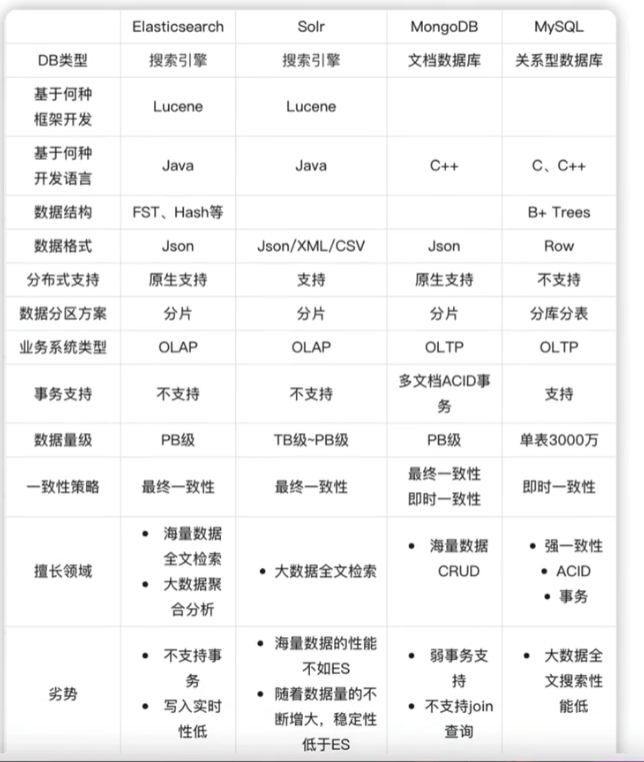
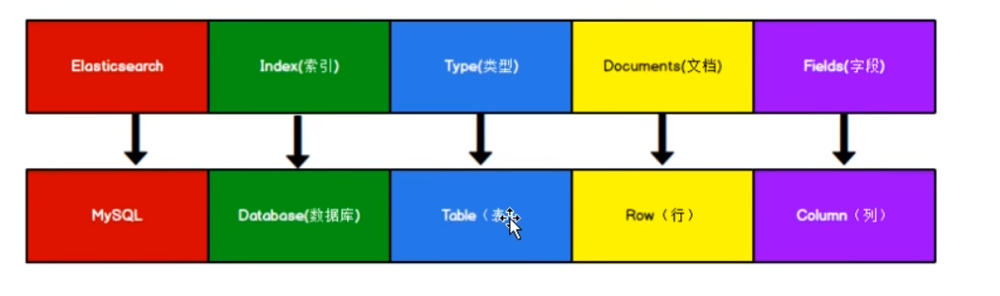
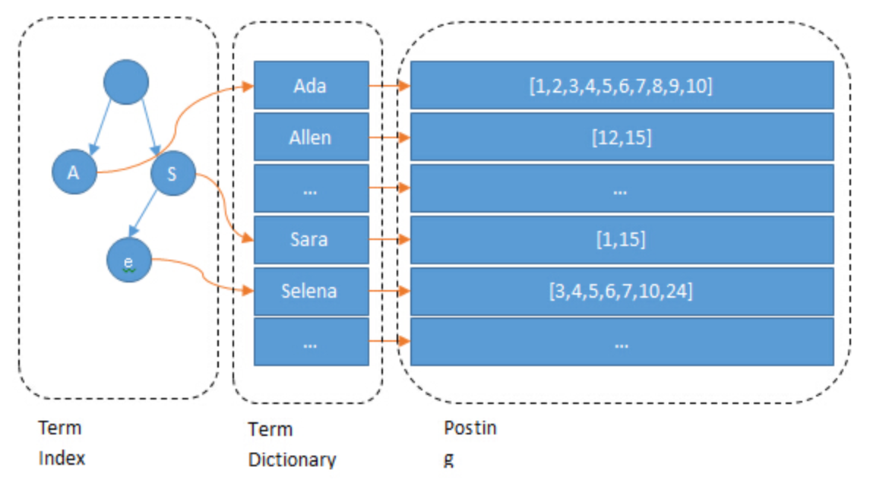
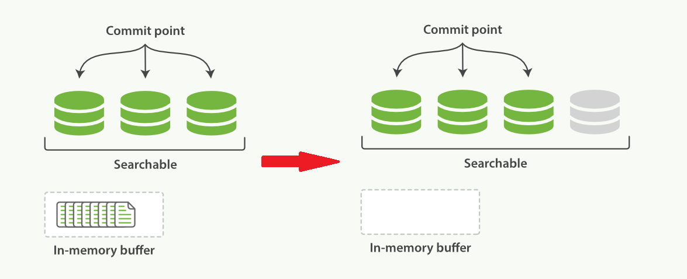
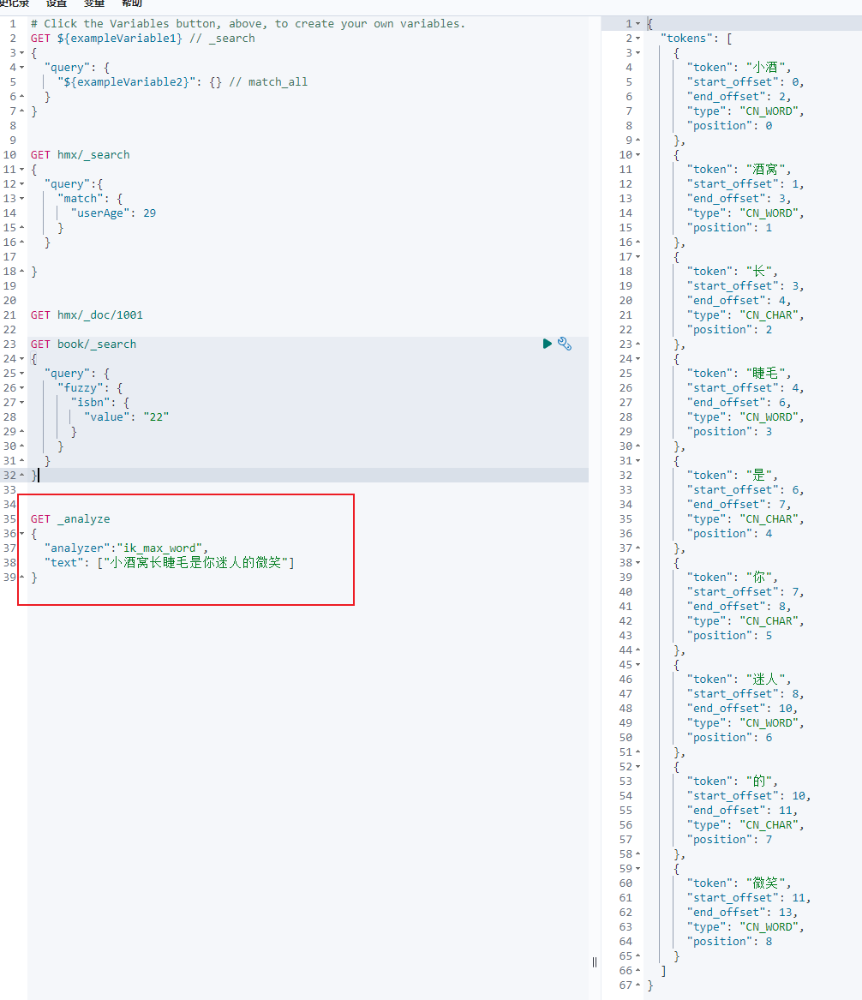
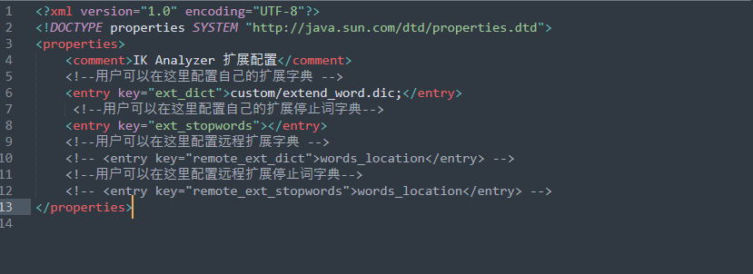
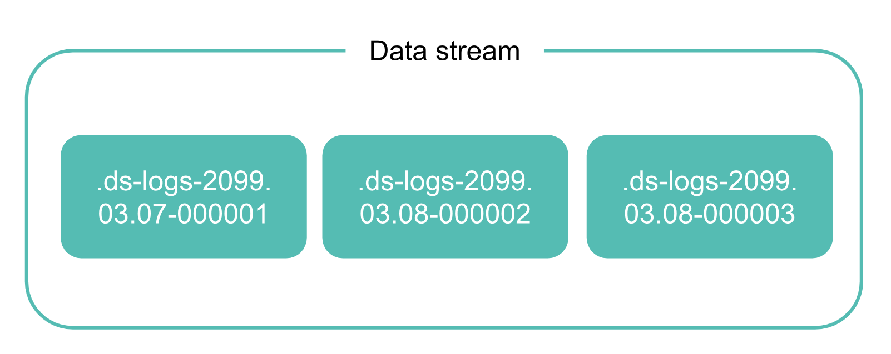

# Elasticsearch

OLAP，**解决海量数据的全文检索**


但是在以下场景并非首选：

* 管理数据（mongoDB比较适合）
* 事务场景
* 大单页查询（单次查询海量数据）
* 数据的实时写入或者更新


## 数据库对比




## 入门

### 倒排索引

ES主要通过索引完成文档的定位。在结构方面，ES与mysql数据库类似。在库、行、列上意思相近，但是已经淘汰了“类型Types”这个概念



```txt
以书为例子
正向索引
id   | content
101  | 水浒传 作者：xxx 第一话 。。
102  | 水经注 作者：xxx 第一话 。。

倒排索引
content  | id
水       |  101,102
传       |  101

```

#### 倒排索引的内部结构
在数据生成的时候会按照正则化过程使用分析器将文本拆分为字词。并把词或者短语以及对应的文本id记录下来。就如上所示。
然而在生产环境上，考虑到各大语种和语种中的每个词项，如果需要完全遍历一遍是显然不行的。因此需要对词项进行排序，类似于b+树，在页里面实现二分查找。
仅仅排序仍然不够，词项都存储在磁盘中，io处理较慢，需要考虑放内存中，然而不加处理就塞进内存瞬间就会溢出。



Luceue的倒排索引，实际上添加了一层**字典树**，不存储词项，而是用来存储前缀，通过字典树查找到单词所在的块(即大致位置)，再在块中二分查找对应的单词，找到对应的文档列表。
除此之外，Luceue提供了一种压缩策略减少内存的消耗。

用于解决文档id列表的两个痛点：
* 如何压缩并节省磁盘内存
* 如何快速求取交并集

**Frame of Reference**
如果存在array1=[73,300,302,332,343,372]数组。
Lucene中数据是按照segment存储的，每个segment最多存65536个文档，如果不进行任何处理，每个数据元数会占用2 bytes。那么array1需要消耗12bytes空间。

1. 首先可以采用增量编码，只几率元素与元素指甲你的增量，于是数组变成：
array2=[73,227,2,30,11,29]
2. 其次，Lucene中每个块是256个id，可以保证每个块经过增量编码后，每个元素不超过256bytes：
假设将array2分割为两块:array2-1=[73,227,2];array2-2=[30,11,29]
3. 最后，按需分配空间，对于第一个块，最大元素为227，只需要8bits，那么给这个块的每个元素都分配8bits空间；另一个块最大为30，只需要5bits，只给每个元素分配5bits空间。
从结果上看，原始储存array1需要24bytes空间，经过3层处理后，仅需要3*8bits+3*5bits=7bytes

**Roaring bitmaps**
在lucene查询，通常不只有1个查询条件，需要对每个查询条件分别去倒排索引中查，根据**frame of reference**反向解压，还原原始文本id，然后对id数组做交集。
<u>即使没有多个条件，考虑到lucene是分片存储的，因此也需要频繁求并集</u>

整数数组
对于有序的数组，可以使用跳表。但是Integer数组每个元素占用2bytes，从磁盘解压后全放入内存中处理，会产生溢出。

BitMap
可以使用[0,0,1,0,0,1,1,0,0,1]表示[3,6,7,10]，利用1表示对应的数字存在。
通过这种方式可以减少内存：每个文档id只需要1bit，相比Integer数组每个id只需原本的1/16内存消耗。并且bit运算更快。

roaring bitmaps
然而bitmap占用的空间是一致的。意味着无论参与运算的文档id数量有多少，占用的内存空间一致。极端说明：每个segment有65536个文档id，但查询条件筛选出来的结果就头尾两个，bitmap表示[0,65535]为[1,0,0,0,0...,1]。从空间上Integer数组更节省空间。
因此可以使用条件函数，当文档数量少于4096个时，使用Integer数组，更多时，使用bitmap。

**Frame of reference**用于压缩数据，减少磁盘的占用空间。因此在从磁盘中取数据时，需要一个反向解压的过程。接着需要对数组在<u>内存</u>中进行交并集处理，数组的数量根据查询条件一致，通过**roaring bitmaps**算法，满足高效和低内存消耗的条件。


## 1. Index Module

索引设置包括：

* 静态索引： 可以在创建的时候或者关闭的索引上设置
* 动态索引： 可以在index存活的时候配置

静态索引：

#### 静态索引

`index.number_of_shards`

​	表明一个索引的主要分片(`primary shards`)数量，默认为1。仅能在创建的时候指定。

​	该设置允许再1024以内，该设置是一个安全值，用来避免在异常创建index时，导致资源再分配，集群的稳定性。允许配置`export ES_JAVA_OPTS="-Des.index.max_number_of_shards=128"`到每个集群的环境变量中。

`index.number_of_routing_shards`

​	配合`number_of_shards`用来引导到主要分片上。在设定上为`number_of_shards`的偶数倍，最大可以达到1024。

一个文档的通过以下公式被路由到具体分区上：

路由因子的定义如下：
$$
routeringfactory = numberRoutingShards / numPrimaryShards
$$
​	具体的路由规则如下：
$$
shardNum = (hash(routing) \% numRoutingShards ) / rountingFactory
$$
通过对rounting（实际上是`Document`的`_id`）进行哈希，并使用路由分片数量取余，将结果固定到[0,`number_of_routing_shards`]，最后除以路由因子。（类似直接对`number_of_shards`取余）

`index.rounting_partition_size`

​	自定义路由值能够路由到的分片数，默认为1

`index.soft_deletes.enable`

​	软删除，默认为true

`index.soft_deletes.retention_lease.period`

​	软删除的保存时间，默认12h

`index.shard.check_on_startup`

​	开机自检，非专家不要调整

#### 动态索引

`index.number_of_replicas`

​	每个主要分片(`primary shard`)的副本数量，默认为1

`index.auto_expand_relicas`

​	自动扩充副本(数量取决于集群中的节点数量)，默认为false。可以通过具体的数值区间指定`[0,5]`或者使用`all`。扩充的副本将携带“分类过滤”规则到各个节点上，但是不会携带其他如"每个节点最大的副本容量"等规则到节点。而每个副本也变成亚健康状态。

`index.search_idle.after`

​	设置多长时间没有接收查询请求就会进入空闲状态。默认为30s

`index.refresh_interval`

​	刷新的间隔时间，让近期的更新能对最新的查询可见，默认为1s。设置为-1表明不自动刷新。

​	对空闲状态的节点触发`search`，将会附带refresh请求

`index.max_result_window`

​	返回的结果集最大容量

`index.gc_deletes`

​	删除之后的文档存活时间

### 1.1 索引分片分配


#### 1.1.1 基础-分片shard

* primary shard

* replica shard

作用：

* 提升分布式服务的高可用性
* 提升系统服务的吞吐量和并发响应的能力(在横向扩容的时候，将`primary shard`分到不同的节点上)
* 当集群的性能不满足业务要求的时候，能方便快速的扩容


#### 1.1.2 基本-分片策略

* 默认为1主1副共计2个分片。
* 每个分片都是一个Lucene实例，有完整的创建索引和处理请求的能力
* ES会自动在node上做分片均衡 shard rebalance
* 一个doc（一部分文本内容）不可能同时存在于多个主分片中（主分片之间内容互补），但是当每个主分片的副本数量不唯一时，可以存在多个副本中
* **主分片及其副本分片不能同时存在于一个节点上**，不然节点宕机，数据完全丢失
* **完全相同的副本不能同时存在于一个节点上**


#### 1.1.3 索引级分片分配过滤

可以控制索引所分配分片的位置。`cluster.routing.allocation`是动态的，现有索引能够立即从一组节点移动到另外一组节点上，但是不能破坏在既定前提下的路由约束（一个节点上不能同时有一个分片及其副本分片等）。通过这个分片分配过滤方式，可以将部分分片路由到更合适的硬件上。

分片分配过滤器可以基于自定义节点属性，或者`_name`, `_host_ip`, `_publish_ip`, `_ip`, `_host`, `_id`, `_tier` 和 `_tier_preference` 等属性。

开启index-level shard allocation filtering，需要以下

1. 在`elasticsearch.yml`自定义节点属性，明确过滤的特性

```yaml
node.attr.size: medium
# 比如有mediu、small、big三个节点，计划通过size属性来做过滤
```

2. 添加路由分配过滤器，支持`include`、`exclude`和`require`三种过滤方式，添加`index.routing.allocation.include`表明过滤的条件

```shell
PUT test/_setting
{
	"index.routing.allocation.include.size": "big,medium"
}
# 必须满足size为big 或者 medium 的节点
```

如果需要指定多个过滤器，那么需要按照顺序指定，并运用三种过滤条件，具体内容用","分割：

* include：至少一个满足
* reuqire：必须全部满足
* exclude：不能满足后面指定的条件


#### 1.1.4 节点离开的延迟分配

当节点离开集群的时候，`master`必须执行以下内容：

* 敦促还在集群中的节点，如果有已离开节点的主分片的副本分片，将其转换为主分片
* 分配副本分片来代替消失的副本分片
* 对集群中的节点再均衡

在节点离开后一段时间内，一部分节点将变成"unassigned"未分配状态，默认为1分钟


**取消分片分配**
如果延迟分配的时间超时，master节点会要求在其他节点上分配已消失的分片。倘若此时节点恢复连接到集群中，该节点中的分片仍然被视为主节点`primary shard`，而分片的再分配会取消，同步的分片也用于恢复。

```shell
PUT _all/_settings
{
	"settings":{
			"index.unassigned.node_left.delayed_timeout":"2m"
	}
}
# 对所有的索引设置延迟时长
# 如果确定一个节点不会再连接到ES集群中，可以直接设置成0，让集群立即分配分片。
```

#### 1.1.5 索引恢复优先级
没分配的分片需要按照优先级恢复，可以通过以下方式指定优先级：
* `index.priority`设置
* 索引创建的时间
* 索引的名称

意味着，默认情况下，越新的索引恢复的优先级越高
```shell
PUT index_1

PUT index_2

PUT index_3 
{
	"setting":{
			"index.piority":10
	}
}

PUT index_4
{
	"setting":{
			"index.priority":5
	}
}

# 恢复的优先级 index_3 > index_4 > index_2 > index_1

# 可以通过以下方式更改优先级
PUT index_4/_settings
{
	"index.priority": 1
}
```

#### 1.1.6 每个节点的分片总数
集群级别的分片分配策略尽可能将每个索引的分片尽可能分散到整个集群。但是同时要考虑到分片和索引的数量，以及大小容量，因此不一定每次分配策略都有效。
可以通过以下方式，限制单个索引在每个节点上的最大分片数量：

* `index.routing.allocation.total_shards_per_node` 单个节点上主+副分片的最大容量，默认无限制

也忽略index的设置，而设置单个节点上的容量
* `cluster.routing.allocation.total_shards_per_node` 每个节点可分配的最大主/副分片数量，默认为-1

Elasticsearch会在每次分配分片的时候检查这个配置。
**这些配置非常重要，可能会导致部分分片不可分配，请谨慎使用**

#### 1.1.7 索引级数据层分配过滤
可以使用索引级别的`_tier_preference` 来控制 索引分配到哪个数据层
`index.routing.allocation.include._tier_preference`


### 1.2 Merge
一个Elasticsearch的分片是Lucene的索引，又被分割为多个segments。
segment是用于数据存储的索引内部存储元素，并且是不可更改的。小的segment会周期合并为较大的segment，用以保持索引的大小不变。
采用自主节流的方式，在合并和查询之间平衡硬件资源

合并执行计划(同步合并)控制合并操作的执行。合并采用多线程方式执行，线程负载满的时候，会等待空闲线程。

`index.merge.scheduler.max_thread_count`
	单个分片上单次合并操作需要的线程数量。默认是`Math.max(1,Math.min(4,<<node.processors,node.processors>>/2))`，在ssd上工作很好。也可以直接在hhd上设置为1。

### 1.3 Similarity module(专家模式)
用来表示不同的文档的相似程度得分。相似度是每个字段匹配获取的。一般使用内置的相似度匹配就可以了。

**配置相似度计算**
大部分的相似度已经内置，并且可以通过在创建/更新索引的时候修改对应配置即可。
```shell
#  配置DFR相似度计算 指向 “my_similarity”
PUT /index
{
  "settings": {
    "index": {
      "similarity": {
        "my_similarity": {
          "type": "DFR",
          "basic_model": "g",
          "after_effect": "l",
          "normalization": "h2",
          "normalization.h2.c": "3.0"
        }
      }
    }
  }
}
```
实际字段的映射如下：
```shell
# 将title的相似度计算配置为“my_similarity”的DFR
PUT /index/_mapping
{
  "properties" : {
    "title" : { "type" : "text", "similarity" : "my_similarity" }
  }
}
```
已有的相似度计算公式，见[官网](https://www.elastic.co/guide/en/elasticsearch/reference/current/index-modules-similarity.html)


### 1.4 Slow Log
#### 1.4.1 慢查询日志 search slow log
可以在查询阶段和读取阶段设置阈值。默认的阈值是-1，即不开启慢查询
```log
index.search.slowlog.threshold.query.warn: 10s
index.search.slowlog.threshold.query.info: 5s
index.search.slowlog.threshold.query.debug: 2s
index.search.slowlog.threshold.query.trace: 500ms

index.search.slowlog.threshold.fetch.warn: 1s
index.search.slowlog.threshold.fetch.info: 800ms
index.search.slowlog.threshold.fetch.debug: 500ms
index.search.slowlog.threshold.fetch.trace: 200ms
```

上面的设置，可以通过动态更新到索引
```shell
PUT /my-index-000001/_settings
{
  "index.search.slowlog.threshold.query.warn": "10s",
  "index.search.slowlog.threshold.query.info": "5s",
  "index.search.slowlog.threshold.query.debug": "2s",
  "index.search.slowlog.threshold.query.trace": "500ms",
  "index.search.slowlog.threshold.fetch.warn": "1s",
  "index.search.slowlog.threshold.fetch.info": "800ms",
  "index.search.slowlog.threshold.fetch.debug": "500ms",
  "index.search.slowlog.threshold.fetch.trace": "200ms"
}
```
打印日志一般在分片阶段，一般在指定的分片上执行，而非整个请求过程，这样的好处在于可以固定打印日志的机器。

#### 1.4.2 慢查询追溯
一个请求会被`X-Opaque-ID`初始化，而其中的用户id会作为慢查询日志的额外**id**字段出现。

#### 1.4.3 index Slow log
在功能上与search slow log类似。输出默认以`_index_indexing_slowlog.json`作为日志文件命名结尾。其配置上也与search slow log 相似。
```shell
index.indexing.slowlog.threshold.index.warn: 10s
index.indexing.slowlog.threshold.index.info: 5s
index.indexing.slowlog.threshold.index.debug: 2s
index.indexing.slowlog.threshold.index.trace: 500ms
index.indexing.slowlog.source: 1000

PUT /my-index-000001/_settings
{
  "index.indexing.slowlog.threshold.index.warn": "10s",
  "index.indexing.slowlog.threshold.index.info": "5s",
  "index.indexing.slowlog.threshold.index.debug": "2s",
  "index.indexing.slowlog.threshold.index.trace": "500ms",
  "index.indexing.slowlog.source": "1000"
}

```
默认日志打印1000个`_source`字母。
如果需要更改，配置`index.indexing.slowlog.source`，配置`false`或者`0`将不会打印`_source`内容;设置`true`将会无视大小，打印全部的`_source`内容。
最原始的`_source`内容将被格式化，确保压缩成一行日志打印。
如果需要保留原始格式，在`index.indexing.slowlog.reformat`设置为`false`。
日志文件保存到`log4j2.properities`里。

#### 1.4.4 慢日志级别
如果需要关闭详细信息打印，达到模拟`index.indexing.slowlog.level: INFO`的效果，只需要设置,`index.indexing.slowlog.threshould.index.trace/debug = -1`


### 1.5 Store存储
控制如何在硬盘上存储和获取索引数据
默认采用`index.store.type: hybridfs` ，能有有效基于读取模式为每种类型选择最好的文件系统类型。

**预载数据到文件系统缓存中（专家模式）**
默认情况下，Elasticsearch会将IO操作缓存到操作系统的文件系统缓存(file system cache)中，可以通过配置`index.store.preload`告诉操作系统先加载一部分热门索引的上下文数据到缓存中。

### 1.6 Translog 传输日志
lucene的硬盘持久化只能通过lucene提交而改变，而这是一个相对有开销的操作，不能在每次删除等操作后执行。每次在提交之后，或者下一次提交之前的改变，都可能因为进程的退出或者硬件异常而丢失。

<u>分片收到写请求的时候，在被lucene内部索引处理之后和lucene知晓之前，请求会存储到translog中</u>
在系统崩溃的时候，如果lucene已经知晓这部分改变，但是没有被lucene commit，将会在下一次分片重启的时候恢复。
通过flush可以让lucene提交和开启新的translog。通常flush会后端自动执行，避免translog过大，和崩溃后恢复时间过长

#### 1.6.1 translog setting
当translog已处于`fsync`并且已经提交过之后，translog的数据就可以持久化到硬盘中。任何崩溃、溢出都会导致数据丢失。
通常情况，`index.translog.durability=request`，在translog成功处于`fsync`和提交到主分片和每个副本分片后，用于报道索引，删除，更新，批量操作的成功信息。

`index.translog.sync_interval`
控制translog将变更的数据存储到硬盘中的频率，无视写入操作。默认5秒

`index.translog.durability`
决定是否在每次索引、删除、更新和批量操作后，同步和提交translog数据到硬盘中，接受以下参数：
	* `request`: 默认设定，每次更新后同步，所有lucene已经知晓的写操作，都会同步和提交到硬盘
	* `async`: 后端每间隔`sync_interval`后提交。异常发生，自上次自动提交以来的所有数据都丢失

`index.translog.flush_threshold_size`
translog存储所有还没有安全被存储到lucene的操作。如果此时分片在停止后重新恢复，那么这些操作会重新加载。该配置控制这些操作的最大数量，避免恢复的时间过长。
一但达到最大阈值，将会产生flush命令，创建一个lucene commit point。
默认值为`512mb`

**lucene commit point**

主要用于记录当前所有可用的segment，每个commit point都会维护一个`.del`文件（一一对应）,而ES在处理删除/更新请求的时候，会在`.del`文件中把旧文档数据做删除记录（es是软删除），当查询请求过来的时候，被删除的文档仍然能够查出来，但是会被commit point维护的`.del`文件过滤掉。

### 1.7 历史保留
采用软删除，默认12h

### 1.8 索引排序
该排序是指：es创建的时候，分片的每个segment如何排序。默认情况下，lucene不会做出排序。可以通过`index.sort.*`指定segment的排序采用哪个字段。
(元数据等系统相关的字段，不能作为排序，他们依赖于相邻的文件id，如果用他们作为排序依据，可能会破坏索引排序)

```shell
# 以age字段，倒序排序
PUT my-index-000001
{
  "settings": {
    "index": {
      "sort.field": "age", 
      "sort.order": "desc"  
    }
  },
  "mappings": {
    "properties": {
      "date": {
        "type": "date"
      }
    }
  }
}


# 多个字段共同参与排序
PUT my-index-000001
{
  "settings": {
    "index": {
      "sort.field": [ "username", "age" ], 
      "sort.order": [ "asc", "desc" ]       
    }
  },
  "mappings": {
    "properties": {
      "username": {
        "type": "keyword",
        "doc_values": true
      },
      "date": {
        "type": "date"
      }
    }
  }
}
```
以下为一部分索引参数配置
`index.sort.field`
用来排序的字段，只能是boolean,numeric,data和x.keyword字段
`index.sort.order`
顺序
`index.sort.mode`
选择用什么值对文档排序，min/max
`index.sort.missing`
处理字段缺失的文档，`_last`放最后/`_first`最开始

排序只能在创建的时候定义一次，不支持后续更新/添加新的排序。索引排序可能会带来吞吐量上的性能瓶颈。


### 1.9 补充（核心写入数据）

elasticsearch是一个近实时的搜索（**near real-time search**）

lucene是由java实现的，也是elasticsearch的基础，引入了segment的概念。而每个segment相当于一个倒序索引，对lucene的index而言，就是一系列的segment和一个提交点（**a collection of segments plus a commit point**）。在每次提交后，都会又新的分区加到提交点中而缓存会清空。


当执行删除/更新等操作时，会将文档先存入内存缓存中(**in-memory indexing buffer**)，**此时buffer中的数据是搜索不到的**，同时将请求操作也会存储到translog中。

* refresh：当buffer快满了，或者`refresh_interval`（默认1秒）后，会清空buffer，将数据生到新的segment中。**此时新的segment是还没有持久化处理的**，新的segment被写入到文件系统缓存中(**file system cache**，操作系统级别)。lucene允许新segment的创建，**无需提交就可以被查询到**，这也是near real-time的原因



* 为了防止es突然宕机，保证数据可靠性，translog也会同步保存数据。根据配置，在指定时间快到或者大小到达上限后执行**flush**命令，会持久化到磁盘中，并生成对应的commit point写入磁盘


## 2. Mapping

映射是定义文档和它所包含的字段如何存储和被检索到的过程
当映射数据时，会创建一个映射定义（**mapping definition**），该定义包含了一系列与文档有关的字段（包括元数据字段）。


**显式映射**
精准对照映射定义。比如：
1. string看做text字段
2. 包括数字，数据或者地理位置的字段
3. 数据的格式
4. 自定义规则控制动态添加的字段映射

**runtime fields**能够有效应对结构改变，不需要重新索引

**避免索引爆炸**
如果对过多的字段配置定义，可能出现映射爆炸，导致大量内存占用、难以恢复等问题。


### 2.1 动态映射 dynamic mapping
动态映射在数据探索阶段效果最好，允许添加新的字段到为最高级别的映射、内部对象或者内置字段。
使用动态匹配模板，可以基于匹配条件，动态添加字段及其映射。
```shell
# 先没有创建index、field、data_type等
# 自动创建data的index，叫count的字段及其字段类型long
PUT data/_doc/1 
{ "count": 5 }
```
如上所示，自动检测和添加新字段的过程就是动态映射

#### 2.1.1 动态字段映射 dynamic field mapping
通过设置`dynamic`参数为`true`或`runtime`，显式为新进文档创建字段映射。
自动创建的匹配规则见[官网](https://www.elastic.co/guide/en/elasticsearch/reference/current/dynamic-field-mapping.html)
如果设置为`false`，表明在文档和对象级都将忽略新的字段，并在elasticsearch遇到未知的字段时，设置`strict`将拒绝文档，并引发错误，要求必须显式添加到映射中。

**日期检测date detection**
默认开启的`date_detection`，决定字符串字段匹配哪种`dynamic_date_formats`，如果成功匹配，新的`date`字段会添加对应的格式。
默认的`dynamic_date_formats`是[`strict_date_optional_time`,"yyyy/MM/dd HH:mm:ss"|"yyyy/MM/dd z"]

**关闭日期检测**
如果设置的`date_detection`为`false`，那么就会将检测到的日期设置为`text`

**自定义日期检测格式**
```shell
PUT my-index-000001
{
  "mappings": {
    "dynamic_date_formats": ["MM/dd/yyyy"]
  }
}

PUT my-index-000001/_doc/1
{
  "create_date": "09/25/2015"
}
```

在配置`dynamic_date_formats`时，如果配置数组和“||”有所不同：
1. 如果配置的是数组`"dynamic_date_formats": [ "yyyy/MM", "MM/dd/yyyy"]`，那么在实际匹配时，第一个文档所匹配成功的模式将决定该字段的映射规则。
```shell
# 创建映射
PUT my-index-000001
{
  "mappings": {
    "dynamic_date_formats": [ "yyyy/MM", "MM/dd/yyyy"]
  }
}
# 添加数据，成功匹配数组第二个
PUT my-index-000001/_doc/1
{
  "create_date": "09/25/2015"
}

# 查看
{
  "my-index-000001": {
    "mappings": {
      "dynamic_date_formats": [
        "yyyy/MM",
        "MM/dd/yyyy"
      ],
      "properties": {
        "create_date": {
          "type": "date",
          "format": "MM/dd/yyyy"  # 该字段的匹配仅为第二个
        }
      }
    }
  }
}
```

2. 如果配置`"dynamic_date_formats": [ "yyyy/MM||MM/dd/yyyy"]`，将允许索引使用不同的模式
```shell
{
  "my-index-000001": {
    "mappings": {
      "dynamic_date_formats": [
        "yyyy/MM||MM/dd/yyyy"
      ],
      "properties": {
        "create_date": {
          "type": "date",
          "format": "yyyy/MM||MM/dd/yyyy"
        }
      }
    }
  }
}

```
**数值检测**
JSON本身支持正整数和负浮点数，但是一些应用/语言有时直接将数值看做字符串。可以显式地映射字段，并且numeric detection可以自动识别：
```shell
PUT my-index-000001
{
  "mappings": {
    "numeric_detection": true
  }
}

PUT my-index-000001/_doc/1
{
  "my_float":   "1.0", # 自动识别为float
  "my_integer": "1"  # 自动识别为long
}
```

#### 2.1.2 动态模板 dynamic templates

在设置`dynamic`为`true`或者`runtime`下时，动态模板能够更好地控制Elasticsearch映射数据。动态模板的新增必须基于以下规则：
* `match_mapping_type` es所检测到的数据类型(data type)
* `match`和`unmatch` 使用模式匹配一个字段名
* `path_match`和`path_unmatch`操作的完整匹配路径
如果没有定义以上的字段，动态模板将不会起作用。
**只有在一个字段包含了具体值，才会追加新的动态字段映射。并且它不会匹配对null或者空数组的进行匹配。如果动态模板中包括了null_value选项，直到第一为该字段指定具体值的文档被检索后，才会应用该选项**

动态模板可以被指定数组格式：
```shell
  "dynamic_templates": [
    {
      "my_template_name": {   # 模板名称
        ... match conditions ...  # match_mapping_type....等匹配条件
        "mapping": { ... } # 被匹配到字段应使用的映射
      }
    },
    ...
  ]
```

### 2.2 显式映射
如果对数据了解的够多，可以在创建索引或者增加字段时，直接使用显式映射

**创建索引的时候指定显式映射**
```shell
PUT /my-index-000001
{
  "mappings": {
    "properties": {
      "age":    { "type": "integer" },  
      "email":  { "type": "keyword"  }, 
      "name":   { "type": "text"  }     
    }
  }
}
```

**追加到已有的映射上**

```shell
PUT /my-index-000001/_mapping
{
  "properties": {
    "employee-id": {
      "type": "keyword",
      "index": false
    }
  }
}

```

**更新字段的映射**
除了一部分支持的映射参数，不能修改已有的参数，这样会使已检索的数据失效。

重命名字段也会使旧字段下的索引数据失效，最好是采用`alias`创建备用字段名称


`GET /myindex/_mapping`可以查看现有索引的映射

`GET /myindex/_mapping/field/specific_field`查看具体的字段映射


### 2.3 Runtime fields

是查询时计算出来的字段，可以支持：

1. 无需重新构建索引，可以直接添加字段到现有的文档
2. 不需要理解如何构建
3. 覆盖查询时，索引返回的数据
4. 无需更改潜在结构，就可以定义一个具体用途的字段

可以在索引映射和查询请求定义runtime fields，且不会被索引，因此不会增加索引大小。并且如果后续将runtime field转化为indexed field，不需要更改任何查询。

**注意：runtime field 本身是不会被显示到的`_source`中，通过search时指定"field"可以查出来**

`runtime`只支持以下数据类型：

* boolean
* composite
* date
* double
* geo_point
* ip
* keyword
* long
* lookup

#### 2.3.1 映射runtime field
可以通过脚本的方式，添加`runtime`的映射。该脚本可以访问文档的上下文，原始的`_source`。在执行查询的阶段，会为每个脚本生成对应的字段。
该例子展示，对`_source`中日期格式的`timestamp`字段计算该时间是周几，并通过`emit`返回计算的结果

```shell
PUT my-index-000001/
{
  "mappings": {
    "runtime": {
      "day_of_week": {
        "type": "keyword",
        "script": {
          "source": "emit(doc['@timestamp'].value.dayOfWeekEnum.getDisplayName(TextStyle.FULL, Locale.ROOT))"
        }
      }
    },
    "properties": {
      "@timestamp": {"type": "date"}
    }
  }
}
```

**无脚本定义runtime field**

如果没有定义脚本，elasticsearch会在查询阶段隐式从`_source`中寻找同名的字段，并做返回。如果没找到对应字段，该`runtime field`就不会出现在返回结果中。
```shell
PUT my-index-000001/
{
  "mappings": {
    "runtime": {
      "day_of_week": {
        "type": "keyword"
      }
    }
  }
}
```
在大多数情况下，尽可能以`doc_value`检索数据。`runtime field`通过`doc_value`检索数据会比从`_source`中检索效率更高。考虑到对应的数据加载方式。

**更新/删除runtime field**
随时可以更新`runtime field`，删除仅需要将其置null

```shell
# 删除
PUT my-index-000001/_mapping
{
 "runtime": {
   "day_of_week": null
 }
}
```

**覆盖**
当post存储数据的时，错误将`numeric`类型字段存储为`text`类型，这将导致无法对该数值字段进行聚合、排序（因为除`text`外的数据默认由`doc_value`额外做列式存储备份，允许对该字段进行排序等操作）。
采用`runtime field`覆盖原始返回值，能够将`text`转换为`numeric`类型，并允许额外的操作，并且不会对源数据做更改。
如果某些文档的具体值计算出现异常，仍然可以通过覆盖解决。
```shell
POST my-index-000001/_search
{
  "runtime_mappings": {  # 在查询的时候 创建runtime field
    "measures.voltage": {
      "type": "double",
      "script": {   # 脚本
        "source": 
        # 如果文档的model_numer为'HG..'，对该文档下的measuere.voltage*1.7倍
        """if (doc['model_number.keyword'].value.equals('HG537PU')) 
        {emit(1.7 * params._source['measures']['voltage']);}
        else{emit(params._source['measures']['voltage']);}"""
      }
    }
  },
  "query": { # 匹配条件
    "match": {
      "model_number": "HG537PU"
    }
  },
  "fields": ["measures.voltage"] 
  # 返回的结果中`_source`仍然为原始值，而`fields`没有指定的话，会返回所有的数据，包括没有被`_source`收录的字段
}

```

#### 2.3.2 对runtime field字段创建索引
如果需要对`runtime field`有更好的性能，将其定义在构建索引映射（**index mapping**）的上下文中即可。并且可以指定额外的参数，控制`runtime field`

```shell
# 对my-index-000001索引构建索引映射，并将runtime field放入，同样可以构建索引
PUT my-index-000001/
{
  "mappings": {
    "properties": {
      "timestamp": {
        "type": "date"
      },
      "temperature": {
        "type": "long"
      },
      "voltage": {
        "type": "double"
      },
      "node": {
        "type": "keyword"
      },
      "voltage_corrected": {
        "type": "double",
        "on_script_error": "fail", 
        "script": {
          "source": """
        emit(doc['voltage'].value * params['multiplier'])
        """,
          "params": {   	# 额外可选的参数
            "multiplier": 4   
          }
        }
      }
    }
  }
}
```
新的查询能够基于该`runtime field`进行检索


### 2.3 数据字段类型
每个字段读都有字段数据类型或者字段类型。

字段类型由家族划分，同一家族的字段类型在查询表现上一致，只是空间消耗、字符表示有所差异。


### 2.4 元数据字段

#### _doc_count

聚合需要返回`doc_count`字段表明参与聚合和分区的文档数量。

如果使作用在与聚合的数据上时，可能会失真，因为一个摘要性字段(**summary field**)可能表示了多个文档。

如果需要对summary field字段准确统计，需要在put文档的时候使用`_doc_count`表明该文档已经聚合了多少数量的文档。

```shell
PUT my_index/_doc/1
{
  "my_text" : "histogram_1",
  "my_histogram" : {
      "values" : [0.1, 0.2, 0.3, 0.4, 0.5],
      "counts" : [3, 7, 23, 12, 6]
   },
  "_doc_count": 45  # 表明该文档已经聚合了45个（柱状）
  # 在返回的doc_count上就会是45
}
```

#### _field_names
`_field_names`现在仅仅用来检索禁用了`doc_values`和`norms`的字段的名称。其他启用两个条件的字段仍然可以被检索，但是不会用`_field_nams`字段标识。

#### _ignored
该字段能够检索出，在存储和索引文档时，因异常或者不规范原因导致被忽略的的字段名称
```shell
# 查询所有存在字段被忽略的文档
GET _search
{
  "query": {
    "exists": {
      "field": "_ignored"
    }
  }
}

```

#### _id

可以在创建文档索引的时候指定，也可以通过elasticsearch自动生成
可以在查询阶段通过`term`,`terms`,`match`,`query_string`	指定
```shell
GET my-index-000001/_search
{
  "query": {
    "terms": {
      "_id": [ "1", "2" ] 
    }
  }
}
```
**仅限于在排序、脚本、聚合的时候使用**
基于`_id`的排序、聚合时允许的，但是建议还是冗余一个具备`doc_value`的字段


#### _index

文档所属的索引


#### _meta

可以存放应用程序指定的元数据


#### _routing

路由的具体规则见公式(1),(2)

默认的理由字段是`_id`。也可以通过给每个文档指定`routing`值，实现自定义路由模式

```shell
PUT my_index/_doc/1?routing=user1&refresh=true
{
  "title":"this is a document"
}
# 通过这种模式可以直接使用’user1‘作为路由值，而非其id(1)

GET my_index/_doc/1?routing=user1
# 相同的routing值需要在getting/deleting/updating中指明
```


自定义的路由会减少search的影响。将不会查询所有的索引分片，而只会发送与指定的`routing`匹配的分片上。

```shell
# 这个search查询只会执行在与user1、user2关联的分片上
GET my_index/_search?routing=user1,user2
{
	"query":{
			"match":{
					"title": "document"
			}
	}
}
```

如果使用自定义的`routing`，需要在各种操作上明确指明`routing`值。

如果忘记填写`routing`值，可能会导致文档被多个分片索引。因此可以将`routing`设置成操作的必要参数

```shell
# 将routing值作为必要参数
PUT my_index
{
	"mapping":{
			"_routing":{
					"required": true
			}
	}
}

# 出现异常：缺乏routing值，routing_missing_exception
PUT my_index/_doc/1
{
	"text":"...."
}
```

**当使用自定义的路由时，索引`_id`的唯一性无法保证在所有分片上都生效。实际上，具备相同`_id`的文档，可能会出现在拥有不同的`_routing`值的不同分片上。**

**因此必须必须确保索引ids的唯一性。**


##### 路由到索引分区

可以通过配置`index.routing_partition_size`，达到将路由转移到分片的子集，而不仅仅是单个分片。这将有助于降低search的影响。当该配置显式表示的时候，那么计算分片的公示如下：
$$
routingValue = hash(routing) + hash(_id)\% routingPartitinSize
$$

$$
shardNum = (routingValue\%numRoutingShard)/routingFactory
$$

`_routing`用来计算索引内的一组的分片集合，而`_id`用来从该集合中选择一个。

要开启该功能，必须满足`index.routing_partition_size ∈ (1,index.number_of_shards)`，一旦开启，分区索引有以下限制：

* 带有`_join`的mapping操作无法使用该功能
* 所有的mapping必须携带有`_routing`字段


#### _source

用JSON存储最初的文档对象（即在一个字段中存储了一个文档全部的字段值），`_source`字段本身不会被检索，但是本身会存储的数据用于在**fetch request**时返回。

`_source`会占用大量的硬盘，它不仅仅只是存储源数据，elasticsearch会重构数据内容，包括拆分，单词词根还原等复杂操作，并保存这些结果数据用于检索。

如果禁用`_source`将无法使用更新、重新索引等操作，并且不会存储字段。在没有指定`store`的情况下，字段不会返回到查询结果中。


#### _tier

在跨多个索引执行查询时，有时需要针对给定数据层（data_hot、data_warm、data_cold 或 data_frozen）的节点上保存的索引。 _tier 字段允许匹配文档被索引到的索引的 tier_preference 设置。


### 2.5 映射参数

#### doc_values

大部分的字段都默认建立索引，使得可以被搜索。通过倒排索引，允许从唯一排序的`terms`索引列表的中查找，并立刻返回包含该`terms`的文件。

`doc_values`是在文档创建索引的时候，就存储在硬盘上的数据结构，允许通过匹配来查询数据。

`doc_values`会以列式存储的方式，**另外存储**一份和`_source`中一样的值，列式存储能够高效地进行排序和聚合。支持除了`text`和`annotated_text`以外的所有数据类型。

`doc_values`同样能够提供查询功能，但是比索引要慢。如果明确该字段的查询性能不是很重要的同时，希望能够减少硬盘占用，**doc-value-only**是个不错的方式。

```shell
PUT my-index-000001
{
  "mappings": {
    "properties": {
      "status_code": { 
        "type":  "long"
      },
      "session_id": { 
        "type":  "long",
        "index": false  # 不被mapping创建索引
        # "doc_value":false #关闭doc_value，但是仍然可以查询
      }
    }
  }
}
```


#### store

默认情况下，大部分的字段值已经被存储在`_source`字段中，即使没有单独存储字段，也能够查询到的，只是不能被检索。

字段的`store`属性默认是false，并不会主动存储该字段。

* 在`_source`开启，`store`关闭的情况，`_source`中存储原始文档，如果只想返回个别字段，则通过`fields`或者指定`_source`返回字段，而elasticsearch会自动从`_source`中抽取必要的字段。这种情况下无论是返回完整的文档还是个别字段，都需要进行磁盘io，因为都存储在`_source`字段中了。


字段的`store`开启后，会在lucene中单独存储该字段，即存在冗余存储。

* 如果所有字段都开启`store`，同时关闭`_source`，此时`_source`不会再存储全部的原始文档，文档的内容都是字段为单位。因此在查询返回结果的时候，会经过多次磁盘io，因为每个字段都是单独存储的。
* 如果部分字段开启`store`和`_source`，这部分字段会额外存储一份。如果查询结果需要返回其中部分字段时，elasticsearch不会再从`_source`中抽取字段，而是从单独存储的字段中加载。


## 3. 文本分析

### 3.1 简介
文本分析（**Text analysis**）开启全文搜索，能够返回所有相关结果，而非仅仅是精准匹配结果。

**Tokenization**

将全文打散成为单个词组，每个独立的单词可以被看做**token**

**Normalization**

这里的normalization是指一个规范化分词过程，区分于[normalizer](# 3.3 Normalizers)

tokenization支持匹配独立的单词，但是匹配的方式仍是逐字逐句匹配。但是无法应对以下情况：

1. 大小写匹配
2. 具备相同词根的变种
3. 有不同词根，但互为同义词

而正则化normalization可以处理以上情况。在查询时，对查询的参数，进行分词和正则转换。


### 3.2 概念

#### 3.2.1 分析器analyzer剖析
内置或者自定义的分析器，本质上是包含字符过滤器、分词器和分词过滤器的包。

只会作用到倒排索引上，不会对源数据产生改变

**字符过滤器character filter**

在分词之前的预处理，过滤无用字符

字符过滤器能够接收原始文档作为字符流，并支持操作该流。
例如，字符过滤器能够将印度-阿拉伯数字转换为阿拉伯-拉丁文(1,2,3,4...)，或者将html脚本中的元素`<b>`转换进流中。

**分词器Tokenizer**
分词器接收字符流，将其分割成单个独立分词。
分词器也能够记录每个单词在原文中顺序和字符偏移量。

**单词过滤器Token filter**
单词过滤器接收单词流，并支持各种编辑操作。支持用`lowercase`过滤器将单词全部转换为小写；`stop`过滤器能够删除通用词（噪音词），比如`the`；`synonym`过滤器能够将单词的同义词加入流中。
但是单词过滤器不能改变单词的先后顺序和偏移量。
在分析器中，按照顺序可以配置0+个单词过滤器

**字符过滤器和分词过滤器仅仅是对倒排索引产生作用，对源数据没有印象！！！！**


#### 3.2.2 索引和查询分析
索引构建阶段，任何`text`类型的字段都会被分析

查询阶段，在`text`字段上执行全文检索，用户用于查询的字符串也会被分析

分析器在以上两个阶段，分别被称之为索引分析器和查询分析器

通常情况下，索引和查询阶段会使用相同的构造器，让查询的值和存储的值具备相同的分词格式，确保查询结果符合预期。

elasticsearch仍然允许使用不同的分析器在查询阶段，只是这样可能会出现预期之外的结果。

#### 3.2.3 退化stemming
stemming是将单词降级成词根的形式，确保单词的每个变种能够在查询的时候匹配。
所恢复的词根，不一定是真实的单词，比如`jumping`和`jumpiness`都会退化为`jumpi`。

stemming处理的过程会放在**stemming token filter**中处理。这类过滤器通常会分为两类：

1. 算法退化式 algorithmic stemmers，基于规则退化
2. 字典退化式 dictionary stemmers，从字典中退化
考虑到退化会改变单词，建议在索引和查询的时候采用同样的退化方式

**algorithemic stemmer**

采用既定规则去还原到词根样式，比如去掉`es/s`等负数后缀，因此它具备以下好处：

1. 几乎不需要安转

2. 少量的内存消耗

3. 执行速度快


但是如果单词变种相比词根的变化较大或者不规律，效果会比较差，例如`be、are、am`等

**dictionary stemmers**

从提供的外部词典，替换待退化的变种单词。

1. 对不规律的变种有较好的支持
2. 能够很好地区分字体构造上相似，但是含义不同的单词


一般情况下，由于到以下情况，算法比字典的方式要好：
1. 字典本身的质量：甚至还要考虑词典有效期的情况
2. 占用大小和性能：字典需要占用大量的内存用来存储各种前后缀


### 3.3 Normalizers

与分析器类似，只作用到单个分词上，只是normalizers只会产出单个分词。因此正则化不支持分词器，并且只接受一组字符过滤器或者分词过滤器。只有作用在字符上的过滤器才有效，stemming filter就无效，因为它是作用到整个关键词上的。

**normalizers作用在keyword类型的字段上** 


### 3.x 中文分词

采用IK分词，[下载地址](https://github.com/medcl/elasticsearch-analysis-ik)，选择和elasticsearch版本一致的分词器，解压后放入plugin文件夹中

#### 3.x.1 词库描述

* IKAnalyzer.cfg.xml：IK分词配置文件
* 主分词器：main.dic
* 英文停用词：stopword.dic 不会建立在倒排索引中
* 特殊停用词：
  * quantifier.dic：计量单位词库
  * suffix.dic：行政单位
  * surname.dic：百家姓
  * preposition.dic：语气词
* 自定义词库：流行词、业务词等





### 3.x.2 两种analyzer

* ik_max_word: 会将文本做最细粒度的拆分，适合做关键词的查询
* ik_smart：会做最粗粒度的拆分，适合短语查询


### 3.x.3 基于本次词库扩展

在**IKAnalyzer.cfg.xml**中配置对应的字典。在对应的xml配置项中使用相对路径，并用分号隔开




#### 3.x.4 远程词库热更新方案

本地词库的更新方案，在每次添加新的词后，需要中断和重启elasticsearch服务

在**IKAnalyzer.cfg.xml**中，可以配置远程拓展字典，其中 `location` 是指一个 url，比如 `http://yoursite.com/getCustomDict`，该请求只需满足以下两点即可完成分词热更新。

1. 该 http 请求需要返回两个头部(header)，一个是 `Last-Modified`，一个是 `ETag`，这两者都是字符串类型，只要有一个发生变化，该插件就会去抓取新的分词进而更新词库。
2. 该 http 请求返回的内容格式是一行一个分词，换行符用 `\n` 即可。

不需要重启 ES 实例


## 4. 数据流
数据流可以通过请求的**单一命名资源**来检索，来访问**多个**只能**追加（append-only）时序数据**的**索引**。并在日志、事件、指标等连续产生的数据上较好的应用。

直接提交到数据流的索引和查询请求，会被自动通过**后台索引**路由到存储流数据的索引中。可以通过ILM（index lifecycle management）去自动管理这些后端索引，包括将过时的数据迁移到廉价的机器上，或直接删除，达到降低成本目的。

**backing idnex**
一个数据流包括多个隐藏的、自动创建的后台索引
数据流中的索引会按照以下约定命名：
```shell
.ds-<data-stream-name>-<yyyy.MM.dd>-<generation>
```
data-stream-name：数据流名称
yyyy.MM.dd：当前时间
generation：6位数字的自增流水id


`generation`越大的后台索引，其中的数据越新。一些操作（`shrink、restore`）会改变后台索引的名称，但是并不会将这些索引从数据流中移出。
除了新添加索引到数据流中，`generation`可能会因为压缩现有索引等情况改变。这意味着一些`generation`可能会不存在，也不应该从后台数据的名称上获取业务/有效信息。

**append-only**
数据流专为数据较少的案例而设计。如果确实有需求，不要直接对数据流进行文档的删除、更新，最好使用更新、删除的api对后台索引进行操作。

### 4.1 创建数据流

**step1 创建索引生命周期配置**

最好选择使用ILM来自动管理数据流后台索引，为此需要先创建一个索引生命周期配置。

**step2 创建组件模板**

数据流需要匹配的索引模板，在大多数情况下，可以使用一个或多个组件模板来编写索引模板。

创建模板的时候必须包括以下：

* 映射成`@trimestamp`类型的`date`或者`date_nanos`，如果没有指定mapping，elasticsearch默认将`@timestamp`作为`date`类型
* 生命周期设置`index.lifecycle.name`

**step3 创建索引模板**

组件模板创建索引模板，指明

* 与数据流名称匹配的一个或者多个索引，建议使用标准的数据流命名方案
* 开启数据流模式
* 任意组件模板包括了自定义的映射和索引配置
* 将优先级设置于200以上，避免与内置模板发生冲突

```shell
PUT _index_template/my-index-template
{
  "index_patterns": ["my-data-stream*"],  # 以my-data-stream打头的采用该模板
  "data_stream": { }, # 开启数据流
  "composed_of": [ "my-mappings", "my-settings" ], # 配置静态映射和索引配置
  "priority": 500, # 设置优先级
  "_meta": {
    "description": "Template for my time series data",
    "my-custom-meta-field": "More arbitrary metadata"
  }
}
```


**step4 创建数据流**

使用索引请求添加文档到数据流中，这些请求必须将`op_type`设置为`create`。文档必须包括`@timestamps`字段。

**step5 确保数据流**

将数据流的优先级和后台索引的优先级一致

具体的使用过程查看[官方示例](https://www.elastic.co/guide/en/elasticsearch/reference/current/set-up-a-data-stream.html#secure-data-stream)


### 4.2 使用数据流

**添加文档到数据流中**

```shell
POST /my-data-stream/_doc/
{
  "@timestamp": "2099-03-08T11:06:07.000Z",
  "user": {
    "id": "8a4f500d"
  },
  "message": "Login successful"
}
```

不能使用该方式添加文档`PUT /<target>/_doc/<_id>`，而是`PUT /<target>/_create/<_id>`，要求`op_type`设置为`create`


**查询数据流**

略


**数据流分析**

```shell
GET /_data_stream/my-data-stream/_stats?human=true
```


**手动滚动数据流**

```shell
POST /my-data-stream/_rollover/
```

等等..


### 4.3 修改数据流

**改变数据流的映射和设置**

每个数据流都有一个匹配的索引模板。当创建数据流时会自动创建第一个后台索引，映射和索引配置也会适配在这个后台索引上。


**也可以通过重构索引的方式改变映射和配置**


### 4.4 时序数据流TSDS
采用时序数据流存储**指标**数据时，大概可以节约70%的硬盘空间，并达到近乎实时的搜索。
普通的data stream，在数据顺序写入的过程中，随着rollover出新索引，数据始终写入最新的索引中。这样的问题在于：如果存在时间跨度很大的数据都会放在最新的索引里，如果确定以某维度进行查询，必须得经过全量检索。
相比常规的数据流，tsds有以下不同：
* 需要`data_stream`配置`index.mode:time_series`选项，开启时序数据的相关功能
* 除了`@timestamp`字段，tsds的每个文档需要至少一个维度字段**dimension field**。索引匹配模板必须指明至少一个`keyword`维度的映射。tsds通常包含至少一个指标字段
* elasticsearch会自动创建一个`_tsid`元数据字段给tsds的每个文档
* tsds采用时间段后台索引**time-bound backing indices**，在一个的后台索引中存储相同时间周期的数据
* 索引模板必须包括`index.routing_path`索引设置。tsds使用该配置来实现基于维度的路由
* 通过`_tsid`和`@timestamp`的内部排序实现分片分区
* 时序文档仅支持自增的文档`_id`值，实际由文档的维度和`@timestamp`哈希后得到的`_id`


时序是个体一系列行为的合集。这些行为可以用来追踪个体的改变，例如：
1. cpu和磁盘的使用率
2. 股票价格
3. 传感器上获取的温度和湿度

在时序数据流中，每个文档都代表在特定时间序列中的一组行为、数据点。尽管时序数据流可以有多个时间序列，但是一个文档只能属于一个时间序列。一个时间序列不能跨越多个数据流。

**维度**
维度用来指明文档的时间序列。用来测量目标物体的方方面面。例如关于天气传感器的文档，可能具备相同的`sensor_id`和`location`值。

由于文档`_id`是由维度和`@timestamp`决定，如果`_bulk`批量增加相同`_id`的文档，会不断覆盖，但是而如果采用put方式，会报错。
文档的`_id`和`_tsid`的值都与文档有关，其中`_id`实际上是一个短哈希编码值，而为了避免`_tsid`过大，elasticsearch会通过`index.mapping.dimentsion_fields.limit`主动限制维度的数量。维度的名称不能超过512b，每个维度的值不能超过1kb。

**指标**
用`time_series_metric`映射类型来将字段标记为**metric**。以下字段类型支持`time_series_metric`参数：
* `aggregate_metric_double`，包括`count`、`gauge`、`null`（default）
* `histogram`
* 所有的数值类型字段


**时间范围索引**

在时序数据流中，每个后端索引都`@timestamp`时间范围。当添加文档到tsds中，elasticsearch会基于`@timestamp`将其添加到对应的后端索引中。**tsds支持添加文档到任意允许写入的后端索引中**，而不仅仅只最后一个索引。
（部分ILM会将源索引标记为只读，此时的任意操作都不被处理，直到处理的`index.time_series.end_time`达到上限。）
如果没有后端索引能接收文档的`@timestamp`，elasticsearch拒绝该文档。


**Look-ahead time**
该索引设置(**index setting**)用来定义接收未来多长时间段的文档到该索引中。当创建一个新的可写索引中，elasticsearch自动计算索引的`index.time_series.end_time`为`now+index.look_ahead_time`。
在时间序列的轮询间隔，elasticsearch检查写入索引是否满足其索引生命周期策略中的**滚动rollover**条件。如果不满足，那么会刷新`now`的值，并重新写入`index.time_series.end_time`计算方式为`now+index.look_ahead_time+time_series.poll_interval`
这个过程直到写入的索引**rolls over**完成，才会重新将`index.time_series.end_time`设置给索引。这个值为下一个索引创建了上边界，避免出现时间上的重叠。
默认为3小时。
`index.time_series.end_time`并不固定，可以被UpdateTimeSeriesRangeService弹性地更新，但是只能扩大时间范围。触发更新的条件一般由**rollover**触发，ILM规则（达到size、count等条件，自行rollover），会生成一个新的索引。新索引由上一个索引的结尾时间作为开始时间，结尾时间同样被无限更新。

(rollover 在ILM中定义，通常用来依据索引大小、文档数量、期限等自动过滤到新索引，并以紧凑格式保存旧数据。在一般data stream上将`write alias`写别名指向新索引，而读操作指向所有索引。api`GET _ilm/policy/xxxx`查看具体的规则)

**Look-back time**
定义接收过去多长时间的文档到索引中。只有在创建数据流的第一个后端索引时有效，elasticsearch计算索引的`index.time_series.start_time`为`now-index.look_back_time`
默认为过去2小时。


**基于维度的路由**
时序数据流中每个后台索引，elasticsearch使用`index.routing_path`这个索引设置，去路由相同维度的文件到相同的分片。
在创建tsds模板的时候，可以指定至少一个维度作为`index.routing_path`。并且每个文档都必须能够满足对应路由配置。路由路径必须满足`keyword`字段，也可以动态匹配，但不支持映射的更新（添加脚本、`runtime`等）。
tsds文档不支持自定义`_rountint`字段。

**索引排序**
每个时序数据流基于`_tsid`和`@timestamp`进行分割分片，并实现索引排序。这样可以具有重复值的文档能够相邻存储，可以实现更好的压缩(在重复值存储在一个索引、分片、分区上时，压缩算法效果最好)。
tsds不支持任何`index.sort.*`设置。


#### 4.4.1 操作tsds

**创建tsds**

以下为模板方式创建一个时序数据流

首先需要创建映射模板，在映射模板中需要满足以下条件：

* 至少一个**维度字段dimension field**配置了`time_series_dimension`为`true`，并且满足至少一个维度字段为`keyword`类型
* 可以至少有一个**指标字段metric fields**，用来参数`time_series_metric`来标记
* 可以指定`date`或者`data_nanos`作为`@timestamp`字段的映射，默认采用`date`

```she
PUT _component_template/desktop_monitor_tsds_mapping
{
  "template": {
    "mappings": {
      "properties": {
        "@timestamp":{
          "type": "date"
          
        },
        "cpu_utilization":{
          "type": "double",
          "time_series_metric":"gauge"
        },
        "disk_utilization":{
          "type": "double",
          "time_series_metric":"gauge"
        },
        "host_no":{
          "type": "keyword",
          "time_series_dimension":true
        }
      },
      "runtime":{
        "abstract":{
          "type":"keyword",
          "script":{
            "source":""" emit('主机为:'+doc['host_no'].value+' 在['+doc['@timestamp'].value+']时,cpu占用率为'+doc['cpu_utilization'].value*100+'%;硬盘占用率为'+doc['disk_utilization'].value*100+'%') """
          }
        }
      }
    }
  },
  "_meta": {
    "description":"电脑基础硬件监控模板"
  }
}
```

另外需要自行配置一个ILM，并生成对应的模板

```she
PUT _component_template/desktop_monitor_tsds_setting
{
  "template": {
    "settings": {
      "index.lifecycle.name":"my_index_lifecycle_policy"  
    }
  },
  "_meta": {
    "description":"电脑基础硬件基础设置"
  }
}
```

创建tsds模板时，或者在创建映射模板时，需要按照[规定](#4.4 时序数据流TSDS)表明`index.mode`和`index.routing_path`

```she
PUT _index_template/desktop_monitor_tsds_template
{
  "template": {
    "settings": {
      "index.mode":"time_series",
      "index.routing_path":["host_no"]
    }
  }, 
  "index_patterns": ["my-desktop-monitor*"],
  "data_stream": {},
  "composed_of": ["desktop_monitor_tsds_mapping","desktop_monitor_tsds_setting"],
  "_meta":{
    "description": "Template for desktop hardware monitor"
  },
  "priority": 501
}
```


**删除**

需要配置`_data_stream`前缀

```she
DELETE _data_stream/my-desktop-monitorxxxxx
```


#### 4.4.2 下采样downsampling
下采样通过降低时序数据流存储的粒度，来减少数据的占用空间。
主要考虑到数据的有效性，之前的数据当下而言可能无关紧要。具体方式是，在固定时间后，下采样将多个文档的数据存储到单个文档（**summary document**）中，该总结性的文档具备了原始数据的各种分析性指标（均值、极值等）

**执行下采样**
可以直接通过索引的文档api设置`fixed_interval`为期望的粒度
```shell
POST /my-time-series-index/_downsample/my-downsampled-time-series-index
{
    "fixed_interval": "1d"
}
```
也可以作为索引生命周期中的一部分(ILM)
```shell
PUT _ilm/policy/my_policy
{
  "policy": {
    "phases": {
      "warm": {
        "actions": {
          "downsample" : {
            "fixed_interval": "1h"
          }
        }
      }
    }
  }
}
```

**限制**
以下的限制下采样：
* 只有时间序列数据流才支持
* 数据是仅仅支持基于时间维度下采样，其他的维度都原封不动到新的索引中
* 在给定的周期中，只有一个索引能够存活，旧的索引将被完全删除
* 只有源索引在只读状态，下采样才能成功
* 支持在同个周期中多次执行下采样，下采样的时间间隔必须是索引之间间隔的整数倍
* 可以在ILM中指定下采样参数
* 新的下采样创建在原始数据的数据层，并继承了原始的设置（分片数量等）
* 下采样的参数来自于时序流的索引匹配中，仅需要额外配置`fixed_interval`

下采样发生在索引**rollover**之后，并且已经超过`index.time_series.end_time`，因为在这之前，源索引仍然要继续接收文档。ILM允许在结束时间之前执行写入操作。


## 5. Index Template
索引模板用来支撑索引的创建。对于数据流而言，索引模板用来配置后台索引的创建。
索引模板的<u>配置</u>优先级高于索引创建时的具体指定。当索引被创建的时候，模板中的设置用来作为索引创建的基础。

模板类型包括：
* component template 用来配置mapping、setting、alias
* index template 用来收集一系列的组件模板，也可以直接指定具体的mapping、setting、alias

索引模板必须遵循以下规定：
* 组合式模板（composable template）的优先级高于传统模板（legacy template），如果没有组合式模板成功匹配索引，那么传统模板仍然会匹配和装配
* 索引创建的时候，如果显式设置和模板设置有冲突，显式设置的配置项会覆盖模板设置
* 索引模板的配置优先级高于组件模板
* 如果索引成功匹配多个索引模板，按照优先级最高的进行配置


**组件模板 完成创建后，如果新添加`runtime field`，只有新索引匹配后才会生效，旧索引不生效，`properties`生效**


## 6. Alias

别名是一组数据流或者索引的第二个名称


**别名类型**

* 一个数据流别名只能指向一个或者多个数据流
* 一个索引别名只能指向一或者多个索引

单个别名不能同时指向数据流和索引，**更不能给一个数据流的后台索引添加别名**


**添加/删除别名**

通过api创建别名，如果不存在就会自动创建

```shell
POST _aliases
{
  "actions": [
    {
      "add": { # 删除用remove
        "index": "logs-nginx.access-prod", # 支持用*通配符匹配，但如果同时匹配数据流和索引就会返回error
        "alias": "logs"
      }
    }
  ]
}
```

支持以<u>原子</u>方式使用多个动作

``` shell
POST _aliases
{
  "actions": [  # 以原子的方式，将别称移到另外一个流上，在swap期间，logs别称不会同时指向两个流
    {
      "remove": {
        "index": "logs-nginx.access-prod",
        "alias": "logs"
      }
    },
    {
      "add": {
        "index": "logs-my_app-default",
        "alias": "logs"
      }
    }
  ]
}
```


**write index**

可以通过`is_write_index`去指定写入索引或者写入数据流的别称。elasticsearch路由任意写入请求到这个索引/数据流

```shell
POST _aliases
{
  "actions": [
    {
      "add": {
        "index": "logs-nginx.access-prod",
        "alias": "logs"
      }
    },
    {
      "add": {
        "index": "logs-my_app-default",
        "alias": "logs",
        "is_write_index": true # 指定写入请求的路由
      }
    }
  ]
}
```

如果在一个别名通过指向多个索引或者数据流，而`is_write_index`又没有指定，elasticsearch就会拒绝写入请求。

如果一个别名只有一个对应，并且`is_write_index`没有指定，索引会自动充当写入索引。

即使别称指向了一个数据流，数据流别称不会设置一个写入数据流。

（对时序数据而言，并不一定非要用数据流存储，如果是经常更改删除的时序数据，设置一个带写入别称的索引更合适，详情见[不用数据流管理时序数据](https://www.elastic.co/guide/en/elasticsearch/reference/current/getting-started-index-lifecycle-management.html#manage-time-series-data-without-data-streams)）


**路由**

使用`routing`将索引的别名请求到特点的分片上，可以使用分片缓存加速索引。数据流不支持`routing`功能

可以同时为索引和查询设置不同的值`index_routing`和`search_routing`指定路由分片，将会覆盖查询的时候`routing`中的值（详情见[`_routing`](#_routing)）

```shell
POST _aliases
{
  "actions": [
    {
      "add": {
        "index": "my-index-2099.05.06-000001",
        "alias": "my-alias",
        "search_routing": "1",
        "index_routing": "2"
      }
    }
  ]
}
```


## 7. 查询DSL

### 7.1 基础概念

**查询**

有明确查询条件边界。比如，年龄15-25，颜色为红色等

**检索**

即全文检索，无搜索条件边界，无搜索条件边界，召回结果却决于**相关性**


### 7.2 全文检索

从海量数据中检索少量数据

核心是建立一个倒排索引**Inverted Index** ，将每个词与包含这个词的文档列表关联起来。倒排索引是一种数据结构，当用户输入关键词，系统依据关键词在倒排索引中查找相应的文档列表，将匹配度搞的文档排在前面返回给用户。


### 7.3 短语匹配Match Phrase

通常用`match`做匹配时，会将搜索词拆分为多个词项，对每个词项进行全文检索，并统一返回各个词项检索结果的并集。

例如：`"match":{"name":"天气不错"}`返回的结果集合可能包括“天气之子”和“周杰伦（哎哟不错哦）”等信息。

使用`match_phrase`则只会返回完全匹配短语的结果，**但并不是说不会对短语进行分词**


#### 7.3.1 短语搜索概念

match phrase查询是一种短语查询，用于匹配包含指定短语的文档，与match查询不同，match phrase查询只匹配包含短语的文档，而不会匹配单个词条。

 #### 7.3.2 匹配规则

* **会分词**，match_phrase会将查询短语拆分为的那个词项
* 每个词项必须**全部匹配且顺序必须相同**
* **slop距离**：默认情况下 ，被检索字段包含的match_phrase中各个词项之间不能有其他词项，即slop为0。

slop表明查询短语中各个词项之间的最大间隔数。为0时，查询”天气不错“，无法返回”天气确实不错“。使用该参数时，需要注意以下几点：

* slop只适用于match_phrase
* slop值越大，匹配的文档数量就越多，查询性能越低，相关度可能也会下降


### 7.4 精准查询 TermLevel Query

精准查询，也称之为`术语级查询`，为不可分词的查询类型，即有明确查询条件边界的查询，如范围查询、词项查询等。一般用于id、姓名、价格等不需要分词的字段。


#### 7.4.1 Term Query

和match query相比,term query不会对搜索词分词，并会保留搜索词原有的**所有属性，包括大小写、标点符号**等。

```she
GET my_index/_search
{
  "query":{
    "term":{              #  term 表明不会对value进行分词， 必须是不会分词的类型，才能精准分词
      "xx.keyword": "AAAA"    # 添加表明keyword,表明查询的时候避免对_source中的xx字段内容进行分词
    }
  }
}
```

上面的例子中， 如果不添加`keyword`，无法查询到预期的结果，因为不添加`keyword`意味着对`_source`中的字段内容进行**文本正则化[normalization](#3. 文本分析)**（执行字符过滤、分词、单词过滤等步骤）——即，原始字段内容会退化和拆分，“今天天气不错”被拆分为“今天”、“天气”、“不错”，类似用”天气不错“去倒排索引”天气“和”不错“中**精准匹配**，自然返回空值。


#### 7.4.2 Terms Query

实现类似于 where id in （id1,id2）的结果

```she
GET my_index/_search
{
  "query": {
    "terms": {
      "FIELD": [
        "VALUE1",
        "VALUE2"
      ]
    }
  }
}
```


### 7.5 布尔查询


#### 7.5.1 查询子句

**Must**

* 计算相关度得分
* 多个条件必须同时满足


**Filter**

* 过滤器cache子句（查询）必须出现在匹配的文档中，但是不会像must那样计算评分。

* 使用filter查询的评分会被忽略，并且结果会被缓存。

   

**Should**

or


**Must_not**

子句中出现的每个条件都不能满足，并且不计算相关得分


#### 7.5.2 组合查询

多个子句同时出现，子句之间的关系是AND，需要同时满足。

**当filter和must一起使用时，filter发挥的作用是对数据的过滤，该过程不计算评分，而must则会对数据进行评分。经过filter后，需要评分的文档数量降低，提升了效率**。如果需要相关度的排序，最好还是must。

原则上，最好用filter


#### 7.5.3 minimum_should_match参数

`minimum_should_match`参数用来指定should返回的文档必须匹配的条件的数量或者百分比 。

默认值为1，即至少满足**should**子句中的一个条件。

当`minimum_should_match`与**filter**或者**must**子句配合使用时， 默认的值变为0，即不需要满足should中的值。


#### 7.5.4 嵌套子句

嵌套使用子句，需要内部再接一个“bool”

```shell
GET /_search
{
  "query": {
    "bool": {
      "must": {
        "bool": {
          "should": [
            { "term": { "body": "nelly"}},
            { "term": { "body": "elephant"}},
            { "term": { "body": "cartoon"}}
          ],
          "minimum_should_match": 2
        }
      },
      "should": {
        "bool": {   // should内部再用bool
          "should": [
            { "term": { "body": "the"}},
            { "term": { "body": "not"}},
            { "term": { "body": "as"}},
            { "term": { "body": "a"}}
          ],
          "minimum_should_match": 3
        }
      }
    }
  }
}

```


## 8. 聚合搜索


### 8.1 基础聚合操作

#### 8.1.1 桶聚合

 类似mysql中的group by，用于统计不同类型数据的数量

**单个聚合条件查询**

```shell
GET mybook/_search
{
  "aggs": {
    "type_group": {
      "terms": {
        "field": "type.keyword"
      }
    }
  }
}
```

**范围条件集合**

```shell
GET mybook/_search
{
  "aggs": {
    "range_price": {
      "range": {
        "field": "price",
        "ranges": [
          {
            "from": 0,
            "to": 30
          },
          {
            "from": 30,
            "to": 40
          },
          {
            "from": 40
          }
        ]
      }
    }
  }
}
```

**多桶聚合Multi Terms**

在聚合的时候需要对多个字段同时聚合的时候，可以使用multi_terms

```she
GET mybook/_search
{
  "aggs": {
    "multi_search": {
      "multi_terms": {
        "terms":[{
          "field":"condition1"
        },{
          "field":"condition2"
        }
        ]
      }
    }
  }
}
```


#### 8.1.2 指标聚合

用于统计某个指标，最大值，最小值，平均值等，可以结合桶聚合一起使用

```shell
GET mybook/_search
{
  "aggs": {
    "metric_max": {
      "max": {
        "field": "price"
      }
    },
    "metric_min":{
      "min": {
        "field": "price"
      }
    },
    "metric_avg":{
      "avg": {
        "field": "price"
      }
    }
  }
}
```


#### 8.1.3 管道聚合

对聚合结果进行的二次聚合

以下示例为，从不同类别中计算平均值，并找到平均值最低的桶

```shell
GET mybook/_search
{
  "aggs": {
  // 从不同类别中计算平均值
    "group_type": {
      "terms": {
        "field": "type.keyword"
      },
      "aggs":{
          "avg_price":{
            "avg": {
              "field": "price"
            }
          }
        }
    },
    // 在同一个层级下
    "min_price_bucket":{
    // 找到聚合结果最低的桶
      "min_bucket": {
        "buckets_path": "group_type>avg_price" // 以相对路径的方式，从外层指向内层需要计算指标的聚合
      }
    }
  }
}
```


### 8.2 聚合数据类型

**doc_value**

只有非`text`和`annotated_text`字段并且`doc_values`正常开启才能支持聚合操作，详情见**[doc_values](# doc_values)**

如果并不确定当前字段是否用于聚合，可以通过指定子字段类型。

```shell
Put my_index
{
  "mappings":{
    "properties":{
      "text_field":{
        "type":"text",
        "fields":{
          "sub_text_field_1":{  // 子字段1
            "type":"keyword"
          },
          "sub_text_field_2":{  // 子字段2
            "type":"keyword",
            "doc_values": false
          }
        }
      }
    }
  }
}
```


**fielddate**

查询时内存数据结构，在首次用当前字段聚合、排序或者脚本中使用时，需要字段为fielddate数据结构，并且创建倒排索引保存到堆中。

与`doc_values`不同，对没有`doc_values`的字段需要聚合时，需要开启fielddate，然后临时在内存中建立正排索引。

fielddate的构建和管理发正在jvm的Heap中。默认是关闭状态，因为`text`一般只用来做分词和搜索，而非聚合。

<u>**在处理海量数据时， 不要使用！！！！**</u>


### 8.3 嵌套聚合

在某种聚合的计算结果之上再次聚合，与[管道聚合](# 8.1.3 管道聚合)不同，嵌套聚合使用的是相同维度。


### 8.4 分页和排序


### 8.5 过滤器

#### 8.5.1 filter

filter适用于局部查询条件过滤，可在指定聚合函数内嵌套使用

```shell
GET mybook/_search
{
  "aggs": {
    "count_type": {
      "filter": {
        "term": {
          "type.keyword": "武侠小说"
        }
      },
      "aggs": {
        "counts": {
          "terms": {
            "field": "type.keyword"
          }
        }
      }
    }
  }
}
```

注意： "filter"与“aggs”同级，并且需要嵌套一层aggs。单独使用时候，则不需要再放置一份aggs，注意区分，对比[桶聚合语法](# 8.1.1 桶聚合)

#### 8.5.2 filters

filter只能通过字段进行聚合，filters 可以用来指定字段数据的聚合操作

```shell
GET mybook/_search?filter_path=aggregations // filter_path=aggregations只显示结果，无视元数据
{
  "size": 0,  
  "aggs": {
    "keyword_filter": {
      "filters": {
        "other_bucket_key": "other",  // 统计没有参与聚合操作的
        "filters": {
          "java": {
            "match": {
              "bookName": "java"  // 聚合书名中包括java的
            }
          },
          "python": {
            "term": {
              "bookName": "python" // 聚合书名中包括python的
            }
          }
        }
      }
      
    }
  }
}
```


#### 8.5.3 全局聚合过滤

聚合操作在query操作之后

```shell
GET mybook/_search
{
  "query": {
    "match": {
      "bookName": "java"  // 先查出书名中包括java的
    }
  }, 
  "aggs": {
    "group": {
      "terms": {
        "field": "type.keyword" // 再计算筛选结果，书类别的总数
      }
    }
  }
}
```


#### 8.5.4 global筛选器

gobal能够避免聚合操作受到query的影响

```shell
GET mybook/_search
{
  "query": {
    "match": {
      "bookName": "java"
    }
  }, 
  "aggs": {
    "group": {
      "avg": {
        "field": "price" //带java名称的书平均价格
      }
    },
    "all_group":{
      "global": {}, // 无视query
      "aggs": {
        "all_sub_group": {
          "avg": {
            "field": "price" // 所有书的平均价格
          }
        }
      }
    },
    "multi_group":{
      "filter": {
        "term": {
          "bookName": "high"  // 如果这里又做了一边筛选，那么会取filter和query的交集
        }
      },
      "aggs": {
        "all_sub_group": {
          "avg": {
            "field": "price"
          }
        }
      }
    }
  }
}
```


#### 8.5.5 后置过滤Post filter

后置过滤是对聚合结果进行详细内容的展示（考虑到是否需要展示等情况）

**post filter对聚合结果不会有任何影响**

```shell
GET mybook/_search
{
  "aggs": {
    "range_price": {    // 按照价格聚合
      "range": {
        "field": "price",
        "ranges": [
          {
            "from": 0,
            "to": 30
          },
          {
            "from": 30,
            "to": 40
          },
          {
            "from": 40
          }
        ]
      }
    }
  }
}
// 正常聚合结果如下，如果想查看聚合桶中doc_count包括了哪些文档，则需要使用到后置过滤器
"aggregations": {
    "range_price": {
      "buckets": [
        {
          "key": "0.0-30.0",
          "from": 0,
          "to": 30,
          "doc_count": 2
        },
        {
          "key": "30.0-40.0",
          "from": 30,
          "to": 40,
          "doc_count": 1
        },
        {
          "key": "40.0-*",
          "from": 40,
          "doc_count": 3
        }
      ]
    }
  }
```


```shell
GET mybook/_search
{
  "aggs": {
    "range_price": {    // 按照价格聚合
      "range": {
        "field": "price",
        "ranges": [
          {
            "from": 0,
            "to": 30
          },
          {
            "from": 30,
            "to": 40
          },
          {
            "from": 40
          }
        ]
      }
    }
  },
  "post_filter": {  //添加后置过滤， 在hits中查看详细信息
    "range": {
      "price": {
        "gte": 30,
        "lte": 40
      }
    }
  }
}
```


### 8.6 对聚合结果查询Top Hits

top hit顶部命中是一个聚合功能，用于在查询结果中返回每个桶bucket的顶部n个文档。

需要在聚合结果中查看每个桶中最相关或者最高评分文档

```shell
GET my_index/_search
{
  "aggs":{
    "term_type":{
      "terms":{
        "field":"type.keyword"
      },
      "aggs":{
        "top_agg":{
          "top_hits":{  // top_hits 返回顶部数据
            "from":1,    // 内部仍然可以指定部分属性  排序对象为：桶内的文档
            "size":10,
            "sort":[
              {
                "price":{
                  "order":"desc"  
                }
              }
            ]
          }
        }
      }
    }
  }
}


```


### 8.7 聚合结果排序 bucket sort

top hits 是对桶内的文档进行排序

而 bucket sort是对桶bucket进行排序

 


### 8.8 常用算子


**histogram**

依据指定字段维度，查询柱状图

```shell
GET mybook/_search
{
  "size": 0, 
  "aggs": {
    "price_range": {
      "histogram": {
        "field": "price",
        "interval": 5,
        "min_doc_count": 1  // 过滤要求： 聚合后最小的桶中至少数量为1，才会显示
      }
    }
  }
}
```


**data histogram**

histogram在`interval`没有指定单位，例如如果是时间间隔，可以理解为1天、1小时等。并且如果在histogram中指定1000ms，会无法显示，因为桶太多，会直接影响性能

```shell
GET mybook/_search
{
  "aggs": {
    "time_range": {
      "date_histogram": {
        "field": "createtime",
        "fixed_interval": "10m"   // 8.0之后的版本用 fixed_interval
      }
    }
  }
}
```

fixed_interval可以使用毫秒ms、秒s、分钟m、小时h、天d等，可以直接加上数量，如果单位国小，可能会导致服务崩溃

除此之外，可以使用calendar_interval指定间隔，这样不允许添加数量


**percentile**

用于评估当前数值分布情况 

```shell
GET mybook/_search
{
  "size": 0, 
  "aggs": {
    "price_percentile": {
      "percentiles": {
        "field": "price",
        "percents": [
          10,  // 10%的书本价格，小于对应的结果值
          50,  
          75,
          99,
          99.99 
        ]
      }
    }
  }
}
```

percentitle返回的结果是一个近似值

 

**percentile_ranks**

由期望的价格选择对应的百分比

```shell
GET mybook/_search
{
  "size": 0, 
  "aggs": {
    "price_percentile": {
      "percentile_ranks": {
        "field": "price",
        "values": [
          10,   // 价格在10以下的，占比多少
          20,
          30,
          40,
          70
        ]
      }
    }
  }
}
```


### 8.9 邻接矩阵

是一种强大的聚合类型， 可以用来分析和发现数据中的关系和连接。尤其在以下场景：

* 社交网络分析
* 推荐系统
* 知识图谱分析
* 文本分析


```shell
GET mybook/_search
{
  "aggs": {
    "perfect_adjacent_matrix": {
      "adjacency_matrix": {
        "filters": {
          "小明": {"terms":{"bookName.keyword":["中国1945","python指南"]}},
          "小红": {"terms":{"bookName.keyword":["high available java","天龙八部"]}},
          "小张": {"terms":{"bookName.keyword":["钢铁枪炮病毒","中国1945"]}}
        }
      },
      "aggs": {
        "top hits": {   // 详细打印筛选结果所对应的源文档!!!
          "top_hits": {
            "size": 10
          }
        }
      }
    }
  }
}
```

以上述例子，聚合搜素分别用邻接矩阵聚合三个人不同的借阅书本，

其中，小明查询为条件为：`bookName in ('中国1945','python指南')`，以此筛选出结果

```shell
  "aggregations": {
    "perfect_adjacent_matrix": {
      "buckets": [
        {
          "key": "小张",
          "doc_count": 2
        },
        {
          "key": "小张&小明", //小明和小张对应的共同爱好书籍数量为1
          "doc_count": 1
        },
        {
          "key": "小明",   //查询出2个条件
          "doc_count": 2
        },
        {
          "key": "小红",
          "doc_count": 2
        }
      ]
    }
  }
```

key为`小张&小明`表明一个邻接查询，其涵义为

| 条件/条件 | 条件A | 条件B | 条件C |
| --------- | ----- | ----- | ----- |
| 条件A     | A     | A&B   | A&C   |
| 条件B     |       | B     | B&C   |
| 条件C     |       |       | C     |

每个`filter`对应一个条件

对于`小张&小明`表达的含义可以理解为为`bookName in ('中国1945','python指南') and bookName in ('中国1945','钢铁枪炮病毒')`,因此对应的`doc_value`表示共同喜好


## 9. 查询数据（概念）

### 9.3 检索数据字段
默认情况下，查询返回的命中结果包括在文档的`_source`中。可以通过`fields`选项和`_source`选项分别从索引映射时和创建索引时获取数据。

**`fields`选项**
由于参考了索引映射时候的数据，相比`_source`直接取值，有以下优势：

* 返回匹配数据的标准类型
* 接受多个字段和别名
* 支持格式化日期、空间数据类型
* 支持`runtime fields`
* 支持索引创建时脚本计算的字段

`fields`返回数据的原理和es检索数据的方式一致，对于标准字段，直接从`_source`中取值，并解析和映射。

```shell
# http.response中的@timestamp字段格式化为毫秒
POST my_index/_search
{
  "fields":{
    "http.response.*":{
      "field":"@timestamp",
      "format":"epoch_millis"
    }
  },
  "query":{
    "match_all":{}
	}

}
```
`fields`的返回结果总是数组（顺序随机），因为elasticsearch本身没有数组类型，然而可能存在字段包含多个值的情况。`fields`返回的结果为展开的列表，因为每个`fields`参数不会获取完整的对象，而是对对象的匹配完成的叶子节点做返回。

**`_source`选项**
设置`_source`参数，可以选择源数据中的哪些字段返回，整个过程为<u>source filtering</u>
也可以通过`includes`和`excludes`配合使用
```shell
"_source": false
"_source": "obj.*"
"_source": ["obj1.*","obj2.*"]

"_source":{
  "includes": ["obj1.*"],
  "excludes": ["*.desc"]
}

```


# Elasticsearch 核心原理


## 1. 文档版本的应用原理

Elasticsearch采用文档版本来控制文档的并发更新。Elasticsearch从写入到检索的时间间隔由刷新频率`refresh_interval`设定，默认为1秒。因此在并发处理时，可能面临操作丢失等问题。

### 1.1 文档版本定义

文档的元数据信息包括如下：

```json
{
  "_index": "my_index",
  "_id": "1",
  "_version": 8,
  "_seq_no": 7,
  "_primary_term": 1,
  "found": true,
  "_source": {
    "@timestamp": "2024-09-09T22:29:12",
    "create_by": "hmx",
    "event_type": "version_change_test_1"
  }
}
```

其中的`_version`代表文档的版本。

当我们创建一个Elasticsearch新文档时，会为该文档分配一个`_version=1`。当后续对该文档（`_id=?`）进行任何更新、索引、删除操作时，都会增加1。以此判断文档是否发生更改。


### 1.2 文档版本冲突

老版本覆盖了新版本


### 1.3 常见的并发控制策略

悲观锁在任何时候都预设会有冲突并采取预防措施。

乐观锁的并发控制策略，得益于缩短了锁定资源的时间，能够在大多数情况下提供比悲观锁更高的吞吐量。

<u>Elaseticsearch采用乐观锁的机制来处理并发问题，其实际上，并没有给数据加锁，而是基于文档版本实现。</u>


### 1.4 解决版本冲突


#### 1.4.1 利用external对版本号进行外部控制

这种机制允许Elasticsearch外部（如数据库）维护版本号的值，以实现对索引操作的精准控制。启用该功能需要设置`version_type=external`。

在external模式下，Elasticsearch将版本控制的责任委托给了外部数据库或者第三方库，由他们生成和管理文档的版本号。

在处理索引请求时，会对比传入文档的版本号和已存储文档的版本号。**如果传入的版本号大于已存储的版本号**，就表明这是一个新版本的文档，Elasticsearch会执行索引操作并更新文档的版本号。否则，就认为是版本冲突，拒绝执行。

例：在没有开启external模式时：

```json
POST my_index/_update/3?version=3
{
  "doc": {
    "@timestamp": "2024-09-09T22:29:12",
    "create_by": "hmx",
    "event_type": "version_change_test_3"
  }
}

// 或者如下
PUT my_index/_doc/3?version_type=external&version=3
{
  "event_type": "version_change_test_3"
}

{
  "error": {
    "root_cause": [
      {
        "type": "action_request_validation_exception",
        "reason": "Validation Failed: 1: internal versioning can not be used for optimistic concurrency control. Please use `if_seq_no` and `if_primary_term` instead;"
      }
    ],
    "type": "action_request_validation_exception",
    "reason": "Validation Failed: 1: internal versioning can not be used for optimistic concurrency control. Please use `if_seq_no` and `if_primary_term` instead;"
  },
  "status": 400
}
// 表明内部版本控制不能使用乐观锁，即version控制。而需要使用if_seq_no和if_primary_no
```

（如果需要非版本的更新,去掉`?version即可`）

**注意：`version_type`只出现在`PUT`请求方式下**

```json
PUT my_index/_doc/3?version_type=external&version=3
{
  "event_type": "version_change_test_3"
}
```


#### 1.4.2 if_seq_no和if_primary_term作为唯一标识避免版本冲突

提供了另外一种更加精细的版本控制机制，Elasticsearch会检查传入的`if_seq_no`和`if_primary_term`是否与最后一次修改文档的序列号(`seq_no`)和主要项(`primary_term`)匹配。

```json
{
  "_index": "my_index",
  "_id": "1",
  "_version": 8,
  "_seq_no": 7,
  "_primary_term": 1,
}
```

但是需要获取上一步写入文档的`if_seq_no`和`if_primary_term=1`的基础上完成的。

`_seq_no` 是一个内部的、自增的版本号，用于跟踪文档的更新历史。**每个文档在索引中都有一个唯一的 `_seq_no`**，即使是同一个文档的不同版本也会有不同的 `_seq_no`。每当一个文档被创建或更新时，`_seq_no` 都会增加。

每个分片都有一个与之关联的 `_primary_term`，它在分片的生命周期内是唯一的。当分片发生故障转移（例如，从主分片转移到副本分片）时，`_primary_term` 会增加。


#### 1.4.3 批量更新/删除中通过proceed忽略冲突

`conflicts=proceed`实际上是告诉进程忽略冲突并继续更新其他文档。


## 2. 文档更新/删除的原理


### 2.1 更新/删除操作文档版本号的变化

在更新时，Elasticsearch会创建一个新版本，并将其存储在主分片中，同时Elasticsearch会维护一个版本历史记录，以便在必要时回滚到旧版本。

`GET my_index/_status`可以查看该索引的状态


```json
// 新增文档
PUT my_index/_doc/1  

// 更新文档  delete+add
PUT my_index/_doc/1

{
	"_all": {
        "primaries": {
          "docs": {
            "count": 1,  // 在该索引中有效的文档数量
            "deleted": 1  // 标记为删除的文档数量
          },
    }
}
```


### 2.2 文档删除、索引删除和文档更新的本质

**文档删除的本质**

文档被标记为“已删除”状态（版本号+1，result标记为deleted）。要想从磁盘上删除这些文档，需要借助段合并实现。

`POST my_index/_forecemerge?only_expunge_deletes`其中`only_expunge_deletes`表示只清除为“已删除”的文档。

执行完毕后，`GET my_index/_status`将会展示`"deleted"=0`


**索引删除的本质**

索引删除`DELETE my_index`实际上是物理删除，包括更新集群和将分片从磁盘删除两个步骤。

如果没有索引快照或者其他数据备份，那么已删除的数据是不可恢复的。


**文档更新的本质**

在Lucene和Elasticsearch中，更新意味着替换。更新文档本质上是“delete+add”操作。实际上是Elasticsearch将旧文档标记为“已删除”，并增加一个全新的文档。旧文档不能被访问，但是也不会立刻被物理删除，除非执行了段合并。


## 3. Elasticsearch写入原理

### 3.1 核心概念

**分段**

在es中，段是由一些倒排索引和一些元数据组成。元数据包括了该段相关的信息，例如段的大小、创建日期和所包含的文档数量等。

`GET my_index/_segments`查看


**事务日志translog**

详情见[如上](#1.6 Translog 传输日志)


**倒排索引不可改变**

已写入磁盘的倒排索引永远不会改变。因此无须担心多进程操作更改数据，而出现不一致问题。

<u>但是：更新了词库后，老的索引不能生效，如果要使其可以被搜索，则必须要重建整个索引或者借助reindex操作迁移索引。</u>


**段是不可改变的**

段一旦被创建，就不能被修改。任何对索引的更改都会产生新的段。


### 3.2 写入流程

1. 客户端向主节点发送数据写入请求时，此时主节点充当协调节点的角色
2. 根据路由算法，对路由哈希取主分片数量的余数，确定被分配到分片n，并转发到分片n所在的节点
3. 节点完成写入后，会将请求并行转发到该分片n对应的副本所在节点
4. 在所有副本分片完成后，主分片所在的节点会向协调节点报告

写入过程，需要注意以下：

* 写操作必须在主分片执行成功后，才能复制到相关的副本分片
* 主分片写入失败，则整个请求失败
* 在主分片写入成功前提下，如果有部分副本写入失败，则该请求被认为是成功
* 如果设置了副本，则数据会先写入到主分片，再同步到副本分片，同步过程会加重IO，间接影响写入性能


### 3.3 refresh和flush操作

详情见[补充（核心写入数据）](# 1.9 补充（核心写入数据）)


## 4. 段合并原理

在Lucene中，为了实现高索引速度（高写入速度）使用了分段存储，将一批写入数据保存在一个段中，其中每个段是磁盘中的单个文件。


### 4.1 什么是段合并

自动刷新（refresh操作）每秒会创建一个新的段，导致短时间内段数量暴增。进而出现以下问题：

* 资源消耗：每个段都会消耗文件句柄、内存和CPU运行周期
* 搜索变慢：每个搜索请求都会必须轮流检查每个段，段越多，搜索的范围越广

当段合并的时候，会将旧的已标记为删除的文档从文件系统中清除。被删除的文档不会被拷贝到新的大段中。刷新操作会将新创建的段open，以供检索使用。合并进程首先会选择一部分大小相似的段，然后再后台将它们合并到更大的段中，并且过程不会导致索引和搜索中断。


### 4.2 为什么要段合并

Elasticsearch是近实时查询，文档的写入和删除是实时的，意味着索引中的段会随着时间增加。搜索时，会对多个段的结果合并，并且占用的磁盘空间也会变大。


### 4.3 段合并的风险

* 段合并操作需要占用系统资源
* 碎片增加：因为合并的段不一定连续
* 写入/搜索延迟过大：取决于需要合并的段数量
* 极端情况导致索引不可用

因此，建议在非业务时间段进行。如果对数据的实时性要求并不严格，建议将次参数设置>30s，能够有效降低段生成的频率，减少段合并的需求。


## 5.检索原理

1. 客户端发起请求
2. 主/协调节点，对请求的查询体验证，并转化为ES可以处理的格式
3. 选择要在查询中使用的索引，根据路由机制选择待检索的分片：采用自适应副本选择策略，一次搜索只会命中所有分片中的一个（即主分片或者副本分片）
4. 在节点做查询，收集匹配结果
5. 协调节点将各个节点匹配的结果整合，做相关性评分
6. 将结果返回给用户


