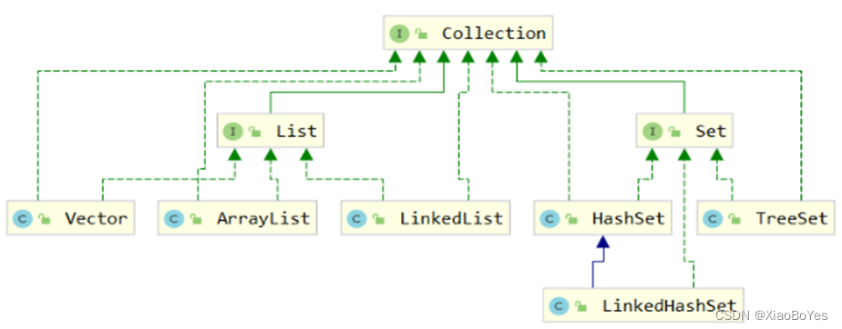
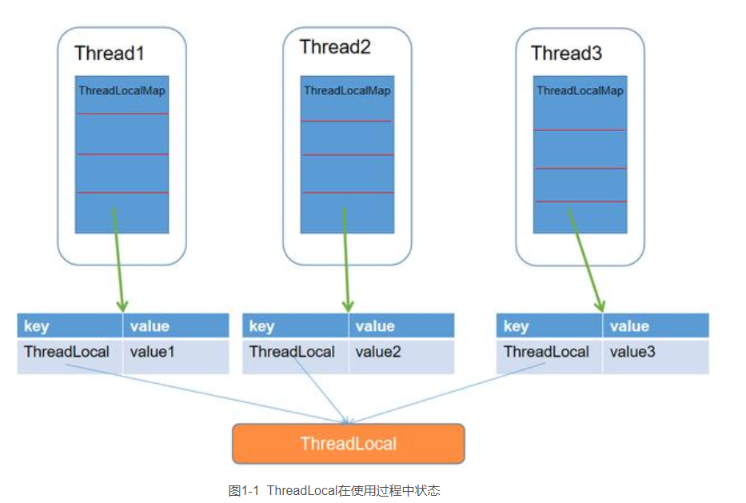
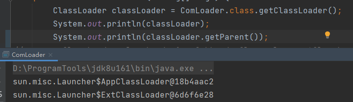
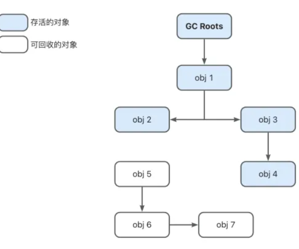
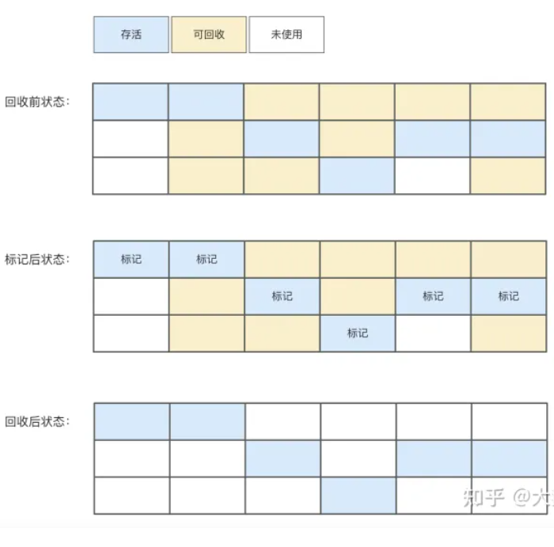
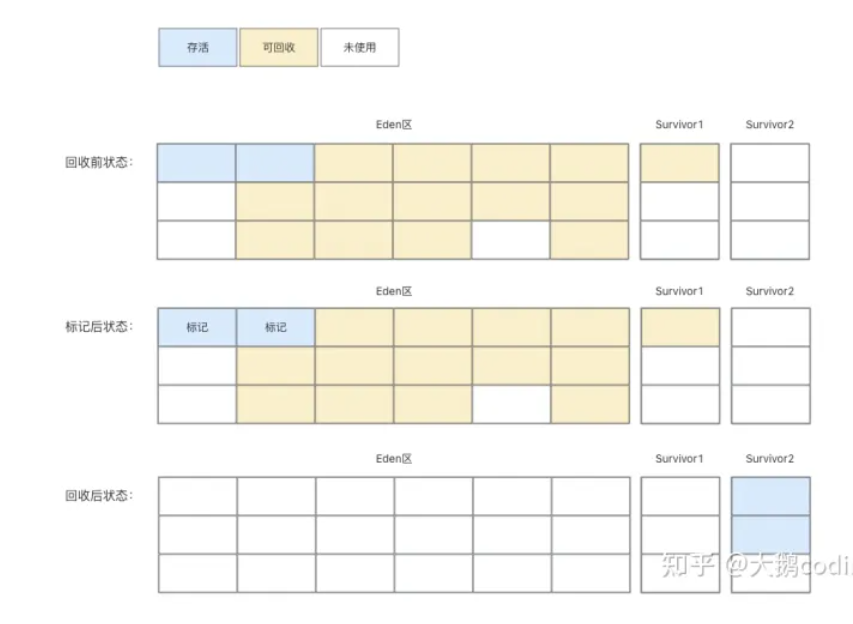

## 基础

### Map

1) HashTable: 其中的键值对都不能为null,线程安全,默认容量为11,扩容为原来的2倍+1
2) HashMap: kv可以为null(但是只能有一个key为null),线程不安全,默认容量为16,扩容后为原来的2倍
3) TreeMap: 有序、默认需要`comparator`接口的实现
4) HashSet:  把数据作为K,而V值一直使用同一个**虚值**表示(由于在hashmap的覆盖只会覆盖v,而hashset的覆盖则会返回false,以此保证数据的不重复)

#### hashMap扩容机制:

触发条件: 容量(hashmap中桶/数组的数量)*负载因子<元素个数

触发过程: 新建一个扩容后的hashMap,把旧的hashmap的值重新计算,加入其中

触发结果: 容量*2

扩容会对该`node[i]`下的链表/树，判别每个节点e的`e.hash & oldCap`，将结果分为0和其他，并生成新的链表，其链表头分别为`lo(w)Head`和`hi(gh)Head`，分别插入到新数组的[i]和[i+oldTab.length]位置,完成扩容。
注意：在新传入值时，计算的是`(n - 1) & hash`，而扩容的时候，计算的是`e.hash & oldCap`，计算判断**位(bit)**不同。


#### hashMap 1.7和1.8

##### 1.7

1.7的hashmap采用头插法,可能在高并发中导致环形和死循环.

头插法本意是考虑到新插入的元素可能很快就会被用到,所以放在头部,但是在扩容后会将元素的倒序.

0. 某数组内的链表顺序为c-b-a

1. 线程A触发hashmap扩容,导致该元素组内数据重新插入(顺序相反),假设线程B此时也获得了元素c的指针
2. 对A而言c.next为null,b.next为c,但是时间片轮转到线程B而言c.next还是扩容前的b
3. 因此对于线程B而言b和a出现了死循环

#### 1.8

头插法变成尾插法,避免了出现死循环的可能,并且加入红黑树


#### hashMap链表与红黑树的互转

<u>Map的key必须是可以比较的</u>,如果没有实现`comparable`,就会对`object.getClass()`所属的class名称比较

转树的触发条件: 当前链表上个数大于8 && hashmap.size() 即桶的数量大于64(否则应该先扩容)

转链表的触发条件: 当前树的root|root.left|root.right|root.left.left为null,或者树的节点数<6则转换为链表

#### hash索引

* hashTable: 直接使用对象的hashCode(根据对象的地址或者字符串或者数字计算出来的int数值);再取模

* hashMap: 需要重新计算hash,先做“与运算”,将负值转为正;再对得到的length取模

#### 集合的线程安全

1. 利用并发包类:ConcurrentHashMap
2. sychronize方式 


#### jdk7 ConcurrentHashMap
CAS+lock+分段思想
按照默认传值初始化`segment`个数(默认为16)，每个segment指向多个hashEntry(默认最少为2,为2的整数次幂)。

在尝试执行put操作时，会先去寻找segment：

1. 如果发现指定位置没有创建segment(即，第一次插入)，那么以CAS创建(赋值)segment
2. 如果有segment，以`tryLock()`方式加锁获取hashEntry
3. 如果`tryLock()`方式返回false，那么在等待其他线程释放锁之前，会轮询遍历该segment下所有hashEntry，如果找到相同的key，返回目标hashEntry，否则创建一个新的hashEntry。在轮询的时候，会不断尝试查看该segment的头是否发生变化，如果发生变化(其他线程操作过)，则重新遍历

扩容：只会对该`segment`下的`hashEntry`链表进行扩容，不会影响其他`segment`的链表长度。支持多线程扩容，但是无法多线程对同一个`segment`操作。


#### jdk8 concurrentHashMap
取消了`segment`的概念。 CAS+synchronized
		初始化时，以CAS方式将`sc`设置为-1，避免其他线程同时操作，并释放资源，同时给`SizeCtl`设置为n*3/4 ，作为扩容下限。再通过`synchronized`同步。
		在每次插入后会判断是否需要变更，仍然采用多线程扩容，通过计算/控制需要转移的位置(通过步长)，对每个位置加锁，禁止put()操作，从右向左迁移。其他线程put()时，如果发现正在迁移，会帮助迁移，如果该线程完成了迁移，那么就会等待，直到最后完成迁移的线程，将新的数组返回。


### Collection



#### ArrayList和LinkedList

* arrayList是数组实现，查询快，增删慢
* linkedLIst是链表实现，查询慢，增删快


## 操作符

### ==和equals

new出来的对象(包括基本类型封装类)通常存放在<u>堆</u>内,基本类型数值和引用变量存放在<u>栈</u>内,除此之外还有<u>字符串常量池</u>

* ==比较两个对象的地址
* equals比较的是两个对象的内容

`Integer`对象除了new还有通过直接将int值传给`Integer`变量,系统会自动执行装箱过程——实际的操作是`Integer a = Integer.valueOf(100)`

```java
public static Integer valueOf(int i) {
  // 在[-127,128]之间的话,会直接从内存中取值
        if (i >= IntegerCache.low && i <= IntegerCache.high)
            return IntegerCache.cache[i + (-IntegerCache.low)];
        return new Integer(i);
    }
```

如果两个一样值的大小处于是[-127,128]之间,那么执行`==`返回的值的地址是一样,如果不在其中那么不同.

```java
Integer a = 100; 从缓存中获取的对象
Integer b = 100;
a == b;  // true
a = 200; 通过new创建的对象
b = 200;
a == b; // false
```

基本类型不是对象,因此没有`equals()`方法,没有重写过的`equals()`是直接调用`==`.

String、Date、ArrayList等类重写了,先比对通过`==`对比内存地址,地址不同再比对具体的值

Ps:<u>若`==`为真,那么`equals`为真;若`equals`为假,那么`==`为假</u>

### hashcode与equals

hashcode是`native`标注的,调用本地系统的c/c++实现,将对象的内存地址转换成整数返回回来.<u>(而==则是返回堆内对象的地址)</u>

**为什么要有hashCode?**

hashcode通常作为两个对象的对比,<u>如果数据需要存入hash结构,则需要先比较hashCode,如果不存在,那么就可以直接put进去(提升效率).否则,还需要使用equals,保证key的唯一性</u>

在`collection`类中,如果重写equal必须要重写hashcode()方法.如上情况,需要保证equals()为真的时候, hashCode值也必须相等.

如果没有重写hashCode()方法,那么将相同内容的对象put进入hashSet()后,不会覆盖,最后的长度大小的2.

```java
class Person{
  Integer age;
  String name;
  
  // 只重写了equals方法
  @Override
  public boolean equals(Person b){
    if(this==b)
      return true;
    if(b==null||getClass()!=b.getClass()) return false;
    return Objects.equals(this.age,b.age)&&Objects.equals(this.name,b.name);
  }
  
  // 需要重写
  @Override
  public int hashCode(){
    return name.toUpperCase().hashCode()^age;
  }
  
  // 自定义类仍需实现toString
}

Person aMan = new Person("zhangsan",20);
Person bMan = new Person("zhangsan",20);

HashSet set = new HashSet();
set.add(aMan);
set.add(bMan);
set.size();//2

```


## 关键字

### violate 

及时更新数据,保证执行的有序性

#### 内存模型

1. java所有变量都是存储在主内存中
2. 每个线程都有自己独立的工作内存,里面保存该线程使用到的变量副本(就是从主内存获取的一份深拷贝)
3. 线程对共享变量的所有操作都必须在自己的工作内存中进行,无法直接在主内存中读写
4. 不同线程之间无法直接访问其他线程工作内存的变量,线程间变量值的传递需要通过主内存来完成
5. 线程1对共享变量的修改,如果要被其他线程看到,必须首先将内存1的更新过的共享变量刷新到主内存中,然后将主内存中最新的共享变量的值更新到工作内存2中

#### 可见性与原子性

可见性:线程对一个共享变量的修改,能够及时被其他变量看到

原子性:不可再分,`return`或者`a=1`都具有原子性,类似`a+=b`就不具有原子性,在jvm中,分为3个步骤:

1. 取出a、b值
2. 计算a+b
3. 将计算结果写入内存

**synchronized能够同时保存可见性和原子性**,在线程加锁时的工作步骤:

1. 先清空工作内存
2. 在主内存中拷贝最新变量的副本到工作内存
3. 执行完代码
4. 将更改后的共享变量的值刷新到主内存中
5. 释放互斥锁

<u>当synchronized修饰一个static方法时,多线程下,获取的是类锁(class本身)</u>

<u>当synchronized修饰一个非static方法时,多线程下,获取的是对象锁(类的实例对象)</u>

**volatile保证可见性,但是不保证操作的原子性**

1. volatile实现内存可见性是通过内存屏障store和load指令完成的
2. 对volatile变量执行写操作时,会在写操作后加入一条store指令,强迫刷性到主内存中
3. 读的时候,会加入一条load指令,强迫从主内存中去值

但是执行`++`等操作时,可能在第1步(从主内存去值后),cpu就把优先级让给了另外一个线程重新取值,计算等等.因此对变量的写入操作不能依赖于当前变量的值.


### threadLocal

threadLocal是线程变量，意思是threadLocal中的填充值仅属于当前线程，相对其他线程而言是不可见。

`ThreadLocal<T>`是与线程绑定的一个变量，和synchronized都用于解决多线程并发访问。但是又有以下不同：

* synchronized用于线程之间的数据共享，而threadlocal用于线程之间的数据隔离
* synchronized利用锁的机制，使代码同一时间只能被一个线程访问。而threadlocal为每个线程都提供了副本，使得每个线程在某时刻访问到的并不是同一个对象

**threadlocal是作为当前线程中属性threadlocalMap集合中的某个键值对entry---（threadlocal,value）。虽然不同线程之间threadlocal这个key值一样，但是不同的线程所拥有的threadlocalMap不同，因此不同线程之间同一个threadlocal的key值，所对应的value不一样。但是如果在同一个线程中，这个value变量的地址是一样的。**



threadlocal的使用案例：

```java
public class ThreadLocaDemo {
 
    private static ThreadLocal<String> localVar = new ThreadLocal<String>();
 
    static void print(String str) {
        //打印当前线程中本地内存中本地变量的值
        System.out.println(str + " :" + localVar.get());
        //清除本地内存中的本地变量
        localVar.remove();
    }
    public static void main(String[] args) throws InterruptedException {
 
        new Thread(new Runnable() {
            public void run() {
                ThreadLocaDemo.localVar.set("local_A");
                print("A");
                //打印本地变量
                System.out.println("after remove : " + localVar.get());
               
            }
        },"A").start();
 
        Thread.sleep(1000);
 
        new Thread(new Runnable() {
            public void run() {
                ThreadLocaDemo.localVar.set("local_B");
                print("B");
                System.out.println("after remove : " + localVar.get());
              
            }
        },"B").start();
    }
}
 
A :local_A
after remove : null
B :local_B
after remove : null
 
```


**务必确保业务结束后将threadlocal中的值remove掉**

实际上 ThreadLocalMap 中使用的 key 为 ThreadLocal 的弱引用，弱引用的特点是，如果这个对象只存在弱引用，那么在下一次垃圾回收的时候必然会被清理掉。而对应的value为强引用，可达性分析能够搜索到，因此不会被gc回收掉。这样就会出现为key为null的value。

还会出现另外一个问题，如果没有将threadLocal内的变量remove掉，它的生命周期与线程共存。通常线程池中对线程的管理都是线程<u>复用</u>，线程池中的线程很难结束，甚至与jvm的生命周期一样，并且线程的。并且，如果不remove掉，下一个复用的线程，无需set就能够获得上一个线程的threadlocal值。如下例子


```java
public class Test {

    // 静态创建threadlocal
    private static ThreadLocal<Information> informationThreadLocal = new ThreadLocal<>();


    public void multiThread() throws Exception{

        ThreadFactory myThreadFactory = new ThreadFactory() {
            private final AtomicInteger index = new AtomicInteger(1);

            @Override
            public Thread newThread(Runnable r) {
                Thread t = new Thread(r, "myThreadPool-"
                        + index.getAndIncrement());
                return t;
            }
        };
        ThreadPoolExecutor threadPoolExecutor = new ThreadPoolExecutor(2, 2, 10L, TimeUnit.MINUTES, new ArrayBlockingQueue<>(5), myThreadFactory);
        
        threadPoolExecutor.execute(()->{
            printfRefine("thread-1-before");
            informationThreadLocal.set(new Information("111"));
            System.out.println("thread-1");
            printfRefine("thread-1");
            System.out.println("======");

        });
        threadPoolExecutor.execute(()->{
            printfRefine("thread-2-before");
            informationThreadLocal.set(new Information("222"));
            System.out.println("thread-2");
            printfRefine("thread-2");
            System.out.println("======");

        });
        threadPoolExecutor.execute(()->{
            printfRefine("thread-3-before");
            informationThreadLocal.set(new Information("333"));
            System.out.println("thread-3");
            printfRefine("thread-3");
            System.out.println("======");

        });
        threadPoolExecutor.execute(()->{
            printfRefine("thread-4-before");
            informationThreadLocal.set(new Information("444"));
            System.out.println("thread-4");
            printfRefine("thread-4");
            System.out.println("======");
        });
        Thread.sleep(1000L);
        System.out.println(threadPoolExecutor.getActiveCount());
    }

    public static void main(String[] args) throws Exception{
        Test test = new Test();
        test.multiThread();
    }


    public void printf(String remark){
        Information information = informationThreadLocal.get();
        System.out.println(Thread.currentThread().getName()+"--- message:"+information.getMessage()+"---remark:"+remark);
        informationThreadLocal.remove();
    }

    public void printfRefine(String remark){
        Information information = informationThreadLocal.get();
        if (information==null){
            information = new Information("remark");
        }
        System.out.println(Thread.currentThread().getName()+"--- message:"+information.getMessage()+"---remark:"+remark);
//        informationThreadLocal.remove();  // 如果不remove 就会出现线程复用，能够保留threadlocal的情况。
    }


    class Information{

        private String message;

        public Information(String message) {
            this.message = message;
        }

        public String getMessage() {
            return message;
        }

        public void setMessage(String message) {
            this.message = message;
        }
    }

}

myThreadPool-1--- message:remark---remark:thread-1-before
thread-1
myThreadPool-1--- message:111---remark:thread-1
======
myThreadPool-2--- message:remark---remark:thread-2-before
thread-2
myThreadPool-2--- message:222---remark:thread-2
======
myThreadPool-1--- message:111---remark:thread-3-before  // 复用了myThreadPool-1 的 threadlocal值
thread-3
myThreadPool-1--- message:333---remark:thread-3
======
myThreadPool-2--- message:222---remark:thread-4-before // 复用了myThreadPool-2 的 threadlocal值
thread-4
myThreadPool-2--- message:444---remark:thread-4
======
```


#### 使用场景

主要适用于以下两个场景：

1. 每个线程需要使用自己单独的实例
2. 实例需要在多个方法中共享，但不希望被多个线程共享

对于场景1，除了使用threadlocal，也可以通过在线程内部构建一个单独的实例。

对于场景2，在场景1的基础下，可以使用方法见的引用传递的形式实现，而thread则可以更加优雅实现。


**spring使用threadlocal解决线程安全问题**

有无状态的Bean才可以在多线程环境下共享，在Spring中，绝大部分Bean都可以声明为singleton作用域。就是因为Spring对一些Bean（如RequestContextHolder、TransactionSynchronizationManager、LocaleContextHolder等）中非线程安全的“状态性对象”采用ThreadLocal进行封装，让它们也成为线程安全的“状态性对象”，因此有状态的Bean就能够以singleton的方式在多线程中正常工作了。 

这样用户就可以根据需要，将一些非线程安全的变量以ThreadLocal存放，在同一次请求响应的调用线程中，所有对象所访问的同一ThreadLocal变量都是当前线程所绑定的。


## class

```java
// 获取该类以及父类明确指明public的属性字段
Field[] fields = kwClassClass.getFields();
// 仅获取当前类的所有的属性字段
Field[] fields = kwClassClass.getDeclaredFields();
// 获取该类及其父类的所有public方法
Method[] methods = kwClassClass.getMethods();
// 获取该类的所有方法
Method[] declaredMethods = kwClassClass.getDeclaredMethods();

```

## ClassLoader

在配置java环境中，有3个环境变量(JAVA_HOME,PATH,CLASSPATH)

其中path指存放jdk目录下的bin目录和jre目录的bin

```shell
PATH=%JAVA_HOME%\bin;%JAVA_HOME%\jre\bin;%PATH%
CLASSPATH=.;%JAVA_HOME%\lib;%JAVA_HOME%\lib\tools.jar
```

ClassLoader作用是加载class文件到Jvm中，但是在Jvm启动的时候，为了防止内存奔溃并不会全部加载所有class文件，而是动态加载。Jvm启动时候有3个classLoader负责加载class

* **Bootstrap ClassLoader**: 最顶层的加载类，主要加载核心库，`%JRE_HOME%\lib`下的各种jar包
* **Extention ClassLoader**: 扩展的类加载器，加载`%JRE_HOME%\lib\ext`目录下的jar包
* **AppclassLoader**： 加载当前应用classpath的所有类

在具体代码中，`ExtClassLoader`和`AppClassLoader`均继承于`URLClassLoader`，其中`URLClassLoader`集成于`SecureClassLoader`(又继承于`ClassLoader`)。

但是在实际调用中，Jvm将appclassLoader调用`getParent()`(父加载器，而不是父类)时，显示为`ExtClassLoader`的一个实例。但是`ExtClassLoader`的父加载器是`null`,并不是说没有父加载器，而是`bootstrapClassLoader`由c++编写，它负责int.class,string.class的加载，而且它没有父加载器，却可以作用到`ExtClassLoader`的父加载器上。



### 双亲委派

一个类加载器查找class和resource时，通过委派机制，即

1. 首先判断这个class是否已经加载成功
2. 如果没有加载成功，那么通过父加载器查询，如果仍然查找不到，则继续向上查询
3. 如果某一级父加载器找到，那么直接返回
4. 如果都没有查询到，那么就到自己规定的路径下寻找并加载，如果该路径下没有，则让子加载器去找
5. 都没找到找到，则抛出异常

**委托是从下向上的，具体查找过程确实自上而下的**

通过双亲委派，可以避免自行编写的class代替java核心api，进而避免带有恶意的同名class

### 自定义ClassLoader

默认的加载器只能加载指定目录下的jar包。如果需要从其他文件夹下动态加载class文件，或者从网络上下载class再加载，就需要一个自定义实现一个classLoader。

步骤：

1. 继承于classLoader抽象类
2. 复写findClass()方法，并在其中调用defineClass()

在编写defineClass()的时候，要求能够支持异常的抛出。

一个classLoader创建发的时候，如果没有指定parent，那么默认给appClassLoader，这样就能保证肯定会关联到系统内置加载器加载成功的class文件。


## Tips

#### 集合转数组 

```java
// CastType为你需要转换的类型
list.toArray(new CastType[0]);
// toArray 带参方法,数组空间大小length
// 1.为0时:动态创建与size相同的数组,性能最好
// 2.>0&&<size(),重新创建大小为size()的数组,增加GC负担
// 3.=size()高并发下,size正在变大的情况下,可能同样造成第GC负担
// 4.>size()空间浪费,且在size处插入null 造成npe隐患

```


## 内存模型

jvm在运行时，会管理一块内存区域，在运行时数据区里，根据用途划分：
1. java虚拟机栈
2. 本地方法栈
3. java堆区
4. 方法区
5. 程序计数器

**java堆**
用于存放java对象实例，线程共享，也是垃圾收集器管理的主要区域

**机栈（栈内存）**
是stack、java方法执行的内存模型。存储java方法执行时的局部变量：以帧栈的形式，包含数据类型，对象的引用，方法结束后自动释放。
线程私有，生命周期与线程相同。
每个java方法执行时都会创建一个栈帧；java方法从被调用到执行完毕转化为一个栈帧在虚拟机栈中的入栈道出栈；局部变量在方法编译的时候就会完成内存分配，执行的时候不会改变大小。

**本地方法栈**
类似于栈内存，区别在于栈内存服务于java方法，而本地方法栈执行native方法服务

**方法区（含常量池）**
堆的逻辑部分，存储已被虚拟机加载的类信息、常量、静态变量等数据。线程共享。
该区域的内存回收主要针对于：运行时常量池和类的卸载。又称永久代，回收条件苛刻，很少出现垃圾收集。

常量池是方法区的一部分，主要存放类文件再编译时生成的各种字面量和符号引用

**程序计数器**
表明当前线程所执行的字节码和行号指示器。实现异常处理、线程恢复等基础功能。
通过改变计数器的值，来选取下一条执行的字节码指令。
线程私有化：为了使线程切换后恢复到正确的执行位置，每条线程都配有一个独立的程序计数器，各线程互不影响，独立存储内存区域。


## 线程池

**java线程和操作系统线程不同，在多核操作系统中，jvm也会允许在一个进程内同时并发执行多个线程。java中的线程和操作系统中的线程分别存在于虚拟机和操作系统中，他们虽然不同，但却是一一对应，息息相关的。**

每创建一个java线程，首先在本地将存储、计数器、缓存区都分配好后，通过jvm调用操作系统的方法，创建一个与java线程绑定的原生线程。

线程的调度由操作系统分配。

### 7大核心参数

```java
public ThreadPoolExecutor(int corePoolSize,  // 核心线程数
                          int maximumPoolSize, // 最大线程数
                          long keepAliveTime,  // (非核心)线程存活时长
                          TimeUnit unit,		// (非核心)线程存活时长单位
                          BlockingQueue<Runnable> workQueue, // 线程队列
                          ThreadFactory threadFactory,  // 线程工厂
                          RejectedExecutionHandler handle) // 拒绝策略
```

补充说明 

**线程队列**分为两类：

1. ArrayBlockingQueue 需要设置队列的最大容量
2. LinkedBlockingQueue 没有最大的容量，可能会导致内存溢出

**线程工厂**主要是给线程命名等

**拒绝策略**包括以下4个类型：

1. AbortPolicy:队列满后，丢弃新的任务，抛出异常（可以及时发现当前系统不能承受更大并发量）
2. DiscardPoilcy:不抛异常地丢弃任务 
3. DiscardOldestPolicy:丢弃队列最前面的任务，然后重新提交
4. CallerRunPolicy:调用提交任务的线程执行当前任务

**为什么不用Executors创建线程池：`Executors.newFixedThreadPool(10);`**

----因为Executors创建的线程池，默认使用的`LinkedBlockingQueue `，可能造成内存溢出

### 线程池的核心数

估计值（N为CPU核心数）：

* 计算型线程池：N+1
* IO型线程池：2N+1

单个任务单个CPU的占用率：`线程cpu时间/(线程cpu时间+线程等待时间)`，而线程池最佳的使用策略是尽量将CPU吃满，那么就需要将该公式取倒数

最佳的计算方式：((线程等待时间+线程cpu时间)/线程cpu时间)*cpu数量


### 默认的四类线程池：

#### newCachedThreadPool

一个可缓存线程池，如果线程池长度超过需要处理需要，可灵活回收空闲线程，若无可回收，则新创建线程，适合短时间任务。 允许创建的线程数量为Integer.MAX_VALUE，可能会创建大量的线程，导致OOM

#### newFixedThreadPool

定长线程池，可以控制最大的并发数，超出的任务会等待。允许的请求队列长度为Integer.MAX_VALUE，可能会堆积大量的请求。

#### newScheduledThreadPool

定长线程池，支持定时和周期性任务执行

#### newSingleThreadPool

单核线程池，保证所有任务先进先出，允许的请求队列长度为Integer.MAX_VALUE，可能会堆积大量的请求


## 动、静态代理

### 静态代理

目标类和代理类实现了同样的接口，在**代理类**中依赖了**目标类**，并做了一部分增强功能。

```java
// 接口
public interface Calc{
  int add (int a ,int b);
}

// 目标实现类
public CalcImpl implements Calc{
  int add (int a , int b){
    System.out.print("a:"+a+" b:"+b);
    return a+b;
  }
}

// 代理类
public CalcPorxy implements Calc{
  private CalcImpl calcImpl;
  
	public CalcProxy(CalcImpl calcImpl){
   	this.calcImple = calcImpl;
  }
  
  @Override
  int add (int a , int b){
    System.out.print("开始执行");
    int res = calcImpl.add(a,b);
    return res;
  }
}
```

* 但是需要为每个实现类编写对应的代理类
* 接口改变后，所有的代理类也需要对应的变化，工作量增加


### 动态代理

利用反射机制，创建代理对象，动态地指定代理类

#### JDK动态代理

动态代理要求目标对象已经实现接口

```java
public class MyPoxyBody {

  /**
  
  */
    public void proxy(){
        IOriService oriService = new OriServiceImpl();
        IOriService oriSer = (IOriService)Proxy.newProxyInstance(oriService.getClass().getClassLoader(), oriService.getClass().getInterfaces(), new InvocationHandler() {
            @Override
            public Object invoke(Object proxy, Method method, Object[] args) throws Throwable {
                String comment = "";
                if ("calcTax".equals(method.getName())) {
                    System.out.println("====开始扣除税率=====");
                    System.out.println("添加奖金");
                    float money = (float) args[0];
                    money += 5000.;
                    comment = (String) method.invoke(oriService,money);
                    System.out.println(comment);
                    System.out.println("===================");
                }

                return comment;
            }
        });
        oriSer.calcTax(1000.f);
    }

    public static void main(String[] args) {
        new MyPoxyBody().proxy();
    }
}
```

#### Cglib

jdk动态代理只能基于接口，cglib则是通过生成子类来实现，代理对象既可以赋值给实现类，也可以赋值接口，并且性能和速度更快.

```JAVA
public class MyCglibProxy implements MethodInterceptor {

    // 目标对象
    private Object object;

    public MyCglibProxy(Object bean){
        object = bean;
    }

    /**
     * 获取 被代理 的实例对象(继承于object.class)
     * @return
     */
    public <T> T getProxy(){
        Enhancer enhancer = new Enhancer();
        // 设置被代理类
        enhancer.setSuperclass(object.getClass());
        // 设置回调 MethodInterceptor 也就是会执行intercept方法
        enhancer.setCallback(this);
        // 正式创建
        return (T) enhancer.create();
    }


    /**
     * 如何增强
     * @param obj 代理对象引用
     * @param method 被代理拦截的方法的描述引用
     * @param args 方法参数
     * @param proxy 代理对象 对目标对象的方法的描述
     * @return
     * @throws Throwable
     */
    @Override
    public Object intercept(Object obj, Method method, Object[] args, MethodProxy proxy) throws Throwable {
        System.out.println("MyCglibProxy 开始执行");
        Object res = proxy.invoke(object, args);
        System.out.println(res.toString());
//        Object res2 = method.invoke(object, args);
        System.out.println("MyCglibProxy 结束执行");
        return res;
    }

    public static void main(String[] args) {
        OriServiceImpl oriService = new OriServiceImpl();
        MyCglibProxy myCglibProxy = new MyCglibProxy(oriService);
        OriServiceImpl proxy = myCglibProxy.getProxy();
        proxy.calcTax(1000.f);

    }
}
```


## 数据竞争

### 异步执行导致的数据竞争
stream可以使用paralle()方法执行提高工作效率，但是使用`Stream.parallel().forEach(Consumer<>)`时，由于stream流式计算本身就是顺序的，并且forEach中调用的方法有副作用，**利用Consumer()访问public属性的时候**就会出现数据竞争
共享可变状态可能影响并行流和并行计算

#### Fork/Join框架
利用递归的方法将并行的任务拆分为更小的任务
创建`RecursiveTask<R>`的子类，`R`为产生结果的类型，唯一需要实现的方法为`R computer()`

```java
if(任务足够小，不够切分)
	顺序执行
else{
	将任务分为两个子任务
	递归调用本方法，拆分每个子任务，等待子任务的执行完毕
	合并每个子任务的结果
}
	
```

执行流程如下图，每次执行的将任务拆分，执行fork()，利用ForkJoinPool的另一个线程异步执行创建的子任务，而本线程可以直接执行递归调用方法(无需另起线程fork)，判别是否需要再度划分，如果不满足划分的最小条件，那么对该任务执行**顺序执行**，最后在父线程中调用join()方法阻塞获取结果值。

该方法就不会造成任务数据竞争，因为最小任务顺序执行，直接将返回的结果向上交付，不会共享对象的可变状态。


调用该方法

```java
public static long forkJoinSum(int[] array){
    // ForkJoinTask为RecursiveTask的父类
    ForkJoinTask<Long> task = new ForkJoinSumCalculator();
    // ForkJoinPool()本身没有意义，只需要实例化一次即可
    return new ForkJoinPool().invoke(task);
    
}
```


+ 由于join方法会阻塞调用方，需要在子任务都执行后的语句再使用
+ RecursiveTask内部不要使用ForkJoinPool的invoke方法
+ 考虑一个子线程重用同一线程
+ 框架需要“预热”


#### Spliterator 可分迭代器

**工作窃取**的实现之一，Fork/Join框架中使用工作窃取，保证每个线程都能负载平衡

`Spliterator<T>`中的T表示遍历元素的类型，stream实现拆封实际上是使用递归

```java
public interface Spliterator<T> {
    // 判别是否存在剩余元素
    boolean tryAdvance(Consumer<? super T> action);
    /**
    1. 判定当前是否可分，如不可分则返回null
    2. 如果还能再分，那么从中间位置开始划分，切记：根据实际情况判定是否需要属性标志位
       将找到的还能再分的部分实例化，并返回
    **/
    Spliterator<T> trySplit();
    // 当前spliterator与待解析的列表的偏差值
    long estimateSize();
    // 返回关键字 表明该Spliterator的状态
    int characteristics();
}
```

+ 切分策略很重要，因为例如统计单词中，切分过程里误把“雷峰塔”切分为“雷锋”和“塔”，可能导致统计结果出错


具体执行语句

```java
// 将待处理的T列表传入可分迭代器中，制定切分策略
Spliterator<T> spliterator= new SpecificalSpliterator(T[]);
// 按照分割策略生成数据流
Stream<T> stream = StreamSupport.stream(spliterator, true);
// 流的归约操作，对T列表执行切分、分组计算、汇聚
// A.accumulate()表示对如何对每个T[]小组计算结果，并以A结果返回
// A.combine()方法表示合并操作中对A结果汇总，生成一个新的A类对象
// ******A应该为不可变类*********
A a = stream.reduce(new A(), A::accumulate, A::combine);
```


### 多线程竞争（线程安全）

#### synchronized代码块
格式：`synchronized(object){需要实现线程安全的代码}`

+ 类锁、也是对象锁 例如 `synchronized(Main.class)`
+ 执行完毕后，会自动释放这把锁


`synchronized(this)，这个this是当前对象，如果创建多个对象`

```java
TicketThread ticket1 = new TicketThread();
TicketThread ticket2 = new TicketThread();
TicketThread ticket3 = new TicketThread();

public void run(){
    synchronized(this){....}
}
```

这个时候必定犯错，因此需使用唯一的对象来加锁，故常使用类的class对象进行加锁

除了对象锁，还有方法锁（只能有一个该任务在执行中）：
```java
// 写法1
private static synchronized void add(){
	value++;
}

// 写法2
private static void add(){
	synchronized(this){
		value++;
	}
}

```

加锁的执行案例：
```java
class A implement Runnable{
 private int total = 100;
 public void run (){
 	while (true){
        synchronized(this){
            if(total>0){
                try{
                    Thread.sleep(100);
                }catch (Exception e){
                    e.printStackTree();
                }
            }
        } // synchronized
 	}
 }
}
```


#### Synchronized补充

锁和对象是相互关联的,每个对象有一把锁,为了执行synchronized语句,线程必须能够获得synchronized语句中表达式指定的对象的锁,在执行完后,就需要归还这把锁.

1. 当两个并发线程访问同一个对象Object的synchronized(this)同步代码块中,一个时间只能有一个线程能够执行

2. 但是另外一个线程可以访问该对象的其他非synchronized(this)同步代码块
3. 当一个线程访问synchronized(this)同步代码块时,其他线程对object其他的synchronized同步代码块的访问也会被阻塞

**对于第三点,对象级的锁通常是一种比较粗糙,通过将整个对象上锁,阻止其他线程对该对象的访问共享资源,应该考虑使用虚拟对象,分别上锁**

Synchronized支持以下使用方法,如果使用`synchronize(.class)`方式加锁,则如果线程进入,那么线程在该类中所有(含static的)操作不能进行,包括静态变量和静态方法.实际上,对于含有静态方法和静态变量的代码块的同步，通常用这种方式来加锁。

1. 满足方法同步，需要保证多线程访问的是同一个对象(在java内存中的地址是否相等)
2. **类锁和对象锁同时存在，多线程访问不会阻塞，因为不是同一个锁**

```java
public class Common{
  // 方法锁 获得的是和申明方法类(Common)相关的class对象的锁
  public synchronized void funding(){
        System.out.println("=====funding======");
        try{
            Thread.sleep(10000L);
        }
        catch (Exception e){
            e.printStackTrace();
        }
        System.out.println("=====funding over======");
    }
  
  // 对象锁
  public void printSyn(){
      synchronized (this){
          // 执行代码
      }
  }
  
  // 通过虚拟对象上锁 避免其他线程访问共享资源
  Object objectX = new Object();
  public void printSynVirtual(){
        synchronized (objectX){
            // 执行代码
        }
  }
  
  // class锁 
    public void printSynVirtual(){
        synchronized (Common.class){
            // 执行代码
        }
  }

}
```

#### Lock

synchronized实现线程锁,锁默认是开启的,当线程进入同步代码块中,锁自动关闭和持有.这种方式比较简单,但是不清楚究竟是哪一步上的锁.为了能够更清晰的表达如何加锁和释放锁,1.5以后的版本新加入`Lock`

```java
// 新建ReentrantLock(可重入的互斥锁)对象 大致功能与synchronized类似
private Lock lock = new ReentrantLock();

public void printLock(String msg){
    try{
      //手动上锁
        lock.lock();
        System.out.println(msg+" method:printLock locked");
        Thread.sleep(5000L);
    }catch (Exception e){
        e.printStackTrace();
    }
    finally {
      //手动释放锁
        lock.unlock();
        System.out.println(msg+" method:printLock unlock");
    }
}
```


#### wait

暂时不需要处理的线程,避免因为占用锁和其他的线程产生冲突,主动释放当前线程所持有的锁,可以等别的方法调用完毕后再执行.

**wait和sleep的差别**

* wait()是Object类的; sleep是Thread类的
* wait释放了锁;sleep没有
* wait不需要捕获异常
* wait()可以不设置参数(表示一直等待),sleep必须设置参数

只有同一把锁上的wait()可以被notify()唤醒——即wait()、notify()、notifyAll()都需要指定同一个对象

**对于不同锁的线程不起作用，而 Java 中任意对象都可以作为一把锁，所以这三个方法可以被任意对象调用，应定义在 Object 类中，线程通过锁对象找到对应的 Monitor**

notify()可以用来唤醒随机一个wait(),notifyAll()唤醒全部,唤醒的线程不会立刻执行,会先等到notify()中的synchronized代码块执行完毕后才继续执行.**并且唤醒的线程并不会一次性全部解除阻塞,也只有先抢到锁的线程才可以进入执行状态**


## 设计模式

### 工厂模式

lambda版本,给一个map作为字典,将具体的实现类作为值,输入所需要的类名称,直接获得该对象

```java
public class FactoryDemo {

    static class  Car extends Product{ public Car(){}}
    static class Phone extends Product{public Phone(){}}
    
    static Map<String, Supplier<Product>> factory = new HashMap();

    static {
        factory.put("car", Car::new);
        factory.put("phone", Phone::new);
    }

    public static void main(String[] args) {
        Supplier<Product> car = FactoryDemo.factory.get("car");
        Product product = car.get();
        System.out.println(product);
    }
}
```

### 责任链模式

####  通用方法

通过一个抽象类, 提供后续的处理逻辑

```java
public abstract class ResponsibilityChain<T> {
  // 记录后续节点
    private ResponsibilityChain<T> successor;
	// 配置后续节点
    public void setSuccessor(ResponsibilityChain successor){
        this.successor = successor;
    }
	// 本链节点详细处理逻辑 需要自己实现
    abstract public T handleWork(T input);

  // 整个链的处理框架
    public T handle(T input){
        T out = handleWork(input);
        if (successor != null)
            return successor.handleWork(out);
        else
            return out;
    }
}

```

具体的实现

```java
public class ChainBody {
		// 实现链的第一个节点
    static class Ser1 extends ResponsibilityChain<String>{
        @Override
        public String handleWork(String input) {
            return input.replaceAll("mistakes", "mistake");
        }
    }
		// 实现第二个节点
    static class Ser2 extends ResponsibilityChain<String>{
        @Override
        public String handleWork(String input) {
            return input.replaceAll("maken","make");
        }
    }

    public static void main(String[] args) {
        Ser1 ser1 = new Ser1();
        Ser2 ser2 = new Ser2();
      // 连接两个节点
        ser1.setSuccessor(ser2);
        String result = ser1.handle("I maken mistakes");
        System.out.println(result);
    }
}

```

#### lambda版本

`Function<T,R>`和它的子类`UnaryOperator<T>`,均提供了具体的操作方法,	`andThen`提供了链的后续操作

```java
public class RChainInterface {
    public static void main(String[] args) {
        UnaryOperator<String> ser1 = (String t) -> t.replaceAll("mistakes", "mistake");
        UnaryOperator<String> ser2 = (String t) -> t.replaceAll("maken", "make");

        String result = ser1.andThen(ser2).apply("I maken mistakes");
        System.out.println(result);
    }
}
```


## GC垃圾回收机制

### 简介

stop the world,即GC算法执行过程中，整个程序的停顿时间

### 回收区域

**堆区**和**方法区**的基本类型数据和对象

栈内的数据(基本类型数据)，在超出作用域后会自动出栈释放掉，不在GC的管理范围内

### 引用计数法

在对象内的被引用计数器，每次被引用就加一，引用失效的时候就减一，触发回收之后，遍历所有对象，把计数器值为0的找出来，释放掉即可

<u>但是如果存在互相引用，就无法释放！</u>

```java
static class Test{
    public Test instance;
}

public void run() {
    Test t1 = new Test();
    Test t2 = new Test();
    // 互相引用，但是释放后，其属性对象由于存在引用，无法被释放
    t1.instance = t2;
    t2.instance = t1;
}
```

几乎不用该算法

### 可达性分析(根搜索算法)

将可以作为GC Roots的根对象作为起始节点，通过引用关系向下搜索，其搜索过程就是一条引用链，不在该链条上（不可达）的对象，就被认为是可以回收的。

可以作为根节点的对象：

1. 虚拟机栈帧中引用的对象，例如线程调用方法产生的参数、局部变量等
2. 方法区中，类的引用类型静态变量或者常量
3. ...



### GC执行时机

创建新的对象或者基本类型的数据，内存空间不足时

### 回收策略

#### 分代回收机制

理论依据于两个分代假说：

* 弱分代假说：绝大多数对象都是朝生夕死
* 强分代假说：熬过多次回收的对象，就越难消亡

可以根据年龄，将对象划分到不同的区域中，分而治之

#### 空间结构

新生代和老年代比例为1:2

#### 新生代

绝大多数新建的对象都会被分配到这里，以**Minor Gc**作为触发的名称，采用<u>标记复制法</u>

**新生代的空间分为：一个伊甸园(Eden)和两个幸存者空间(Fron Survivor、To Survivor)，空间分配为8:1:1**

新生代GC收集的执行顺序如下：

1. 绝大多数新创建的对象会放在伊甸园中
2. 第一次GC之后，存活的对象会集体移动到一个幸存者空间
3. 此后每一次GC后，都会将幸存的对象复制到其中一个幸存者空间，并清空另外一个幸存者空间
4. 如果空闲的空间不够存放幸存的对象，那么会直接移动到<u>老年代</u>
5. 以上过程重复15(默认)次，依然存活的对象就会移动到老年代

**两个幸存者空间，必须有一个是空的**

#### 老年代

只有一个相对较大的区域，多次GC后，存活的对象会直接拷贝到这里。触发的GC发生的次数不会很多，但是由于老年代内存占比更大，并且使用的是**标记-整理算法**，成本更高，相对耗时。

#### 方法区

该区域主要是回收废弃的常量和类型，例如常量池里不会被使用的各种符号引用等。必须同事符合以下条件才会回收：

1. 所有实例被回收
2. 加载该类的ClassLoader被回收
3. Class对象无法通过任何途径访问(包括反射)

可以使用 -Xnoclassgc 禁用方法区的回收。

#### 跨代引用的问题

比如老年代的对象引用了新生代的对象，当新生代触发GC的时，不能只搜索新生代的区域，还得看老年代的对象是否引用了新生代中非GCRoots引用链上的对象。

通过采用**卡表**的方式去实现记忆集，卡表是由数组实现，每个元素对应一个特定大小的内存区域，这块内存区域被称之为**卡页**，用来存储N个存在跨区域引用的对象，只要存在跨区域引用的对象，该卡页就被表示为1。当GC发生的时候，就不需要存储整个区域了，只需要查看被标识为1的卡页带到GC Roots中一起扫描就可以了。

### 回收算法

#### 标记-清除算法

1. 通过可达性分析，通过根对象顺着引用链把这些存活对象都标记出来
2. 遍历这个区域所有对象，把没有标记的对象全部清理掉

算法执行效率较高，但是算法执行后，可能存在内存空间碎片化的问题。



##### 内存碎片化

很长的字符串，byte数组等，都必须存储在连续的内存空间，而如果找不到一块连续的内存空间来存储它，就会提前触发一次full GC

#### 标记-复制算法

把内存按1:1分为两块相同大小的空间，每次清理掉之后，把存活的对象移动带另外一块内存中，再清除。效率高，但是浪费了一半的空间。

但是可以根据IBM的调查没必要按照1:1分配，可以按照8:1:1分配内存， 利用率90%



适合于回收率比较高的场景（因为只有10%的幸存空间），且不会有碎片化的产生，但是对于老年代存活率较高的场景就不适合了。

如果存在10%的对象存活，幸存者空间装不下，**分配担保机制**就是保证出现这个问题时，有其他内存担保，通常是老年代，直接忽略年龄，进入老年代中。

#### 标记-整理算法

在标记-清除算法的基础上，进行了对象的移动排序整理，成本较高，但是解决了内存碎片化的问题。

老年代的存活率很高，而且极有可能存储大对象，需要连续的内存来存储
