# Spark基础

## 入门

相对于hadoop,spark具备以下优势:

* 计算层面,spark比MR有巨大的性能优势,但是市面上存在大量基于MR架构的计算框架,比如Hive
* Spark仅做计算,而hadoop生态圈有MR、HDFS、YARN为大数据体系架构的核心架构


spark处理数据与hadoop不同:

* spark处理数据,将中间处理结果数据存储在内存中
* spark提供了非常丰富的算子(api),可以将复杂任务放在一个spark程序中;hadoop有m、r两个算子,需要多重组合才能完成一个复杂任务


spark架构上与yarn相似:

* 提供Master对标RM,负责整个集群资源的管理

* 提供Work对标NM,负责所在服务器的资源管理
* 提供Driver对标AM,负责对任务计算的管理.在Local单机模式下(实际上是一个进程内的多个线程执行),Driver也是要干活的
* 提供Executor对标Container内的Task,负责每个容器内部的计算


## Local模式基本原理

资源管理:

* Master:Local进程本身
* Worker:Local进程本身

任务执行

* Driver:Local进程本身
* Executor:不存在,没有独立的Executor角色,有Local进程中的线程提供计算能力

(Driver也是一种特殊的Executor)

Local模式下,一个进程只能运行一个spark程序,如果执行多个spark程序,就是多个相对独立的local进程在执行


**Local模式就是一个独立的进程配合其内部线程来提供Spark运行环境**

**4040端口是Spark任务运行后，会在driver机器上绑定4040端口，提供当前任务的监控页面**


## StandardAlone部署

master和worker角色以独立进程的形式存在，并组成spark运行时环境

### 基本部署

主要有3类进程：

* master进程：管理整个集群资源，托管运行各个任务的driver
* 从节点worker：管理每个机器的资源，分配对应的资源来运行Executor
* 历史服务器HistoryServer(可选)：spark Application运行完成之后，保存时间日志数据至hdfs中，启动HistoryServer可以查看应用运行相关信息

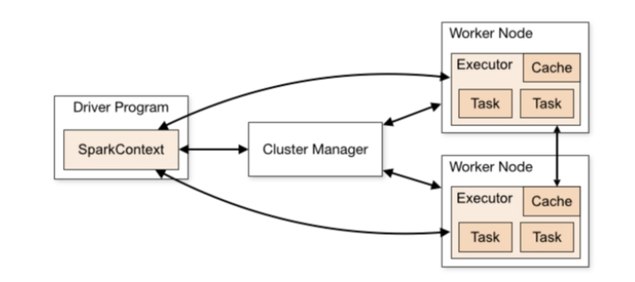

在conf文件中有

* worker(.template) 表示参与执行任务的spark服务端
* spark-env.sh(.template) 表示一些基本配置，包括JavaHome、HADOOPHOME等
* HDFS上创建运行历史记录的文件夹
* 配置spark-default.conf文件


```sh
# spark-env.sh

JAVA_HOME=/app/jdk1.8.0_341

# Options read in any mode
# - SPARK_CONF_DIR, Alternate conf dir. (Default: ${SPARK_HOME}/conf)
# - SPARK_EXECUTOR_CORES, Number of cores for the executors (Default: 1).
# - SPARK_EXECUTOR_MEMORY, Memory per Executor (e.g. 1000M, 2G) (Default: 1G)
# - SPARK_DRIVER_MEMORY, Memory for Driver (e.g. 1000M, 2G) (Default: 1G)

# Options read in any cluster manager using HDFS
# - HADOOP_CONF_DIR, to point Spark towards Hadoop configuration files
HADOOP_CONF_DIR=/app/hadoop-3.3.3/etc/hadoop
YARN_CONF_DIR=/app/hadoop-3.3.3/etc/hadoop
# Options read in YARN client/cluster mode
# - YARN_CONF_DIR, to point Spark towards YARN configuration files when you use YARN
# 配置spark资源 主机
export SPARK_MASTER_HOST=hmx1
# 配置spark 通讯接口
export SPARK_MASTER_PORT=7077
# 配置spark 网络ui接口
SPARK_MASTER_WEBUI_PORT=8080

# 配置spark worker 核心、内存、通讯端口、ui端口
SPARK_WORKER_CORES=1
SPARK_WORKER_MEMORY=1g
SPARK_WORKER_PORT=7078
SPARK_WORKER_WEBUI_PORT=8081

# 配置spark日志存放位置
SPARK_HISTORY_OPTS="-Dspark.history.fs.logDirectory=hdfs://hmx1:8020/sparklog -Dspark.history.fs.cleaner.enabled=true"
```

```sh
# workers
hmx1
hmx2
hmx3
```

```txt
# spark-defaults.conf
spark.eventLog.enabled true
spark.eventLog.dir hdfs://hmx1:8020/sparklog/
spark.eventLog.compress true
```

**通过命令`bash sbin/start-all.sh`可以开启集群**，查看**spark-env.sh. SPARK_MASTER_WEBUI_PORT**监控页面，可以确认是否启动成功

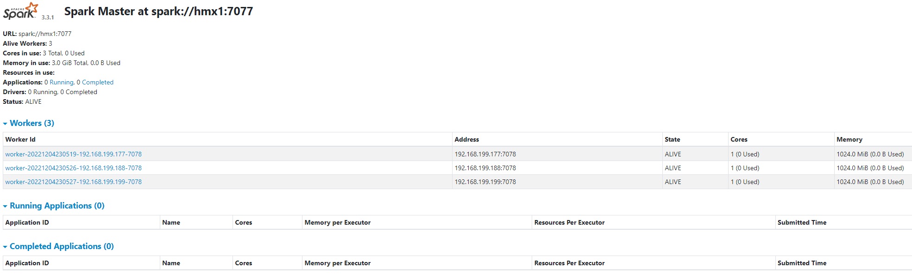

输入`./bin/pyspark --master spark://hmx1():7077(master节点的通讯端口)`，可以连接到集群中，以**pysparkshell**的类型和**driver**的进程展示到**Running Application**中。在该shell中执行的操作将会作为子任务，展示到二级页面中。

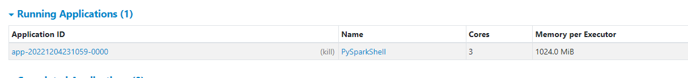

4040端口是在任务执行中能看到的，当执行结束后就看不到了。

不过可以通过18080端口查看历史执行记录

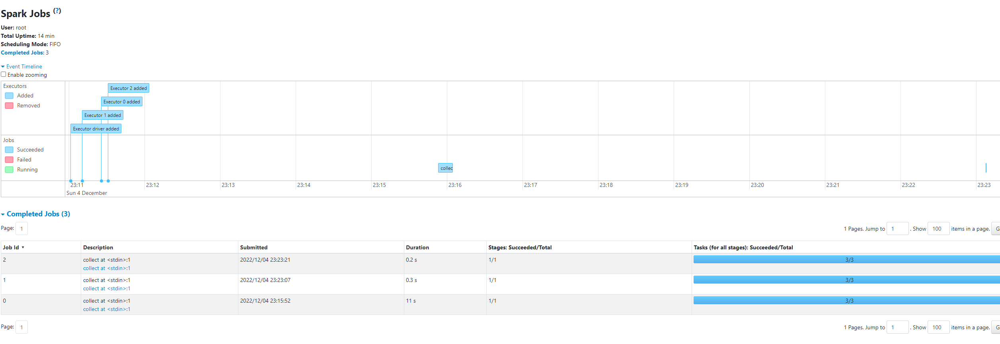

通过这种方式，当退出pysparkshell时，只会退出driver，不会将master、work退出，所以监控页面还是保留下来。

### spark程序运行层次

* 4040：是运行application过程中临时绑定的端口，查看当前任务的状态，如果被占用则会顺延4041、42..，当任务完成后端口会注销
* 8080： 默认在standardAlone下，Master角色(进程)的WEB端口，查看集群的状态
* 18080： 默认是历史服务器的端口，由于每个程序完成后404x端口会被注销，回看某个程序的状态就可以通过历史服务器查看，以守护进程，支持长期查看

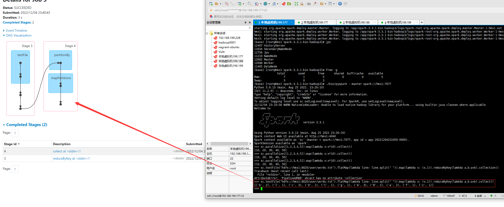

### 提交任务

`/bin/spark-submit --master spark://xxx:7077`


## Spark HA高可用部署

单点故障解决方案：

1. 基于文件系统的单点恢复-只能开发，测试环境
2. 基于zookeeper的standby master，可以用于生产环境

zookeeper提供了一个leaderElection机制，利用这个机制保证虽然集群中有多个master，但是只有一个是active。当master故障，另外一个standby Master就会被选举出来。

集群的基本信息，如Worker、Driver、Application信息都持久化到文件系统，因此在切换的过程中只会影响到新job的提交，对于正在进行的job没有任何影响。

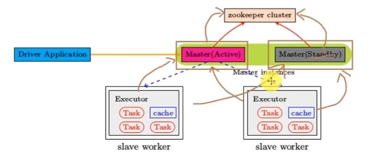

## sparkOnYarn部署

**可以提高资源的利用率。在已有yarn的场景下让spark受到yarn的调度可以更好的管控资源**

本质是

* Master角色由Yarn的ResourceManager担任
* Worker角色由Yarn的Nodemanager担任
* Driver角色运行在Yarn容器内或提交任务的客户端进程中(容器外)
* 真正干活的Executor运行在yarn提供的容器中

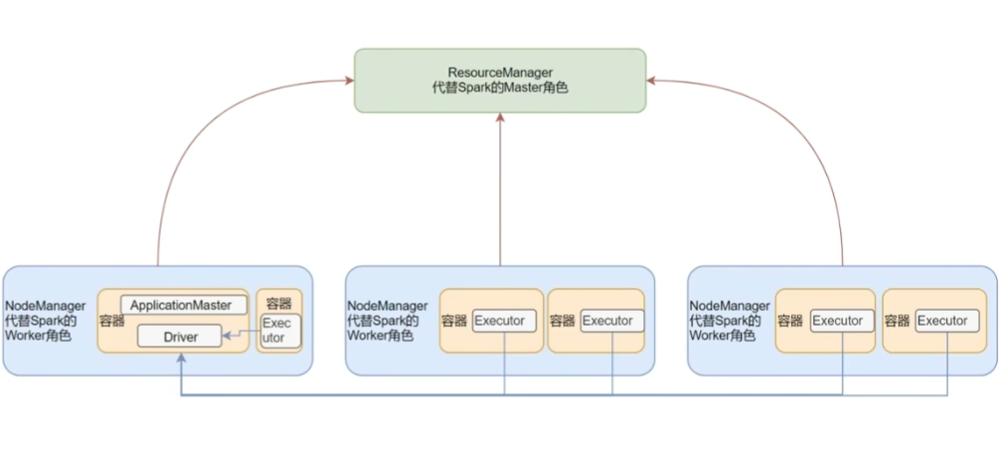

sparkOnYarn需要啥：

1. yarn集群
2. 需要spark客户端工具，比如spark-submit
3. 需要被提交的代码程序

### 部署

确保spark-env.sh中包含以下配置

```sh
# spark-env.sh
HADOOP_CONF_DIR=/app/hadoop-3.3.3/etc/hadoop
YARN_CONF_DIR=/app/hadoop-3.3.3/etc/hadoop
```

### 启动到yarn环境

`bin/pyspark --master yarn`

可以在yarn:8088端口查看到application包含type为spark的应用

### 两种运行模式

* cluster模式： `bin/spark-submit yarn --deploy-mode cluster (--driver-memory 512m --executor-memory 512m --num-executors 3 --total-executor-cores 3)` Driver运行在yarn容器内部，和applicationMaster运行在同一个容器中

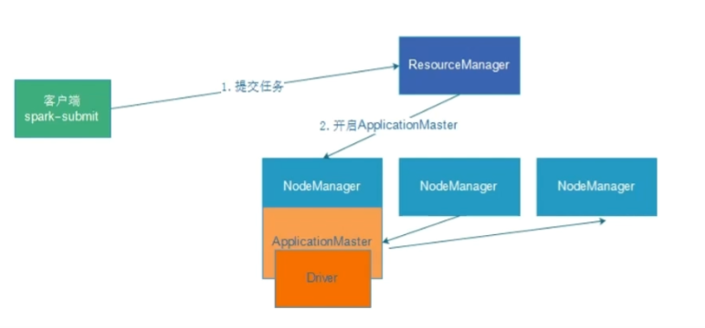

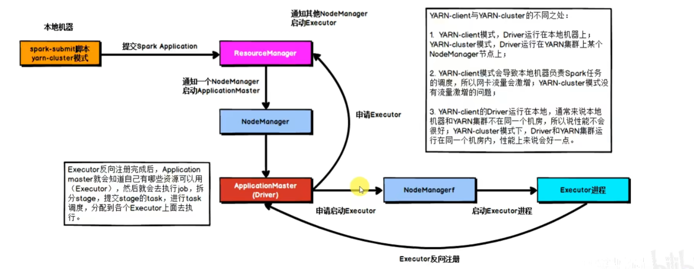

* client模式：`bin/spark-submit yarn --deploy-mode cient` Driver运行在客户端进程中，比如Driver(可以)运行在spark-submit、pyspark、spark-shell 程序的进程中

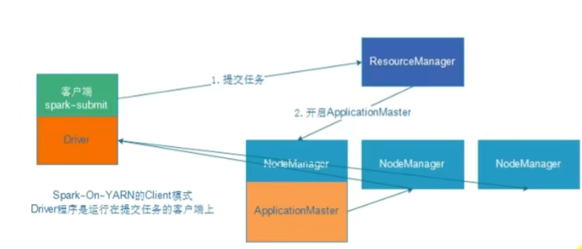

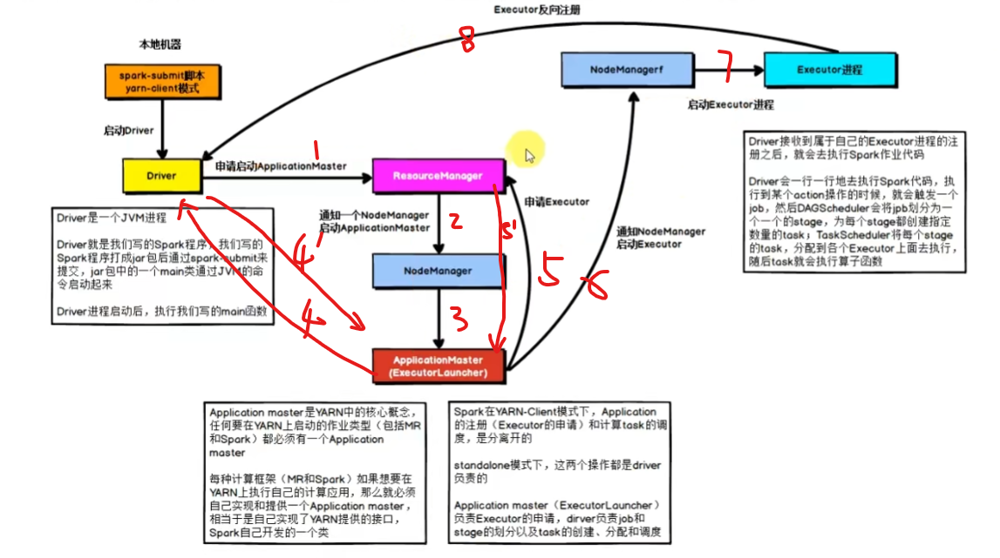

**都是由applicationMaster去向resourceManager申请executor的容器的；在申请资源前由有AM和Driver“沟通”确认需要多少的资源，才会去申请**


|            | cluser             | client                                     |
| ---------- | ------------------ | ------------------------------------------ |
| driver位置 | yarn容器内         | yarn容器外                                 |
| 日志查看   | 在容器内部，不方便 | 日志直接输出到客户端的标准输出流，方便查看 |
| 生产可用   | 推荐               | 不推荐                                     |
| 稳定性     | 稳定               | 基于客户端进程，受到客户端影响             |
| 通讯成本   | 直接和容器沟通     | 可能跨集群，与客户端沟通，成本高           |


## pythonOnSpark

在driver端：python的Driver代码，会翻译成jvm代码，变成jvmDriver运行。 worker executor端也是jvm执行，但是python的Executor操作指令无法翻译。**于是JvmExecutor通过，将指令发送给Pyspark守护进程，再由Pyspark调度运行到python进程上，Executor端本质就是python进程在工作，指令由JVM Executor发送（RPC）而来**

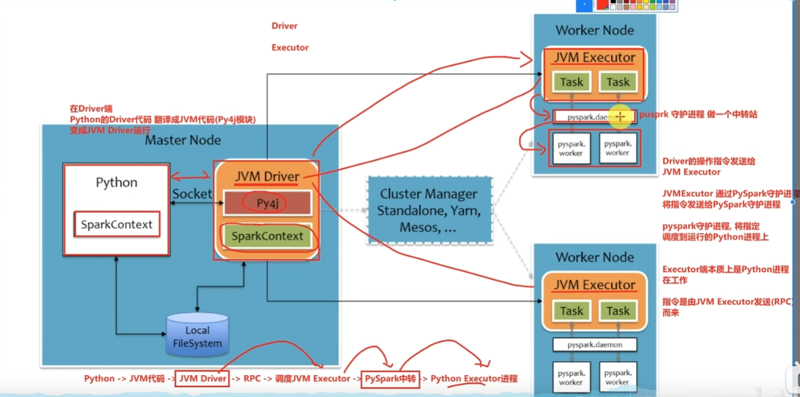

# SparkCore

RDD(Resilient Distributed Dataset)弹性分布式数据集,spark的数据抽象,代表一个不可变、可分区、里面的元素可并行计算的集合

* Dataset: 一个数据集合,用来存放数据,本地集合(存放在一个进程内部)
* Distributed: RDD中的数据是分布式存储的(跨机器、跨进程)
* Resilient: RDD中的数据可以存储在内存或者磁盘中

特性:

1. RDD(逻辑对象)有分区(物理概念)
2. 计算方法作用到每一个分区上
3. RDD之间有依赖关系
4. KV型RDD可以有分区器
5. RDD分区数据的读取会尽量靠近数据所在地

## RDD的分区*

RDD内部的数据集合在逻辑和物理上被划分为多个子集合,即分区.RDD本身不存储具体的数据,通过编号和分区编号锁定唯一分区的块编号.<u>利用底层数据存储层提供的接口,就能从存储介质(HDFS、Memory)提取出分区对应的数据.</u>

### 分区的原则

分区太多导致任务数量太多,每次调度比较耗时;分区太少会导致部分节点没有分配任务,而个别节点的内存要求就会提高.

* **情况1:从目标源读取数据**

spark通过API读取hdfs上的数据时,默认文件有几个block就会产生几个分区,最少有两个分区.

从kafka读取数据时,rdd分区数等于kafka分区数量.

* **情况2:计算过程中**

自己设定,<u>尽可能保证分区的个数等于集群核心数量.</u>

### RDD的分区器

* 哈希分区器:依据key的hashcode进行分区,速度快,但是可能产生数据偏移,造成每个分区中数据量不均衡

* 范围分区器:对现有rdd中的key-value数据进行采样,尽量找到均衡分割点,保证每个分区内数据量均衡,速度较慢.step1:数据抽样,找到排序后分区的边界数据; step2:依据key在边界数据中所属的位置来判断分区的id

## RDD创建

1. 并行化创建

```python
conf = SparkConf().setAppName("test").setMaster("local[*]")
sc = SparkContext(conf=conf)
# parallelize如果没有指定分区数量,那么
# 分区数由
# 1.分区数核指定,
# 2.或者local[*]指定 
# 将本地集合-》分布式RDD对象
rdd = sc.parallelize([1,2,3], partition_num)
# collect()将RDD各个分区中的数据,都发送到Driver中,形成一个python list
rdd.collect()
```

2. 读取文件创建

```python
sparkContext.textFile(param1,param2)
# 参数1 文件路径,支持本地文件、hdfs上
# 参数2 (可选)最小分区数量,spark有自己的判断,输入过大,不一定起作用

# 小文件数量比较多的时候性能较好
sparkContext.wholeTextFile(param1,param2)
# param1 文件夹

```

## RDD算子的提交

RDD算子可以直接使用yarn-client模式.**如果本地的机器能够直连集群**,在pycharm中,添加以下参数

```python
import os
os.environ["HADOOP_CONF_DIR"]="hadoop配置文件路径 hadoop/etc/hadoop"

# 需要设置一个参数告知集群,还有附件文件在执行文件中需要
conf = SparkConf().setAppName(value="test-yarn").setMaster("yarn")
conf.set("spark.submit.pyFiles","附件的路径,相对/绝对路径都可以")

```

也可以将代码提交到集群上,使用yarn-cluster模式,执行命令

```sh
spark-submit --master yarn --py-files ./xxx.py /home/??/执行文件.py
```

提交完毕后,可以在hadoop的8088端口,查看任务的提交情况

指定的附件可以是py文件或者zip包


## RDDAction算子

* collect等算子,从Executor分区中收集结果到dirver中,由driver集中对外输出
* foreach、saveAsText算子直接在Executor中直接处理和输出,但是没有返回值,不和dirver汇报


## RDD分区操作

* mapPartitiron 每次传入的都是一个分区数据的迭代器,(与map不同,每次传输的都是分区的一个数值),每次传来都是只有一次IO,性能强于map
* foreachPartition与foreach类似,前者在Executor上一次性直接处理一个分区的数据,而foreach是Executor一条条的处理


## RDD分组操作

* groupBy : groupBy操作会先将数据shuffle,分到指定的partition中,可能存在大量的IO
* RecuceByKey: 功能与groupBy一样,如果需要对分组的数据进行**聚合操作**,那么recudeByKey算子的操作效率高于groupBy. 因为reduceBykey会现在分区内**预聚合**,比如[(a,1),(b,2),(a,1)..]=>[(a,2),(b,2)...],减少IO次数


## RDD数据

RDD之间是相互迭代计算,当执行开启后,新的RDD产生,旧的RDD消失

RDD是过程数据,只在处理的过程中存在,处理完成后,就不见了

**这样可以最大化的利用资源,老旧的RDD从内存清理,腾出内存空间**

(如果存在两条链路:rdd1->rdd2->rdd3->rdd4;rdd1->rdd2->rdd5, 在完成第一条后,由于内存中没有rdd2了,那么就会根据rdd的血缘关系,从rdd1重新构建rdd2,供给rdd5使用)

### RDD的缓存

对于上面的例子,可以优化,让rdd2不从内存中消失,rdd1->rdd2就不需要执行两次

RDD的缓存技术,spark提供了缓存API,让我们通过调用API,将RDD数据保存在内存或者磁盘上

```python
rdd3.cache() # 缓存在内存中
rdd3.persist(StorageLevel.Memory_only_?) # 仅内存缓存,?个副本
rdd3.persist(StorageLevel.DISK_AND) # 仅磁盘
rdd3.persist(StorageLevel.MEMORY_AND_DISK) # 先内存再磁盘

rdd.unpersist() # 主动清理缓存
```

分散缓存,放在**Executor服务器**的内存、硬盘空间中,如果缓存丢失,就需要重新计算缓存,缓存必须保留的内容:被缓存RDD的“前置”血缘关系

### RDD的checkPoint

checkPoint是将RDD的数据保存起来,但是它**仅支持硬盘存储**,并且在**设计上被认为是安全的,也就没有保存血缘关系**

* 缓存是**分散存储**,无法设置具体存放的位置
* checkPoint是**集中收集各个分区的数据进行存储**可以设置具体的位置,可以放在HDFS上

### 缓存和CheckPoint对比

* check不管分区数量是多少,风险是一样的;而缓存的分区越多,风险越高(只要有一个分区的缓存损害,那么整个缓存就没法使用了)
* checkPoint支持写入HDFS(高可靠性存储),checkPoint被认为是安全的
* checkPoint不支持内存.缓存可以,如果缓存写入内存中,性能比checkPoint要好一些
* checkPoint因为被设计是安全的,不保留血缘关系,而缓存则保留
* 缓存适合保存一些轻量化的数据,即使数据丢失重新计算也不会太耗时间;而checkPoint适合保存重量级的RDD数据


## 共享变量

### 广播变量

本地list对象,被发送给每个分区处理的线程上使用(executor),可能会存放多个一样的数据(**一个Executor可能有多个分区,如果给每个分区都发送,就会产生重复.因为Executor是进程,每个分区计算是线程,进程的资源在线程之间是共享的,因此只需要给Executor传一份即可**)

在操作层面,只需要将共享变量标记为广播变量,那么同一executor进程中的第二个分区等待客户端发送该广播变量时,系统就会判别是够已经发送给该executor下的其他分区.

```python
# 1.将本地list,标记成广播变量即可,中间传输的就是broadcast这个对象了
boardcast = sc.broadcast(obj)
# 2.使用时,.从broadCast对象中取出本地list对象即可,只要传输的是broadcast对象,spark留意,只会给每个executor传输一份
value = broadcast.value
```


### 累加器

与广播变量类似,让分区累加的结果返回到driver(全局累加)

```python
acc = sc.accumulate()
rdd.map(lambda _: acc+=1)
```

注意,当rdd在执行累加器后被销毁,后续新的链路需要该rdd,那么,可能会导致**累加器的重复计算**

```python
rdd1 = rdd.map(累加器)
# rdd1被销毁
rdd1.collect()

# 由于rdd1被销毁, rdd2的构建需要重新计算rdd1,导致累加器再一次运行!!!!!
rdd2 = rdd1.map(lambda x:x)
rdd2.collect()

# ==============================改进如下===============================

# 可以通过将rdd1缓存的方式避免
rdd1 = rdd.map(累加器)

# 缓存下来,让rdd2的构建可以直接使用内存中的值
rdd1.cache()
# rdd1被销毁
rdd1.collect()

# 由于rdd1被销毁, rdd2的构建需要重新计算rdd1,导致累加器再一次运行!!!!!
rdd2 = rdd1.map(lambda x:x)
rdd2.collect()
```

## DAG

* 1个action产生一个1个dag,每个dag在程序运行时,产生一个job,一个代码运行起来,在spark中称之为Application,一个Application中,可以有多个job,每个job内包含dag


## 宽窄依赖和阶段划分

* 从后向前,遭遇**宽依赖**就划分出一个阶段,称之为stage


## 内存迭代计算

同一个stage中的窄依赖,spark考虑会直接让一个线程走完(rdd1->rdd2...),避免网络IO等消耗


## spark并行

* 先有并行度,才有分区规划,每个分区只会有一个task处理
* 一个task可以处理多个rdd


## spark的任务调度

spark任务由Driver调度，工作内容包括：

1. 逻辑DAG产生
2. 分区DAG产生
3. Task划分（DAG调度器）
4. 将Task分配给Executor并监控其工作（Task调度器）

层级梳理：

1. 一个spark环境可以运行多个application
2. 一个代码运行起来就是一个application
3. 每个人application内部依据action划分job，每个job有自己的DAG执行图
4. 一个job的DAG图，基于宽窄依赖划分成不同的阶段
5. 不同阶段基于分区数量，形成多个并行的内存迭代管道
6. 每个内存迭代管道形成一个task

# sparkSQL

sparkSQL是spark的一个模块，用于处理**海量结构化数据**

## 概述

sparkSQL的数据抽象：

* pandas-DataFrame 二维表数据结构，单机，本地集合
* sparkCore-RDD： 无标准数据结构，存任何非、半、结构化数据皆可，分布式集合
* sparkSQL-DataFrame：二维表数据结构，分布式集合

在RDD阶段，程序的执行入口对象是sparkContext，在2.0后，sparkSession对象，作为spark编码的统一入口对象，（sparksession.sparkContext来完成RDD编程、sparkSQL编程的入口）

dataSet和dataFrame基本相同，只是dataSet支持泛型特性，可以与java、scala集合的更好，但是python本身没有泛型，所有dataSet用的少。

## DataFrame

在结构层面：

1. structType对象描述整个DataFrame的<u>表结构</u>
2. structFiled对象描述一个列的信息

在数据层面：

1. Row对象记录一行数据
2. Column对象记录一列数据和该列的信息(由structField对象提供)

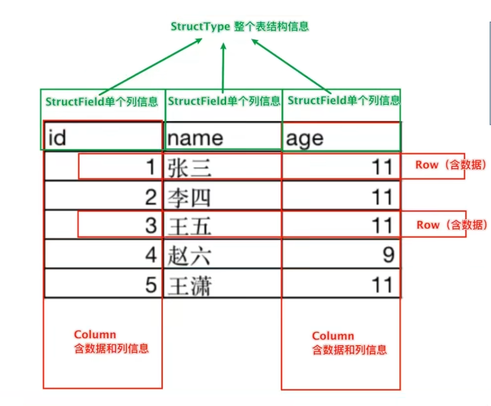


### 创建

从rdd中创建dataFrame，可以直接解析出行列、数据，但是缺乏表信息，可以通过如下方式添加表信息

1. 设置schema
2. 通过structType对象来定义DataFrame
3. 通过rdd的toDF()方法

```python
# 1. 方案1 通过shema粗略定义列信息
df = spark.createDataFrame(rdd,schema=['name','age'])
# ======================================
# 2. 方案2 通过structType 定义完整的表结构信息
schema = StructType().add("name", StringType(), nullable=True).add(...)
df = spark.createDataFrame(rdd,schema=schema)
# ======================================
# 3. 方案3 通过rdd的内置toDF()方法快速构建
df = rdd.toDF(['name','age'])
# ======================================

# show()展示dataframe的数据，
# 第一个参数表明展示的行数，默认为20条
# 第二个参数表明是否截断，出现字符过长，可能会出现...
df.show(20,False)

# 将df转化为临时视图，可以支持sql语句访问
df.createOrReplaceTempView("A")
spark.sql("select * from A where ...")
```

也可以从pandas的DataFrame转化为sparkSQL的DataFrame

```python
# 创建pandas的df
pdf = pd.Dataframe({
    "id":[1,2],
    "name":["1","2"]
})
# 基于pandas的DataFrame构建sparkSql的df对象
df = spark.createDataFrame(pdf)
```

从外部读取DataFrame，spark提供了统一的api入口

```python
sparksession.read
.format("text|csv|json|...") # 在设置如text、json等格式后，会自动后台设置schema
.option("K","V") # option可选，以键值的方式，例如.option("header",True).option("endcoding",'utf-8')
.schema(StructType|String) #以string方式设置shema ： .schema("name STRING","age INT")
.load("")
```

### 视图

```python
# 设置全局表，可以跨sparkSession对象使用，但是在具体使用上需要在表明前加入“global_temp.xxx
df.createGlobaltempView("xxx") 
spakr.sql("select * from global_temp.xxx")

```

### UDF创建

定义方式：

1. sparksession.udf.register()注册的UDF可以用于DSL和SQL，返回值用于DSL风格，传参内给名字、UDF的处理逻辑、UDF的返回值类型，返回的是一个UDF对象
2. pyspark.sql.functions.udf，仅能使用DSL风格

```python
# rdd创建
rdd = sc.parallelize([1,2,3,4,5]).map(lambda x: [x])
df = rdd.toDF(['num'])

def 处理方法(x):
    return x*10

# 方式1.创建并注册udf
udf = sparksession.udf.register("udf1", 处理方法名, IntegerType()) # 或者其他返回类型
# sql风格 selectExpr以SELECT表达式执行，select方法接受普通的字符串字段名，或者返回值是Column对象的计算
df.selectExpr("udf1(num)").show()
# DSL风格 返回值UDF作为方法使用，传入的参数一定是column对象
df.select(udf(df['num'])).show()

# 方式2.注册udf
import pysqark.sql.functions as F
udf_ = F.udf(处理方法, IntegerType()) # 或者其他返回类型
# 改注册方式只能使用dsl方法
df.select(udf_(df['num'])).show()
```

**返回数组类型的UDF**

```python
def spilit_line(line):
    return line.split(" ")

# 构建UDF的时候，需要变动返回值类型，除了需要设定为array类型，还需要指定array内的数据类型(本处为string)
udf = sparksession.udf.register("udf_",spilit_line,ArrayType(StringType()))

```

**返回(复杂)字典类型的UDF**，可以使用`structType`带代替返回类型

```python
def process(data):
    return {"xx":data[0],"yy":data[1]}

udf = sparksession.udf.register("udf_", process, 
                                StructType()
                                .add("xx",IntegerType(),nullable=True)
                                .add("yy",stringType(), nullable=True)
                               )
```

## 运行流程

### sparkRDD的执行流程及Catalyst优化器

RDD->DAGScheduler->TaskScheduler->worker

RDD的运行依托于开发者的代码执行和coding水平，因为**RDD内含的数据结构不限制格式和结构！！！**

但是，sparkSQL会有"自动优化"，因为**DataFrame是二维表结构，可以被针对**，依赖于Catalyst优化器

 

**Catalyst优化器，是sparkSQL为了替换HIVE中的优化器** sparksql的底层仍然采用RDD

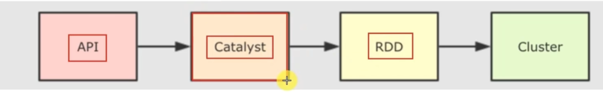

* 断言/谓词下推： 将filter操作放在join之前
* 列值裁剪：只使用必要的列，把其他不用的列裁剪掉，减少数据的处理量（适合于parquet等列式存储数据库）

### sparkSQL执行流程

1. 提交sparkSQL代码
2. catalyst优化：

​		a. 生成原始AST语法树

​		b. 标记AST元数据

​		c. 进行断言下推和列值裁剪

​		d. 得到最终AST，生成执行计划

​		e. 执行计划翻译成RDD代码

3. Driver执行环境入口构建(sparkSession)
4. DAG调度器规划逻辑任务
5. Task调度区分配逻辑任务到具体的Executor上工作并监控管理任务
6. Worker干活


### SparkOnHive原理

<u>区分与HiveOnSpark的Hive即作为元数据又负责SQL语法解析，执行引擎变成spark，生成RDD执行</u>

关键在于**Hive提供了MetaStore元数据服务**，帮助SparkSQL翻译成RDD并成功去目标位置读取数据并识别不同的列名和计算处理。

需要配置：

1. MetaStore需要存在并开机
2. Spark知道MetaStore在哪里，端口？

配置路径：`/spark/conf/hive-site.xml`,并在`./jars`中确认存在mysql.jar

```xml
<configuration>
<property>
  <name>hive.metastore.warehouse.dir</name>
  <value>hdfs://192.168.199.177:8020/hive/warehouse</value>
  <description>管理表存储的位置,可以是linux中的目录,也可以是相对于fs.default.name有关的目录</description>
    </property>
        <property>
      <name>hive.metastore.local</name>
      <value>false</value>
    </property>
  
    <property>
      <name>hive.metastore.uris</name>
      <value>thrift://node1:9083</value>
    </property>
</configuration>
```


### 分布式SQL的执行引擎原理

