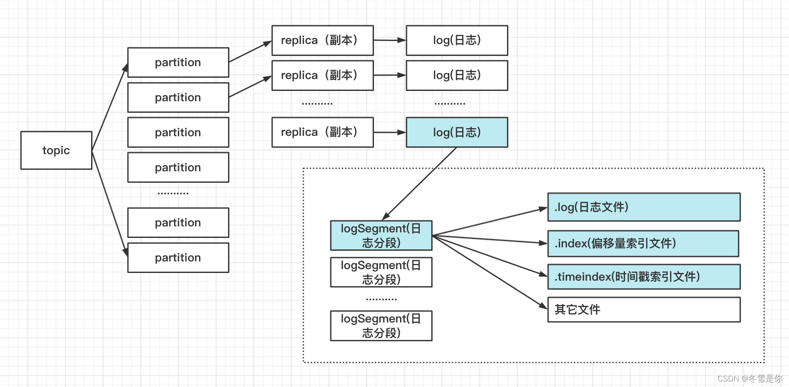
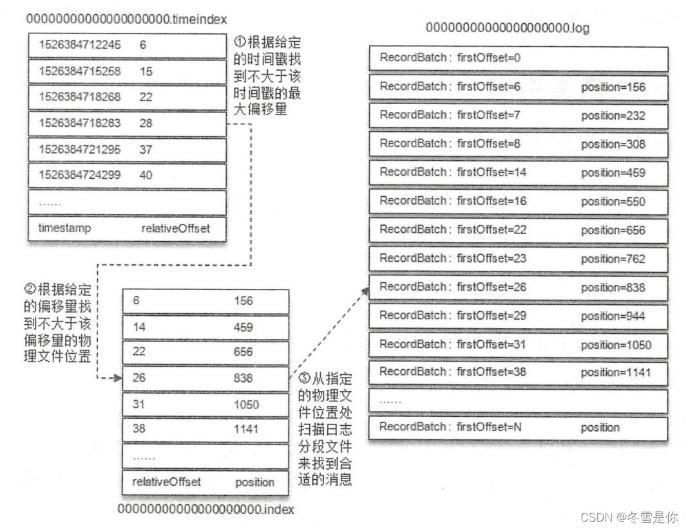
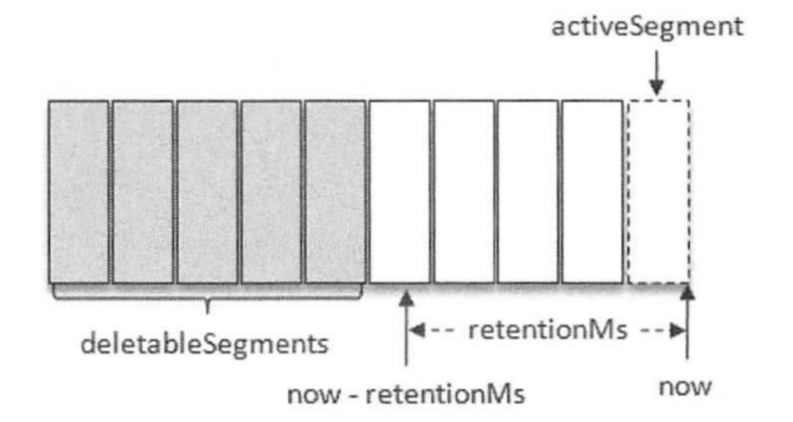
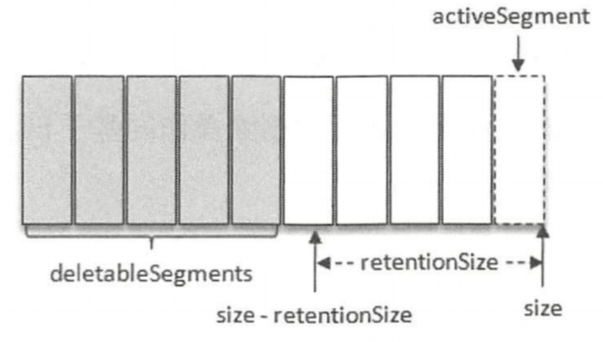
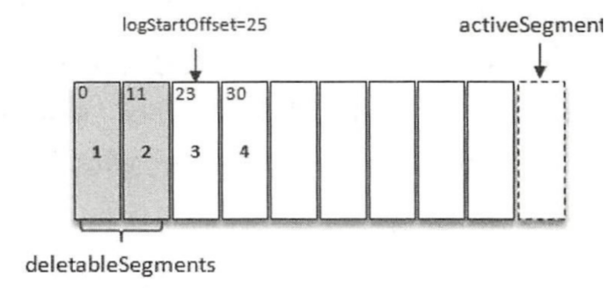
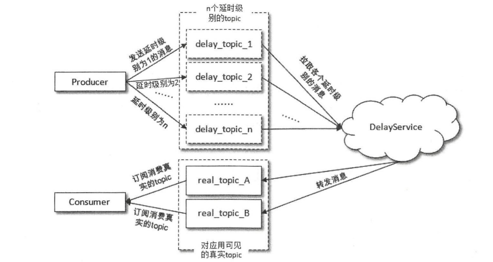
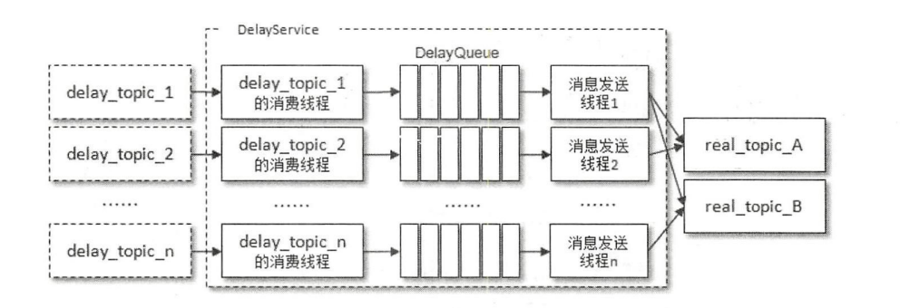
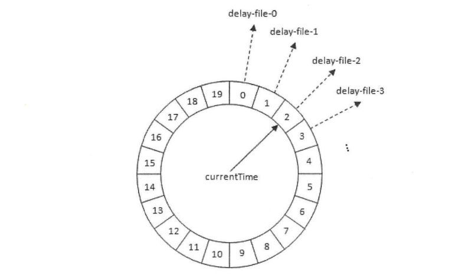
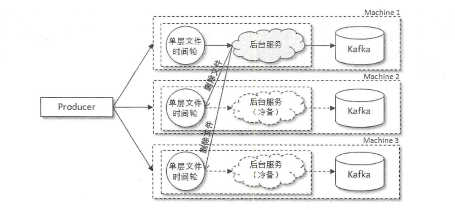

# kafka 基础


## kafka优化问题

### 1) 确保99.9%的消息消费

* 生产者:设置ack为1,或者-1/all,保证发送的消息能够被kafka集群内replication接收
* 消费者:关闭自动提交offset,设置手动提交

```java
// 配置ack 如果为0:说明发送到kafka分区后,默认发送成功
// 1: 只要发送所在目的分区的leader,并完成本地磁盘写入,就算成功
// all/-1: 发送到leader副本后,其他的follower副本(ISR中的副本)不断地去拉取,然后本地磁盘写入,才算结束
properties.put(ProducerConfig.ACKS_CONFIG,"0");

Producer<String,String> producerClient = new KafkaProducer<String, String>(properties);
```


### 2) 消息的重复消费

​		产生原因:**当生产者发送消息至kafka broker后,因为网络抖动等原因,没有收到ack,那么生产者可能会重新发送消息,然后被消费者重复消费**

**幂等性: 多次访问的结果是一样的**

* 生产者:把重试关闭,但是可能会丟消息

* 消费者:解决非幂等性消费

  a) 方案一: 在数据库中设置一个唯一id,插入的时候校验(不建议)

  b) 方案二: 使用分布式锁


### 3) 顺序消费

​		由于分区的存在,顺序只是分区内有序,如果把消费组内的对同一个topic的消息进行统一消费,那么是乱序的

* 生产者:设置ack不为0,关闭重试,使用同步发送,等发送完成后再发送下一条,确保消息的发送是顺序的
* 消费者:消息是发送到一个分区中,只能有一个消费组的消费者来接收消息

**顺序消费会牺牲性能**


### 4) 消息的堆积

​		实际上,kafka的消息都是存在本地的.当消费者的消费速度<<生产者的生产速度,导致kafka大量的数据没有被消费,由于消息的积压,消费者寻址性能越来越差,导致整个kafka对外提供的服务性能越来越差.

* 消费者: 使用多线程,充分利用机器的性能进行消费处理
* 创建多个消费组,多个消费者,部署到其他机器上,一起消费
* 创建一个消费者,在消费者在kafka内另外建一个topic,该消费者不做消费,直接转发到新建的主题,并对该主题的多个分区分配多个主题.

**通过业务架构设计,提升消费的性能**


### 5) 延迟队列

消费者根据消息的创建时间和当前时间,作出不同的操作


## Rebalance机制

尽可能让消费者分配到相对均匀的分区,保证Consumer的资源都能得到充分的利用

### 触发时机

1. 消费者组消费的分区个数发生变化
2. 消费者组消费的主题数量发生变化
3. 消费者组内的消费者个数发生变化

### 消费组协调者(Coordinator)

是broker进程中的一个组件,每个broker都会有一个Coordinator.其主要职责:服务ConsumerGroup,完成reblance过程,提供group位移、组内成员的管理

**消费者组在保存位移offset所在\__consumer_offsets主题的某个partition分区(因为__consumer_offsets的分区取决于group.id),该partition分区的leader副本所在的broker上的coordinator就是该消费者组的协调者**

* 当consumer启动的时候,会向协调者所在broker发送包括**Join Group**等请求,向协调者执行消费者组的注册和消费者元数据的保存.其组内的各个消费者会定时向协调者发送心跳请求,以便于协调者了解每个消费者的状态信息.

* 当触发rebalance的时候,会在收到组内消费者发送的请求后回复**rebalance_need**,停止消费者的消费行为,并开始rebalance.而消费者接受到响应后,向协调者发送SyncGroup请求,询问分配给自己的分区信息.

### 分配策略

1. range:指按照分区号的范围(连续)进行分区分配
2. rangeRobin:分配策略是指轮询每个分区,将分区(离散)逐个分配给消费者
3. StickyAssignor:尽可能保留之前的分配方案,保证分区分配的最小变动.这样已有实例连接TCP就可以继续使用,不用重新创建连接其他broker的socket资源

### 产生的影响

1. 影响消费效率
2. 可能会产生消费重复消费

### 减少Rebalance的产生

1. session.timeout.ms 协调者最长等待没有收到心跳间隔的时间,生产环境中尽量保证>3*heartbeat.interval.ms
2. Max.poll.interval.ms 调用poll的时间间隔 (给消费者提供更长的消费时间)

## 分区分配策略

kafka提供指定分区的消息发送模式

* 如果没有指定具体的分区，但是指定了具体的key：依据hashcode(key)%partitionSize 分配具体分区，但是需要**提前确定好分区的数量**，避免扩容后消息分区的前后不一致
* 如果既没有指定具体的分区，也没有指定具体的key：
  0. 在kafka默认发生消息的时候，考虑到通讯的资源消耗，会将消息缓存在分区的batch中，等到size达到`bacth.size`后，再一并发送，或者单个消息的缓存时间到达`linger.ms`无视size大小直接发送，因此必然会存在一定的延迟。
  1. 在2.4版本之前，默认采用轮询的方式，即` RoundRobinPartitioner`：在可用分区上，依次把消息放入到每个分区对应的batch中，但是会导致长时间无法填满`batch.size`，产生延迟和小分区问题。
  2. 在2.4版本之后，采用黏性分区`StickyPartitionCache`，缓解延迟和解决小分区问题，即：黏性分区会优先选择一个分区，并一直使用该分区来缓存消息，直到该batch满了或者已完成时才会随机切换其他分区。这种方式短时间会将所有所有消息发送到一个分区上，但是时间拉长后，每个分区其实都会有消息均匀地发送成功。

## 分区的管理

当分区的leader节点发生故障，其中一个follower会成为新的leader节点，导致集群的负载不均衡。kafka就要确保所有主题的优先副本在Kafka集群中均匀分布。

### 优先副本选举

AR集合列表中的第一个就是**优先副本**。而优先副本选举就是leader副本。但是分区平衡并不是kafka集群的负载均衡，还要考虑到不同leader副本的负荷。

配置`auto.leader.rebalance.enable=true`，kafka会自动启动定时任务，计算每个broker节点的分区不平衡率(非副本优先的leader个数所占全部分区的比例)，超过10%就会**阻塞式**执行。

### 分区重分配

存在以下情况：

1. 如果节点突然宕机，并且其中的分区是<u>单副本</u>的，在节点恢复前就丢失数据了。
2. 集群的节点有计划的下线操作时，为了保证分区以及副本的合理分配。
3. 新增broker节点时，只有新创建的主题分区才有可能分配到这个节点上，已有的分区则不会主动分配过去。

分区重分配的基本原理在于，先是通过控制器为每个分区添加新的副本(副本因子)，新的副本从分区的leader副本那里复制所有的数据。复制完毕后，控制器将从旧副本从副本单中移除。

broker下线之前，最好能够在分区重分配之前先重启或者关闭。

## kafka日志存储

### 日志目录

一个主题对应多个分区,一个分区对应多个副本,一个副本对应一个日志(log),一个日志对应多个日志分段(segment)组成.

log在物理上以文件夹的形式存在,分区segment对应磁盘上的一个日志文件和两个索引文件(.index,.timeindex),以及其他可能的文件(.delete,.cleaned,.swap...)



log中的追加消息时顺序写入的,只有最后一个logSegment(被称为“activeSegment”)才能执行写入操作.

每个logSegment都有一个基准偏移量(64位)baseoffset,用来表示当前logSegment中第一条消息的offset.日志和两个索引文件都是根据基准偏移量命名的.

![[B0F27226-2200-42E1-82F3-07EE3C7426E2.png)]](./pic/watermark,type_d3F5LXplbmhlaQ,shadow_50,text_Q1NETiBA5Yas6Zuq5piv5L2g,size_20,color_FFFFFF,t_70,g_se,x_16-20230420141604491.jpeg)

### 日志索引

**偏移量索引文件(.index)**用来建立**消息偏移量(offset)**到**物理地址**之间的映射关系

**时间戳索引文件(.timestamp)**则根据指定的时间戳来查找**对应的偏移量信息**

索引以稀疏索引(sparse index)的方式构建消息的索引,它不保证每个消息在索引文件中都有对应项,每当(向.log文件)写入一定量的消息时(由`log.index.interval.bytes=4096B`指定),<u>偏移量索引文件和时间戳索引文件</u>分别增加一个<u>偏移量索引项和时间戳索引项</u>

 偏移量索引文件中的偏移量是单调递增的,查询的时候:

* 使用二分查找法定位偏移量,如果该偏移量不在索引中,那么返回小于该偏移量的最大偏移量

时间戳索引文件同样单调递增:

* 二分查找,查找不大于该时间戳的最大偏移量,然后再找到根据偏移量索引文件(.index)再次定位物理位置

#### 偏移量索引

每个偏移量索引占用8个字节:

* relativeOffset:相对偏移量,表示消息相对于baseOffset的偏移量,占用4个字节,当前索引文件名称即baseOffset
* position:物理地址,消息在日志分段文件中对应的物理位置,占用4个字节

ps消息的偏移量(offset)占用8个字节,也是**绝对偏移量**

#### 时间戳索引

每个索引项占用12字节:

* timestamp:当前日志分段**最大的时间戳**
* relativeOffset:时间戳对应的消息的相对偏移量

时间戳索引项追加时,必须大于之前的timestamp,否则不予追加,如果保证broker端的`log.message.timestamp.type=logAppendTime`,那么消息的时间戳必定单调递增;或者生产者通过指定时间戳的方式添加,避免不同时钟的生产者同时往一个分区中插入消息,可能造成的乱序.

已知每当消息写入一定量后,就会在偏移量索引文件和时间戳索引文件中分别增加一个偏移量索引项和时间戳索引项.

**虽然两个文件增加的索引项是同时进行的,理论上:偏移量索引中的relativeOffset和时间戳索引项的relativeOffset可以一致，但是由于网络、传输等情况存在，可能出现不一致情况**

#### 执行流程

查询指定时间戳(xxxx18288)开始的消息

1. **确认日志分段**:通过targetTimeStamp和每个日志分段中的最大时间戳largestTimeStamp逐一对比,直到找到不小于targetTimeStamp的largestTimeStamp所对应的日志分段——日志分段LogSegment中的largestTimeStamp计算是先查询该日志分段对应的时间戳索引文件,找到最后一条索引项,如果大于0,就取该值,否则就是该日志分段的最近修改时间
2. **找到偏移量**:在确认目标日志分段后,在时间戳索引文件使用二分查找法找到不大于targetTimeStamp的最大索引项
3. **确认物理位置**:在偏移量索引文件中使用二分查找找到不大于step2得到的偏移量的索引项
4. **获取目标消息**:拿到物理位置后,<u>在step1中确定的日志分段中,从step3得到的物理位置开始查找不小于targetTimeStamp的消息</u>



### 日志清理

kafka将日志存储在磁盘中,为了控制磁盘占用不断增加,提供了两套方案:

* **日记删除**:按照一定的保留策略直接删除不符合条件的日志分段
* **日志压缩**:针对每个消息的key进行整合,对于相同key的不同value值,只保留最后一个版本


删除日志分段时,首先会从log对象维护日志分段的跳跃表中移除待删除的日志分段,保证没有线程能够读取这些日志,然后将这些日志分段加上`.deleted`的后缀,最后由一个`delete-file`命名的延迟任务来删除这些带`.deleted`后缀的文件,配置`file.delete.delay.ms`参数来调配,默认为1min


#### 基于时间的删除

日志删除任务会从检查当前日志文件是否超过阈值(retentionMS),寻找可删除日志分段文件集合(deletebleSegment).由`log.retention.hours`、`log.retention.minutes`、`log.retention.ms`.默认时间为168(7天)



在查找过期的日志分段文件,并不是简单地根据日志分段的最近修改时间(lastModifiedTime)来计算的,而是<u>根据每个日志分段中时间戳索引文件的最后一条索引记录——最大的时间戳largestTimeStamp</u>.因为日志分段的最近修改时间(lastModifiedTime)可以有意或无意地修改(分区副本重置等),除非最后一条索引项的时间戳字段值为0,才会使用lastModifiedTime.

若全部的日志分段均已过期,会预先切分出一条新的日志分段作为activeSegment,然后再执行删除操作.


#### 基于大小的删除

通过检查日志大小判断是够超过设定的阈值(retentionSize),设置参数`log.retnetion.bytes`,代表log中所有日志文件的总大小,不是单个日志分段(.log文件)的大小,默认为-1,其中单个日志分段的大小由broker端数`log.retnetion.bytes`

首先计算出日志问价你的总大小的size和retentionSize差值diff,然后从日志文件中的第一个日志分段开始进行查找可以删除的日志分段的文件集合deletableSegment.




#### 基于起始偏移量的删除

通常,如果没有执行过deleteRecordsRequest请求、日志的清理、删除,那么日志文件的其实偏移logStart Offset等于第一个日志分段的baseoffset.

保留策略在于判断某日志分段的下一个日志分段的其实偏移量baseoffset是否小于等于logStartOffset,若是,则可以删除此日志分段.



# 高级应用


## 过期时间TTL

不同类别的消息可能会有不同过期时间，因此建议在**header字段**配置预期的时间，通过`ConsumerInterceptor`的`OnConsumer()`方法进行排查。

可以直接使用`org.apache.kafka.common.header.internals.RecordHeader(s)`


## 延迟队列

队列是消息的载体，延时队列存储的对象是延时消息（期望客户等待特定时间，才消费），注意和TTL（超时抛弃）的区别

kafka本身没有队列的概念，其存储消息的载体是主题（其实是分区），但是可以把存储延时消息的主题称之为“延时主题”


### Baseline

发送延时消息的时候，并不是先投递要发送的真实主题，先投放在不可见的内部主题，自定义的服务将满足条件的消息二次投放在真实主题中。延时时间一般是按秒计算。考虑到资源的利用，不再按照延时时间分类，而是按照固定的延时等级来划分，比如`delay_topic_1`表示为`5s`的延时主题



关于`DelayService`服务，针对不同延时级别，分配单独的线程进行消息的拉取，以及单独的队列暂存。DelayQueue会按照消息的时间戳和延时时间的数值之和排序，随后又专门的线程负责转发。



这种方式存在较为明显的延时。


### 强化

1） 为了减少延时，可以在`producer`端，采用在内存延时发送到broker中，但是这种方式会造成消息的积累和内存的负担。

2） 可以采用时间轮的方式，无需大量的系统开销和大量的句柄维护。只需要加载距离时间轮表盘指针相近位置的部分文件即可。




时间轮能解决延时精度和内存暴涨的问题。可靠性问题可以通过：生产者将消息写入多个备份（单层文件时间轮），待时间轮转动触发某些时间格过期就将时间格对应的文件内容（也就是延时消息）转发到真实主题中，并删除相应的文件。




时间轮相关讲解：https://www.rstk.cn/news/61817.html?action=onClick


## 死信队列

某些原因消息不能被正确投递，确保消息不回被无故抛弃，一般将其置于一个特殊角色的队列，也就是死信队列。通过对死信队列进行分析，优化系统。

死信的范围，可以理解成：

* 不符合处理要求的消息
* 消费者不想处理的消息
* 消费者不能处理到的消息

比如解析错误的消息，不能随意抛弃而丢失可靠性，将其投递到死信队列，或者超时重试次数过多的情况


## 重试队列

重试队列可以理解成一种回退队列，消费端消费失败的饿时候，防止丢失，将消息回滚到broker中。

与直接的回退不同，重试队列分多个等级，比如第一次消费失败进入延时为5s的重试队列Q1，再失败进入10s的Q2，再再次失败则进入死信队列。


如果消费发生异常，就不会对本次消费进行确认，因此进而发生回滚消息的操作后，异常消息会始终出现在队列的头部，进而陷入不断被处理和回滚的死循环。可以综合死信队列和重试队列，来提供一种暴涨机制


# 应用


## Consumer属性配置

### 自动提交offset

默认为true的时候会自动提交

```java
properties.put(ConsumerConfig.ENABLE_AUTO_COMMIT_CONFIG,true);
```

如果为false,则每次消费掉消息后手动提交offset,通常使用同步提交就可以了,因为一般后续不会有其他的逻辑代码

```java
// ....消息处理逻辑
// 同步提交offset
(Consumer<String,String>)consumerClient.commitSync();
// 异步提交offset
(Consumer<String,String>)consumerClient.commitAsync();
```


### 消费记录位置

默认为`latest`

1) 已有该分区消费记录的消费者:默认从offset+1的位置开始拉取和消费

2) 如果从来没有消费过(没有产生offset):消费后续新产生的数据

如果为`earliest`

1. 该用户产生过offset:从+1位置开始消费
2. 新用户:从头开始消费,并生成offset

在消费之后提交offset,由于`__consumer_offsets`已经保存了该用户组对该分区的offset,下一次拉取(没有配置`AUTO_OFFSET_RESET_CONFIG`)将继续从目标位置拉取

```java
// 配置groupId,便于kafka寻找offset
properties.put(ConsumerConfig.GROUP_ID_CONFIG,GROUP_NAME);
// 区别于consumerClient.seekToBeginning
properties.put(ConsumerConfig.AUTO_OFFSET_RESET_CONFIG,"earliest")
```


#### \__consumer_offsets

\__consumer__offsets用于记录消费者(组)在每个主题分区上的偏移量

考虑到存在多个topic和consumerGroup,存在同时提交位移,加重写入负担.因此,kafka将该功能从zookeeper上迁移到kafka上以主题的形式存在,共计50个分区.不同consumer的偏移量由group.id做哈希,分散到不同分区上.

\__consumer_offsets的每条记录格式大概由group.id、topic-partition、offset三个部分组成

(所以不存在,在已消费的情况下,新的消费组成员开始消费后,找不到分区下offset的可能,因为每个partition只能被同一消费组中的一个成员消费)


### 指定分区消费

```java
consumerClient.assign(Arrays.asList(new TopicPartition(TOPIC_NAME,0)));
```


### 消息回溯消费

```java
// topic_Name的0分区,从头开始消费
consumerClient.seekToBeginning(Arrays.asList(new TopicPartition(TOPIC_NAME,0)));

// 支持指定过去多少时间内的重新消费  指定时间消费
// 1。 找到topic主题的所有分区
// 2。 找到各个分区中过去指定时间点，消费到的offset
consumerClient.offsetsForTimes(new HashMap<TopicPartition,Long>() {{put(new TopicPartition(TOPIC_NAME,0),new Date().getTime()-1000*60*60);}})
```


### 轮询拉取消息

从结构上,kafka与订阅发布模型类似,但是订阅发布模型主要是主动推送给订阅者,而kafka则是主动拉取主题分区中的消息.

`poll`方法默认返回每3秒内的拉取的消息,最多500条

如果消费处理的逻辑时间过长(默认超过30s),那么broker就会认定该消费者消费能力过弱,将其踢出消费组,触发rebalance,造成额外的开销,当前的groupId无法正常消费该分区.

```java
while(true){
  ConsumerRecords<String, String> records = consumerClient.poll(Duration.ofSeconds(3000));
  // 消息处理逻辑
  // 如果时间过长,导致被认定消费能力不足而被踢出消费组
  // 可以修改如下参数,增加间隔时间
  // properties.put(ConsumerConfig.MAX_POLL_INTERVAL_MS_CONFIG,300000);

}
```


### spring中配置

导入maven

```xml
<!-- https://mvnrepository.com/artifact/org.apache.kafka/kafka-clients -->
<dependency>
  <groupId>org.apache.kafka</groupId>
  <artifactId>kafka-clients</artifactId>
  <version>3.2.3</version>
</dependency>

<!-- https://mvnrepository.com/artifact/org.springframework.kafka/spring-kafka -->
<dependency>
  <groupId>org.springframework.kafka</groupId>
  <artifactId>spring-kafka</artifactId>
  <version>2.8.8</version>
</dependency>
```


默认系统配置

```yaml
spring:
  kafka:
    bootstrap-servers: 192.168.199.177:9092
    producer:
      acks: 1
      key-serializer: org.apache.kafka.common.serialization.StringSerializer
      value-serializer: org.apache.kafka.common.serialization.StringSerializer
    consumer:
      auto-offset-reset: latest
      key-deserializer: org.apache.kafka.common.serialization.StringDeserializer
      value-deserializer: org.apache.kafka.common.serialization.StringDeserializer
      bootstrap-servers: 192.168.199.177:9092
```

Consumer的编写

```java
@Component
public class KafkaConsumerListener {

    @KafkaListener(groupId = "group1",
            topicPartitions = {
            // 多个主题，设置不同的分区，或者针对特定的分区设置初始的offset
           @TopicPartition(topic = "tmp"
//         partitions = {"0"}
           ,partitionOffsets = @PartitionOffset(partition = "0",initialOffset = "10"))
            }
            // kafka设置有多少个消费者组成员？
            ,concurrency = "1")
    public void getMessage(List<?> list){
        list.forEach(System.out::println);
    }

}

```

自定义的`consumer`搭配`@KafkaListener`中的`containerFactory`

```java
@Bean
    KafkaListenerContainerFactory<ConcurrentMessageListenerContainer<String,String>> kafkaSearchListenerContainerFactory(){
        ConcurrentKafkaListenerContainerFactory<String, String> containerFactory = new ConcurrentKafkaListenerContainerFactory<>();
        Map<String,Object> properties = KafkaProperties.generateMap("consumer");
        properties.put(ConsumerConfig.ENABLE_AUTO_COMMIT_CONFIG,false);
        containerFactory.setConsumerFactory(new DefaultKafkaConsumerFactory<>(properties));
        containerFactory.setConcurrency(1);
        containerFactory.setBatchListener(true); // 批次接受消息,监听器的入参类型可以为 List<ConsumerRecord>
        long interval = 10000;   //重试间隔    10s重试一次
        long maxAttempts = 10;  //最大重试次数 最多重试10次
//        当 Consumer 消费消息异常的时候，进行拦截处理,重试小于最大次数时，重新投递该消息给 Consumer
//       代替 SeekToCurrentBatchErrorHandler()
        CommonErrorHandler commonErrorHandler = new DefaultErrorHandler(new FixedBackOff(interval,maxAttempts));
        containerFactory.setCommonErrorHandler(commonErrorHandler);
        return containerFactory;
    }
```

在spring-kafka中,已经提供了对重试队列和私信队列的支持.对以上内容`Bean`拆分:

1. Spring-kafka中配置`enable.auto.commit=false`时,仅代表Kafka-client本身不会自动提交offset,但是Spring-kafka会辅助性获取`List<ConsumerRecord>`的最后一个record的偏移量并提交
1. 当处理在`List<ConsumerRecord>`中的某一条record出现异常,会进入重试队列,再将整个`List<ConsumerRecord>`重新接收处理,<u>会导致消息重复性消费</u>
1. 并且当重试过多而被spring-kafka扔进死信队列中时,默认会提交整改整个`List<ConsumerRecord>`的offset.会导致列表后半截消息没有处理.因此需要在处理消息逻辑时:遇到异常,可以先处理后续消息.
