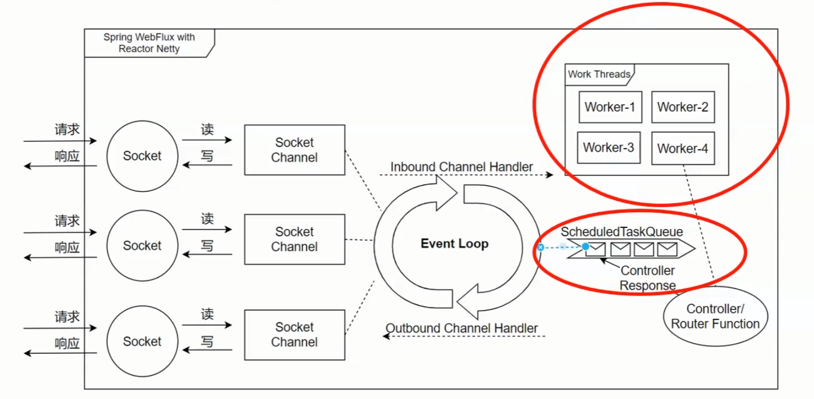

# spring boot 强化
## 1.底层注解
### @Bean

spring中的bean默认是单例模式。其本身<u>不是线程安全</u>的。具体仍然要结合`@scope`，存在以下情况：
* singleton: 单例模式
* prototype：原型，每次从容器中调用bean，都会返回一个新的bean。相当于执行`new XxxBean()`
* request：每次http请求都会创建一个新对象，适用于webapplicationContext环境
* session：同一个http session共享一个bean，不同的session使用不同的bean，适用于webapplicationContext环境
* global-session：全局会话，所有会话共享同一个实例

```markdown
当多个线程访问同一个对象时，不考虑线程在运行时环境下的调度和交替运行，也不需要进行额外的同步，或者在调用方进行其他的协调操作，调用对象的行为都可以获取正确的结果，那么就是线程安全。
```
单例的bean多线程共享，存在资源竞争。如果单例的bean只关注于方法，不会对bean的成员执行查询以外的操作，那么这个bean可以被认为是安全的。
* 有状态bean：指在生命周期中保存状态信息（由自己保管的实例变量）的java bean。当多个线程同时访问有状态bean时，可能会引发并发问题。因为每个线程可能会访问和修改相同的状态数据，导致数据的不一致或者竞态条件。
* 无状态bean：不保存状态信息（由自己保管的实例变量）的bean，每个请求都会独立的处理，不会涉及到共享数据的状态，所以不会产生并发问题。controller、service等层本身并不是线程安全，当多线程调用一个实例的方法，会在内存中复制变量，这是自己的线程的工作内存，是安全的。

spring根本上就是大量无状态的单例bean构建的系统，以事务脚本的方式提供服务。spring容器没有提供线程安全的策略，因此是否线程安全取决于bean本身的特性。

可以使用`ThreadLocal<T>`来处理有状态bean的线程安全问题。`ThreadLocal`提供一个独立的状态副本，避免共享状态带来的问题。也注意`remove()`避免OOM。

尽量不要在`@controller`等容器中定义静态变量，都是线程不安全的


### @configuration

```java
@Configuration(proxyBeanMethod = false/true) // 告诉springboot 这是一个配置类(文件)
public class Config{
  
  // 给容器中添加组件 ,方法名为组件id,返回类型为组件类型.返回的值就是组件在容器中的实例
  //如果 proxyBeanMethod为true,说明启动代理, 利用user01方法返回的对象直接从容器中获取,意味着多次调用方法返回的User对象是一个
  // 使用true的场景是需要设置组件依赖,例如:new user01().getPet()==tomcatPet() 即:用户的宠物(tomcat)就是容器中的组件“tom”
  @Bean
  public User user01(){
    return new User("zhangsan",tomcatPet());
  } 
  
  // 如果@Bean标注的方法传入了对象参数,那么这个参数的值就会从容器中寻找
  @Bean("tom")
  public Pet tomcatPet(){
    return new Pet("tomcat");
  }
}
```

### @Import
从容器中导入组件
```java
// 调用User的默认构造函数
@import({User.class,})
public class XXXX{}
```

### @Conditional
条件装配,如果容器中缺什么就加载什么,如果多了就不再加载
```java
// 如果容器中有xxx组件,那么该类下的所有配置才能生效,@Bean才能起作用
@ConditionalOnBean(name="xxx")
public class yyy{
		// 如果下面该条件不满足,那么不会加载user01这个组件
		@ConditionalOnBean()
		@Bean
		public User user01(){
			return new User();
		}

}
```
### 配置绑定 @ConfigurationProperties 、@EnableConfigurationProperties
```java
// 必须是spring容器中的组件才能使用绑定配置文件中的内容
@Component
// 绑定配置文件中的前缀
@ConfigurationProperties(prefix="car")
public class Car{
		
		String brand;
		
}
// 使用EnableConfigurationProperties来代替@Component
// 1. 先开启car的配置绑定功能
// 2. 将car组件自动注入到容器中
@EnableConfigurationProperties(Car.class)
public class Config{}

```

## 2.自动配置原理
### 引导加载自动配置类

`@SpringBootConfiguration`
代表当前是一个配置类
`@ComponentScan`
指定扫描哪个类,spring注解,默认为springApplication所在包,及其子包


`@EnableAutoConfiguration`包含以下两个组件完成组件的加载
1. `@AutoConfigurationPackage`
```java
@Import(AutoConfigurationPackages.Registrat.class)
public @interface AutoConfigurationPackage{}
//给容器中导入一个组件,用于批量导入一系列的组件
//拿到注释的类对应的包,并全部倒入
```
2. `@Import(AutoConfigurationImportSelector.class)`
```java
// 获取需要倒入容器的组件名
List<String> configurations = getCandidateConfigurations()
// 利用SpringFactoryLoader工厂加载器加载
//从META-INF/spring.factories位置来加载一个文件,默认扫描系统中(通过maven导入的jar包)所有该位置下的文件
```

总结:

+ springboot先加载所有的自动配置类
+ 每个自动配置类按照条件生效,默认就会绑定配置文件指定的值,从xxxxproperties(和配置文件进行绑定)里面拿
+ 生效的配置类会给容器装配组件
+ 容器中有这些组件,相当于功能就有了
+ 以用户自己配置的优先

### 配置排除

不需要加载自动配置类？

在项目启动时，自动配置类会自动按照"约定"(大于配置)去注入到容器中。但是遇到需要用户自行配置的情况，就需要手动排除。

1. 在SpringBootApplication注解中

```java
@SpringBootApplicaiton(exclude={DataSourceConfiguration.class},excludeName={"xxx.class"})
```

2. 在`resources/META-INF/spring.factories`中

```java
org.springframework.boot.autoconfigure.EnableAutoConfiguration= com.a.b.c
```

3. 扫描排除某些不要的bean

```java
@ComponentScan(basePackages={"com."},excludeFilters={@Filter(type=Filtertype.REGEX,pattern={"com.a.b.c"})})
```


## 3.请求处理


### Rest映射

Rest风格 使用http请求方式动词便是对资源的操作(在Springboot中需要手动开启)
`spring-mvc-hiddenmenthod-filter-enable=true`
(表单,由于只能是post/get,如果需要使用rest风格)核心hiddenHttpMethodFilter, requesWrapper辅助put/delete方式传为对应的方式(不然就是get,post)
如果使用的是客户端工具,如postman,那么不会经过filter


### 请求映射
```java
HttpServletp doGet()
	HttpServletBean
		FrameworkServlet processRequest->doService
			DispatcherServlet doService()实现

```

+ 通过doService() 中的doDispatch()方法 确认哪个请求进行处理
+ doDispatch()中的getHandler(processRequest)执行具体的定位,如果没有找到对应的handler,就找下一个handlerMapping
+ **handlerMapping**,其中第一个(RequsetMappingHandleMaping)包括所有的controller和请求路径的映射关系,在springboot启动时,自动加载
+ 先根据url,找到多个备选项,再依据请求方式,找到唯一的一个请求路径,如果请求项>1,就会报错


### 参数处理原理
**HandlerMapping**中找到能够处理请求的handler(controller.method())

为当前的handler找到一个适配器handlerAdapter
0. 支持方法上放置@RequestMapping: RequsetMappingHandlerAdapter、HandlerFunctionAdapter、...
1. 支持函数式编程

2. 找到对应的适配器后,通过
    `HanderAdapter.handle(processRequest,response,mappedHandler.getHandler())`
    
    `invokeHandlerMethod(request, response,handlerMethod())`
    
    执行目标方法

  ```java
  //具体真正执行方法是在ServletInvocablehandlerMethod
  Object returnValue = invockForRequest(webRequset, mavContainer, provideArgs);
  ```


3. 参数解析器 handlerMethodArgumentResolver

    在`HanderAdapter.handle`中,`AbstractHandlerMethodAdapter`调用`handle->handleInternal`

    `invokeHandlerMethod(request, response,handlerMethod())`负责分析对应的参数

    创建出来的`invocableMethod`在后续提取参数

    ```java
    invocableMethod.invockForRequest(){
    Object[] args = this.getMethodArgumentValues(request, mavContainer, providedArgs);
    }
    
    
    ```

    

    确定将要执行的目标方法的每一个参数是什么,argumentResolvers 包含26+个解析器,支持RequestParamMethodArgumentResolve,PathVariableMethodArgumentResovle

    ```java
    if (!this.resolvers.supportsParameter(parameter)) {
        throw new IllegalStateException(formatArgumentError(parameter, "No suitable resolver"));
    }
    
    try {
        args[i] = this.resolvers.resolveArgument(parameter, mavContainer, request, this.dataBinderFactory);
    } catch (Exception var10) {
        if (logger.isDebugEnabled()) {
            String exMsg = var10.getMessage();
            if (exMsg != null && !exMsg.contains(parameter.getExecutable().toGenericString())) {
                logger.debug(formatArgumentError(parameter, exMsg));
            }
        }
    
        throw var10;
    }
    ```

    首先判断,当前参数是否支持当前解析器的解析,supportParameter()---->boolean
    开始解析resolveArgument()

4. 返回值解析器
    returnValueHandlers

5. 如何确定每一个参数的值

```java
// InvocableHandlerMethod
Object[] getMethodArgumentValues(){
  //1. 挨个判断所有参数解析器,suppprotParameter(),查看对应的参数标注的annotation是否和当前参数解析器上一致,每次解析后,都会将当前解析器类放入缓存
  //2. 通过resolveArgument,先把参数的名称、值
}
```


复杂参数的Map、Model里的数据会被放到request的请求域中,request.setAttribute


6. 目标方法执行完毕

   将所有的数据都放到ModelAndViewContainer;包含页面地址view,以及数据


## 4.mybatis

### 多值传入

`selectA(object,list)`传入对象和列表参数

```sql
// #{0}代表第一个对象参数object,#{1}...依次代表后续参数
// param? 可以依次代表不同的参数

select *
from target_table
where 
<if test="#{0}.field!=null">and target_table.field = #{0}.name</if>
and target.id in 
<foreach collection="param2" item="id" open="(" separator="," close=")">
#{id}
</foreach>
```


## 5.配置文件的读取

读取的范围:

1. xml文件
2. properties文件
3. txt等kv方式书写的文件


### 1.properties对象

#### 内置方法:

1. (String) getProperty(String, [String defaultValue]) 返回指定键对应的value值
2. (void) list(PrintStream out) 将属性输出到指定的输出流
3. (void) load(inputStream/Reader) 从输入流,面向行的格式字符中读取属性列表
4. (Enumeration) propertyNames() 返回所有的key枚举,使用hasNextElement判断是否为最后一个key值;nextElement()获取当前的key值

#### 读取流程

从文件中导入properties文件形成流或者Reader:

* inputStream: getClass().getResouceAsStream(“绝对路径或者classpath下的带‘/’的相对路径”)
* Reader: 通过fileReader读取文件: new FileReader(“文件路径,最好是绝对路径”)

通过以上方式获取inputStream或者Reader,喂入load()方法中,获取键值对


#### 中文读取乱码

使用`getResouceAsStream()`方式读取配置文件容器出现乱码问题,主要原因是inputStream默认的read方式是通过字节的方式读取内容,而中文字符通常是3-4个字节组成.

可以通过Reader的方式读取,因为`Reader.read()`每次读取是安装文档默认的编码进行解码(或者按照指定的格式进行解码),再按字符的数量读取内容.

1. BufferedReader

   ```java
   properties.load(new BufferedReader(
     new InputStreamReader(
       getClass().getResourceAsStream("/xxx.yml"))))
   ```

   

2. InputStreamReader

   ```java
   properties.load(new InputStream(getClass().getResourceAsStream("/xxx.yml"),"utf-8"))
   ```

   

#### 使用场景

通过工厂模式,避免在后端写死程序代码,提高后续需求变动的灵活性,将部分内容写到配置文件上


### 2.补充:Class对象

#### Class对象

每次编写一个新类,在编译的时候会产生一个class对象,该class对象会以.class的形式保存在文件中,用于记录新类的相关类型信息.当new一个类的实例变量或者调用其中的静态方法时,jvm的类加载器会根据这个类型相关的Class对象加载并创建所需要的实例变量.

总的来说:

1. 每个类,不论创建多少个对象,在jvm中只有一个Class对象,用于提供具体对象的基本信息
2. Class类是类的一种,与关键词class不同
3. 所有的类都是第一次实例化被加载到jvm中,并且不是完全加载,只有在必须的时候才会,如果类加载器判断没有加载过该类,就会根据类名查找.class文件


得到Class的3种方式:

1. Object.getClass()
2. Class.forName(全限定名)
3. T.Class


#### Class.forName

用于返回一个类,作用是要求jvm加载该类,并执行其中的静态代码块

new创建一个新类的对象,允许该类没有被加载过.但是在使用`newInstance()`时,必须保证已经加载和连接了(这两步主要时forName实现的)

```java
String className = readFromXMLCOnfig();
Class c = Class.forName(className);
Factory factory = (ExampleInterface) c.newInstance();
```

通过类加载机制,可以从配置文件中读取,任何实现了ExampleInterface接口的类


#### 使用场景

以加载数据驱动为例:

```java
Class.forName("com.microsoft.sqlserver.jdbc.SQLServcerDriver");
Connection con = 
  DriverManager.getConnection("jdbc:sqlserver://localhost:1433;DatabaseName=xxx","u","p");
```

在获取数据库连接时,没有使用`newInstance()`.而是只调用了`forName()`.因为java文件要求driver必须向DriverManager注册自己,通过`forName()`完成了Class对象在加载过程中,执行了其内部的静态文件块.

```java
public class ProxoolDriver implements Driver{
  static {
    try {
      DriverManager.registerDriver(new ProxoolDriver());
    }catch(SQLException e){
      System.out.println(e.toString);
    }
  }
}
```

### 3.配置文件的优先级

配置文件的可以有以下存放位置.

```java
DEFAULT_SEARCH_LOCATIONS = "classpath:/,classpath:/config/,file:./,file:./config/*/,file:./config/";
```

优先级

1. 先是读取工程下的`./config/`文件
2. `./`工程目录下的文件
3. `src/../resource/config/`资源目录下的文件
4. `src/../resource/`

<u>工程下的配置文件并不会被打包进去</u>,并且后读取文件的内容不会覆盖前面的文件

`.properties`的优先级高于`.yml`


## 6.AOP切面

面相切面编程，针对OOP(面向对象)只能垂直继承，但是难以实现父类所有的方法的相同的位置存在相同的控制(例如日志)。

而AOP通过切点、切面类、增强和连接点组成。通过代理模式，将相同的公共行为和逻辑，封装成一个可以重复使用的模块中，在不改变原有业务的基础上进行方法增强。进行解耦，提高代码的可维护性。

动态代理spring AOP，分别使用jdk和cglib实现。而静态代理则为AspectJ。


### 使用场景

日志、与业务无关的统计

### 操作

`@Aspect`驱动：

1. 定义各一个切面类Aspect：在声明的类中增加`@component和@Aspect`注解，并且引入spring-boot-starter-aop包依赖
2. 定义切点PointCut：定义切点在哪些地方执行，采用@pointcut注解完成，如`@Pointcut(public * com.xxx.xxx.*.*(..))`，表示com.xxx.xxx包下的所有类的带任意参数的所有方法
3. 定义Advice通知：利用@Before，@After等注解完成某些切点的增强动作，例如@Before("myPointcut()")


### 切点


| AspectJ指示器(切点标识符) | 描述                                                         |
| ------------------------- | ------------------------------------------------------------ |
| arg()                     | 限制连接点的指示参数为指定类型的执行方法                     |
| @args()                   | 限制连接点匹配参数由指定注解标注的执行方法                   |
| execution()               | 用于匹配连接点的执行方法                                     |
| this()                    | 限制连接点匹配aop代理的bean类型为指定类型的类                |
| target()                  | 限制连接点匹配特定的执行对象，这些对象应对的类要具备指定类型的注解 |
| within()                  | 限制连接点匹配指定类型                                       |
| @with()                   | 限制连接点匹配指定注释锁标注的类型                           |
| @annotation               | 限制匹配带有指定注释的方法连接点                             |


<u>连接点(**join point**)：总是方法的执行或者异常的处理。即只有方法连接点</u>


切点示例

```java
// 匹配指定包中的所有的方法
execution(* com.xys.service.*(..))
 
// 匹配当前包中的指定类的所有方法
execution(* UserService.*(..))
 
// 匹配指定包中的所有 public 方法
execution(public * com.xys.service.*(..))
 
// 匹配指定包中的所有 public 方法, 并且返回值是 int 类型的方法
execution(public int com.xys.service.*(..))
 
// 匹配指定包中的所有 public 方法, 并且第一个参数是 String, 返回值是 int 类型的方法
execution(public int com.xys.service.*(String name, ..))
匹配类型签名
 
// 匹配指定包中的所有的方法, 但不包括子包
within(com.xys.service.*)
 
// 匹配指定包中的所有的方法, 包括子包
within(com.xys.service..*)
 
// 匹配当前包中的指定类中的方法
within(UserService)
 
 
// 匹配一个接口的所有实现类中的实现的方法
within(UserDao+)
匹配 Bean 名字
 
// 匹配以指定名字结尾的 Bean 中的所有方法
bean(*Service)
切点表达式组合
 
// 匹配以 Service 或 ServiceImpl 结尾的 bean
bean(*Service || *ServiceImpl)
 
// 匹配名字以 Service 开头, 并且在包 com.xys.service 中的 bean
bean(*Service) && within(com.xys.service.*)

```


## 6.x 全局统一异常处理


`@ResctControllerAdvice`的实现依赖于AOP切面技术

具备以下三点用处：

1. @ExceptionHandler：捕获controller中抛出的不同类型的异常， 达到全局异常处理
2. @ModelAttribute：在执行目标方法之前执行
3. @InitBinder：解析请求中自定义参数的解析，达到自定义请求参数格式的目的


### @ExceptionHandler


```java
// 开启，并设置responseBody，便于解析返回类型
// 如果只设置controllerAdvice， 前端可能直接404，无法解析
@RestControllerAdvice 
@Slf4j
public class MybatisGoodsExceptionHandler {

	// 配置对应的异常的解析处理器，默认为Exception
    @ExceptionHandler({Exception.class, IllegalArgumentException.class})
    public ResponseBody<Object> handlerException(Exception e){
      log.info("[ExceptionHandler]获取异常: {} ",e.getMessage());
        ResponseBody responseBody = new ResponseBody();
        responseBody.setCode(500);
        responseBody.setBody(null);
        responseBody.setMessage(e.getMessage());
        return responseBody;
    }
}
```

**注意：在controller的方法中如果有`try-catch`模块，可能会导致提前捕获异常，走catch模块的内容，`@ExceptionHandler`无法捕获该异常**


### @ModelAttribute

允许往`Model`中注入全局属性可以供所有controller中有@requestMapping的方法使用

`value`和`name`指定属性的`key`，`binding`表示是否绑定

```java
// 配置
@RestControllerAdvice
public class MybatisGoodsExceptionHandler {
    
    // 方式1
    @ModelAttribute
    public void addAttribute(Model model){
        model.addAttribute("controllerAdvice","MybatisGoodsExceptionHandler");
    }

    // 方式2
    // 1.不传参数的时候，默认把返回值的字符串作为属性的key, 例如：map
    //    @ModelAttribute
    // 2.如果有参数，则参数值作为key
    @ModelAttribute("myMap")
    public Map<String, String> addAttribute2(){
        Map<String, String> map = new HashMap<>();
        map.put("controllerAdvice","MybatisGoodsExceptionHandler");
        return map;
    }   
}
```

使用：

```java
@RestController
public class AdviceController {
    
    @GetMapping("methodOne")
    public String methodOne(Model model){ 
        Map<String, Object> modelMap = model.asMap();
        return (String)modelMap.get("controllerAdvice");
    }

  
    @GetMapping("methodTwo")
    public String methodTwo(@ModelAttribute("controllerAdvice") String globalAttr){
        return globalAttr;
    }


    @GetMapping("methodThree")
    public String methodThree(ModelMap modelMap) {
        return (String) modelMap.get("controllerAdvice");
    }
    
}
```


### @InitBinder

请求参数预处理


```java
@ControllerAdvice
public class MyGlobalHandler {

    @InitBinder
    public void processParam(WebDataBinder dataBinder){

        /*
         * 创建一个字符串微调编辑器
         * 参数{boolean emptyAsNull}: 是否把空字符串("")视为 null
         */
        StringTrimmerEditor trimmerEditor = new StringTrimmerEditor(true);

        /*
         * 注册自定义编辑器
         * 接受两个参数{Class<?> requiredType, PropertyEditor propertyEditor}
         * requiredType：所需处理的类型
         * propertyEditor：属性编辑器，StringTrimmerEditor就是 propertyEditor的一个子类
         */
        dataBinder.registerCustomEditor(String.class, trimmerEditor);
   
    }
}
```


## 7.Bean生命周期

1.  实例化
2.  属性赋值
3.  初始化
4.  销毁


## 8. IOC

控制反转，在传统的程序语言设计中，控制指的是：当前对象，以`new`的方式对内部成员的控制权(包括该成员的全部生命周期)。而控制反转指的是：**这种控制权不再由对象管理**，交由第三方（例如spring）来控制对象的生命周期和对象之间的关系。

这种设计思想，不再需要程序员通过修改内部代码实现业务变更。

```java
public class Engine{
  private String brand;
  private String name;
  private float size;
  
}

public class car{
  // 车引擎 每次变更都需要修改
  // 程序主动去创建对象
  private Engine engine = new Engine(brand, name, size);
}
```

而IOC则以依赖注入(dependancy injection)的方式实现，

```java
public class car{
  // @Autowired 注解注入
  private Engine engine;
  
  // 依赖注入
  public car(Engine engine){
    this.engine = engine;
  }
  
  public void setEngine(Engine engine){
    this.engine = engine;
  }
}
```


# Spring Security5

## 1. 基本组件以及认证流程分析

过滤器通过过滤器代理完成，每次加入一个或者多个过滤器代理，分别负责管理哪些Security Filter加入进来

如果有多个过滤器链代理的话，就会成这样：


组件介绍

1. **Authentication （Principal）** 封装用户身份信息，顶层接口，主要实现:

*  AbstractAuthenticationToken():
	* RememberMeAuthenticationToken: 封装登录后的身份信息
	* UsernamePasswordAuthenticationToken：用户名密码登录后封装的身份信息

2. **AuthenticationManager** 身份认证器的代理，负责多个认证器的代理，管理多个AuthenticationProvider，主要实现：

* ProviderManager

3. **AuthenticationProvider** 真正实现认证处理工作，多个provider受AuthenticationManager管理，主要实现：

* AbstractUserDetailsAuthenticationProvider
	* DaoAuthenticationProvider
* RememberMeAuthenticationProvider 

4. **UserDetailsService** 负责定义用户信息的来源，从不同来源加载用户信息，唯一的方法`loadUserByUsername(String username)`，主要实现：

* UserDetailsManager
	* InMemoryUserDetailsManager
	* JdbcUserDetailsManager

5. **UserDetails** 定义用户身份信息，比`Authentication`更加详细，主要实现：
* User
* 自己实现

6. **SecurityContextHolder** 存放和获取用户身份信息的帮助类
7. **FilterChainProxy** spring Security Filter的入口，FilterChainProxy管理多个filter
8. **AbstractHttpConfigurer** 构建所有过滤器的核心组件，主要有init()和configure,主要实现类：
* FormLoginConfigurer
* CorsConfigurer
* CsrfConfigurer
* ...


常见的内建过滤器

* BasicAuthenticationFilter 如果请求头中找到一个Basic Auth Http头，则尝试用该头的用户名/密码验证用户
* UsernamePasswordAuthenticationFiltyer 如果请求参数或者Post请求中找到用户名/密码，则通过这种方式验证
* DefaultLoginPageGeneratingFilter 默认登录页面过滤生成器，用于生成一个登录页面，如果没有明确禁止使用这个功能的话
* DefaultLogoutPageGeneratingFilter 如果没有禁用该功能，则生成一个注销页面
* FilterSecurityInterceptor 过滤安全拦截器，用于授权逻辑


核心组件：

* SecurityContext 用于存放当前认证的用户详细信息
* SecurityContextHolder 工具类，提供了安全上下文SecurityContext的访问，默认下使用ThreadLocal对象来存储安全上下文
* Authentication 存储当前用户的详细信息


## 2. 登录表单配置及原理

5.x版本后，不再继承使用`WebSecurityConfigurerAdapter`

``` java
@Configuration
public class SecurityDemoConfig {
    @Bean
    public SecurityFilterChain securityFilterChain(HttpSecurity httpSecurity) throws Exception{
        httpSecurity.authorizeHttpRequests(auth->{
            try {
                auth.anyRequest().authenticated()   //开启权限配置(所有请求都要开启)
                        .and()  //返回httpSecurity，从头开始配置
                        .formLogin() //开启表单登录
                        .loginPage("") //自定义的登录页面
                        .loginProcessingUrl("") //定义登录提交的接口地址
                        .defaultSuccessUrl("") // 设置登录成功后的跳转地址
                        .failureUrl("") // 失败后的跳转地址
                        .permitAll() // 允许这些地址不需要认证
                        .and()
                        .csrf()
                        .disable(); // 支持csrf保护
            }catch (Exception e){
                throw new RuntimeException();
            }
        });

        return httpSecurity.build();

    }
}
```

登录成功返回JSON

``` java
auth
    .successHandler(new AuthenticationSuccessHandler() {
        @Override
        public void onAuthenticationSuccess(HttpServletRequest request, HttpServletResponse response, Authentication authentication) throws IOException, ServletException {
            HashMap<String, Object> result = new HashMap<>();
            result.put("code",0);
            result.put("msg","登陆成功");
            result.put("data",authentication);
            response.setContentType("application/json;charset=utf-8");
            try{
                response.getWriter().println(JSONUtils.toJSONString(result));
            }catch (Exception e){
                throw new RuntimeException(e);
            }
        }
    }) // (前后端分离)定义成功登录后的回调

```

## 3. 获取用户信息的方式

默认只能从当前线程获取用户信息，如果启用了一个新线程(异步线程)，无法拿到

**用户信息实际保存在`httpSession.getAttribute("SPRING_SECURITY_CONTEXT")`中**

### 方式1：通过SecurityContextHolder获取

```java
@GetMapping("/")
public String index(){
        Authentication authentication = SecurityContextHolder.getContext().getAuthentication();
        return JSONUtils.toJSONString(authentication);
}
```

返回内容包括了用户信息，权限信息，还有个details(可以扩展自己的业务信息)


### 方式2：注入Authentication

```java
@GetMapping("/")
public String index(Authentication authentication){
        return JSONUtils.toJSONString(authentication);
}
```


### 异步线程获取当前登录信息

SecurityContextHolder支持以下三种策略：

* **MODE_THREADLOCAL** ：默认策略，只在当前线程保存用户信息
* **MODE_INHERITABLETHREADLOCAL** : 支持多线程中传递用户信息，security会将当前线程的用户信息拷贝一份到新的线程中
* **MODE_GLOBAL** ： security将数据保存在各全局变量中，一般很少用


## 4. 多种方式配置登录用户

### 基于内存的方式

```java
@Bean
public InMemoryUserDetailsManager inMemoryUserDetailsManager(){
    UserDetails user1 = User.withUsername("memory1").password("{noop}memory1").roles("memeory1").build();
    UserDetails user2 = User.withUsername("memory2").password("{noop}memory2").roles("memeory2").build();
    return new InMemoryUserDetailsManager(user1,user2);
}
```

`{noop}`表示明文，不需要加密

### 基于JDBC方式（很少使用）

引入依赖

```xml
<dependencies>
	<dependency>
        <groupId>mysql</groupId>
        <artifactId>mysql-connector-java</artifactId>
    </dependency>
    <dependency>
        <groupId>org.springframework.boot</groupId>
        <artifactId>spring-boot-starter-jdbc</artifactId>
    </dependency>
</dependencies>
```

在`/org/springframework.security/core/userdetails/jdbc/user.ddl`中有执行sql的语句，表明jdbc获取用户的表信息

```sql
create table users(username varchar_ignorecase(50) not null primary key,password varchar_ignorecase(500) not null,enabled boolean not null);
create table authorities (username varchar _ignorecase不需要这个 (50) not null,authority varchar_ignorecase(50) not null,constraint fk_authorities_users foreign key(username) references users(username));
create unique index ix_auth_username on authorities (username,authority);
```

开始查找

```java
@Autowired
private DataSource dataSource;

public JdbcUserDetailsManager jdbcUserDetailsManager(){
    JdbcUserDetailsManager jdbcUserDetailsManager = new JdbcUserDetailsManager(dataSource);
    return jdbcUserDetailsManager;
}
```

### 基于Mybatis方式

`User`需要自己去实现，`UserMapper`需要对应`mybatis`

```java
@Service
public class MyUserDetailService implements UserDetailsService {

    @Autowired
    private UserMapper userMapper;


    @Override
    public UserDetails loadUserByUsername(String username) throws UsernameNotFoundException {

        User user = userMapper.loadUserByUsername(username);
        if (Objects.isNull(user)){
            throw new UsernameNotFoundException("user is null");
        }
        user.setRoles(userMapper.getRolesByUid(user.getId()));

        return user;
    }
}
```

需要再配置文件中定义密码的加密方式，以便于对登录表单中的明文密码和数据库中的加密密码进行对照。

```java
    @Bean
    public PasswordEncoder encoder(){
//        return new BCryptPasswordEncoder();
        return PasswordEncoderFactories.createDelegatingPasswordEncoder();
    }
```

* 如果使用`BCryptPasswordEncoder`方式设置密码的加密方式，那么无需在数据库所存储密码明示加密类型。

* 如果使用`PasswordEncoderFactories.createDelegatingPasswordEncoder()`工厂方式创建，那么需要在密码开始指明加密类型，例如`{bcrypt}xxxx`

具体的使用方式，<u>应该和配置文件中加密方式对应</u>

对于工厂方式创建的加密，会首先进入`DelegatingPasswordEncoder`类的`match`方法，匹配对应的加密方式和加密后的密码

```java
public boolean matches(CharSequence rawPassword, String prefixEncodedPassword) {
        if (rawPassword == null && prefixEncodedPassword == null) {
            return true;
        } else {
            // 获取加密方式
            String id = this.extractId(prefixEncodedPassword);
            PasswordEncoder delegate = (PasswordEncoder)this.idToPasswordEncoder.get(id);
            if (delegate == null) {
                return this.defaultPasswordEncoderForMatches.matches(rawPassword, prefixEncodedPassword);
            } else {
                // 获取加密后的密码
                String encodedPassword = this.extractEncodedPassword(prefixEncodedPassword);
                return delegate.matches(rawPassword, encodedPassword);
            }
        }
    }
```

最后对代理的加密类做密码匹配，实际上就是调用了具体类的`match`方法

```java
// BCryptPasswordEncoder的匹配方法
public boolean matches(CharSequence rawPassword, String encodedPassword) {
    if (rawPassword == null) {
        throw new IllegalArgumentException("rawPassword cannot be null");
    } else if (encodedPassword != null && encodedPassword.length() != 0) {
        if (!this.BCRYPT_PATTERN.matcher(encodedPassword).matches()) {
            this.logger.warn("Encoded password does not look like BCrypt");
            return false;
        } else {
            return BCrypt.checkpw(rawPassword.toString(), encodedPassword);
        }
    } else {
        this.logger.warn("Empty encoded password");
        return false;
    }
}
```


### *为什么定义多个UserDetailService就抛出异常？

在`InitializeUserDetailsManagerConfigurer`中的`getBeanOrNull`方法中，如果找到了多个`UserDetailsService`的`bean`就只会返回null回来，最终会导致`DaoAuthenticationProvider`装载失败

```java
class InitializeUserDetailsManagerConfigurer extends GlobalAuthenticationConfigurerAdapter {
        InitializeUserDetailsManagerConfigurer() {
        }

        public void configure(AuthenticationManagerBuilder auth) throws Exception {
            if (!auth.isConfigured()) {
                UserDetailsService userDetailsService = (UserDetailsService)this.getBeanOrNull(UserDetailsService.class);
                if (userDetailsService != null) {
                    PasswordEncoder passwordEncoder = (PasswordEncoder)this.getBeanOrNull(PasswordEncoder.class);
                    UserDetailsPasswordService passwordManager = (UserDetailsPasswordService)this.getBeanOrNull(UserDetailsPasswordService.class);
                    DaoAuthenticationProvider provider = new DaoAuthenticationProvider();
                    provider.setUserDetailsService(userDetailsService);
                    if (passwordEncoder != null) {
                        provider.setPasswordEncoder(passwordEncoder);
                    }

                    if (passwordManager != null) {
                        provider.setUserDetailsPasswordService(passwordManager);
                    }

                    provider.afterPropertiesSet();
                    auth.authenticationProvider(provider);
                }
            }
        }

        private <T> T getBeanOrNull(Class<T> type) {
            String[] beanNames = InitializeUserDetailsBeanManagerConfigurer.this.context.getBeanNamesForType(type);
            return beanNames.length != 1 ? null : InitializeUserDetailsBeanManagerConfigurer.this.context.getBean(beanNames[0], type);
        }
    }
```

## 5. 配置多个数据源：验证不同用户表

 从上图中可知道，`AuthenticationManager`中保存的`List<AuthenticationProvider> providers`可以验证多个用户

```java
@Bean
public AuthenticationManager authenticationManager(){
    DaoAuthenticationProvider provider = new DaoAuthenticationProvider();
    provider.setUserDetailsService(inMemoryUserDetailsManager());

    DaoAuthenticationProvider provider1 = new DaoAuthenticationProvider();
    provider1.setUserDetailsService(jdbcUserDetailsManager());
    return new ProviderManager(provider,provider1);
}
```

 ## 6. 验证码-略


## 7. 前后分离，使用JSON数据格式登录

### 原始表单提交请求的处理逻辑UsernamePasswordAuthenticationFilter

1. 判断请求方式
2. 使用obtain获取用户名和密码(通过request.getParameter获取)
3. 调用proverManager.authenticate()进行认证

```java
public Authentication attemptAuthentication(HttpServletRequest request, HttpServletResponse response) throws AuthenticationException {
    if (this.postOnly && !request.getMethod().equals("POST")) {
        throw new AuthenticationServiceException("Authentication method not supported: " + request.getMethod());
    } else {
        String username = this.obtainUsername(request);
        username = username != null ? username : "";
        username = username.trim();
        String password = this.obtainPassword(request);
        password = password != null ? password : "";
        UsernamePasswordAuthenticationToken authRequest = new UsernamePasswordAuthenticationToken(username, password);
        this.setDetails(request, authRequest);
        return this.getAuthenticationManager().authenticate(authRequest);
    }
}
```


### 实现

1. 过滤器继承UsernamePasswordAuthenticationFilter
2. 从json格式获取参数
3. 封装成token
4. 调用`AuthenticationManager`的`authenticate()`完成认证
5. 如果不是json格式，那么调用父类`UsernamePasswordAuthenticationFilter`的处理逻辑

```java
public class JsonLoginFilter extends UsernamePasswordAuthenticationFilter {

    @Override
    public Authentication attemptAuthentication(HttpServletRequest request, HttpServletResponse response) throws AuthenticationException {

        if (request.getContentType().equalsIgnoreCase(MediaType.APPLICATION_JSON_VALUE)){
            try{
                HashMap hashMap = new ObjectMapper().readValue(request.getInputStream(), HashMap.class);
                String username = hashMap.get(getUsernameParameter()).toString();
                String password = hashMap.get(getPasswordParameter()).toString();
                UsernamePasswordAuthenticationToken usernamePasswordAuthenticationToken = new UsernamePasswordAuthenticationToken(username, password);
                return this.getAuthenticationManager().authenticate(usernamePasswordAuthenticationToken);
            }catch (Exception e){
                throw new RuntimeException(e);
            }
        }
        return super.attemptAuthentication(request, response);
    }
}
```

完成过滤器类编写后，需要依赖注入

```java
@Bean
public JsonLoginFilter jsonLoginFilter(){
    JsonLoginFilter jsonLoginFilter = new JsonLoginFilter();
    // this.getAuthenticationManager().authenticate(usernamePasswordAuthenticationToken) 使用到了
    // 因此自定义的filter需要自行塞入
    jsonLoginFilter.setAuthenticationManager(authenticationManager());
    jsonLoginFilter.setAuthenticationFailureHandler(new AuthenticationFailureHandler() {
        @Override
        public void onAuthenticationFailure(HttpServletRequest request, HttpServletResponse response, AuthenticationException exception) throws IOException, ServletException {
            HashMap<String, Object> result = new HashMap<>();
            result.put("code",-1);
            result.put("msg","登录失败");
            result.put("data",exception.getMessage());
            response.getWriter().println(result);
        }
    });
    jsonLoginFilter.setAuthenticationSuccessHandler(new AuthenticationSuccessHandler() {
        @Override
        public void onAuthenticationSuccess(HttpServletRequest request, HttpServletResponse response, Authentication authentication) throws IOException, ServletException {
            HashMap<String, Object> result = new HashMap<>();
            result.put("code",-1);
            result.put("msg","登录成功");
            result.put("data",authentication);
            response.getWriter().println(result);
        }
    });
    return jsonLoginFilter;
}
```

最后在`SecurityFilterChain`组件中，将放置该过滤器组件

```java
// 把自定义的json登录过滤器 放在UsernamePasswordAuthenticationFilter过滤器之前
httpSecurity.authorizeHttpRequests()
    .anyRequest().authenticated()
    .and()
    .addFilterAt(jsonLoginFilter(), UsernamePasswordAuthenticationFilter.class)
    .csrf().disable();
return httpSecurity.build();
```


## 8. PasswordEncoder详解

  `{noop}`表示明文，不需要加密，如果没有表示，默认是bcrypt加密

在没有构建`PasswordEncoder`的bean组件时候，会默认使用`DelegatingPasswordEncoder`

如果设置了`PasswordEncoder`组件，那么{}中的加密方式将会失效，同时去掉`.password({pbkdf2}xxxxx)`中的内容

```java
public static PasswordEncoder createDelegatingPasswordEncoder() {
        String encodingId = "bcrypt";
        Map<String, PasswordEncoder> encoders = new HashMap();
        encoders.put(encodingId, new BCryptPasswordEncoder());
        encoders.put("ldap", new LdapShaPasswordEncoder());
        encoders.put("MD4", new Md4PasswordEncoder());
        encoders.put("MD5", new MessageDigestPasswordEncoder("MD5"));
        encoders.put("noop", NoOpPasswordEncoder.getInstance());
        encoders.put("pbkdf2", new Pbkdf2PasswordEncoder());
        encoders.put("scrypt", new SCryptPasswordEncoder());
        encoders.put("SHA-1", new MessageDigestPasswordEncoder("SHA-1"));
        encoders.put("SHA-256", new MessageDigestPasswordEncoder("SHA-256"));
        encoders.put("sha256", new StandardPasswordEncoder());
        encoders.put("argon2", new Argon2PasswordEncoder());
        return new DelegatingPasswordEncoder(encodingId, encoders);
    }
```

`DelegatingPasswordEncoder`可以支持多种不同加密方式的密码共存(比如旧密码和新密码在一张表中，动态根据id来matches密码)，会自动将密码加密方式从'{}'抽取出来

```java
public boolean matches(CharSequence rawPassword, String prefixEncodedPassword) {
        if (rawPassword == null && prefixEncodedPassword == null) {
            return true;
        } else {
            String id = this.extractId(prefixEncodedPassword);
            // 抽取加密方式
            PasswordEncoder delegate = (PasswordEncoder)this.idToPasswordEncoder.get(id);
            if (delegate == null) {
                return this.defaultPasswordEncoderForMatches.matches(rawPassword, prefixEncodedPassword);
            } else {
                String encodedPassword = this.extractEncodedPassword(prefixEncodedPassword);
                return delegate.matches(rawPassword, encodedPassword);
            }
        }
    }
```


## 9. RememberMe实现以及原理

在SecurityChain中添加设置即可

```java
httpSecurity
    .and()
    .rememberMe()
    .key("")
    .and()
    ...
```

### 实现思路

1. 用户登录网站后，勾选RememberMe
2. 服务端认证通过，把用户信息进行算法加密，完成后，让浏览器保存cookie至本地
3. 当浏览器关闭后重新打开网址，会把cookie带给服务器
4. 服务端校验cookie确定用户身份，进而自动登录


## 10. 实现并发控制

类似于qq电脑、手机同时登录

```java
httpSecurity
    .and()
    .sessionManagement()
    .maximumSession(1)
    .maxSessionPreventsLogin(true) // 不允许后面的把前面登录的挤下线
    ...
```

## 11. session共享解决方案

背景：在集群下，登录过机器1并成功保存了session，但是下次请求转发到了机器2，机器2本地却没有保存session，因此跳转到login页面

工具：<u>nginxWebUI</u>

* session复制
* session粘滞：始终保持用户在一台机器上
* Session共享：将所有的session会话统一存储空间中

导入依赖

```xml
<!-- https://mvnrepository.com/artifact/org.springframework.boot/spring-boot-starter-data-redis -->
        <dependency>
            <groupId>org.springframework.boot</groupId>
            <artifactId>spring-boot-starter-data-redis</artifactId>
            <version>3.0.5</version>
        </dependency>
        <!-- https://mvnrepository.com/artifact/org.springframework.session/spring-session-data-redis -->
        <dependency>
            <groupId>org.springframework.session</groupId>
            <artifactId>spring-session-data-redis</artifactId>
            <version>3.0.1</version>
        </dependency>
```


```java
@Autowired
private FindByIndexNameSessionRepository sessionRepository;

@Bean
public SpringSessionBackedSessionRegistry sessionRegistry(){
    return new SpringSessionBackedSessionRegistry(sessionRepository);
}

@Bean
public SecurityFilterChain securityFilterChain(HttpSecurity httpSecurity) throws Exception{
    httpSecurity.sessionManagement().maximumSessions(-1).sessionRegistry(sessionRegistry());
    return httpSecurity.build();
}

```


## 12. 解决跨域问题

域名、端口、协议任意一个不同就是跨域。

* @CrossOrigin 注解
* 拦截器
* 过滤器

但是整个请求执行过程

1. 首先经过过滤器，包括web filter和security filter
2. 再进过Dispatcherservlet
3. 再到拦截器
4. 最后到controller

但是，security是基于全路径拦截的，而注解是基于拦截器实现，在security filter之后；而过滤器不生效是因为优先级在security filter之后


## 13. 认证和授权异常处理器

* AuthenticationException 认证异常
* AccessDeniedException 权限异常

`http...and().exceptionHandling()`会开启异常处理handler，`authenticationEntryPoint()`和`accessDeniedHandler()`分别处理不同的handler。**如果实现了异常处理端点，security就不会将生成登录页面的过滤器加入，需要自行实现登录页面**

```java
http.exceptionHandling()
                .accessDeniedHandler(new AccessDeniedHandler() {
                    @Override
                    public void handle(HttpServletRequest request, HttpServletResponse response, AccessDeniedException accessDeniedException) throws IOException, ServletException {

                    }
                })
                .authenticationEntryPoint(new AuthenticationEntryPoint() {
                    @Override
                    public void commence(HttpServletRequest request, HttpServletResponse response, AuthenticationException authException) throws IOException, ServletException {

                    }
                })
```


# Spring gateway

## 谓词

配置文件中如下，`-`代表`predicates`列表中的一个元素。

```yaml
spring:
    gateway:
      routes:
        - id: first
          uri: lb://hhh-app-server
          predicates:
            - path=/api/**
            # 第二种写法，name为谓词类型的命名前缀
            - name: path 
              args: # 对应可配置的参数集合
                patterns: /api/**,/api1/** # 配置一个参数map的键值对,如果value类型是list，直接写
```

其中：`path`是一个缩写，全称为：`PathRoutePredicateFactory`，在配置文件中必须省略后面的`RoutePredicateFactory`部分。

以`PathRoutePredicateFactory`为例，继承了`AbstractRoutePredicateFactory<PathRoutePredicateFactory.Config>`，其中的config是内部类，其中的`patterns`为`List`，可以配置书写如上。

```java
@Validated
public static class Config {
    private List<String> patterns = new ArrayList();
    private boolean matchTrailingSlash = true;
    
}
```

## 过滤器

所有过滤器都是`GatewayFilter`的实现类，与谓词一样，都是基于工厂模式开发的内部类型

## 限流

`    RequestRateLimiterGatewayFilterFactory`过滤器用来限制客户端单位时间内的请求数量

* 计数器算法：QPS每秒查询率。很难保证极限情况
* 漏桶算法：额外放一个队列缓存，等待当前查询完成后，依次执行
* 令牌桶算法：令牌工厂匀速生成令牌，新来的请求领取令牌并绑定客户端

## 服务容错

`HystrixGatewayFilterFactory` 2021年已经停止更新，现在使用**Sentinel**

## 全局过滤器

过滤器分为路由过滤器和全局过滤器，前者需要给`Router`写具体的路由才会生效，而**全局过滤器不需要配置任何路径，启动直接生效，并且在没有路由上都生效**。

```java
@Component
public class AuthFilter implements GlobalFilter, Ordered{
    @Override
    public Mono<Void> filter(ServerWebExchange exchange, GatewayFilterChain chain){
        // 前置过滤
        
        //执行后续逻辑
        Mono<Void> result = chain,filter(exchange);
        
        // 后置过滤
        return result;
    }
}
```


# Spring cloud


## 1.LoadBalancer原理以及自定义负载均衡器

`LoadBalancerClient`作为负载均衡客户端，从服务列表中选择一个服务地址调用，具体的实现类为`BlockingLoadBalancerClient`，在内部持有`LoadBalancerClient`对象。内部结构如下:

```java
public interface LoadBalancerClient extends ServiceInstanceChooser {
    <T> T execute(String serviceId, LoadBalancerRequest<T> request) throws IOException;

    <T> T execute(String serviceId, ServiceInstance serviceInstance, LoadBalancerRequest<T> request) throws IOException;

    URI reconstructURI(ServiceInstance instance, URI original);
}
```

`execute()`方法用来执行请求，而`reconstructURI()`用来重构url。

其实现类`BlockingLoadBalancerClient`在执行`execute()`方法时，会调用`choose()`方法，通过工厂类`loadBalancerClientFactory.getINstance()`获取具体的负载均衡器实例，再调佣`choose(request)`实现负载均衡算法选择下一个服务器完成负载均衡。

```java
public <T> ServiceInstance choose(String serviceId, Request<T> request) {
    // 负载均衡器实例
    ReactiveLoadBalancer<ServiceInstance> loadBalancer = this.loadBalancerClientFactory.getInstance(serviceId);
    if (loadBalancer == null) {
        return null;
    } else {
        // 选择下一个服务器完成负载均衡
        Response<ServiceInstance> loadBalancerResponse = (Response)Mono.from(loadBalancer.choose(request)).block();
        return loadBalancerResponse == null ? null : (ServiceInstance)loadBalancerResponse.getServer();
    }
}
```

`ReactiveLoadBalancer`是实现负载均衡算法的实现类，其继承树如下：


### 自定义负载均衡器

`LoadBalancerClientFactory`是创建客户机、负载均衡器和客户机配置实例的工厂。它根据请求的url中服务名称创建一个` ApplicationContext`中完成加载配置，作为`spring ApplicationContext`的子容器，并从中提取所需的`bean`. 下面为自定义负载均衡器的`bean`。

```java
@Configuration
public class CustomLoadBalancerConfig {

    @Bean
    public ReactorLoadBalancer<ServiceInstance> customLoadBalancer(Environment environment, LoadBalancerClientFactory loadBalancerClientFactory){
        String name = environment.getProperty(LoadBalancerClientFactory.PROPERTY_NAME);
        //返回随机轮询负载均衡方式
        return new CustomLoadBalancer(loadBalancerClientFactory.getLazyProvider(name, ServiceInstanceListSupplier.class),name);
    }

}
```

实现自定义的负载均衡器的时候，需要实现接口`ReactorServiceInstanceLoadBalancer`，因为去获取负载均衡器实例的时候，是通过去容器中查找`ReactorServiceInstanceLoadBalancer`类型的`bean`来实现的.

实现一个优先使用本机服务的负载均衡器。

```java
public class CustomLoadBalancer implements ReactorServiceInstanceLoadBalancer {

    private static final Log log = LogFactory.getLog(CustomLoadBalancer.class);
    private ObjectProvider<ServiceInstanceListSupplier> serviceInstanceListSupplierProvider;
    private final String serviceId;

    public CustomLoadBalancer(ObjectProvider<ServiceInstanceListSupplier> serviceInstanceListSupplierProvider, String serviceId) {
        this.serviceInstanceListSupplierProvider = serviceInstanceListSupplierProvider;
        this.serviceId = serviceId;
    }

    @Override
    public Mono<Response<ServiceInstance>> choose(Request request) {
        ServiceInstanceListSupplier supplier = serviceInstanceListSupplierProvider.getIfAvailable(NoopServiceInstanceListSupplier::new);

        return supplier.get(request).next().map(serviceInstances->{
            return this.processInstanceResponse(supplier,serviceInstances);
        });
    }

    public Response<ServiceInstance> processInstanceResponse(ServiceInstanceListSupplier supplier, List<ServiceInstance> serviceInstances){
        Response<ServiceInstance> serviceInstanceResponse = this.getInstanceResponse(serviceInstances);
        if (supplier instanceof SelectedInstanceCallback && serviceInstanceResponse.hasServer()) {
            ((SelectedInstanceCallback)supplier).selectedServiceInstance((ServiceInstance)serviceInstanceResponse.getServer());
        }
        return serviceInstanceResponse;
    }


    public Response<ServiceInstance> getInstanceResponse(List<ServiceInstance> instances){
        // 不要使用.size()==0 校验是否为空
        if (instances.isEmpty()) {
            if (log.isWarnEnabled()) {
                log.warn("No servers available for service: " + this.serviceId);
            }
            return new EmptyResponse();
        }
        // 从注册服务端，获取与当前环境相匹配的ip地址，返回本机的微服务接口
        try{
            InetAddress localHost = InetAddress.getLocalHost();
            Optional<ServiceInstance> serviceInstanceOpt = instances.stream().filter(ins -> localHost.getHostAddress().contains(ins.getHost())).findAny();
            if (serviceInstanceOpt.isPresent()) {
                return new DefaultResponse(serviceInstanceOpt.get());
            }
        }catch (UnknownHostException e1){
            log.warn("无法辨别当前主机, 随机指定一个服务端");
        }finally {
            // 如果出现本机ip获取异常 或者 没有找到找到与本机ip对应的 微服务端
            // 就会随机返回一个微服务实例
            int index = ThreadLocalRandom.current().nextInt(instances.size());
            ServiceInstance instance = (ServiceInstance)instances.get(index);
            return new DefaultResponse(instance);
        }

    }

}
```


### 自动配置和注入均衡器

直接将`CustomLoadBalancerConfig`加入spring容器中，会导致null指针,`environment.getProperty(LoadBalancerClientFactory.PROPERTY_NAME)`等于null，无法识别服务名。需要使用自定义负载均衡自动配置

```java
@LoadBalancerClients(defaultConfiguration = CustomLoadBalancerConfig.class)
public class CustomLoadBalanceAutoConfiguration {}
```

`@LoadBalancerClients`注解自动import了`LoadBalancerClientConfigurationRegistrar.class`，在该注册类中，`registerBeanDefinitions()`方法,获取`@LoadBalancerClients`注解中配置的参数

```java
public void registerBeanDefinitions(AnnotationMetadata metadata, BeanDefinitionRegistry registry) {
    	// 获取 LoadBalancerClient[] value() default {} 指定的具体的负载均衡客户端
        Map<String, Object> attrs = metadata.getAnnotationAttributes(LoadBalancerClients.class.getName(), true);
        if (attrs != null && attrs.containsKey("value")) {
            AnnotationAttributes[] clients = (AnnotationAttributes[])((AnnotationAttributes[])attrs.get("value"));
            AnnotationAttributes[] var5 = clients;
            int var6 = clients.length;
			// 循环对LoadBalancerClient数组注册
            for(int var7 = 0; var7 < var6; ++var7) {
                AnnotationAttributes client = var5[var7];
                registerClientConfiguration(registry, getClientName(client), client.get("configuration"));
            }
        }
		// 获取注解上的defaultConfiguration参数
        if (attrs != null && attrs.containsKey("defaultConfiguration")) {
            String name;
            if (metadata.hasEnclosingClass()) {
                name = "default." + metadata.getEnclosingClassName();
            } else {
                name = "default." + metadata.getClassName();
            }

            registerClientConfiguration(registry, name, attrs.get("defaultConfiguration"));
        }

        Map<String, Object> client = metadata.getAnnotationAttributes(LoadBalancerClient.class.getName(), true);
        String name = getClientName(client);
        if (name != null) {
            registerClientConfiguration(registry, name, client.get("configuration"));
        }

    }
```

在获取到需要注册的负载均衡器客户端后，需要注入到bean中，其中

* BeanDefinition是是Spring Framework中定义Bean的配置原信息接口，包括：Bean的全限定名、行为元素（作用域、生命周期回调）、配置属性、其他Bean的引用

```java
private static void registerClientConfiguration(BeanDefinitionRegistry registry, Object name, Object configuration) {
    // 构建BeanDefinition
    BeanDefinitionBuilder builder = BeanDefinitionBuilder.genericBeanDefinition(LoadBalancerClientSpecification.class);
    // 设置bean的属性
    builder.addConstructorArgValue(name);
    builder.addConstructorArgValue(configuration);
    // 获取BeanDefinition并注册
    // bean的默认名称为『全限定性类名』+『#编号』
    registry.registerBeanDefinition(name + ".LoadBalancerClientSpecification", builder.getBeanDefinition());
}
```

最后，如果需要独立成包，则需要再`resource/META-Info/spring.factories`中指明，自动加载`CustomLoadBalanceAutoConfiguration`

## 2.Oauth2(授权码模式)

考虑到oauth目前还没有release版本，采用独自开发的`spring-security-oauth2-authorization-server`，版本上0.x版本适用于jdk8，而1.x版本则要求jdk11+。

本文采用0.3.1版本，jdk8，spring security5.7.6。

在父工程下，导入依赖

```XML
<!-- https://mvnrepository.com/artifact/org.springframework.security/spring-security-oauth2-authorization-server -->
            <dependency>
                <groupId>org.springframework.security</groupId>
                <artifactId>spring-security-oauth2-authorization-server</artifactId>
<!--                <version>0.2.3</version>-->
                <version>0.3.1</version>
            </dependency>
```

### 认证授权中心

认证中心负责用户的登录和授权

需要如下依赖

```xml
<dependency>
    <groupId>org.springframework.security</groupId>
    <artifactId>spring-security-oauth2-authorization-server</artifactId>
</dependency>

<dependency>
    <groupId>org.springframework.boot</groupId>
    <artifactId>spring-boot-starter-jdbc</artifactId>
</dependency>

<dependency>
    <groupId>org.projectlombok</groupId>
    <artifactId>lombok</artifactId>
</dependency>

<!-- SpringBoot Web -->
<dependency>
    <groupId>org.springframework.boot</groupId>
    <artifactId>spring-boot-starter-web</artifactId>
</dependency>
<dependency>
    <groupId>mysql</groupId>
    <artifactId>mysql-connector-java</artifactId>
</dependency>
```


oauth2使用非对称RSA加密。如果内容可以公开，但是验证掌握在自己手上，别人收到的消息来自于受信任方，那么自己私钥掌握在自己手上，公钥去解。

将cer、jks加密文件放到resource下。

https://blog.csdn.net/devil_bye/article/details/82759140

jwks会读取RSA的私钥的加密方式，再通过lambda方式确认加密。

#### 认证服务器的安全配置

负责对用户进行表单登录

```java
/**
 * 访问认证服务器的一些安全措施
 */
@EnableWebSecurity(debug = true)
public class DefaultSecurityConfig {

    /**
     * 配置 请求授权
     *
     * @param http
     * @return
     * @throws Exception
     */
    @Bean
    SecurityFilterChain defaultSecurityFilterChain(HttpSecurity http) throws Exception {
        // 配置 请求授权
        http.authorizeRequests(authorizeRequests ->
                // 任何请求都需要认证（不对未登录用户开放）
                authorizeRequests.anyRequest().authenticated()
        )
                // 表单登录
                .formLogin()
                .failureHandler(new AuthenticationFailureHandler() {
                    @Override
                    public void onAuthenticationFailure(HttpServletRequest request, HttpServletResponse response, AuthenticationException exception) throws IOException, ServletException {
                        System.out.println("登录失败");
                        System.out.println(exception.getMessage());
                        HashMap<Object, Object> objectObjectHashMap = new HashMap<>();
                        objectObjectHashMap.put("msg",exception.getMessage());
                        response.getWriter().println(objectObjectHashMap);
                    }
                })
                .and()
                .logout()
                .and()
                // 声明 资源服务器 验证的令牌格式，默认 JWT
                // 授权服务器本身也是资源服务器
                .oauth2ResourceServer().jwt();
        return http.build();
    }


    /*@Bean
    UserDetailsService users() {
        UserDetails user = User.builder()
                .username("admin")
                .password("admin123")
                .passwordEncoder(PasswordEncoderFactories.createDelegatingPasswordEncoder()::encode)
                .roles("USER")
                .build();
        return new InMemoryUserDetailsManager(user);
    }*/


    @Bean
    public PasswordEncoder encoder() {
        return PasswordEncoderFactories.createDelegatingPasswordEncoder();
//        return new BCryptPasswordEncoder();
    }

    /**
     * jwt 解码器
     * 客户端认证授权后，需要访问user信息，解码器可以从令牌中解析出user信息
     * @return
     * @throws CertificateException
     * @throws IOException
     */
    @Bean
    public JwtDecoder jwtDecoder() throws IOException, CertificateException {
        CertificateFactory certificateFactory = CertificateFactory.getInstance("x.509");
        // 读取cer公钥证书来配置解码器
        ClassPathResource resource = new ClassPathResource("myjks.cer");
        Certificate certificate = certificateFactory.generateCertificate(resource.getInputStream());
        RSAPublicKey publicKey = (RSAPublicKey)certificate.getPublicKey();

        return NimbusJwtDecoder.withPublicKey(publicKey).build();
    }
}
```

自行配置`userDetailsService`实现，用于生成比对登录的基本信息。

#### 授权服务器的配置

```java
/**
 * <p>授权服务配置</p>
 * 用于授权、生成令牌；注册客户端，向数据库保存操作记录
 * @version 1.0
 */
@Configuration(proxyBeanMethods = false)
public class AuthorizationServerConfiguration {
    /**
     * 授权配置
     * // @Order 表示加载优先级；HIGHEST_PRECEDENCE为最高优先级
     *
     * @param http
     * @return
     * @throws Exception
     */
    @Bean
    @Order(Ordered.HIGHEST_PRECEDENCE)
    public SecurityFilterChain authorizationServerSecurityFilterChain(HttpSecurity http) throws Exception {
        // 采用默认授权服务配置器配置
        OAuth2AuthorizationServerConfiguration.applyDefaultSecurity(http);
        // 定义授权服务配置器，与上面效果一样
        OAuth2AuthorizationServerConfigurer authorizationServerConfigurer =
                new OAuth2AuthorizationServerConfigurer();

//        authorizationServerConfigurer.authorizationServerSettings();
        // 获取授权服务器相关的请求端点
        RequestMatcher authorizationServerEndpointsMatcher =
                authorizationServerConfigurer.getEndpointsMatcher();

        http
                // 拦截对 授权服务器 相关端点的请求
                .requestMatcher(authorizationServerEndpointsMatcher)
                // 拦载到的请求需要认证确认（登录）
                .authorizeRequests()
                // 其余所有请求都要认证
                .anyRequest().authenticated()
                .and()
                // 忽略掉相关端点的csrf（跨站请求）：对授权端点的访问可以是跨站的
                .csrf(csrf -> csrf
                        .ignoringRequestMatchers(authorizationServerEndpointsMatcher))

                //.and()
                // 表单登录
                .formLogin()
                .and()
                .logout()
                .and()
                // 应用 授权服务器的配置
                .apply(authorizationServerConfigurer);
        return http.build();
    }

    /**
     * 注册客户端
     *
     * @param jdbcTemplate 操作数据库
     * @return 客户端仓库
     */
    @Bean
    public RegisteredClientRepository registeredClientRepository(JdbcTemplate jdbcTemplate) {
        // ---------- 1、检查当前客户端是否已注册
        // 操作数据库对象
        JdbcRegisteredClientRepository registeredClientRepository = new JdbcRegisteredClientRepository(jdbcTemplate);

        /*
         客户端在数据库中的几个记录字段的说明
         ------------------------------------------
         id：仅表示客户端在数据库中的这个记录
         client_id：唯一标示客户端；请求token时，以此作为客户端的账号
         client_name：客户端的名称，可以省略
         client_secret：密码
         */
        String clientId_1 = "ssc_client";
        // 查询客户端是否存在
        RegisteredClient registeredClient_1 = registeredClientRepository.findByClientId(clientId_1);

        // ---------- 2、添加客户端
        // 数据库中没有
        if (registeredClient_1 == null) {
            System.out.println("数据库中没有，需要调整");
            registeredClient_1 = this.createRegisteredClientAuthorizationCode(clientId_1);
            registeredClientRepository.save(registeredClient_1);
        }

        // ---------- 3、返回客户端仓库
        return registeredClientRepository;
    }

    /**
     * 定义客户端（令牌申请方式：授权码模式）
     *
     * @param clientId 客户端ID
     * @return
     */
    private RegisteredClient createRegisteredClientAuthorizationCode(final String clientId) {
        // JWT（Json Web Token）的配置项：TTL、是否复用refrechToken等等
        TokenSettings tokenSettings = TokenSettings.builder()
                // 令牌存活时间：2小时
                .accessTokenTimeToLive(Duration.ofHours(2))
                // 令牌可以刷新，重新获取
                .reuseRefreshTokens(true)
                // 刷新时间：30天（30天内当令牌过期时，可以用刷新令牌重新申请新令牌，不需要再认证）
                .refreshTokenTimeToLive(Duration.ofDays(30))
                .build();
        // 客户端相关配置
        ClientSettings clientSettings = ClientSettings.builder()
                // 是否需要用户授权确认
                .requireAuthorizationConsent(false)
                .build();

        return RegisteredClient
                // 客户端ID和密码
                .withId(UUID.randomUUID().toString())
                //.withId(id)
                .clientId(clientId)
                //.clientSecret("{noop}123456")
                .clientSecret(PasswordEncoderFactories.createDelegatingPasswordEncoder().encode("123456"))
                // 客户端名称：可省略
                .clientName("my_client_name")
                // 授权方法
                .clientAuthenticationMethod(ClientAuthenticationMethod.CLIENT_SECRET_BASIC)
                // 授权模式
                // ---- 【授权码模式】
                .authorizationGrantType(AuthorizationGrantType.AUTHORIZATION_CODE)
                // ---------- 刷新令牌（授权码模式）
                .authorizationGrantType(AuthorizationGrantType.REFRESH_TOKEN)
                /* 回调地址：
                 * 授权服务器向当前客户端响应时调用下面地址；
                 * 不在此列的地址将被拒绝；
                 * 只能使用IP或域名，不能使用localhost
                 */
                .redirectUri("http://127.0.0.1:7777/login/oauth2/code/sscClient")
                .redirectUri("http://127.0.0.1:7777")
                // 授权范围（当前客户端的授权范围）
                .scope("read")
                .scope("write")
                // JWT（Json Web Token）配置项
                .tokenSettings(tokenSettings)
                // 客户端配置项
                .clientSettings(clientSettings)
                .build();
    }

    /**
     * 令牌的发放记录
     *
     * @param jdbcTemplate               操作数据库
     * @param registeredClientRepository 客户端仓库
     * @return 授权服务
     */
    @Bean
    public OAuth2AuthorizationService auth2AuthorizationService(
            JdbcTemplate jdbcTemplate,
            RegisteredClientRepository registeredClientRepository) {
        return new JdbcOAuth2AuthorizationService(jdbcTemplate, registeredClientRepository);
    }

    /**
     * 把资源拥有者授权确认操作保存到数据库
     * 资源拥有者（Resource Owner）对客户端的授权记录
     *
     * @param jdbcTemplate               操作数据库
     * @param registeredClientRepository 客户端仓库
     * @return
     */
    @Bean
    public OAuth2AuthorizationConsentService auth2AuthorizationConsentService(
            JdbcTemplate jdbcTemplate,
            RegisteredClientRepository registeredClientRepository) {
        return new JdbcOAuth2AuthorizationConsentService(jdbcTemplate, registeredClientRepository);
    }


    /**
     * 加载jwk资源，获取私钥
     * 用于生成令牌
     * @return
     */
    @SneakyThrows
    @Bean
    public JWKSource<SecurityContext> jwkSource() {
        // 证书的路径
        String path = "myjks.jks";
        // 证书别名
        String alias = "myjks";
        // keystore 密码
        String pass = "ssc2023";

        ClassPathResource resource = new ClassPathResource(path);
        KeyStore jks = KeyStore.getInstance("jks");
        char[] pin = pass.toCharArray();
        jks.load(resource.getInputStream(), pin);
        RSAKey rsaKey = RSAKey.load(jks, alias, pin);

        JWKSet jwkSet = new JWKSet(rsaKey);
        return (jwkSelector, securityContext) -> jwkSelector.select(jwkSet);
    }

    /**
     * <p>授权服务器元信息配置</p>
     * <p>
     * 授权服务器本身也提供了一个配置工具来配置其元信息，大多数都使用默认配置即可，唯一需要配置的其实只有授权服务器的地址issuer
     * 在生产中这个地方应该配置为域名
     *  0.4.1之后的版本已经移除
     * @return
     */
    @Bean
    public ProviderSettings providerSettings() {
        return ProviderSettings.builder().issuer("http://hmx.com:8077").build();
    }


    @Bean
    public OAuth2TokenCustomizer<JwtEncodingContext> oAuth2TokenCustomizer(){
        return context->{
          if (context.getPrincipal().getPrincipal() instanceof UserDetails ){
              Oauth2SimpleUser user = (Oauth2SimpleUser)context.getPrincipal().getPrincipal();
              // 获取申请的scopes
              Set<String> scopes = context.getAuthorizedScopes();
              // 获取用户的权限
              Collection<? extends GrantedAuthority> authorities = user.getAuthorities();
              // 提取权限并转为字符串
              Set<String> authoritySet = Optional.ofNullable(authorities).orElse(Collections.emptyList()).stream()
                      // 获取权限字符串
                      .map(GrantedAuthority::getAuthority)
                      // 去重
                      .collect(Collectors.toSet());

              // 合并scope与用户信息
              authoritySet.addAll(scopes);
              JwtClaimsSet.Builder claims = context.getClaims();
//              将权限信息放入jwt的claims中（也可以生成一个以指定字符分割的字符串放入）
              claims.claim("authorities", authoritySet);
              claims.claim("user_id",user.getUserId());
              // 标记user_key指明唯一的用户
              claims.claim("user_key",UUID.randomUUID().toString());

              /*OAuth2TokenClaimsSet.Builder claims = OAuth2TokenClaimsSet.builder();
              // 将权限信息放入jwt的claims中（也可以生成一个以指定字符分割的字符串放入）
              claims.claim("authorities", authoritySet);
              claims.claim("user_id",user.getUserId());*/

          }
        };
    }

}

```


### 资源服务器

导入依赖

```xml
<dependency>
  <groupId>org.springframework.boot</groupId>
  <artifactId>spring-boot-starter-oauth2-resource-server</artifactId>
</dependency>
```

配置jwt文件存放位置

```java
@Data
@ConfigurationProperties(prefix = "jwt")
public class JwtProperties {
    /*
    ======= 配置示例 ======
    # 自定义 jwt 配置
    jwt:
        cert-info:
            # 证书存放位置
            public-key-location: myKey.cer
        claims:
            # 令牌的鉴发方：即授权服务器的地址
            issuer: http://os:9000
    */
    /**
     * 证书信息（内部静态类）
     * 证书存放位置...
     */
    private CertInfo certInfo;

    /**
     * 证书声明（内部静态类）
     * 发证方...
     */
    private Claims claims;

    @Data
    public static class Claims {
        /**
         * 发证方
         */
        private String issuer;
        /**
         * 有效期
         */
        //private Integer expiresAt;
    }

    @Data
    public static class CertInfo {
        /**
         * 证书存放位置
         */
        private String publicKeyLocation;
    }
}

```

Jwt相关配置

```java
@EnableConfigurationProperties(JwtProperties.class)
@Configuration(proxyBeanMethods = false)
public class JwtDecoderConfiguration {

    @Resource
    private JwtProperties jwtProperties;


    /**
     *  校验jwt发行者 issuer 是否合法
     *
     * @return the jwt issuer validator
     */
    @Bean
    JwtIssuerValidator jwtIssuerValidator() {
        return new JwtIssuerValidator(this.jwtProperties.getClaims().getIssuer());
    }


    /**
     * jwt token 委托校验器，集中校验的策略{@link OAuth2TokenValidator}
     *
     * // @Primary：自动装配时当出现多个Bean候选者时，被注解为@Primary的Bean将作为首选者，否则将抛出异常
     * @param tokenValidators the token validators
     * @return the delegating oauth 2 token validator
     */
    @Primary
    @Bean({"delegatingTokenValidator"})
    public DelegatingOAuth2TokenValidator<Jwt> delegatingTokenValidator(Collection<OAuth2TokenValidator<Jwt>> tokenValidators) {
        return new DelegatingOAuth2TokenValidator<>(tokenValidators);
    }

    /**
     * 基于Nimbus的jwt解码器，并增加了一些自定义校验策略
     *
     * // @Qualifier 当有多个相同类型的bean存在时，指定注入
     * @param validator DelegatingOAuth2TokenValidator<Jwt> 委托token校验器
     * @return the jwt decoder
     */
    @SneakyThrows
    @Bean
    public ReactiveJwtDecoder jwtDecoder(@Qualifier("delegatingTokenValidator")
                                         DelegatingOAuth2TokenValidator<Jwt> validator) {

        // 指定 X.509 类型的证书工厂
        CertificateFactory certificateFactory = CertificateFactory.getInstance("X.509");
        // 读取cer公钥证书来配置解码器
        String publicKeyLocation = this.jwtProperties.getCertInfo().getPublicKeyLocation();
        // 获取证书文件输入流
        ClassPathResource resource = new ClassPathResource(publicKeyLocation);
        InputStream inputStream = resource.getInputStream();
        // 得到证书
        X509Certificate certificate = (X509Certificate) certificateFactory.generateCertificate(inputStream);
        // 解析
        RSAKey rsaKey = RSAKey.parse(certificate);
        // 得到公钥
        RSAPublicKey key = rsaKey.toRSAPublicKey();
        // 构造解码器
        NimbusReactiveJwtDecoder nimbusJwtDecoder = NimbusReactiveJwtDecoder.withPublicKey(key).build();
        // 注入自定义JWT校验逻辑
        nimbusJwtDecoder.setJwtValidator(validator);
        return nimbusJwtDecoder;
    }

}
```

资源服务器过滤器配置

```java
@Configuration
@EnableWebFluxSecurity
public class OAuth2ResourceServerConfiguration {

    @Resource
    private IgnoreWhiteProperties ignoreWhiteProperties;

    @Resource
    private ReactiveJwtDecoder jwtDecoder;


  //这里是使用的webflux, 所以是severHttpSecurity
    @Bean
    SecurityWebFilterChain securityWebFilterChain(ServerHttpSecurity http){
        // 拒绝访问处理器 401
        Oauth2SimpleAccessDeniedHandler accessDeniedHandler = new Oauth2SimpleAccessDeniedHandler();
        // 认证失败处理器 403
        Oauth2SimpleAuthenticationEntryPoint authenticationEntryPoint = new Oauth2SimpleAuthenticationEntryPoint();

        http.oauth2ResourceServer()
                .jwt()
                .jwtAuthenticationConverter(jwtAuthenticationConverter())
                .jwtDecoder(jwtDecoder)
                ;

        http.authorizeExchange()
                // 白名单
                .pathMatchers(ignoreWhiteProperties.getWhites().toArray(new String[0])).permitAll()
                .anyExchange().authenticated()
                .and()
                // 异常处理
                .exceptionHandling()
                .accessDeniedHandler(accessDeniedHandler)
                .authenticationEntryPoint(authenticationEntryPoint)
                .and()
                .csrf().disable()
                .cors();

        return http.build();
    }

    /**
     * 结合
     * JWT个性化解析
     * JwtAuthenticationConverter 负责从JWT中转换认证信息
     * JwtGrantedAuthoritiesConverter 负责转换权限信息 默认是带“scope_”符号，因此在hasAnyAuthority()中需要显示表示“scope_xxx”
     * @return
     */
    @Bean
    Converter<Jwt, ? extends Mono<? extends AbstractAuthenticationToken>> jwtAuthenticationConverter() {
        JwtAuthenticationConverter jwtAuthenticationConverter = new JwtAuthenticationConverter();
        JwtGrantedAuthoritiesConverter jwtGrantedAuthoritiesConverter = new JwtGrantedAuthoritiesConverter();
//        如果不按照规范  解析权限集合Authorities 就需要自定义key
//        jwtGrantedAuthoritiesConverter.setAuthoritiesClaimName("scopes");
//        OAuth2 默认前缀是 SCOPE_     Spring Security 是 ROLE_
//        jwtGrantedAuthoritiesConverter.setAuthorityPrefix("");
        jwtAuthenticationConverter.setJwtGrantedAuthoritiesConverter(jwtGrantedAuthoritiesConverter);
        // 用户名 可以放sub
        jwtAuthenticationConverter.setPrincipalClaimName(JwtClaimNames.SUB);
        return new ReactiveJwtAuthenticationConverterAdapter(jwtAuthenticationConverter);
    }

}

```

401异常处理

```java
/**
 * 拒绝访问处理器
 */
public class Oauth2SimpleAccessDeniedHandler implements ServerAccessDeniedHandler {
    @Override
    @SneakyThrows
    public Mono<Void> handle(ServerWebExchange exchange, AccessDeniedException denied){
        ServerHttpRequest request = exchange.getRequest();
        ServerHttpResponse response = exchange.getResponse();
        // 有哪些权限
        System.out.println(SecurityContextHolder.getContext().getAuthentication().getCredentials());
        HashMap<String, String> map = new HashMap<>(2);
        map.put("uri", Objects.requireNonNull(request.getRemoteAddress()).getHostName());
        map.put("msg", "拒绝访问");
        response.setRawStatusCode(HttpStatus.UNAUTHORIZED);
        response.getHeaders().add(HttpHeaders.CONTENT_TYPE,MediaType.APPLICATION_JSON_VALUE);

        ObjectMapper objectMapper = new ObjectMapper();
        String resBody = objectMapper.writeValueAsString(map);

        DataBuffer dataBuffer = response.bufferFactory().wrap(resBody.getBytes(StandardCharsets.UTF_8));
        return response.writeWith(Mono.just(dataBuffer));
    }
}

```

403异常处理

```java
public class Oauth2SimpleAuthenticationEntryPoint implements ServerAuthenticationEntryPoint {

    @Override
    public Mono<Void> commence(ServerWebExchange exchange, AuthenticationException ex) {
        ServerHttpResponse response = exchange.getResponse();
        response.setStatusCode(HttpStatus.OK);
        HashMap<String, String> map = new HashMap<>(2);
        map.put("uri", exchange.getRequest().getPath().value());
        map.put("msg", "认证失败");
        response.getHeaders().add(HttpHeaders.CONTENT_TYPE,MediaType.APPLICATION_JSON_VALUE);
        response.setRawStatusCode(com.ssc.common.core.constant.HttpStatus.FORBIDDEN);
        ObjectMapper objectMapper = new ObjectMapper();
        try {
            String resBody = objectMapper.writeValueAsString(map);
            DataBuffer dataBuffer = response.bufferFactory().wrap(resBody.getBytes(StandardCharsets.UTF_8));
            return response.writeWith(Mono.just(dataBuffer));
        } catch (JsonProcessingException e) {
            throw new RuntimeException(e);
        }
    }
}

```

### 客户端

导入依赖

```xml
<dependency>
    <groupId>org.springframework.boot</groupId>
    <artifactId>spring-boot-starter-oauth2-client</artifactId>
</dependency>
<dependency>
    <groupId>org.springframework.boot</groupId>
    <artifactId>spring-boot-starter-web</artifactId>
</dependency>
```

配置文件中输入：

```yaml
spring:
  security:
      oauth2:
        client:
          registration:
            # 客户端：与注册时保持一致
            sscClient:
              client-id: ssc_client
              client-secret: 123456
              #client-name: my_client_name
              scope: read,write
              authorization-grant-type: authorization_code
              provider: myOauth2
              redirect-uri: '{baseUrl}/{action}/oauth2/code/{registrationId}'
              # 认证方法
              client-authentication-method: client_secret_basic

          provider:
            # 服务提供地址
            myOauth2:
              issuer-uri: http://hmx.com:8077
              # issuer-uri 可以简化下面的配置
              # 请求授权码地址
              authorization-uri: http://hmx.com:8077/oauth2/authorize
              # 请求令牌地址
              token-uri: http://hmx.com:8077/oauth2/token
              # 用户资源地址
              user-info-uri: http://hmx.com:8077/oauth2/user
              # 用户资源返回中的一个属性名
              user-name-attribute: name
```


### 基于数据库的RBAC

#### 授权和基本表达式

授权(`Authorization`)

**AccessDecisionManager**

根据相关信息做出授权的决定，其的`decide()`返回一个object对象，说明这个对象可以把任何和授权的信息放进去，比如MethodInvocation，其投票方式包括：多数、一票、全票

**RoleVoter**

如果有`Role_`开头，就可以进行投票

如果有一个`GrantedAuthority`返回的字符串正好等于一个或者多个`role_`开头的`configAttributes`，将授予访问权限

如果没有`role_`开头的`configAttributes`完全匹配，将投拒绝票

如果没有`role_`开头的`configAttributes`，将放弃投票


```java
http...
    .authorizeRequests()
    .antMatchers("/res1")
    // 默认带“ROLE_”
    .hasAnyRole("commone")
    // 不带
    .hasAuthority("ROLE_com")
    .access("hasRole('xxx') or hasRole('yyy') and @某个bean.该bean下的方法()")
```


#### 方法级注解

在新建（空白即可）的配置类上，添加注解

```java
@EnableGloablMethodSecurity(prePostEnable=true)
public class MethodSecurityConfig{}
```


@PreAuthorize 在执行方法之前，判断是否执行 。 例如`@PreAuthorize("hasRole('ADMIN')")`

@PostAuthorize 先执行方法，利用返回的对象进行条件判断，决定是否授权返回，慎用，<u>尤其是在对数据产生变更的操作</u>。 例如`@PostAuthorize("returnObject.username ==  authentication.name")`


#### 基于角色的访问控制

**角色是可以包含其他角色的**

如果希望一管理员能够完成普通用户能做的一切事情，应该把各个用户对应角色的权限分配给管理员，但是这种操作过于繁琐。

**角色层级**

spring security提供RoleHierarchyVoter，可通过配置RoleHierarchy得到用户分配的所有**可达权限**

如下图所示


可以自行配置role和authority之间的大小关系。

```java
@Bean
public RoleHierarchyImpl roleHierarchy(){
    RoleHierarchyImpl rolehierarchy = new RoleHierarchyImpl();
    rolehierarchy.setHierarchy("ROLE_ADMIN > ROLE_MANAGER \n ROLE_MANAGER > ROLE_USER");
    return rolehierarchy;
}
```

## 3.openfeign 常用配置

openfeign常用配置

* Openfeign 开启gzip压缩 （如果请求的数据比较大）
* 统一openfeign使用配置：日志、重试、请求连接和响应时间限制
* 使用okhtttp代替httpclient（需要引入依赖）


## 4.Stream消息驱动组件


如果不使用stream消息组件，那么每次更换消息组件(kafka<->rocketmq)后，代码都需要重写


# 异步调用


## 1. Spring MVC对异步操作的支持

### 对MVC应用的异步化改造

`@Async`配置在服务方法上，让这个方法以异步的方式调用

1. 需要一个配置类，设置一个异步线程Executor

```java
@EnableAsync
@Component
public class AsyncConfig {

    @Bean
    public Executor asyncExecutor(){
        // 不会做异步线程的复用
//        return new SimpleAsyncTaskExecutor();
        // 异步线程复用
        ThreadPoolTaskExecutor taskExecutor = new ThreadPoolTaskExecutor();
        taskExecutor.setCorePoolSize(3);
        taskExecutor.setMaxPoolSize(3);
        taskExecutor.setQueueCapacity(100);
        taskExecutor.setThreadNamePrefix("AsyncMVC-");
        taskExecutor.initialize();
        return taskExecutor;
    }
    // 通过这种@Bean方式，每次在方法上调用的时候，需要明确@Async(name="asyncExecutor")
    
    // 或者直接AsyncConfig extends AsyncConfigurerSupport 
    // @Override
    // public Executor getAsyncExecutor() {
    //     return asyncExecutor();
    // }
    
    
}
```

2. 对服务层进行改造

``` java
@Service
public class DoingServiceImpl implements DoService{
    private DoMapper doMapper;
    
    // 异步处理
    @Override
    @Async
    public Future<List<Do>> getDoListAsync(){
        return new AsyncResult<>(getDoList);
    }
    
    // 原始的同步处理逻辑
    public List<Do> getDoList(){
        return doMapper.findAll();
    }
    
    // 对void返回参数进行处理
    @Async
    @Override
    public Future<void> addDoOperation(String msg){
        // 虽然是同步阻塞操作，但是这个function已经交由异步线程进行进行处理了
        addDoOperation();
        return new AsyncResult<>(null);
    }
    
}
```

**注意：`@Async`执行只能作用在public方法上；并且如果在同一个类里面调用Async方法，也不会生效**

3. 对controller进行改造


```java
public class DoController{
    @Resource
    private DoService doService;
    
    @GetMapping("/1")
    public List<Do> getDoList(){
        // 存在对Future的get(),仍然会在当前线程阻塞
        List<Do> result= doService.getDoListAsync().get();
        return result
    }
    
    // 非阻塞调用的重写 方式1 
    @GetMapping("/1")
    public DeferredResult<List<Do>> getDoListAsync(){
        DeferredResult<List<Do>> result = new DeferredResult<>;
        // 不能将阻塞方法放在本线程中执行，另外用一个线程池
        ForkJoinPool.commonPool().submit(()->{
            try{
                List<Do> doList= doService.getDoListAsync().get();
                result.setResult(doList);
            }catch(Exection e){
                throw new Exection();
            }
        });
        // 在执行submit之后就直接返回结果
        // 而线程池中的获取结果后，会通过callback函数返回
        return result;
    }
    
    // 非阻塞调用的重写 方式2
    @GetMapping("/1")
    public Callable<List<Do>> getDoListAsync2(){
        Callable<List<Do>> callable = () ->{
            List<Do> doList = doService.getDoListAsync().get();
            return doList;
        }
        return callable;
        
        // 方式3 
        WebAsyncTask<List<Do>> task = new WebAsyncTask<>(callable);
        return task;
    }
    
    
    @GetMapping("/2")
    public String addDoOperation(){
        // 由于没有get()，不会造成当前线程的阻塞
        doService.addDoOperation();
        return "ok";
    }
}
```


### 异步调用的原理

**`WebAsyncManager`是springMVC中管理异步的核心类。**


在成功执行解析控制器参数，开始执行具体的处理逻辑，`invocableMethod.invokeAndHandle(webRequest, mavContainer, new Object[0])`

```java
public void invokeAndHandle(ServletWebRequest webRequest, ModelAndViewContainer mavContainer, Object... providedArgs) throws Exception {
    // 执行具体的处理逻辑
    Object returnValue = this.invokeForRequest(webRequest, mavContainer, providedArgs);
    this.setResponseStatus(webRequest);
    if (returnValue == null) {
        if (this.isRequestNotModified(webRequest) || this.getResponseStatus() != null || mavContainer.isRequestHandled()) {
            this.disableContentCachingIfNecessary(webRequest);
            mavContainer.setRequestHandled(true);
            return;
        }
    } else if (StringUtils.hasText(this.getResponseStatusReason())) {
        mavContainer.setRequestHandled(true);
        return;
    }

    mavContainer.setRequestHandled(false);
    Assert.state(this.returnValueHandlers != null, "No return value handlers");
    try {
        // 解析具体的返回值
        this.returnValueHandlers.handleReturnValue(returnValue, this.getReturnValueType(returnValue), mavContainer, webRequest);
    } catch (Exception var6) {
        if (logger.isTraceEnabled()) {
            logger.trace(this.formatErrorForReturnValue(returnValue), var6);
        }

        throw var6;
    }
        
}
```

在解析具体的参数返回值时

```java
public void handleReturnValue(@Nullable Object returnValue, MethodParameter returnType, ModelAndViewContainer mavContainer, NativeWebRequest webRequest) throws Exception {
	// 选择合适的参数解析器 
    // 类似于ModelAndViewMethodReturnValueHandler、DefferedResultReturnValueHandler
    HandlerMethodReturnValueHandler handler = this.selectHandler(returnValue, returnType);
    if (handler == null) {
        throw new IllegalArgumentException("Unknown return value type: " + returnType.getParameterType().getName());
    } else {
        handler.handleReturnValue(returnValue, returnType, mavContainer, webRequest);
    }
}
```

异步返回的`DeferredResult`采用的是`DefferedResultReturnValueHandler`其中的handler同时满足多种不同的返回值类型(`ListenableFuture`和`CompletionStage`)

```java
public void handleReturnValue(@Nullable Object returnValue, MethodParameter returnType, ModelAndViewContainer mavContainer, NativeWebRequest webRequest) throws Exception {
    if (returnValue == null) {
        mavContainer.setRequestHandled(true);
    } else {
        DeferredResult result;
        if (returnValue instanceof DeferredResult) {
            result = (DeferredResult)returnValue;
        } else if (returnValue instanceof ListenableFuture) {
            result = this.adaptListenableFuture((ListenableFuture)returnValue);
        } else {
            if (!(returnValue instanceof CompletionStage)) {
                throw new IllegalStateException("Unexpected return value type: " + returnValue);
            }

            result = this.adaptCompletionStage((CompletionStage)returnValue);
        }
		// 执行位置
        WebAsyncUtils.getAsyncManager(webRequest).startDeferredResultProcessing(result, new Object[]{mavContainer});
    }
}
```

通过调用`startDeferredResultProcessing()`,在`WebAsyncManager`中添加多个·handler·

```java
public void startDeferredResultProcessing(final DeferredResult<?> deferredResult, Object... processingContext) throws Exception {
    // 添加各种超时、异常、结束handler
    ...;
    // 触发异步
    this.startAsyncProcessing(processingContext);
    // ...
}
// 触发异步
private void startAsyncProcessing(Object[] processingContext) {
    synchronized(this) {
        this.concurrentResult = RESULT_NONE;
        this.concurrentResultContext = processingContext;
        this.errorHandlingInProgress = false;
    }

    this.asyncWebRequest.startAsync();
    if (logger.isDebugEnabled()) {
        logger.debug("Started async request");
    }

}
```

在`startAsync()`中执行请求的处理，会将在`startDeferredResultProcessing()`中添加的`handler`转换为监听器`Listener`

```java
public void startAsync() {
    Assert.state(this.getRequest().isAsyncSupported(), "Async support must be enabled on a servlet and for all filters involved in async request processing. This is done in Java code using the Servlet API or by adding \"<async-supported>true</async-supported>\" to servlet and filter declarations in web.xml.");
    Assert.state(!this.isAsyncComplete(), "Async processing has already completed");
    if (!this.isAsyncStarted()) {
        // 真正执行异步处理
        this.asyncContext = this.getRequest().startAsync(this.getRequest(), this.getResponse());
        // 添加监听器
        this.asyncContext.addListener(this);
        if (this.timeout != null) {
            this.asyncContext.setTimeout(this.timeout);
        }

    }
}
```

到目前为止，请求处理线程的工作基本完成


在`WebAsyncManager`中

```java
public void startDeferredResultProcessing(final DeferredResult<?> deferredResult, Object... processingContext) throws Exception {
    // handler..
    
    // 异步处理
    this.startAsyncProcessing(processingContext);
    try {
        interceptorChain.applyPreProcess(this.asyncWebRequest, deferredResult);
        // 结果处理器
        deferredResult.setResultHandler((result) -> {
            result = interceptorChain.applyPostProcess(this.asyncWebRequest, deferredResult, result);
            this.setConcurrentResultAndDispatch(result);
        });
    } catch (Throwable var7) {
        this.setConcurrentResultAndDispatch(var7);
    }
}
```

* 如果请求处理器没有设置`ResultHandler`，那么请求处理器就会直接释放

* 如果给定了`ResultHandler`并且当前的请求处理线程上没有结果返回，线程也会被释放掉

<u>这也是希望能够看到的</u>

在controller中，`setResult()`对返回结果后，`DeferredResult`的`resultHandlerToUse.handlerResult()`会调用在设置的`WebAsyncManager`配置的`ResultHandler`

```java
public boolean setResult(T result) {
    return this.setResultInternal(result);
}

private boolean setResultInternal(Object result) {
    if (this.isSetOrExpired()) {
        return false;
    } else {
        DeferredResult.DeferredResultHandler resultHandlerToUse;
        synchronized(this) {
            if (this.isSetOrExpired()) {
                return false;
            }

            this.result = result;
            resultHandlerToUse = this.resultHandler;
            if (resultHandlerToUse == null) {
                return true;
            }

            this.resultHandler = null;
        }
		// 执行点
        resultHandlerToUse.handleResult(result);
        // 实际上调用WebAsyncManager.setConcurrentResultAndDispatch(result);
        return true;
    }
}
```

WebAsyncManager对结果的复制并分发到servlet容器

```java
private void setConcurrentResultAndDispatch(Object result) {
    synchronized(this) {
        if (this.concurrentResult != RESULT_NONE) {
            return;
        }

        this.concurrentResult = result;
        this.errorHandlingInProgress = result instanceof Throwable;
    }

    if (this.asyncWebRequest.isAsyncComplete()) {
        if (logger.isDebugEnabled()) {
            logger.debug("Async result set but request already complete: " + this.formatRequestUri());
        }

    } else {
        if (logger.isDebugEnabled()) {
            boolean isError = result instanceof Throwable;
            logger.debug("Async " + (isError ? "error" : "result set") + ", dispatch to " + this.formatRequestUri());
        }
		// 分发到servlet容器
        this.asyncWebRequest.dispatch();
    }
}
```

servlet容器会再次调用`dispathServlet()`,进行视图的渲染和http的关闭


相比`DefferedResult`而言，对于controller返回结果类型为`Callable`的执行存在以下不同

* ` (HandlerMethodReturnValueHandler)this.selectHandler(returnValue, returnType);`返回的结果处理器不同，为`CallableMethodReturnValueHandler`，记住了具体的lambda表达式
* `DeferedResult`一般直接在控制器上提交给异步线程池这个任务并set返回值；而`Callable`从控制器返回这个对象的时候，其实没有执行具体的处理逻辑，`WebAsyncManager`会利用自己的`taskExecutor`执行这个对`WebAsyncManager`是可见的任务，再通过`setConcurrentResultAndDispatch(result)`返回结果


### Security对异步请求的支持

`SecurityContextHolder`的`strategyName`默认采用为**MODE_THREADLOCAL**，每次http请求过来，会自动将session中的SecurityContext放到对应的请求处理线程中。

因此在使用异步处理线程中，无法获取请求处理线程中的安全上下文。

* 对Async配置类中的线程池做上层包装

```java
@Bean
public Executor asyncExecutor(){
    ThreadPoolTaskExecutor threadPoolTaskExecutor = new ThreadPoolTaskExecutor();
    threadPoolTaskExecutor.setCorePoolSize(4);
    threadPoolTaskExecutor.setMaxPoolSize(4);
    threadPoolTaskExecutor.setQueueCapacity(100);
    threadPoolTaskExecutor.setThreadNamePrefix("AsyncMVC-");
    threadPoolTaskExecutor.setRejectedExecutionHandler(new ThreadPoolExecutor.CallerRunsPolicy());
    threadPoolTaskExecutor.initialize();

//        return threadPoolTaskExecutor;
    // 让threadPoolTaskExecutor中的线程也能够拿到安全上下文
    return new DelegatingSecurityContextExecutor(threadPoolTaskExecutor);
}
```

* 使用安全代理类包装后的线程池

```java
private final Executor asyncExecutor;

asyncExecutor.execute(()->{
            Future<List<HashMap>> list = projectService.getList();
            try {
                // 成功查询到安全上下文
                SecurityContextHolder.getContext().getAuthentication();
                deferredResult.setResult(list.get());
            } catch (InterruptedException | ExecutionException e) {
                throw new RuntimeException(e);
            }
        });
```

`DelegatingSecurityContextExecutor(executor)`会对当前的上下文包装进线程池中，产生`DelegatingSecurityContextRunnable`对象

```java
public void run() {
    // 可能当前线程已经存在其他的SecurityContext，此处进行备份
    this.originalSecurityContext = SecurityContextHolder.getContext();
    boolean var5 = false;

    try {
        var5 = true;
        // 将代理进来的SecurityContext,传到当前线程
        SecurityContextHolder.setContext(this.delegateSecurityContext);
        this.delegate.run();
        var5 = false;
    } finally {
        if (var5) {
            // 处理结束，将当前的SecurityContext还原回去
            SecurityContext var3 = SecurityContextHolder.createEmptyContext();
            if (var3.equals(this.originalSecurityContext)) {
                SecurityContextHolder.clearContext();
            } else {
                SecurityContextHolder.setContext(this.originalSecurityContext);
            }

            this.originalSecurityContext = null;
        }
    }

    SecurityContext emptyContext = SecurityContextHolder.createEmptyContext();
    if (emptyContext.equals(this.originalSecurityContext)) {
        SecurityContextHolder.clearContext();
    } else {
        SecurityContextHolder.setContext(this.originalSecurityContext);
    }

    this.originalSecurityContext = null;
}
```


### CompletableFuture实现服务的异步返回

CompletableFuture是在非响应式编程中最贴近响应式的

* service 层改造

```JAVA
@Override
//不需要加@Async
public CompletableFuture<List<HashMap>> getListCF() {
    return CompletableFuture.supplyAsync(()->
            // 业务逻辑
            waitLatencyResult() );
}
```

* controller层改造

```java
@GetMapping("/aa2")
public CompletableFuture<Integer> get1(){
    CompletableFuture<Integer> integerCompletableFuture = 
        // 返回list的长度
        projectService.getListCF().thenApplyAsync(List::size);
    return integerCompletableFuture;
}
```

返回值处理类型也是`DefferedResultReturnValueHandler`


## 2. 响应式流

一种面向数据流和变化传播的声明式的编程范式，异步的方式整合、处理来自不同源头的数据，同时让数据对用户的响应更及时。

推模式下，生产者会主动推送消息给消费者，相比“拉”而言，资源控制会更好，但是由于持续的生成数据推送，容易引发“**流量控制**”问题。在生产速度>>消费速度的时候，通常采用中间缓存队列来控制流量，但是队列在纯“推”的模式下，会有很多不可控制的因素。

**背压**: 发表-订阅模式下一种常见的流量控制机制，目的是避免流中事件处理的消费者由于处理速度较慢，被一个或者多个快速生产的生产者压垮。不能无法控制地丢弃事件，通过一种方式向上游(upstream)反馈，减缓生产速度。在“拉和推”中达到一种动态平衡。


### 宣言


**反应式应用**

对应用层组件而言，反应式编程主要特征在于让任务以异步的方式运行。异步*非阻塞*的方式能够充分利用现代多核处理器。反应式框架和库会在<u>轻量级</u>的结构，如future、actor等事件循环间共享线程、分发回调函数的结果。

这些技术比线程更轻量，不必要花费精力在同步、竞争条件、死锁这样典型的多线程底层实现上。

* 需要注意的是：不要在主事件循环中添加可能阻塞的操作。以下为一个例子说明：

```markdown
在该例子中，有两个线程的线程池，需要处理3个流的事件。由于同一时间，最多最能处理两个流，只有通过竞争，流才能高效公平地共享两个线程。假设第一个线程正在执行漫长地执行事件；而第二个线程触发了第二个流的IO操作，该操作是阻塞的，在阻塞完成之前，第三个流是没有机会被处理的。
```


为了解决这个问题，大多数的反应式框架，都会开辟独立的线程用于执行阻塞式操作。主线程池中运行的线程执行的都是无阻塞的操作，以确保所有的cpu都得到充分的利用。


**反应式系统**

反应式应用和反应式系统不同，前者主要是对临时数据进行处理，因此也被称为<u>事件驱动型</u>；后者主要构建协调组件之间的通信，具备该特征的被称为<u>消息驱动系统</u>。消息往往是发给单一目标的，而事件会被发送给所有被注册了该事件的组件接收。


### 响应式编程接口分析

publisher接口

* 接收到subscription的`request()`请求后，发送数据，并调用subscriber的`onNext`方法，该`onNext()`信号接收次数不能超过订阅者请求的元素个数
* 如果进程失败，需要调用onError告知订阅者
* Publisher.subscribe()内部需调用onSubscribe(Subscription s)
* 允许多个订阅者

Subscriber接口

* 调用Subscription.request(long n)来向发送者请求数据，用于订阅者及时准备资源接收和处理来自onNext的信号
* OnComplete、onError方法的限制
* 只能存在一个活跃的订阅
* 调用Subscription.cancel()之后仍然有可能有onNext信号发送

Subscription接口--表述发布者和订阅者之间关系的对象

* 需要再订阅者的上下文中被调用
* Subscription.request(long n)最多请求2^63-1个元素

Processor接口--处理的状态


## 3. Project Reactor

与RxJava一样都是响应式流规范的一种实现，同时也是Spring WebFlux默认的响应式框架

* 完全异步非阻塞，对背压的支持
* 提供两个异步序列API：Flux[N]和Mono[0|1]
* 提供对响应式流的操作


Mono和Flux可以在不同的线程上执行。

可以使用`subscribeOn()`和`publisheOn()`来切换上下文，`subscribe()`开启订阅。

* 多个`subscribeOn()`只会取最前面的
* 多个`publisheOn()`会又作用域


### 实时流

元素的生成和有没有被订阅是两件事。

```java
@Test
public void simpleHotStreamCreation(){
    Sinks.Many<Object> hotStream = Sinks.unsafe().many().multicast().directBestEffort();
    Flux<Object> objectFlux = hotStream.asFlux();
    // 第一个订阅
    objectFlux.subscribe(d-> System.out.println("subscriber 1 get: "+d));

    // 发送事件,失败直接退出
    hotStream.emitNext(1, Sinks.EmitFailureHandler.FAIL_FAST);
    //  发送事件,抛出一些异常
    hotStream.tryEmitNext(2).orThrow();
    // 第二个订阅
    objectFlux.subscribe(d-> System.out.println("subscriber 2 get: "+d));
    // 发送事件,失败直接退出
    hotStream.emitNext(22, Sinks.EmitFailureHandler.FAIL_FAST);
    //  发送事件,抛出一些异常
    hotStream.tryEmitNext(33).orThrow();
    hotStream.emitComplete(Sinks.EmitFailureHandler.FAIL_FAST);
}

out:
subscriber 1 get: 1
subscriber 1 get: 2
subscriber 1 get: 22
subscriber 2 get: 22
subscriber 1 get: 33
subscriber 2 get: 33
    
/**
 * 协调多个订阅者的操作
 */
@Test
public void connectableFlux() throws InterruptedException {
    // 先订阅 再发送
    // 实际上这个数据只生成了一份
    Flux<Integer> source = Flux.range(1, 4);

    ConnectableFlux<Integer> connectableFlux = source.publish();
    connectableFlux.subscribe(d-> System.out.println("subscriber 1 get: "+d));
    connectableFlux.subscribe(d-> System.out.println("subscriber 2 get: "+d));
    // 截止目前 并没有发送订阅
    Thread.sleep(5000);
    System.out.println("开始订阅");
    connectableFlux.connect();
}
@Test
public void connectableFluxAuto() throws InterruptedException {
    Flux<Integer> source = Flux.range(1, 4);
    // 设置订阅者数量 自动开顶发送
    Flux<Integer> connectableFlux = source.publish().autoConnect(2);

    Thread.sleep(2000);
    System.out.println("用户1 开始订阅");
    connectableFlux.subscribe(d-> System.out.println("subscriber 1 get: "+d));
    // 截止目前 并没有发送订阅
    Thread.sleep(2000);
    System.out.println("用户2 开始订阅");
    connectableFlux.subscribe(d-> System.out.println("subscriber 2 get: "+d));
   // 订阅者数量达标 开始发送
}
out:
用户1 开始订阅
用户2 开始订阅
subscriber 1 get: 1
subscriber 2 get: 1
subscriber 1 get: 2
subscriber 2 get: 2
subscriber 1 get: 3
subscriber 2 get: 3
subscriber 1 get: 4
subscriber 2 get: 4
```


### Spring安全框架对webFlux的支持


### 处理http请求和响应

`webFlux`支持使用非controller的方式对路由响应。使用`handler`和`router`实现。

* 自定义handler或者直接继承`HandlerFunction`实现对处理逻辑的编写。

```java
@Component
public class ApiHandler implements HandlerFunction<ServerResponse> {

    public Mono<ServerResponse> getResponse(ServerRequest request){
        return ServerResponse.ok()
                .contentType(MediaType.APPLICATION_JSON)
                .body(
                        Flux.create(sink->{
                            sink.next(Ting1.builder().id(100L).name("100").build());
                            sink.complete();
                            }
                        ),Ting1.class
                );
    }

    @Override
    public Mono<ServerResponse> handle(ServerRequest request) {
        return ServerResponse.ok()
                .contentType(MediaType.APPLICATION_JSON)
                .body(
                        Flux.create(sink->{
                                 sink.next(Ting1.builder().id(500L).name("100").build());
                                 sink.complete();
                                }
                        ),Ting1.class
                );
    }
}
```

* router代替传统的controller模式

`router(arg1,arg2)`穿入两个参数：请求预判的方式和路由、对应的handler的处理方法

```java
@Configuration
public class RouterConfig {
		
  // 这里的传参，使用了bean 
    @Bean
    public RouterFunction<ServerResponse> apiRouter(ApiHandler apiHandler){
        return RouterFunctions
                .route(RequestPredicates.GET("/api/1"),apiHandler::getResponse)
          // 多个route之间使用andRoute()
                .andRoute(RequestPredicates.GET("/api/2"),apiHandler::handle)
                ;
    }

}
```

考虑到响应式和orm层的复杂性，可以考虑在依赖包中实现对应的接口类，再依赖注入到handler中。


## 4. spring webFlux解析


一般同步框架会有很多线程，但是大部分线程都在等待阻塞io的返回，因此处于Parked状态，会被JVM记录下来放在一旁，内存占用会比较多；响应式框架每个cpu会分配一个工作线程，这个线程不会等待阻塞io的结果返回，但是仍然会高效地返回。

响应式框架会采用一种EventLoop事件循环，接受请求的时间，将阻塞的操作交给别的线程执行。





## 5. 服务器推送技术

Server Sent Event

* http标准
* 单向由服务器想客户端发送的事件流

流程：

1. 客户端发起连接，请求中指定事件的终点
2. 服务端响应：指定content-type为text/event-stream
3. 客户端处理服务短板发送的(不是特别)实时事件(比如订阅的信息：股票行情、新闻推送)

浏览器接收到http事件流之后，会有对应的处理流程：

* 通过JS的EventSource API监听
* 从数据流中进行事件分割
* 读取data/id/event，包装成DOM事件

```java
@GetMapping(value = "/kafka",produces = MediaType.TEXT_EVENT_STREAM_VALUE)
public Flux<ServerSentEvent<String>> kafkaFluxDetail(){
    return
    Flux.interval(Duration.ofSeconds(5))
            .map(seq->{
                ConsumerRecords<String,String> mqMsg = kafkaMsgService.getMqMsg();
                List<ConsumerRecord<String, String>> springdemo = mqMsg.records(new TopicPartition("springdemo", 0));
                List<ServerSentEvent<String>> collect = springdemo.stream()
                        .map(record -> ServerSentEvent.<String>builder().id(seq.toString()).data(record.value()).event(record.topic()).build())
                        .collect(Collectors.toList());
                return collect;
            })
            .flatMap(Flux::fromIterable);

}
```


## 6. WebFlux+WebScoket实时数据推送

继承定义`WebSocketHandler`，处理socket连接
`WebSocketMessage`是`DataBuffer`的包装器
`WebSocket`模块中的`WebSocketHandler`接口只允许一次处理一条消息


## 7. 背压BackPressure

背压是为了从下游控制上游传输的数据流量。

`flux.range()`采用的背压策略是缓存，缓存订阅者来不及处理的元素，<u>这样也导致下游向上游`subscription.request()`看不出来有什么效果</u>

`flux.create()`是拉和推的混合模式，在上游数据准备完成后将其推送给下游，同时下游也可以主动从上游拉取数据


```java
	enum OverflowStrategy {
		/**
		 * Completely ignore downstream backpressure requests.
		 * <p> 完全忽略下游背压请求。当下游队列充满时会导致IllegalStateException
		 * This may yield {@link IllegalStateException} when queues get full downstream.
		 */
		IGNORE,
		/** 在下游无法跟上时发出错误信号IllegalStateException
		 * Signal an {@link IllegalStateException} when the downstream can't keep up
		 */
		ERROR,
		/** 如果下游尚未准备好接收信号，则丢弃该信号
		 * Drop the incoming signal if the downstream is not ready to receive it.
		 */
		DROP,
		/** 让下游只从上游获取最新信号
		 * Downstream will get only the latest signals from upstream.
		 */
		LATEST,
		/**
		 * Buffer all signals if the downstream can't keep up.
		 * <p> (默认值)以在下游无法跟上时缓冲所有信号。（这会实现无限缓冲，并可能导致OutOfMemoryError）
		 * Warning! This does unbounded buffering and may lead to {@link OutOfMemoryError}.
		 */
		BUFFER
	}
```


## 8. webflux 服务基础

### 8.1 webflux内核
部分核心代码：
*  `DataBuffer`是针对字节缓存区的有用抽象
*  `ServerWebExchange` 该接口充当http请求-响应实例的容器（一种约束）替换MVC的`httpServletRequest`

`HttpHandler`会将给定的`ServerHttpResponse`和`ServerHttpRequest`组合到`ServerWebExchange`，再传递到`WebFilterChain`和`WebHandler`，达到请求过滤的效果。

```java
interface WebFilter{
	Mono<Void> filter(ServerWebExchanbge exchange, WebFilterChain chain)
}
```
### 8.2 webflux和webMvc

webFlux会在`HandlerMapping`中添加`RouterFunctionMapping`实例，区分MVC接收请求的`RequestMappingHandlerMapping`

系统或队列中驻留的平均请求数（同时处理的请求数）= 吞吐量（每秒用户数）× 平均响应时间或延迟时间

#### 8.2.1 全面分析和比较

**理解webFlux和Web MVC中的处理模型**

webMVC基于阻塞IO，意味着每个传入请求的Thread可能被从IO读取传入的消息体阻塞。下图为阻塞请求和响应处理


webFlux建立在非阻塞API之上，没有操作需要与IO阻塞Thread进行交互。下图为异步非阻塞请求处理。


使用webflux系统没有在收集请求消息体时候发生等待。然后底层操作系统可以通知，对请求消息体的收集已经完成，并且处理器可以在非阻塞的情况下对其进行处理。提升CPU的利用率


虽然MVC模式能欧利用多线程在感官上达到实时处理的错觉。但是，当系统具有公共资源（如CPU或内存）时，扩大并行工作单元的数目可能降低系统的性能。在这种情况下，当用户请求的处理设计太多的Thread实例时，它们之间的不一致性会导致性能下降。


**处理模型对吞吐量和延迟的影响**

webFlux构建在Netty上，其中Thread实例的默认数量是`Runtime.getRuntime().availableProcessors()`的两倍

正如解决阻塞问题，应该将长时间运行的工作委派给单独的处理器池，或者在单进程节点的情况将工作委托给其他节点。例如，可以组织一个有效的<u>时间循环</u>，[其中的一个Thread接受连接，将实际处理委托给另外一个工作单元/节点池](#4 spring webFlux解析)。

异步非阻塞的一个常见错误是阻塞操作的用法。Web应用常见的操作：创建一个UUID：

```java
UUID uuid = UUID.randomUUID()
```

`randomUUID()`使用`SecureRandomn`。典型的加密算法随机生成数使用应用程序的外部**熵源**，可能是正常操作中诸如鼠标移动等随机事件。但是**熵源**具有速率限制，对于某些系统而言，读取熵的系统调用将停止直到足够的熵可用才恢复。

而生成UUID随机数的`synchronized public void nextBytes(byte[] bytes)`是同步的，由不同线程访问时，会导致显著的性能损失。需要注意诸如此类，实际上隐藏了一些与OS特定交互的方法。


**不同处理模型对内存消耗的影响**

webFlux内存使用仍然稳定。

webFlux只需要一小部分就可以开始处理数据，当我们向客户端发送响应消息体时，也可以实现相同的目标。不必等待整个响应体，而在每个元素到来的时候就开始将其写入网络。

这种处理模型，能够更快地返回第一个响应。并且能够支持无限流的处理。

<u>流数据处理技术不能使我们预测响应消息体的内容长度！！！</u>


## 8.3 WebFlux的应用

在大多数情况下，webFlux是高负载Web服务器和正确解决方案。性能约是MVC的两倍。

* 基于微服务的额系统
* 处理客户端连接速度慢的系统
* 流或者实时系统


