 微服务架构


# 3.进程之间的通信


## 3.3异步消息模式的通信

使用消息机制，服务之间的通信采用异步交换消息的方式完成。基于消息机制的应用程序通常使用消息代理，充当服务之间的媒介。或者直接无代理架构，直接向服务发送消息执行服务请求。

由于通信时异步的，因此客户端不会阻塞和等待回复。


### 3.3.1消息传递

消息由消息头部和消息主体组成。标题是名称与值对的集合，描述正在发送的数据的元数据。除此之外，还有消息头部包括：发件方生成的唯一消息Id，以及可以可选的返回地址，该地址指定发送回复的消息通道。消息正文是以文本或者二进制格式发送的数据。包括以下类型：

* 文档：仅包含数据的通用消息。接收者决定如何解释，对命令式消息的回复是文档消息的一种使用场景
* 命令：一条等同于RPC请求的消息，它指明需要调用的操作以及参数
* 事件：表示发送方这一端发生了重要的事件。事件通常是领域事件，表示领域对象(Order或者Customer)状态更改

有两种类型的消息通道：

* 点对点通道：向消费者传递消息。服务使用点对点通道来时间前面描述的一对一交互方式。例如，命令式通道通常通过点对点通道发送。
* 发布-订阅：将一条消息发送给所有订阅的接收方。服务使用发布-订阅通道来实现一对多交互方式。事件式消息通过该方式发送消息。


### 3.3.2实现交互方式


**实现请求/响应和异步请求/响应**

客户端必须告知服务发送回复消息的位置，必须将回复消息与请求匹配。客户端发送具有<u>回复消息通道</u>头部的命令式消息；服务器将回复消息写入通道，该消息包含于消息标识符具有相同值的<u>相关性id</u>。客户端使用<u>相关性id</u>将回复消息和请求进行匹配。

客户端和服务使用消息机制，本质上是异步的。理论上客户端会产生阻塞，但是实际上仍然是异步的，可以由任意一个客户端的实例处理。

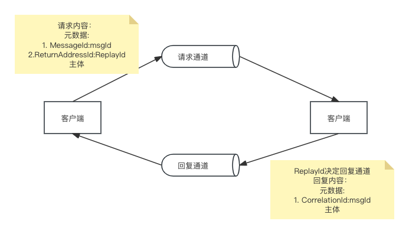

**实现单向通知**

客户端将（通常是命令式）消息发送到服务所拥有的点对点通道。但服务不会发回消息。

**实现发布/订阅**

客户端将消息发布到由多个接收方读取的发布/订阅通道。服务使用发布/订阅来尕布领域事件，领域时间代表领域对象的更改。

发布领域事件的服务通常有拥有自己的发布/订阅通道，通道的名称往往派生自领域类。例如，Order Service把Order事件发布到Order通道。

**实现发布/异步响应**

高级形式，将发布/订阅和请求/响应两种方式的元素组合在一起。

客户端发布一条消息，<u>在消息的头部中指定回复通道</u>，这个通道同时也是一个发布订阅通道。消费者将包含<u>相关性Id</u>的回复消息写入回复通道。客户端通过相关性id来手机响应，与请求进行匹配。


### 3.3.6处理重复消息

理想情况下，消息代理应该只传递依次消息，但是保证有且仅有一次的消息传递通常成本很高。相反，大多数消息代理承诺至少成功传递一下消息。

并且，在使用消息代理的时候应该注意，重新传递时的顺序。

处理重复消息有以下两种方式：

* 编写幂等消息处理程序
* 跟踪消息并丢弃重复项


**编写幂等消息处理程序**

满足幂等的消息处理程序可以被放心执行多次，只要消息代理在重新传递消息时保持相同的消息顺序。但是应用程序逻辑通常不是幂等，因此需要跟踪消息并丢弃重复消息的消息处理程序。

**跟踪消息并丢弃重复消息**

执行应用程序逻辑的消息处理必须用过检测和丢弃重复消息而成为幂等性。

简单的解决方案是消息接收方使用message Id跟踪它已处理的额消息并丢弃任何重复项。当接收方处理消息时吗，它将消息的message id作为创建和更新业务实体的事务的一部分记录在数据库表中。

* 接收方将包含message id的行插入处理过消息的操作记录表中。
* 如果消息是重复的那么操作记录表的插入将失败，而接收方也可以直接丢弃这个消息。


### 3.3.7事务性消息

服务通常需要在更新数据库的事务中发布消息。服务可能更新数据库，但可能会在发送消息之前崩溃，数据库更新、消息发送都必须在事务中进行。传统的解决方式是在数据库和消息代理之间使用分布式事务，但是kafka等中间件并不支持分布式事务。以下介绍部分不同的机制保证消息的可靠发送。

**使用数据库表作为消息队列**

如果应用程序使用关系型数据库。可靠地发布消息的直接方式是应用事务性发件箱模式。该模式使用数据库作为临时的消息队列。

发送消息的服务有一个outbox表，作为创建、更新和删除业务业务对象的数据库事务的一部分，服务通过将消息插入到outbox表来发送消息。通过这种方式保证原子性，因为这个是本地acid事务。而messageRelay是一个读取outbox表并将消息发送到消息代理的组件。

某些nosql数据库可以使用类似的方法。作为record存储在数据流中每个实体都有一个属性，该属性是需要发布的<u>消息列表</u>，当服务更新数据库中的实体时，会以原子性向该列表附加一条消息。

（因此对拥有实体并发布事件的业务实体有一定要求）

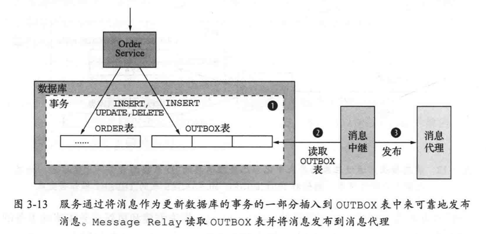

将消息从数据库移动到消息代理并对外发送有两种不同的方法。

<u>通过轮询模式发布事件</u>

它通过定期查询表`select * from outbox ordered by xxx asc`，messageRelay将这些消息发送给消息代理，它把每个消息发送给它们的目的地消息通道。最后再由messageRelay把完成发送的消息从outbox表中删除。

```sql
begin
 delete from outbox where id in (...)
commit 
```

轮询数据库是一种在小规模下运行良好的解决方案。但是经常轮询数据库的开销可能比较昂贵。可以考虑将此方法与nosql数据库一起执行。

<u>使用事务日志拖尾模式发布事件</u>

更加复杂的实现方式，让MessageRelay拖尾数据库的事务日志文件（提交日志）。每次应用程序提交到数据的更新都对应着数据库事务日志中的一个条目。事务日志挖掘器可以读取事务日志，把每条跟消息有关的记录发送给消息代理。

读取事务日志条目，将对应于插入消息的每个相关日志条目转化为消息，并将该消息发布到消息代理。可用于发布写入关系型数据库中的outbox表的消息或附加到nosql数据库中的记录消息。

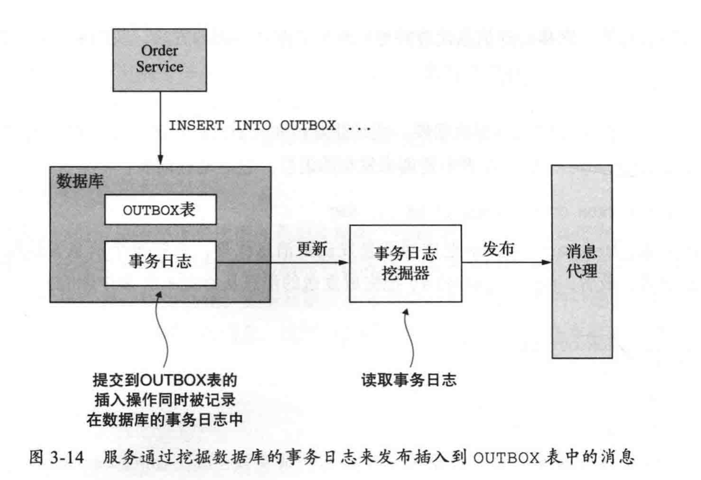


## 3.4 异步消息提高可用性


### 3.4.1同步消息会降低可用性

rest问题在于是一个同步协议，http客户端必须等待服务端返回响应。只要服务使用同步协议通信，就可能降低应用程序的可用性。

从统计上来说，一个系统操作的可用性，由其所涉及的所有服务所共同决定。如果服务的可用性均为99.5%，那么系统操作的98.5%，是一个非常低的数值。并且，当服务必须从另一个服务获取信息后，才能返回它客户端的调用，可会产生可用性问题。

因此必须设法最小化系统的**同步操作量**。


### 3.4.2消除同步交互

**使用异步交互模式**

理想情况下，所有交互使用异步。客户端和服务端使用消息通道发送消息来实现异步通信。这个交互不存在堵塞等待响应的情况。

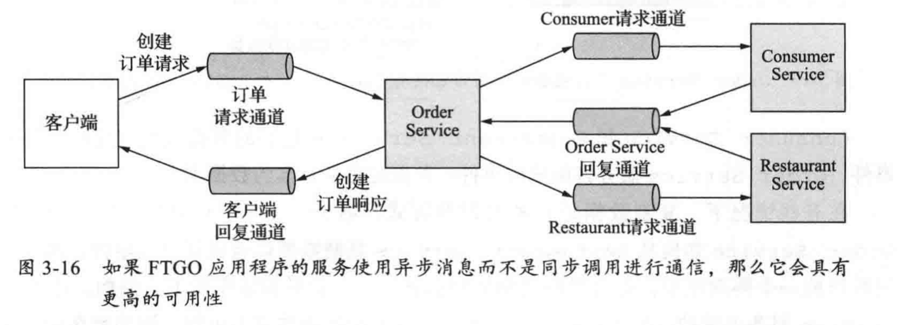

客户端向service发送一个请求消息交换消息的方式创建订单。这个服务随即采用异步交换消息的方式和其他服务通信完成订单的创建，最后向客户端发回一个返回的消息。

这种架构相当具有弹性，因为消息代理会一直缓存消息，直到有服务端接收并处理消息。（而发送消息的线程已经完成）


**复制数据**

服务很多情况下都采用类似rest同步通信协议的外部api完成。解决这种，在请求处理环节，减少同步请求的另外一种方式，就是数据复制。服务维护一个数据副本，这些数据是服务在处理请求时需要使用的。

这些数据的源头会在数据变化时，服务订阅这些消息来确保数据副本的实时更新。

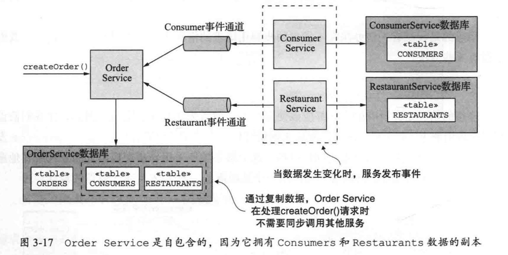

在某些情况下复制数据是有用的。但是存在以下弊端：

* 有时候复制的数据量过大，会导致效率低下
* 服务维护一个数据流过大的数据副本是不合适的（例如维护用户信息表）
* 复制数据没有从根本上解决服务如何更新其他服务所拥有数据的问题


**先返回响应，再完成处理**

1. 仅使用本地的数据来完成请求的验证
2. 更新数据库，包括向outbox表插入消息
3. 向客户端返回响应

当处理请求时，服务并不需要与其他服务直接进行同步交互。相反，服务异步向其他的服务发送消息。保证了服务之间的松耦合。

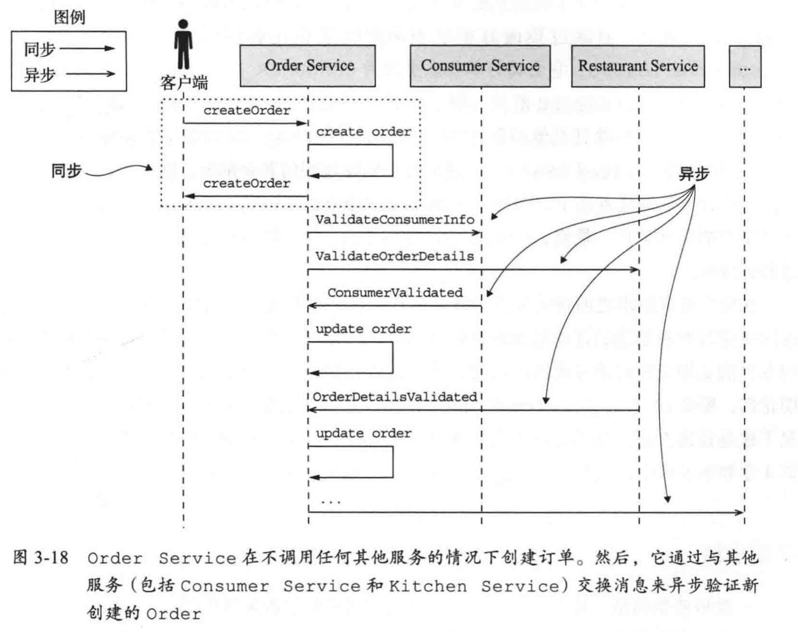

orderService可以按照任意顺序接收各个服务的验证消息。并更改订单的状态。该方法的优点在于，即使某一个验证微服务中断，orderService仍然能够创建订单并响应客户；最终，中断的服务也会在重新启动并处理任何排队的消息，并且验证订单。

弊端在于会使客户端更加复杂。为了使客户端知道订单是否已经成功创建，要么必须定期轮询，要么orderService必须向客户端发送通知消息。看似复杂，但是仍然是多种情况下的<u>首选方案</u>。


# 5. 业务逻辑设计

## 5.3 发布领域事件

### 5.3.1-3 需求

领域事件，可以协作应用程序其他了解聚合（对象）的状态变更。

在命名领域事件时，往往选择动词的过去分词。

领域事件通常具有元数据，例如时间Id和时间戳。可以包含了执行此次更改的用户的身份，以便于用户行为的审计。元数据可以使事件对象的一部分，可以在超类中定义。时间元数据可以位于封装事件对象的“信封对象”中。

以下为创建订单的领域事件设计

```java
interface DomainEvent{} // 领域事件标识接口类
interface OrderDomainEvent extends DoaminEvent {} // order领域事件标识接口类
class OrderCreated implements OrderDomainEvent {} // 创建order的具体领域事件
class DomainEventEnvelope<T extends DomainEvent> {
  private String aggregateType; // 事件的元数据 领域对象的类别
  private Object aggregateId;  // 可以是领域对象的id
  private T event;
} // 包含事件元数据和事件对象的类
```

`OrderCreated`事件类已经覆盖了已经发布事件的本质。

如果接收方需要领域的详细信息。如果请求服务来检索该信息，会造成额外的开销。另外的一种方式为**事件增强**，在具体操作事件类中增加订单详情。

```java
class OrderCreated implements OrderEvent{
  private List<OrderLineItem> lineItems;
  private ...;
  private long restaurantId;
} // 接收方通常需要的数据
```

**事件增强**简化了接收方，但是可能会时领域事件的稳定性降低。每当接收方的需求发生变更，事件类需要做出对应的调整，降低可维护性。

一个完整的<u>事件发布</u>，可以包含以下内容：

```json
{
  "event":"111",    // 事件id
  "eventType":"OrderCreated",  //事件类型
  "aggregateType":"order",  //事件对应的对象类型
  "aggregateId":"100",    //对象的id
  "eventPayload":{  // order相关的属性
    "orderId":"100",
    "orderProperty_A":"A",
    "orderProperty_B":"B"
  },
  "createdTimestamp":"2024-08-12",
}
```


### 5.3.5 生成和发布领域事件

在[领域事件通信](#3.3.1 消息传递)中讨论过异步消息传递。但在业务逻辑将它们发布到消息代理之前，必须生成领域事件。

**生成领域事件**

领域事件由聚合对象发布。聚合对象知道状态何时变化，从而知道要发生的事件，再直接调用消息传递api。但是<u>聚合对象不能直接注入，需要通过api所需的方法参数传递。这将导致基础设施和业务逻辑绑定在一起。</u>

更好的做法是，在聚合和调用它的服务之间分配角色。服务可以通过使用依赖注入，获取消息传递api的引用，在得知状态发生改变后，从而轻松发布事件。

```java
//  生成事件 示例1
public class Ticket{
  //step1 在聚合对象下创建一个方法，返回值包可以一个事件列表
  public List<DomainEvent> accept(ZonedDateTime readyBy){
    return singletonList(new TicketAcceptEvent(readyBy));
  }
}

public class KitchenService{
	private TicketRepository ticketRepository;
  
  private DomainEventPublisher domainEventPublisher;
  
  public void accept(long ticketId, ZonedDateTime readyBy){
    Ticket ticket = ticketRepository.findBy(ticketId);
    List<DomainEvent> events = ticket.accept(readyBy);
    domainEventPublisher.publisher(Ticket.class, ticketId, events); // 发布领域事件
  } 
}
```

这种方式比较简单，但是非void返回类型的方法会变得很复杂。返回的内容需要包括原始返回值和事件列表对象。

另一种方式是在聚合对象超类中保存和累计事件。然后服务检索事件并发布。如下所示

```java
// 生成事件 示例2 
public class Ticket extends AbstractAggregateRoot{ 
  public void accept(ZonedDateTime readyBy){
    // 在聚合对象上级保存和累积事件
    registerDomainEvent(new TicketAcceptEvent(readyBy)); 
  }
}
```

`AbstractAggregateRoot`记录事件`registerDomainEvent()`方法。并通过getter方法检索这些时事件。

以上生成事件，最好让方法把事件返回给服务。


**可靠地发布事件**

应该保证每个发布者，只能发布范围内的事件，因此需要一个超类和泛型来确保这一条件。


# 7. 微服务实现查询

查询通常需要检索分散到多个服务所拥有的数据库中的数据

通常有两种不同的模式：

* API组合模式：简单的，尽可能使用，让拥有数据的服务的客户端负责调用服务，组合服务返回的查询结果
* 命令查询职责隔离模式：


## 7.1 使用API组合模式查询

该模式有两种类型的参与者：

* API组合器
* 数据提供方服务

在该模式下，需要解决两个设计问题：

1. 确定架构中的哪个组件是查询操作的**API组合器**
2. 如何编写有效的聚合逻辑


**谁担任API组合器的角色**

可以将API组合器实现为独立的服务，此选择可以用于多个服务内部使用的查询操作。此操作还可以用于外部可访问的查询操作（解决方法一，避免存在防火墙，客户端无法直接访问服务），由于他们的聚合逻辑过于复杂，无法在API Gateway中完成查询（解决方法二，提供复杂操作环境），必须使用单独的服务。

**API组合器应该使用响应式编程模型**

API组合器应该并行调用提供方服务，最大限度缩短查询操作的响应时间。如果存在依赖关系，则需要按顺序调用一部分服务。


API实现简单，但是仍然存在以下问题：

**增加额外开销**

需要调用多个服务和查询多个数据库，对计算和网络资源要求增加

**带来可用性降低的风险**

API组合器和多个提供方服务时，其可用性小于单个服务的可用性。可以通过以下策略提高可用性：

1. API组合器在提供方不可用时，返回先前缓存的数据。有时候API组合器会缓存提供方服务返回的数据，以提高性能。如果提供方不可用，则API组合器可以从缓存中返回数据，尽管缓存的数据可能是过时的。
2. 允许API组合器返回不完整的数据。

**缺乏事务数据一致性**

单体应用程序通常使用一个数据库事务执行查询操作。可以确保应用程序具有一致的数据视图。

相反，API组合模式则针对多个数据库执行查询，可能会导致返回的数据不一致。例如服务1返回的状态为A，而服务2返回的状态为B。


### API组合模式无法解决的问题

**问题1：条件查询的缺失**

`findOrderHistory()`操作可以检索消费者的订单历史，存在如下参数：

1. consumerId： 用户
2. pagination： 分页
3. filter：过滤条件，可选的订单状态、餐厅名称、菜单匹配项等

使用组合模式并非看起来的简单，因为**并非所有的服务由存储特定用于过滤/排序的属性**。API组合器有两种方式：

1. API组合器进行内存中连接。让无法过滤的服务检索用于的全部相关记录，对能够使用过滤条件的服务执行连接。
2. API组合器通过从可以过滤的服务中检索出匹配的结果，然后通过ID从其他服务请求订单。

**问题2：单一服务的挑战**

可能 拥有数据的服务不适合实现查询、有时服务的数据库（或数据模型）不能有效支持查询。

例如，找出附近在给定时间可以送达的餐厅列表，对于支持地理空间类型的数据库（如mysql、pg等）查询简单。但是使用其他类型的数据库具有一定挑战性。

**问题3：隔离问题的必要性**

单个服务难以查询的还有：拥有数据的服务有时候不是实现查询的服务。

数据权（数据划分给某一微服务）并不唯一考虑的东西，还需要考虑到隔离问题的必要性。

具体的查询服务，需要数据拥有方将数据提供。而维护一些数据的最终一致性副本以实现查询是必需的。


## 7.2 CQRS命令查询职责隔离模式

许多企业级应用程序使用关系型数据库作为数据记录的事务系统，使用文本搜索数据库进行文本搜索查询。某些应用程序同时写入来保持数据库同步，然后再定期将数据从关系型数据库复制到文本搜索引擎中。该架构利用了关系型数据库的事务属性和文本数据库的查询功能。


[API组合器无法处理的问题](API组合模式无法解决的问题)展示了微服务架构查询的常见问题：

1. 使用API组合模式检索分散在多个服务中的数据会导致昂贵、低效的内存中连接
2. 拥有数据的服务将数据存储在不能有效支持所需查询的表单或数据库中
3. 隔离问题考虑，拥有数据的服务不一定是会实现查询操作的服务


**CQRS隔离命令和查询**

CQRS涉及隔离和问题的分隔。将持久化数据模型和使用数据的模块分为两个部分：

1. 命令端和数据模型：实现创建、更新和删除
2. 查询端和数据模型：实现查询

<u>查询端通过订阅命令端发布的事件，使其数据模型与命令端数据模型保持同步</u>


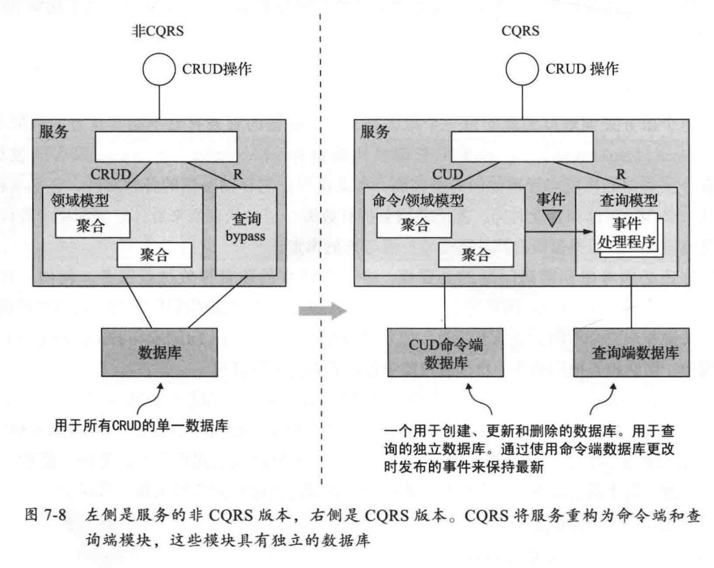


独立的查询模型可以处理复杂的查询场景。查询端的代码往往比命令端简单多，因为不需要实现具体的业务逻辑。并且支持多种数据库。


**CQRS和查询专用服务**

CQRS不仅可以在服务中应用，可以使用此模式来定义查询服务（<u>即独立出一个查询微服务</u>）。查询服务的API只包含查询操作。可以订阅至少一个服务发布的事件来确保它的数据是不断更新的。当查询端订阅多个服务发布的事件时，这个视图不属于任何特定服务，因此将其实现为独立的服务是合理的。

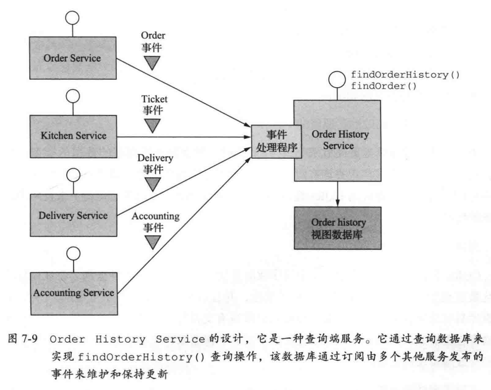

CQRS代表了当前流行的基于事件的数据库应用场景，例如：使用关系型数据库作为记录系统，使用文本搜索引擎来处理文本查询。不同之处在于CQRS使用更广泛的数据库类型。可以近乎实时更新CQRS查询端视图。


### CQRS的优劣

存在如下优势：

**微服务架构中高效地实现查询**

实现了检索多个服务所拥有地数据的查询。

**高效地实现多种不同地查询类型**

尝试使用单个持久化数据类型支持所有查询通常具有挑战性，并且在某些情况下不太可能。一些NOSQL数据库具有非常有限的查询功能。支持定义多个视图来避免单个数据存储的限制。

**基于事件溯源技术的应用程序中实现查询**

事件存储库仅支持主键的查询。CQRS模式订阅由基于事件溯源的聚合发布的事件流，可以保持最新的聚合的一个或者多个视图

**进一步实现问题隔离**

领域模型以及其相应的持久化数据模型不必同时处理命令和查询。CQRS模式为服务的命令端和查询端定义了单独的代码模块和数据库模式。通过隔离问题，命令端和查询端可能更简单，易于维护。


存在以下劣势：

**更加复杂的架构**

复杂性增加了，开发人员必须编写更新和查询视图的查询端服务。应用程序可能支持不同类型的数据库。

**处理数据复制产生的延迟**

处理命令端和查询端视图之间的“滞后”。更新聚合然后立即查询视图的客户端应用程序可能会看到聚合前的版本，必须避免向用户暴露潜在的不一致的方式编写CQRS的查询端。

可以通过，采用命令端和查询端API为客户端提供版本信息，使其能够判断查询端是否过时。


### 设计CQRS视图

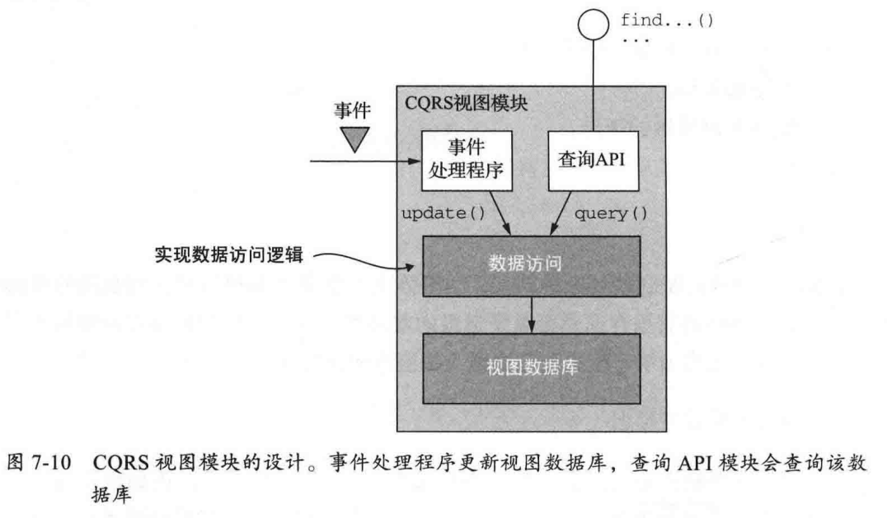

#### 选择视图数据库

NoSQL数据库通常具有有限的事务模式和较少的查询功能。NoSQL数据库由于其更丰富的数据模型和性能，通常是CQRS视图的一个很好的选择。尽管现在SQL数据库在主流硬件上运行时具有出色的性能。

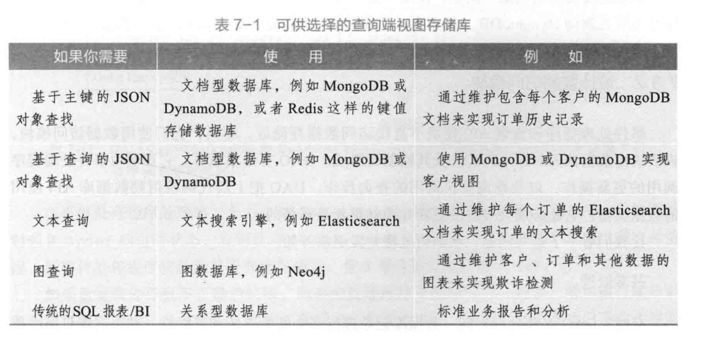


**支持更新操作**

某些数据库能够有效支持基于外键的更新操作，但是其他NoSQL数据库不基于主键的更新没有俺么容易。应用程序需要维护某种特定于数据库的映射，从外键到主键，确保需要更新的记录。


#### 设计数据访问模块

事件处理程序和查询API模块不直接访问数据存储区。相反它们使用数据访问模块，该模块由数据访问对象（DAO）以及辅助类组成。

DAO实现由事件处理程序调用的更新操作，以及查询模块调用的查询操作。


**并发处理**

DAO必须处理对同一数据库记录进行多个并发更新的可能性。如果视图订阅由多个聚合类型发布的事件，则多个事件处理程序可能同时更新同一个记录。DAO必须保证正确处理，不允许一次更新覆盖另外一次更新。

如果DAO通过读取记录进行更新，然后再写入已更新记录的做法，则必须使用悲观锁或者乐观锁。

更简单的做法是：使用`UpdateItem()`而不是`PutItem()`，来操作更新项目的各个属性，必要时候创建项目。由于不同的事件处理程序只更新记录的部分不同属性，因此`UpdateItem()`是有意义的。操作也更有效，因为无须先从表中检索订单。


**幂等事件处理程序**

可以多次使用同一事件调用事件处理程序，如果查询端事件处理程序是幂等的，通常不是问题。

为了确保可靠，事件处理程序必须记录事件ID并以原子化的方式更新数据存储区，如何执行此操作取决于数据库的类型。如果视图的底层数据库是SQL数据库，则事件处理程序可以将已处理的事件作为更新视图事务的一部分插入到`PROCESSED_EVENTS`表中。到那时如果视图底层是有限事务模型的NoSQL数据库，则事件处理程序必须<u>将事件保存在它更新的数据存储区记录中</u>（例如MongoDB文档）。

如果事件ID具有递增属性，事件处理程序不需要记录每个事件的ID，每个记录仅需要存储从给定聚合实例接收的`max(eventId)`。如果记录对应单个聚合实例，则则事件处理程序只需要记录`max(eventId)`，如果由多个聚合的事件连接，则必须包含`[aggregate type, aggregate id]`到`max(eventId)`的映射。

下图为映射的JSON效果图：

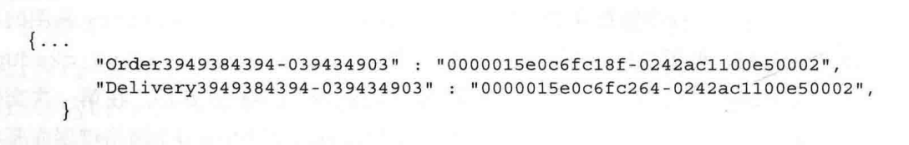

DAO使用以下条件表达式进行更新：


只有当`[aggregate type, aggregate id]`不存在，或者`[aggregate type, aggregate id]`对应的`eventId`大于数据库中的`eventId`，才会对当前事件做出响应。

<u>命令端</u>操作将包含已发布事件的ID返回给客户端，客户端将这个事件有关的Id传递给查询操作，如果该事件尚未更新，则返回错误。可以通过这种方式检测不一致性。


**添加/更新CQRS视图**

CQRS视图在应用程序的整个生命周期内不断地添加和更新，有时需要添加新视图支持新查询，有时候需要重构视图。

创建新的视图，需要开发查询端模块、设置数据存储区并部署服务。查询端模块的事件处理程序处理所有事件，最终视图将是最新的。

* 使用归档事件构建CQRS视图：消息代理无法无期限地存储消息。
* 增量式构建CQRS视图：视图创建地另外一个问题是所有事件所需地事件和资源在日积月累。最终视图创建变得缓慢且昂贵。可以第一步定期计算每个聚合实例的快照，第二步使用快照和任何后续事件创建视图。


# 附:Http和RPC

早期的通讯方式通过TCP连接，TCP本身**面相连接、可靠、基于字节流**。字节流可以理解为双向的通道里传输的二进制数据。然而裸TCP收发的01串没有头任何边界，无法知道到哪里才算一条完整的消息。
为了解决**粘包问题**，需要在这个基础上添加一些自定义的规则，来区分消息边界。通常会把每条要发送的数据都包装一下，比如加上**消息头**，写清楚一个完整的包有多长，截取出来后，就是我们真正要传输的消息体。
这些**消息头**，还可以放消息体是否被压缩过、压缩的格式等等消息，只要上下游都约定好，就是所谓的协议。因此基于TCP，衍生出来HTTP和RPC。

从网络分层上：
* 应用层： HTTP、gRPC
* 传输层：TCP、UDP
* 网络层
* 网络接口层

TCP是传输层的协议，而基于TCP创造出来的各类RPC协议，<u>只是定义了不同消息格式的应用层协议而已</u>。

RPC是远程过程调用，本身不是一个具体的协议，而是一种调用方式。像调用本地方式一样调用远程服务器暴露出来的方法，可以屏蔽掉一些网络细节。基于这个思路，创造出来很多RPC协议，如：gRPC、thrift。
虽然大部分RPC协议底层使用TCP，但是也可以改用UDP或者HTTP，同样可以达到类似的效果。

||  既然有HTTP协议，为什么还有RPC
其实，RPC出生于TCP与HTTP之间。
现在电脑上各类联网软件，在客户端与服务器建立连接发送消息的时候，都需要用到应用层协议，在这种C/S架构下，只与自己公司服务器连接，使用rpc足够了。
然而，浏览器这个软件，不仅仅要求能访问自家公司的服务器，还需要能够访问其他公司的服务器，需要一个统一的标准，不然大家没法交流。HTTP就是那个时代用于统一B/S的协议。
考虑到现在很多软件都是多端互联，既有客户端，也有网页版，B/S和C/S架构在慢慢融合，协议只需要用HTTP一套就够了。

## HTTP和RPC的区别

### 服务发现
向某个服务器发起请求的时候，需要预先知道IP地址和端口来建立连接，这个其实就是**服务发现**
在HTTP中，知道服务的域名，就可以通过DNS服务区解析得到它背后的IP地址，默认为80端口。
而RPC，一般需要中间服务器保存服务名和IP信息，比如Consul。

### 底层连接形式
主流的HTTP/1.1协议为例，其默认在建立TCP连接之后会一直保持长连接（Keep Alive），后续的请求和响应都复用这条连接。
而RPC协议除了HTTP/1.1的长连接特性外，还会创建一个线程池，在请求量大的时候，建立多条连接放在池内，要发送数据的时候就从池里取一条连接出来。用完放回去，下次再复用。
由于连接池有利于提升网络请求性能，所以不少编程语言的网络库都会给HTTP加一个连接池。

### 传输的内容
基于TCP传输的消息，无非都是消息头Header和Body。Header用于标记一些特殊信息，最重要的就是消息体长度。Body则是可以通过JSON将对象序列化。
对于HTTP而言，如果每次都用以下携带header的方式传输，将会是非常冗余的。可以直接约定第几位是Content-Type，就不真的传“content-type”过来。
```json
{
'content-type':'application/json'
...
}
```
而RPC，因为定制化程度更高，可以采用体积更小的Protobuf或者其他序列化协议去保存结构体数据，不需要考虑浏览器行为。因此性能会更好点，适合公司内部微服务使用。

而HTTP/2在HTTP/1.1基础上提升，性能比RPC更好

## HTTP/1.0 /1.1 /2

### /1.0
在HTTP/1.0，每次请求都需要建立连接，需要手动设置Keep Alive。
规定下一个请求必须在前一个请求响应达到之后才能发送。如果前一个请求响应一直不到达，那么下一个请求就一直无法发送，处于阻塞了。这就是队头阻塞。

### /1.1
基本的报文格式就是键值对。
默认设置长连接，只要任意一端没有明确提出断开连接，则保持TCP连接状态。如果某个HTTP长连接超过一定时间没有和任何数据交互，服务端自动断开这个连接。

**管道传输**
由于长连接的存在，在同一个TCP连接内，客户端可以发起多个请求，后续的请求发送不必等待前一个请求的响应到达。但是服务器必须<u>按照接收请求的顺序，依次发送对这些管道化请求的响应</u>，没有解决响应头的队头阻塞。然而管道技术并不是默认开启，而且浏览器基本没有支持，后续讨论同样默认无视该技术。

### /2.0

**头部压缩**
在客户端和服务器同时维护一张表头信息表，所有字段存入该表，生成一个索引号，就不用重复发送同样字段，只需要发送索引号了。

**二进制格式**
数据以数据流的形式以字节单位发送，数据包可以不按顺序发送。
HTTP/2每个请求或者响应的所有数据包，称为一个数据流（Stream），每个数据流通过ID标记。每个数据流以消息的形式发送，而消息由一个或者多个帧组成。由于帧头部携带了StreamID，不同Stream的帧可以乱序发送，只需要接收端通过StreamID顺序组装即可。

**多路复用**
由于2.0的二进制分帧特性，可以实现并发多个请求和回应。移出了串行请求，降低了延迟。

**TCP导致队头阻塞**
因为TCP是面向字节流传输，只有TCP拿到完整连续的数据时，内核才会将数据从缓存区交给HTTP应用，只要前一个字节没有收到，HTTP就无法从内核缓冲区中拿到数据。
因此如果出现丢包就会触发TCP的超时重传，后续连续的缓存队列中的数据都得等丢包重传。